* Docker

    Use Aleksey containers/

    * Container

        This are completely isolated environment except they all share the same OS kernel

        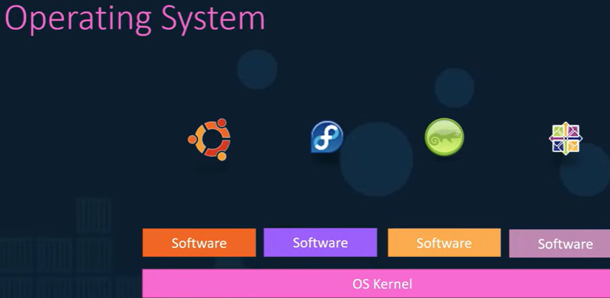

        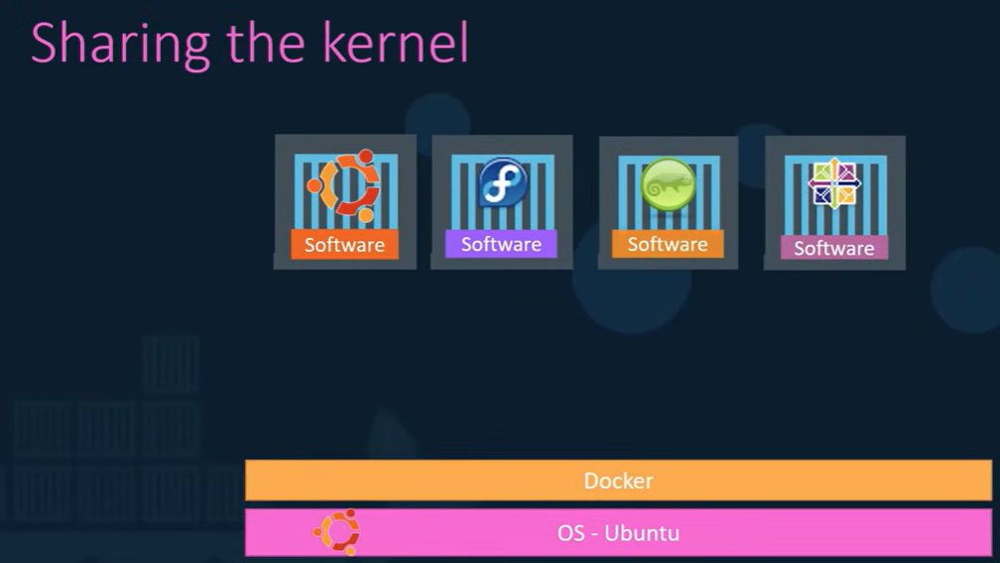

        TE MAIN  PURPOSE OF DOCKER IS TO PACKAGE AND CONTAINER AS APPLICATIONS AND TO SHIP THEM AND TO RUN THEM ANYWHERE ANY TIMES AS MANY TIMES
        AS YOU WANT.

    * Containers vs Virtual Machines

        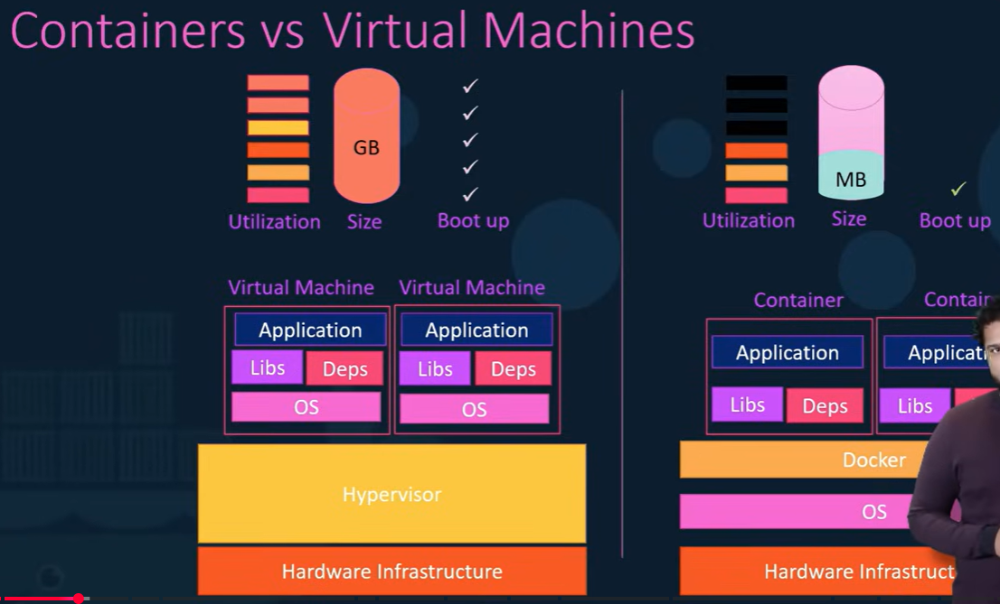
    
    * Containers & Virtual Machines

        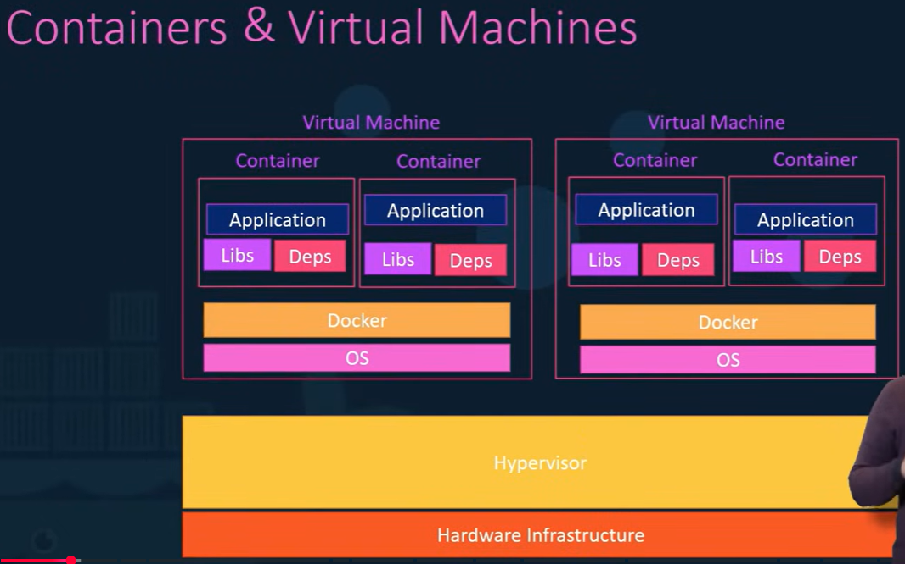

    * Docker vs Images

        Images are templates
        Docker execute Images
    
    * Public docker - dockerhub

        You can download any image from there.

    * Docker versions

        Community Edition
            Free
            Desktop for Windows
            instalarlo y volver al minuto 16:45 

        Enterprise Edition
            Certify

        - Docker on Windows

            - using Docker Toolbox
                . This is the original version
                . Docker Toolbox has:
                    Oracle Virtualbox
                    Docker Engine
                    Docker Machine
                    Docker Compose
                    Kitematic GUI

                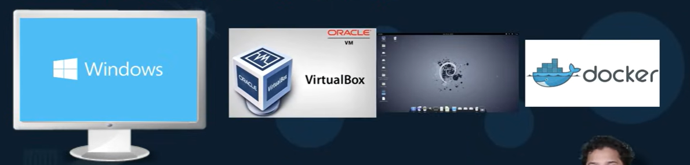

                ⚠️ When WOULD you use Docker Toolbox?

                Almost never in 2026.

                Only if:

                    You are on very old hardware
                    No virtualization support
                    Cannot use WSL2 or Hyper-V

            - using Docker Desktop
                . When you install it create a linux system underneath by default
                . Both options are to use Linux containers. If you want to use windows containers you must switch

                    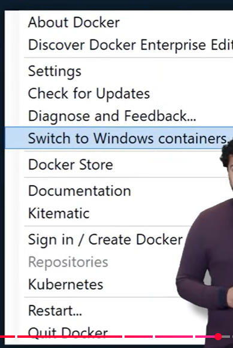

                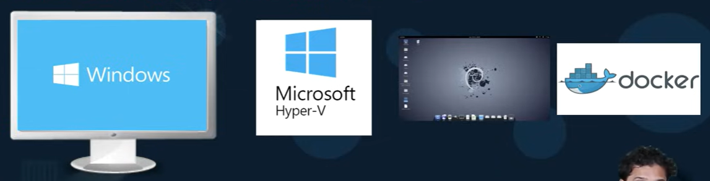

                . Windows Containers

                    - Container Types

                        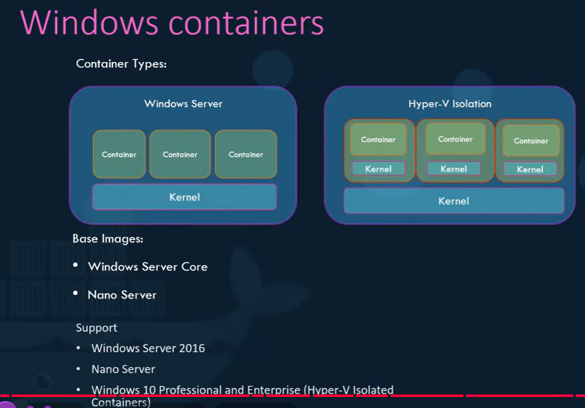
    
    * Install Docker

        - Docker Desktop

            1. Check Virtualizacion is enabled. 
                Open Task Manager → Performance → CPU
                Check “Virtualization: Enabled”

            2. Enable Windows Features
                Open PowerShell as Admin and run:
                dism.exe /online /enable-feature /featurename:Microsoft-Windows-Subsystem-Linux /all /norestart
                dism.exe /online /enable-feature /featurename:VirtualMachinePlatform /all /norestart

            3. Install WSL2 (Windows Subsystem Linux)
                Execute this line on PowerShell:
                wsl --install

                The requested operation is successful. Changes will not be effective until the system is rebooted.
            
            4. Install Docker Desktop
                https://www.docker.com/products/docker-desktop/

            5. Start Docker

                After installation:

                Launch Docker Desktop
                Wait until it says: “Docker is running”

            6. Verify Installation

                Open terminal (PowerShell or WSL) and run:

                docker version

    * Docker commands

        - docker run
        - docker ps
        - docker stop name
        - docker rm name
        - docker images
        - docker rmi
        - docker pull --> NO LO ENTENDI BUSCAR INFO
        - docker exec distracted_mcclintock cat /etc/hosts
        - To create an Image
            Run the docker build command within that directory 
            docker build -t webapp-color .
    
    * Docker Labs
        
        - LAB I (Basic Docker Commands)
            docker run
            docker ps -a
            docker images
            docker run redis
            docker run -i XXX  --> To interact with the app
            docker run -it XXX --> To stnds for a sudo terminal

            docker inspect [Container Name]
            docker logs [Container Name]

            docker stop brave_hamilton

            to delete a conteiner you have to stop and then remove
            docker stop id/name
            docker rm id/name

            docker rmi repository

            Run a container using the image name nginx:1.14-alpine (not the image ID) and name ir [webapp]
            docker run -d --name webapp nginx:1.14-alpine 

            To delete an image it shouyld be in use.

        
        - LAB II (Docker Run Commands)
            Run an instance of kodekloud/simple-webapp:blue and name container blue-app, mapping port 8080 on the container to port 38282 on the host.

            docker run -p 38282:8080 --name blue-app kodekloud/simple-webapp:blue

            The LEFT part of the port is the HOST port and the rigth is the CONTAINER port
            

            . We just downloaded the code of an application. What is the base image used in the Dockerfile?
            Inspect the Dockerfile in the webapp-color directory.

            You can either open the file using vi /root/webapp-color/Dockerfile (or using commands such as cat/more/less/vim e.t.c) and look for the FROM instruction or search for it directly using grep -i FROM /root/webapp-color/Dockerfile.

                Python 3.16

            .To what location within the container is the application code copied to during a Docker build?
            Inspect the Dockerfile in the webapp-color directory.
            
                /opt

            .Build a docker image using the Dockerfile and name it webapp-color. No tag to be specified.
            Move to the directory first by using the cd command and verify the path of the working directory from pwd command :-

                $ cd /root/webapp-color/
                $ pwd
                /root/webapp-color
                Now, run the docker build command within that directory :-

                $ docker build -t webapp-color . 
                NOTE: At the end of the command, we used the "." (dot) symbol which indicates for the current directory, so you need to run this command from within the directory that has the Dockerfile.
            
            .Run an instance of the image webapp-color and publish port 8080 on the container to 8282 on the host.

            . Build a new smaller docker image by modifying the same Dockerfile and name it webapp-color and tag it lite.
                Hint: Find a smaller base image for python:3.6. Make sure the final image is less than 150MB.

                Open the Dockerfile using vi Dockerfile
                Change FROM python:3.6 to FROM python:3.6-alpine
                :wq
                docker build -t webapp-color:lite .

        - LAB III (How to create my own image?)
            . OS - Ubuntu
            . Update apt repo
            . Install dependencies using apt
            . Install Python dependencies using pip
            . Copy source code to /opt folder
            . Run the we server using "flask" command

        - LAB IV (Environment Variables)

            docker inspect CONTAINER NAME

            .Inspect the environment variables set on the running container and identify the value set to the APP_COLOR variable.
                
            .Run a container named blue-app using image kodekloud/simple-webapp and set the environment variable APP_COLOR to blue. Make the application available on port 38282 on the host. The application listens on port 8080.

            Run the command : docker run -p 38282:8080 --name blue-app -e APP_COLOR=blue -d kodekloud/simple-webapp

            To know the env field from within a webapp container, run docker exec -it blue-app env

            .Deploy a mysql database using the mysql image and name it mysql-db.
            Set the database password to use db_pass123. Lookup the mysql image on Docker Hub and identify the correct environment variable to use for setting the root password.

            Run the command: docker run -d -e MYSQL_ROOT_PASSWORD=db_pass123 --name mysql-db mysql

            To know the env field from within a mysql-db container, run docker exec -it mysql-db env

    
        - LAB V (Command vs Entrypoint)

            .What is the ENTRYPOINT configured on the mysql image?

            cat Dockerfile-mysql | grep 

            .Run an instance of the ubuntu image to run the sleep 1000 command at startup.
            Run it in detached mode.

                Command: docker run -d  ubuntu sleep 1000
        
        
        - LAB VI (COMPOSE)

            . It's a container that we can use to set up complex app. 
              E.g we can create a catainer with Python, Redis, VS, PostgreSQL

              docker run -d --name=redis redis
              docker run -d --name=db postgres:9.4 --link db:db result-app
              docker run -d --name=vote -p 5000:80 --link redis:redis voting-app
              docker run -d --name=result -p 5001:80
              docker run -d --name=worker --link db:db --link redis:redis worker

              now er have to link everithing
              
              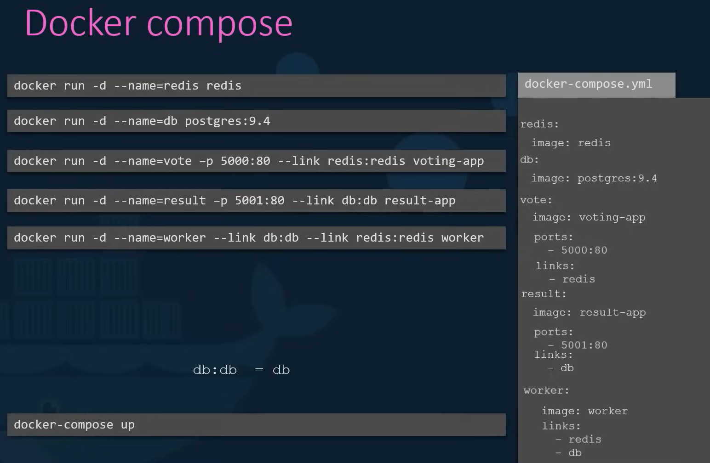
              

            . First create a redis database container called redis, image redis:alpine.
            if you are unsure, check the hints section for the exact commands.

            docker run --name redis -d redis:alpine

            .Next, create a simple container called clickcounter with the image kodekloud/click-counter, link it to the redis container that we created in the previous task and then expose it on the host port 8085.
            The clickcounter app run on port 5000.
            if you are unsure, check the hints section for the exact commands.

            docker run -d --name=clickcounter --link redis:redis -p 8085:5000 kodekloud/click-counter

        - LAB VII (Docker Storage)

            . When we install docker the structure is
                /var/lib/docker
                    aufs
                    containers
                    image
                    volumes

            . We have two types of volumns

                . Volume mounting 
                    This mount the volumn from the volumes directory

                    docker volume create data_volume -->> Esto no lo ejecutamos nunca
                    docker run -v data_volume:/var/lib/mysql mysql

                . Bind mounting
                    This mount the volumn from any location on the docker host

                    docker run /v /data/mysql:/var/lib/mysql mysql

                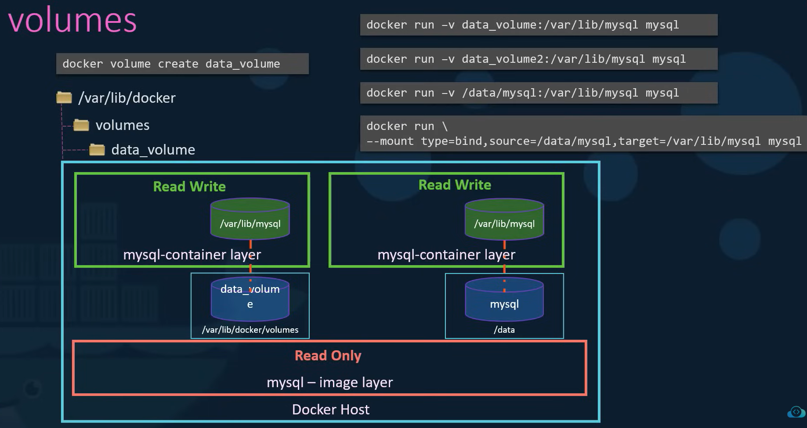
            
            . Storage drivers
                AUFS - ZFS - BTRFS - DEVICE MAPPER - OOVERLAY - OVERLAY2

            .What location are the files related to the docker containers and images stored?

                /var/lib/docker

            .Run a mysql container named mysql-db using the mysql image. Set database password to db_pass123
            Note: Remember to run it in the detached mode.

                docker run -d --name mysql-db -e MYSQL_ROOT_PASSWORD=db_pass123 mysql

            .Run a mysql container again, but this time map a volume to the container so that the data stored by the container is stored at /opt/data on the host.
            Use the same name : mysql-db and same password: db_pass123 as before. Mysql stores data at /var/lib/mysql inside the container.

                docker run -v /opt/data:/var/lib/mysql -d --name mysql-db -e MYSQL_ROOT_PASSWORD=db_pass123 mysql

                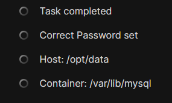

        - LAB VIII (Docker Registry)

            .Docker Registry
            What is a Docker Registry?

            .DockerHub
            DockerHub is a hosted registry solution by Docker Inc.
            Besides public and private repositories, it also provides:
            automated builds,
            integration with source control solutions like Github and Bitbucket etc.

            .Which command is used for Login to a self-hosted registry?

            .Let practice deploying a registry server on our own.
            Run a registry server with name equals to my-registry using registry:2 image with host port set to 5000, and restart policy set to always.

            Note: Registry server is exposed on port 5000 in the image.

            Here we are hosting our own registry using the open source Docker Registry.

            NOTE: You do not need to run docker login for this local registry setup because authentication is not configured. This registry allows for anonymous access.

                docker run -d -p 5000:5000 --restart=always --name my-registry registry:2

            
            .Now its time to push some images to our registry server. Let's push two images for now .i.e. nginx:latest and httpd:latest.
            Note: Don't forget to pull them first.
            To check the list of images pushed , use curl -X GET localhost:5000/v2/_catalog

                Run: 
                docker pull nginx:latest 
                
                then 
                docker image tag nginx:latest localhost:5000/nginx:latest 
                
                finally push it using 
                docker push localhost:5000/nginx:latest.

                Same for httpd:
                docker pull httpd:latest 
                docker image tag httpd:latest localhost:5000/httpd:latest 
                docker push localhost:5000/httpd:latest

            .Let's remove all the dangling images we have locally. Use docker image prune -a to remove them. How many images do we have now?
            Note: Make sure we don't have any running containers except our registry-sever.
            To get list of images use: docker image ls

                docker image prune -a

        - LAB IX (Docker Networking)

            docker networks ls

            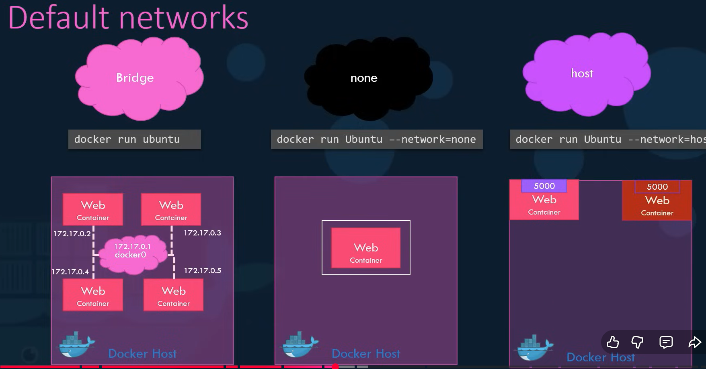

            .  When you intall docker create 3 networks by default
                parameter --network

                Bridge
                    docker run ubuntu
                    private internal IP 172.17.
                
                none
                    docker run ubuntu --network=none
                    no tiene acceso a la red

                host
                    docker run ubuntu --network=host
                    you can specified the port to match an external app like a webapp

            .Explore the current setup and identify the number of networks that exist on this system.

                docker network ls

            .Run a container named alpine-2 using the alpine image and attach it to the none network.

                docker run --name alpine-2 --network=none alpine

            . Create a new network named wp-mysql-network using the bridge driver. Allocate subnet 182.18.0.0/24. Configure Gateway 182.18.0.1

                Run the command: docker network create --driver bridge --subnet 182.18.0.0/24 --gateway 182.18.0.1 wp-mysql-network

                Inspect the created network by docker network inspect wp-mysql-network

            .Deploy a mysql database using the mysql:5.7 image and name it mysql-db. Attach it to the newly created network wp-mysql-network
            Set the database password to use db_pass123. The environment variable to set is MYSQL_ROOT_PASSWORD.

                docker run -d -e MYSQL_ROOT_PASSWORD=db_pass123 --name mysql-db --network wp-mysql-network mysql:5.7
            
            . Deploy a web application named webapp using the kodekloud/simple-webapp-mysql image.
              Expose the container’s port 8080 to port 38080 on the host.

              The application makes use of two environment variable:
              1: DB_Host with the value mysql-db.
              2: DB_Password with the value db_pass123.
              Make sure to attach it to the newly created network called wp-mysql-network.

              Also make sure to link the MySQL and the webapp container.

                docker run --network=wp-mysql-network -e DB_Host=mysql-db -e DB_Password=db_pass123 -p 38080:8080 --name webapp --link mysql-db:mysql-db -d kodekloud/simple-webapp-mysql
        

