# SQL Server Learning

<style>
r { color: red }
o { color: Orange }
g { color: Green }
lg { color: lightgreen }
b { color: Blue }
lb { color: lightblue }
</style>

- To create tables:
  
  https://www.tablesgenerator.com/markdown_tables

> [!NOTE]  
> Highlights information that users should take into account, even when skimming.

> [!TIP]
> Optional information to help a user be more successful.

> [!IMPORTANT]
> Crucial information necessary for users to succeed.

> [!WARNING]  
> Critical content demanding immediate user attention due to potential risks.

> [!CAUTION]
> Negative potential consequences of an action.

> [!IDEA]
> XXXXX

---

## Index
  - [SQL Server 2012 architecture and configuration](#SQL#Server#2012#architecture#and#configuration)
    - [1. Architecture](#Architecture)
    - [1.1. MSSQL Server Physical CLIENT-SERVER Architecture Diagram](#MSSQL#Server#Physical#CLIENT#-#SERVER#Architecture#Diagram)
    - [1.2. Components of the SQL Server Engine](#Components#of#the#SQL#Server#Engine)
    - [1.3. The Protocol Layer](#The#Protocol#Layer)
    - [1.4. The Query Processor](#The#Query#Processor)
      - [1.4.1. PARSER](#PARSER)
      - [1.4.2. OPTIMIZER](#OPTIMIZER)
      - [1.4.3. EXECUTOR](#EXECUTOR)
    - [1.5. The Storage Engine](#The#Storage#Engine)
      - [1.5.1. Access Method](#Access#Method)
      - [1.5.2. Buffer Manager](#Buffer#Manager)
      - [1.5.3. Transaction Manager](#Transaction#Manager)
    - [1.6. The SQLOS](#The#SQLOS)      
    - [1.7. Plan Caching and Recompilation](#Plan#Caching#and#Recompilation)
    - [1.8. Transactions and Concurrency](#Transactions#and#Concurrency)

  - [Anexo I](#Anexo#I)
    - [PERFORMANCE (Articles / Courses)](#PERFORMANCE#(Articles#/#Courses)#)
      - [Slow in the Application, FAst in SSMS?](#Slow#in#the#Application,#Fast#in#SSMS?)

---

\
&nbsp;
\
&nbsp;
\
&nbsp;
\
&nbsp;
\
&nbsp;
\
&nbsp;
\
&nbsp;
\
&nbsp;
\
&nbsp;
\
&nbsp;

## **SQL Server 2012 architecture and configuration**

## **1. Architecture**

### **1.1. MSSQL Server Physical CLIENT-SERVER Architecture Diagram**

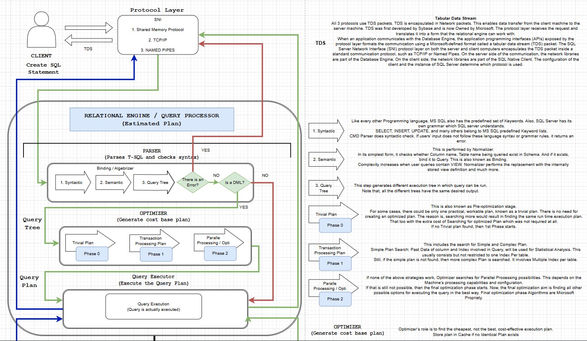
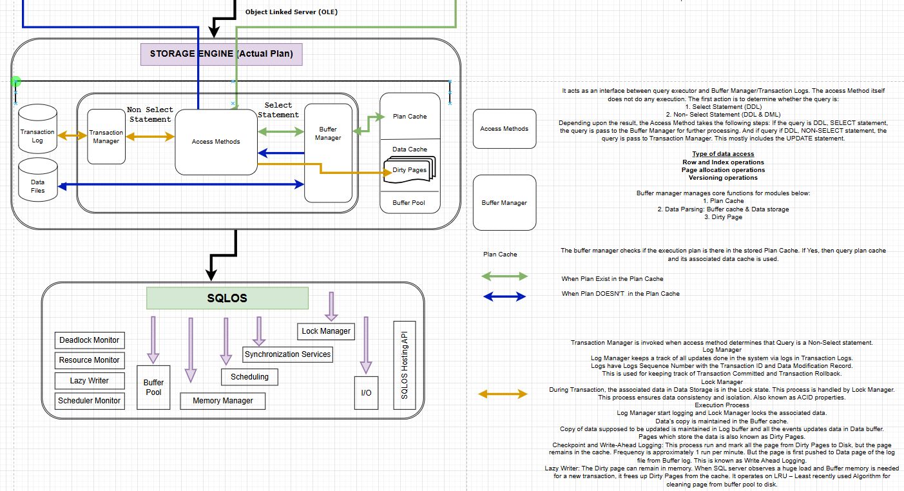
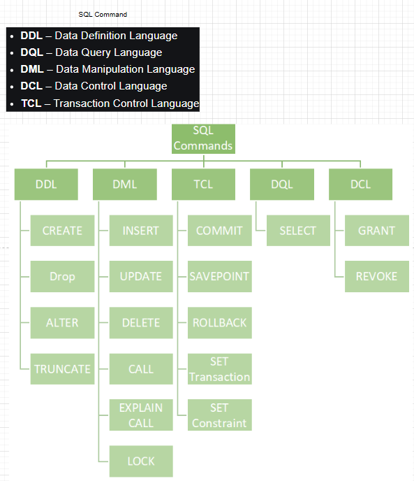

### **1.2. Components of the SQL Server Engine**

The four major components of SQL Server engine are: **the protocol layer**, **the query processor**, **the storage engine**, and **the SQLOS**. Every batch submitted to SQL Server for execution, from any client application, must interact with these four components.

**The protocol layer** receives the request and translates it into a form that the relational engine can work with. It also takes the final results of any queries.
**The query processor** accepts T-SQL batches and determines what to do with them. For T-SQL queries and programming constructs, it parses, compiles, and optimizes the request and oversees the process of executing the batch. As the batch is executed, if data is needed, a request for that data is passed to the storage engine.
**The storage engine** manages all data access, both through transaction-based commands and bulk operations such as backup, bulk insert, and certain Database Console Commands (DBCCs). 
**The SQLOS** layer handles activities normally considered to be operating system responsibilities, such as thread management (scheduling), synchronization primitives, deadlock detection, and memory management, including the buffer pool.

### **1.3. The Protocol Layer**

Receives the request and translates it into a form that the relational engine can work with. It also takes the final results of any queries.

### **1.4. The Query Processor**

It includes the SQL Server components that determine exactly what your query needs to do and the best way to do it.
This has two primary components: Query Optimization and query execution. This layer also includes components for parsing and binding. By far the most complex component of the query processor—and maybe even of the entire SQL Server product—is the Query Optimizer, which determines the best execution plan for the queries in the batch.

#### **1.4.1. PARSER**

To be Complete

#### **1.4.2. OPTIMIZER**

  The Query Optimizer takes the query tree and prepares it for optimization.
  Statements that can’t be optimized, such as flow-of-control and **Data Definition Language (DDL)** commands, are compiled into an internal form. Optimizable (not DDL) statements are marked as such and then passed to the Query Optimizer.

  The Query Optimizer is concerned mainly with the **Data Manipulation Language (DML)** statements SELECT, INSERT, UPDATE, DELETE, and MERGE, which can be processed in more than one way; the Query Optimizer determines which of the many possible ways is best. It compiles an entire command batch and optimizes queries that are optimizable. The query optimization and compilation result in an execution plan.

  The first step in producing such a plan is to normalize each query, which potentially breaks down a single query into multiple, fine-grained queries. After the Query Optimizer normalizes a query, it optimizes it, which means that it determines a plan for executing that query. **Query optimization is cost-based**, the Query Optimizer chooses the plan that it determines would cost the least based on internal metrics that include estimated memory requirements, CPU utilization, and number of required I/Os.

  The Query Optimizer considers the type of statement requested, checks the amount of data in the various tables affected, looks at the indexes available for each table, and then looks at a sampling of the data values kept for each index or column referenced in the query. The sampling of the data values is called distribution statistics. Based on the available information, the Query Optimizer considers the various access methods and processing strategies that it could use to resolve a query and chooses the most cost-effective plan.

  After normalization and optimization are completed, the normalized tree produced by those processes is compiled into the execution plan, which is actually a data structure.

- **Overview**

  When a query is compiled, the SQL Statement is first parsed into an equivalent tree representartion. For queries whit valid SQL syntax, the next stage performs a series of validation steps on the query, generally called binding, where the columns and tables in the tree are compared to databases metadata to ensure that those columns and tables exist and are visible to the current user. This stage also performs semantic checks on the query to ensure that it's valid, such as making sure that the columns bound to a GROUP BY operation are valid. After the query tree is bound, the QO takes the query and start evaluating different possible query plans. The QO perform this search, selects the query plan to be executed, and then returns it to the system to execute. The execution component runs the query plan and returns the query results.

- **Understanding the tree format**

  When you submit a SQL query to the QP, the SQL is parsed into a tree representation. Each mode in the tree represents a query operation to be performed. e.g. the query 

  ```sql
  SELECT * FROM Customers C INNER JOIN Orders O ON C.cid = O.cid WHERE O.date = '2008-11-06'
  ```

  might be represented internally as:

  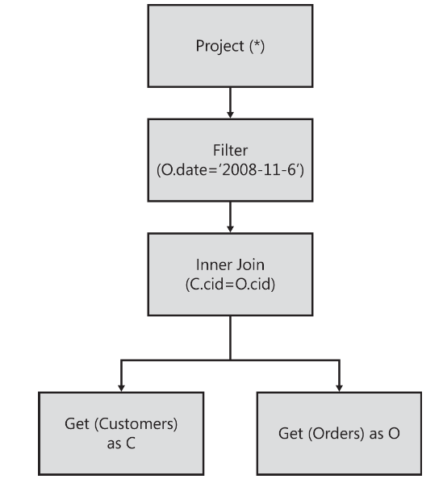

- **Understanding optimization**

  Another major job of the QO is to find an efficient query plan. At first you might think that every SQL query would have an obvious best plan. Unfortunatelly, finding an optimal query plan is actually a much more difficult algorithmic problem for SQL Server. As the number of tables increases, the set of alternatives to consider quicly grows to be larger than what any computer can count. The storage of all possible query plans also becomes a problem. The Query Optimizer solves this problem using heuristics and statistics to guide those heuristics.

  > [!WARNING]
  
  > What heuristics means on this contexts?

- **Search space and heuristics**

  The QO uses a framework to search and compare many different possible plan alternative efficiently.

    - **Rules**

      The QO is a search framework. 
      The QO considers transformation of a spacefic query tree from the current state to a different. 
      In the framework used in SQL Server, the transformations are done via RULES, wich are very similar to the mathematical theorems. Rules are matches to tree patterns and are the applied if they are suitable to generate new alternatives. The QO has different kinds of RULES:

      1. SUBSTITUTION RULE. Rules that heuristically rewrite a query tree into a new shape.
      2. EXPLIRATION RULES. These rules generate new tree shapes but can't be directly executed.
      3. IMPLEMENTATION RULES. Rules that convert logical trees into physical tress to be executed.

      The best of these generated physical alternatives from implementation rules is eventually output by the QO as the final query execution plan.

    - **Properties**

      The search framework collects information about the query tree in a format that can make it easier for rules to work. e.g. one property used in SQL Server is the set of columns that make up a UQ on the data. Consider the following query:

      ```sql
      SELECT col1, col2, MAX(col3) FROM Table1 GROUP BY col1, col2;
      ```

      This query is represented internally as a tree, as show below:

      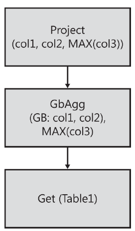

      If the columns (col1, col2) make up a unique key on table group by, doing grouping isn't necessary at all because each group has exactly one row. So, writing a rule that removes the group by from the query tree completely is possible. Figure below shows this rule in action

      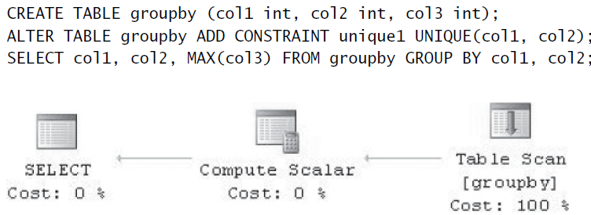

      By looking at the final query plan you can see that the QO performs no grouping operation, even though the query uses a GROUP BY. The properties collected during optimization enable this rule to perform a trees transformation to make the resulting query plan complete more quicly.

      One useful app of this scalar property is in CONTRADICTION DETECTION. The QO can determine whether the query is written in such a way as to never return any rows at all. When the QO detects a contradiction, it reqires the query to remove the portion of the query containing the contradiction. Figure below shows an example of a contradiction detected during optimization.

      ```sql
      CREATE TABLE dbo.DomainTable ([col1] INT);
      GO

      SELECT *
      FROM   dbo.DomainTable D1
      JOIN   dbo.DomainTable D2
      ON     D1.col1 = D2.col1
      WHERE 
            D1.col1 > 5 
      AND    D2.col1 < 0;
      ```

      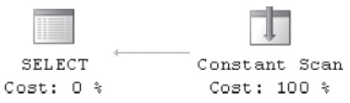

      The final QP doesn’t even reference the table at all; it’s replaced with a special Constant Scan operator that doesn’t access the storage engine and, in this case, returns zero rows. This means that the query runs faster, consumes less memory, and doesn’t need to acquire locks against the resources referenced in the section containing the contradiction when being executed.

      Like with rules, both logical and physical properties are available.
      
      - Logical properties cover things like the output column set, key columns, and whether or not a column can output any nulls.
      - Physical properties are specific to a single plan, and each plan operator has a set of physical properties associated with it.

    - **The Memo (Storage of alternatives)**

      Earlier, this chapter mentioned that the storage of all the alternatives considered during optimization could be large for some queries. 
      The QO contains a mechanism to avoid storing duplicate information. The structure is called the Memo, and one of its purposes is to find previously explored subtrees and avoid reoptimizing those areas of the plan it exists for the life of one optimization.
      
      The Memo works by storing equivalent trees in groups. This model is used to avoid storing trees more than once during query optimization and enables the QO to avoid searching the same possible plan alternatives more than once.

      The Memo stores all considered plans.

      If the QO is about to run out of memory while searching the set of plans, it contains logical to pick a **good enough** query plan rather than run out of memory.
      After the QO finishes searching for a plan it goes through the Memo to select the best alternative from each group that satisfies the query's requirements. These operators are assembled into the final query plan, but it's very close to the showplan output generated for the query plan.

    - **Operators**

      SQL Server has around 40 opertaros and even more physical operators.

      Traditionally operators in SQL Server follow the model shows below:

      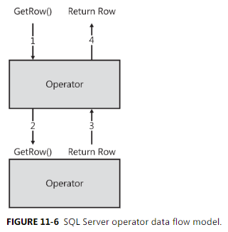

      This **row-based** model works by requesting rows from one or more children and then producing rows to return to the caller. The caller can be another operator or can be sent to the user if it's the uppermost opertor in the query tree. Each operator **returns one row at a time**, meaining that the caller must call for each row.

      I will cover a few of the more rare and exotic operators here and will reference them later.

      * Compute Scalar: Project
        Is a simple operator that attempts to declare a set of columns, compute some value, or perhaps restrict columns from other operators in the query tree. These operators correspond to the SELECT list in the SQL Language.

      * Compute Sequence: Sequence Project
        Is somewhat similar to a compute Scalar in that it computes a new value to be added into the output stream. The key difference is that this works on an ordered stream and contains state that is preserved from row to row.

      * semi-join:
        It describes an operator that performs a join but returns only values from one of its inputs. The QP uses this internal mechanism to handle most subqueries.
        Contrary to popular belief, a subquery isn't always executed and cached in a temporary table, its trated much like a regular join. e.g. Suppouse that you need to ask a sales tracking system for a store to show you all customers who have placed an order in the last 30 days so that you can send them a thank you email.

        ```sql
        CREATE TABLE Customers (
            custid INT IDENTITY
          , name   NVARCHAR(100)
        ); 

        CREATE TABLE Orders (
            orderid   INT IDENTITY
          , custid    INT
          , orderdate DATE
          , amount    MONEY
        ); 

        INSERT INTO Customers(name) VALUES ('Conor Cunningham'); 
        INSERT INTO Customers(name) VALUES ('Paul Randal'); 

        INSERT INTO Orders(custid, orderdate, amount) VALUES (1, '2025-07-12', 49.23); 
        INSERT INTO Orders(custid, orderdate, amount) VALUES (1, '2025-07-04', 65.00); 
        INSERT INTO Orders(custid, orderdate, amount) VALUES (2, '2025-07-12', 123.44); 

        truncate table Orders
        drop table Orders

        -- Let's find out customers who have ordered something in the last month  
        -- Semantically wrong way to ask the question - returns duplicate names 
        SELECT name 
        FROM Customers C 
        JOIN Orders    O 
        ON   C.custid = O.custid 
        WHERE  DATEDIFF(M, O.orderdate, '2025-06-30') < 1 
                
        -- and then people try to "fix" by adding a distinct 
        SELECT DISTINCT name  
        FROM  Customers C  
        JOIN  Orders O  
        ON C.custid = O.custid  
        WHERE DATEDIFF("m", O.orderdate, '2025-06-30') < 1; 
                
        -- this happens to work, but it is fragile, hard to modify, and it is usually not done properly. 
        -- the subquery way to write the query returns one row for each matching Customer 
        SELECT name  
        FROM   Customers C  
        WHERE  EXISTS ( SELECT  1 
                FROM	Orders O  
                WHERE   C.custid = O.custid 
                AND     DATEDIFF("m", O.orderdate, '2008-08-30') < 1 ); 
        -- note that the subquery plan has a cheaper estimated cost result  
        -- and should be faster to run on larger systems

        --SELECT  DATEDIFF("m", '2025-07-12', '2008-08-30'), DATEDIFF("m", '2025-07-04', '2008-08-30'), DATEDIFF("m", '2025-07-12', '2008-08-30'); 

        SELECT * FROM Customers
        SELECT * FROM Orders

        -- exercice
        SET STATISTICS IO, TIME ON
        -- do the same with CTE
        WITH cteRecentOrdes AS (
          SELECT custid
          FROM Orders
          WHERE DATEDIFF("m", orderdate, '2008-08-30') < 1
          /* GROUP BY custid */
        )
        SELECT name
        FROM   Customers C
        WHERE  EXISTS ( SELECT 1
                FROM cteRecentOrdes R
                WHERE C.custid = R.custid );

        -- CUAL ES LA MAS PERFORMANTE???
        SELECT name  
        FROM   Customers C  
        WHERE  EXISTS ( SELECT  1 
                FROM	Orders O  
                WHERE   C.custid = O.custid 
                AND     DATEDIFF("m", O.orderdate, '2008-08-30') < 1 ); 
        ```

        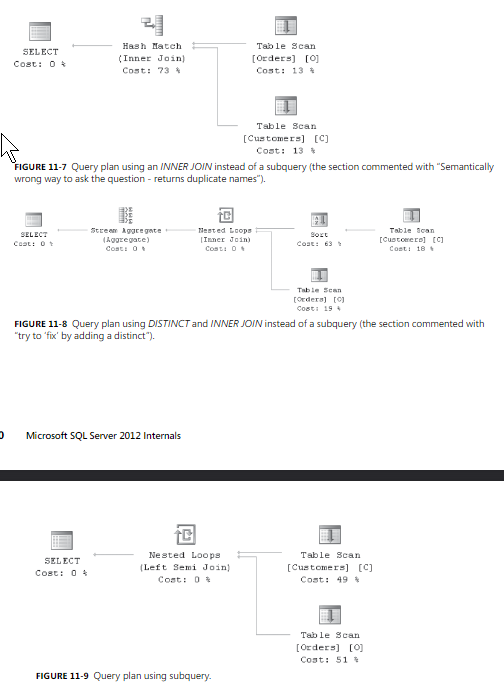
    
    - **Apply**
          
      Since SQL server 2005, CROSS APPLY and OUTER APPLY represent a special kind of subquery. The most common application for this feature is to do an index lookup join.

      ```sql
      CREATE TABLE idx1 (col1 INT PRIMARY KEY, col2 INT); 
      CREATE TABLE idx2 (col1 INT PRIMARY KEY, col2 INT); 
      GO

      SELECT * FROM idx1  
      CROSS APPLY ( SELECT * FROM idx2 WHERE idx1.col1 = idx2.col1) AS a;
      ```

      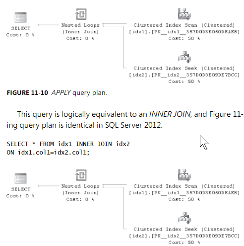

      In boths cases, a value from the outer table is referenced as an argunment to the seek on the inner table.
      The apply operator is almost like a function call in a procedural langueage. For Each row from the outer (left) side, some logic on the inner (right) side is evaluated and zero or more rows are returned for that invocation of the right subtree.

    - **Spools**
    
      SQL Server has a number of different, specialized spools, each one highly tuned for some scenario. 
      Conceptually, they all do the same thing—they read all the rows from the input, store them in memory or spill it to disk, and then allow operators to read the rows from this cache. 

      **Spools exist to make a copy of the rows.**

      The most exotic spool operation is called a **common subexpression**. This spool can be written once and then read by multiple, different children in the query. It’s currently the only operator that can have multiple parents in the final query plan.
      **Common subexpression spools** have only one client at a time. So, the first instance populates the spool, and each later reference reads from this spool in sequence.
      **Common subexpression spools** are used most frequently in wide update plans, the are also used in windowed aggregate funcitons.

      ```sql
      CREATE TABLE window1 (col1 INT, col2 INT); 
      GO 
      
      DECLARE @i INT = 0;

      WHILE @i < 100 
      BEGIN 
          INSERT INTO window1 (col1, col2) 
          VALUES (@i/10, RAND() * 1000); 
          SET @i += 1; 
      END;
      
      SELECT col1, SUM(col2) 
        OVER(PARTITION BY col1) 
      FROM window1
      ```

      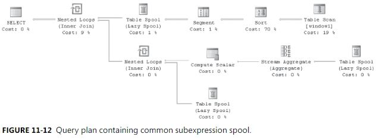

    - **Exchange**

      The Exchange operator is used to represent parallelism in query plans. This can be seen in the show-plan as a Gather Streams, Repartition Streams, or Distribute Streams operation, based on whether it’s collecting rows from threads or distributing rows to threads, respectively. 

- **Optimizer architecture**

  The QO contains many optimization phases that each perform different functions.
  The major phases in the optimization of a query, as show below are as follows:

  * Simplification
  * Trivial plan
  * Auto-stats create/update
  * Exploration/Implementation(phases)
  * Convert to executable plan

  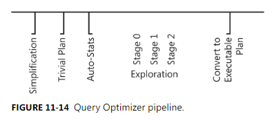

  - **Before otimization**
  The SQL Server QP performs several steps before actual optimization process begins. View expansion is one major preoptimization activity. Coalescing adjacent UNION operations is another preoptimization transformation that is perfromed to simplify the tree.

  - **Simplification**

    Early in optimization, the tree is normalized in the Simplification phase to convert the tree from a form linked closely to the user syntax into one that helps later processing. 
    The Simplification phase also performs a number of other tree rewrites, including the following:

    - Grouping joins together and picking an initial join order, based on cardinality data for each table.
    - Finding contradictions in queries that can allow portions of a query not to be executed
    - Performing the necessary work to rewrite SELECT lists to match computed columns

  - **Trivial plan/auto-parameterization**

    The main optimization path in SQL Server is a very powerfull cost-based model of a query's execution time. 
    To be able to satisfy small query applications well, SQL Server use a fast path to identify queries where cost based optimization isn't needed. This means that only one plan is available to execute or an obvious best plan can be identified. In these cases, The QO directly generates the best plan and returns it to the system to be executed.
    
    The SQL Server QP actually takes this concept one step further. When simple queries are compiled and optimized, the QP attempts to rewrite them into an equivalent parameterized query instead. If the plan is determined to be **trivial**, the parameterized query is turned into an executable plan. Then, future queries that have the same shape except for constants in well-known locations in the query text just run the existing compiled query and avoid going through the QO at all. 

    ```sql
    SELECT [text]
    FROM   sys.dm_exec_query_stats AS qs      
    CROSS APPLY sys.dm_exec_sql_text(qs.sql_handle) AS st 
    WHERE st.text LIKE '%Table1%';  
    ---------------------------------------- 
    (@1 tinyint)SELECT [col1] FROM [Table1] WHERE [col2]=@1
    ```

    The other choice is **full**, meaning that cost-based optimization was performed.

  - **Limitations**

    Using more complex features can disqualify a query from being considered trivial because those features always have a cost-based plan choice or are too difficult to 
    identify as trivial. Examples of query features that cause a query not to be considered trivial include Distributed Query, Bulk Insert, XPath queries, queries with joins or subqueries, queries with hints, some cursor queries, and queries over tables containing filtered indexes.

    SQL Server 2005 added another feature, **forced parameterization**, to auto-parameterize queries more aggressively. This feature parameterizes all constants, ignoring cost-based considerations. The benefit of this feature is that it can reduce compilations, compilation time, and the number of plans in the procedure cache. All these things can improve system performance. On the other hand, this feature can reduce performance when different parameter values would cause different plans to be selected. These values are used in the Query Optimizer’s cardinality and property framework to decide how many rows to return from each possible plan choice, and forced parameterization blocks these optimizations.
    

  - **The Memo: exploring multiple plans efficiently**

    **The core structure of the QO is the Memo**. 
    
    This structure helps store the result of all the rules run in the Query Optimizer, and it also helps guide the search of possible plans to find a good plan quickly and to avoid searching a subtree more than once. the Memo consist of a series of groups. Rules are the mechanism that allow the memo to explore new alternatives during the optimization process.

    An optimization search pass is split into two parts. 
    In the first part of the search, exploration rules match logical trees and generate new, equivalent alternative logical trees that are inserted into the Memo. Implementation rules run next, generating physical trees from the logical trees. After a physical tree is generated, it’s evaluated by the costing component to determine the cost for this query tree. The resulting cost is stored in the Memo for that alternative. When all physical alternatives and their costs are generated for all groups in the Memo, the Query Optimizer finds the one query tree in the Memo that has the lowest cost and then copies that into a standalone tree. The selected physical tree is very close to the showplan form of the tree.

    The optimization process is optimized further by using multiple search passes. The QO can quit optimization at the end of a phase if a sufficiently good plan has been found. This calculation is done by comparing the estimated cost of the best plan found so far against the actual time spent optimizing so far. If the current best plan is still very expensive, another phase is run to try to find a better plan. This model allows the QO to generate plans efficiently for a wide range of workloads. By the end of the search, the QO has selected a single plan to be returned to the system. This plan is copied from the Memo into a separate tree format that can be stored in the Procedure Cache. During this process, a few small, physical rewrites are performed. Finally, the plan is copied into a new piece of contiguous memory and is stored in the procedure cache


- **Statistics, cardinality estimation, and costing**

- **Statistics**

  The QO uses a model with estimated costs of each operator to determine which plan to choose. The costs are based on statistical information used to estimate the number of rows processed in each operator. By default, statistics are generated automatically during the optimization process to help generate these cardinality estimates. The QO also determines which columns need statistics on each table.
  When a set of columns is identified as needing statistics, the QO tries to find a preexisting statistics object for that column. If it doesn’t find one, the system samples the table data to create a new statistics object. If one already exists, it’s examined to determine whether the sample was recent enough to be useful for the compilation of the current query. If it’s considered out of date, a new sample is used to rebuild the statistics object. This process continues for each column where statistics are needed. Both auto-create and auto-update statistics are enabled by default.

  Althoug these settings are left enabled, some reasons for disabling the creation or update behavoir of statistics, include the following:

  - The table is very large, and the time to update the statistics automatically is too high.
  - The tables has many unique values, and the sample rate used to generate statistics isn´t high enough to capture all the statistical information needed to generate a good query plan.
  - The DB app has a short query timeout defined and doesn´t want automatic statistics to cause a query to require noticiably more time than average to compile because it could cause that timeout to abort the query.

  SQL Server 2005 introduced a feature called asynchronous statistics update, or ALTER DATABASE...SET AUTO_UPDATE_STATISTICS_ASYNC {ON | OFF}. This allows the statistics update operation to be performed on a background thread in a different transaction context.

- **Statistics design**

  Statistics are stored in the system metadata and are composed primarily of **a histogram** (a representation of the data distribution for a column)
  Statistics can be created over most, but not all. As a general rule, data types that support comparisions (such as >, = and so on) support the creation of statistics.
  Also SQL Server supports tatistics on computed column. The following code creates statisitics on a persisted computed column created on a function of an otherwise noncomparable UDT.

  ```sql
  CREATE TABLE Geog (col1 INT IDENTITY, col2 GEOGRAPHY); 
  INSERT INTO Geog (col2) VALUES (NULL); 
  INSERT INTO Geog (col2) VALUES (GEOGRAPHY::Parse('LINESTRING(0 0, 0 10, 10 10, 10 0, 0 0)')); 

  ALTER TABLE Geog 
  ADD col3 AS col2.STStartPoint().ToString() PERSISTED; 
  
  CREATE STATISTICS s2 ON Geog(col3); 
  DBCC SHOW_STATISTICS('Geog', 's2');
  ```

  **For small tables, all pages are sampled. For large tables a smaller percentage of pages are sampled. So that the histogram remains a reasonable size, it's limited to 200 total steps.**

- **Density/Frequency information**

  In addition to a histogram, the QO keeps track of the number of unique values for a set in columns.
  This information, called the **DENSITY INFORMATION**, is stored in the statistics objects. Dentisy is calculated by the formula **1/frequency**, with frequency being the average number of duplicates for each value in a table. For multicolumn statistics, the statistics objetct stores density information for each combination of columns in the statitisc object.

  ```sql
  CREATE TABLE MULTIDENSITY (col1 INT, col2 INT); 
  go 
  
  DECLARE @i INT; 
  SET @i=0; 
  WHILE @i < 10000 
  BEGIN  
      INSERT INTO MULTIDENSITY(col1, col2) 
      VALUES (@i, @i+1);  
      
      INSERT INTO MULTIDENSITY(col1, col2) 
      VALUES (@i, @i+2);  
      
      INSERT INTO MULTIDENSITY(col1, col2) 
      VALUES (@i, @i+3);  
      
      set @i+=1; 
  END; 
  GO 
  
  -- create multi-column density information 
  CREATE STATISTICS s1 ON MULTIDENSITY(col1, col2); 
  GO
  ```

  In col1 are 10,000 unique values, each duplicated three times. In col2 are actually 10,002 unique values. For the multicolumn density, each set of (col1, col2) in the table is unique.

  ```sql
  DBCC SHOW_STATISTICS ('MULTIDENSITY', 's1')
  ```

  The density information for col1 is 0.0001 1/0.0001 = 10,000 wich is the number of unique values of col1. The density information for (col1/2) is about 0.00003 (the number are stored as floating points and are imprecise).

  ```sql
  SET STATISTICS PROFILE ON 
  SELECT COUNT(*) AS CNT FROM MULTIDENSITY GROUP BY col1
  ```

  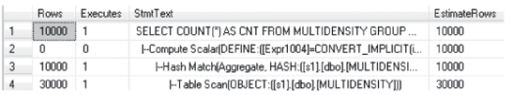

  ```sql
  SET STATISTICS PROFILE ON 
  SELECT COUNT(*) AS CNT FROM MULTIDENSITY GROUP BY col1, col2
  ```    

  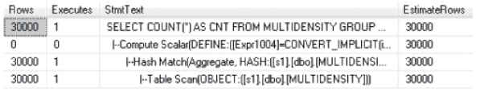


- **Filtered Statistics**

  SQL 2008 introduced the Filtered Index and Filtered Statistics feature. The statistics object is created over a subset of the rows in a table based on a filter predicate.
  Filtered statistics can avoid a common problem in cardinality estimation in which estimates become skewed because of data correlation between columns. e.g. if you create a table called CARS, you might have a column called MAKE and a column called MODEL. The following table shows that multiple models of cars are made by Ford.

  CAR_ID  MAKE MODEL
  1       Ford F-150
  2       Ford Taunus
  3       BMW  M3
  
  Also, assume that you want to run a query like the following:

  ```sql
  SELECT * FROM CARS WHERE MAKE ='Ford' AND MODEL ='F-150';
  ```

  When the query processor tries to estimate the selectivity for each condition in an AND clause, it usually assumes that each condition is independent. This allows the selectivity of each predicate to be multiplied together to form the total selectivity for the complete WHERE clause. For this example, it would be 2/3 * 1/3 = 2/9. The actual selectivity is really 1/3 for this query because every F-150 is a Ford. This kind of estimation error can be large in some data sets.

  In addition to the Independence assumption, the QO contains other assumptions that are used both to simplify the estimation process and to be consistent in how estimates are made across all operators. Another assumption in the QO is **Uniformity**. This means that if a range of values is being considered but the values aren’t known, they are assumed to be uniformly distributed over the range in which they exist. e.g. if a query has an IN list with different parameters for each value, the values of the parameters aren’t assumed to be grouped. The final assumption in the QO is **Containment**. This says that if a range of values is being joined with another range of values, the default assumption is that query is being asked because those ranges overlap and qualify rows. Without this assumption, many common queries would be underestimated and poor plans would be chosen.

- **String statistics**

  SQL Server 2005 introduced a feature to improve cardinality estimation for strings called **String Statistics or trie trees**. SQL Server histograms can have up to 200 steps, or unique values, to store information about the overall distribution of a table. Although this works well for many numeric types, the string data types often have many more unique values. Trie trees were created to store efficiently a sample of the strings in a column.

- **Cardinality estimation details**

  During optimization, each operator in the query is evaluated to estimate the number of rows processed by that operator. This helps the QO make proper tradeoffs based on the costs of different query plans. This process is done bottom up, with the base table cardinalities and statistics being used as input to tree nodes above it.
  e.g. to explain how the cardinality derivation process works see:

  ```sql
  CREATE TABLE Table3(col1 INT, col2 INT, col3 INT); 
  GO 
  SET NOCOUNT ON; 
  BEGIN TRANSACTION; 
      DECLARE @i INT=0; 
      
      WHILE @i< 10000  
      BEGIN 
          INSERT INTO Table3(col1, col2, col3) VALUES (@i, @i,@i % 50); 
          
          SET @i+=1; 
      END; 
  COMMIT TRANSACTION; 
  GO 
  
  SELECT col1, col2 FROM Table3 WHERE col3 < 10;
  ```

  For this query, the filter operator requests statistics on each column participating in the predicate (col3 in this query). The request is passed down to Table3, where an appropriate statistics object is     
  created or updated. That statistics object is then passed to the filter to determine the operator’s selectivity. Selectivity is the fraction of rows that are expected to be qualified by the predicate and then 
  returned to the user.
  When the selectivity for an operator is computed, it’s multiplied by the current number of rows for the query. The selectivity of this filter operation is based on the histogram loaded for column col3, as shown in Figure below

  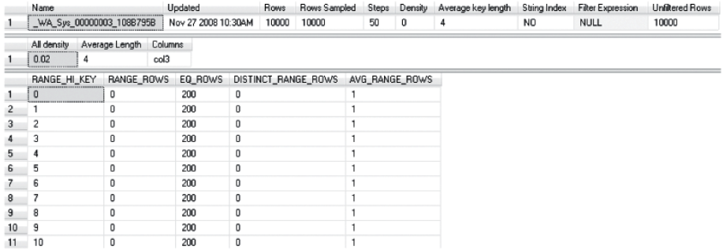

  The distribution on col3 is uniformly distributed from 0 to 49, and 10/50 values are less than 10, or 20 percent of the rows. Therefore, the selectivity of this filter in the query is 0.2, and the calculation of the number of rows resulting from the filter is as follows:

  ```sql
  (# rows in operator below) * (selectivity of this operator)
  10000 * 0.2 = 2000 rows
  ```

  The estimate for the operator is taken by looking at the histogram, counting the number of sampled rows matching the criteria (in this case, 10 histogram steps with 200 equal rows are required for values 
  that match the filter condition). Then, the number of qualifying rows (2,000) is normalized against the number of rows sampled when the histogram was created (10,000) to create the selectivity for the operator (0.2). This is then multiplied by the current number of rows in the table (10,000) to get the estimated query output cardinality. The cardinality estimation process is continued for any other filter conditions, and the results are usually just multiplied to estimate the total selectivity for each condition.

  When a multicolumn statistics object is created, it computes density information for the sets of columns being evaluated in the order of the statistics object. So a statistics object created on (col1, col2, col3) has density information stored for ((col1), (col1, col2), and (col1, col2, col3)). 

  ```sql
  CREATE TABLE Table4(col1 int, col2 int, col3 int) 
  GO 
  DECLARE @i int=0 
  WHILE @i< 10000  
  BEGIN 
      INSERT INTO Table4(col1, col2, col3) 
      VALUES (@i % 5, @i % 10,@i % 50); 
      
      SET @i+=1 
  END 
  CREATE STATISTICS s1 on Table4(col1, col2, col3) 
  DBCC SHOW_STATISTICS (Table4, s1)
  ```

  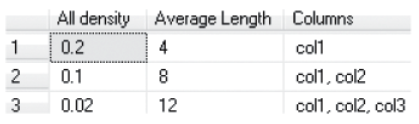

  If a similar table is created with random data in the first two columns, the density looks quite different. This would imply that every combination of col1, col2, and col3 is actually unique in that case.

- **Limitations**

  The cardinality estimation of SQL server is usually very good. Unfortunatelly, you can understand that the calculations explained earlier in this sections don't work perfectly in every query.

  - Multiple predicates in an operator
  - Deep query tress. The process of tree-based cardinality estimation is good, but it also means that any errors lower in the query tree are magnified as the calculation proceeds higher up 
    the query tree to more and more operators.
  - Less common operators. The QO uses many operators. Most of the common operators have extremely deep support developed over multiple versions of the product. Some of the lesser-used operators, 
    however, don’t necessarily have the same depth of support for every single scenario. So if you’re using an infrequent operator or one that has only recently been introduced, it might not 
    provide cardinality estimates that are as good as most core operators.

- **Costing**

  The process of estimating cardinality is done using the logical query trees. Costing is the process of determining how much time each potential plan choice will require to run, and it’s done separately for each physical plan considered. Because the QO considers multiple different physical plans that return the same results, this makes sense. Costing is the component that picks between hash joins and loops joins or between one join order and another. The idea behind costing is actually quite simple. Using the cardinality estimates and some additional information about the average and maximum width of each column in a table, it can determine how many rows fit on each database page. This value is then translated into a number of disk reads that a query requires to complete. The total costs for each operator are then added to determine the total query cost, and the QO can select the fastest (lowest-cost) query plan from the set of considered plans during optimization. To make the QO more consistent, the development team used several assumptions when creating the costing model.

  - A query is assumed to start with a cold cache. This means that the QP assumes that each initial I/O for a query requires reading from disk.
  
  - Random I/Os are assumed to be evenly dispersed over the set of pages in a table or index. If a nonindexed base table (a heap) has 100 disk pages and the query is doing 100 random bookmark-based lookups from a
    nonclustered index into that heap, the QO assumes that 100 random I/Os occur in the query against that heap because it assumes that each target row is on a separate page.
  
  The QO has other assumptions built into its costing model. One assumption relates to how the client reads the query results. Costing assumes every query reads every row in the query result. However, some clients read only a few rows and then close the query. e.g. if you are using an application that shows you pages of rows on screen at a time, that application can read 40 rows even though the original query might have returned 10,000 rows. If the QO knows the number of rows the user will consume, it can optimize for the number in the plan selection process to pick a faster plan. SQL Server exposes a hint called FAST N for just this case.

  ```sql
  CREATE TABLE A(col1 INT); 
  CREATE CLUSTERED INDEX i1 ON A(col1); 
  GO 
  SET NOCOUNT ON; 
  BEGIN TRANSACTION; 
  DECLARE @i INT=0; 
  WHILE @i < 10000 
  BEGIN 
      INSERT INTO A(col1) VALUES (@i); 
      SET @i+=1; 
  END; 
  COMMIT TRANSACTION; 
  GO
  
  SELECT A1.* 
  FROM   A AS A1 
  JOIN   A AS A2 
  ON     A1.col1 = A2.col1; 
  
  SELECT A1.* 
  FROM   A AS A1 
  JOIN   A AS A2 
  ON     A1.col1 = A2.col1 OPTION (FAST 1);

  /* FAST N
  Specifies that the query is optimized for fast retrieval of the first integer_value number of rows. This result is a non-negative integer. After the first integer_value number of rows are returned, 
  the query continues execution and produces its full result set.
  */

  USE AdventureWorks2022
  GO
  SELECT ProductID, OrderQty, SUM(LineTotal) AS Total
  FROM  Sales.SalesOrderDetail
  WHERE UnitPrice < $5.00
  GROUP BY ProductID, OrderQty
  ORDER BY ProductID, OrderQty
  OPTION (HASH GROUP, FAST 10);
  GO

  SET STATISTICS IO, TIME ON
  SELECT * FROM  Sales.SalesOrderDetail
    --Table 'SalesOrderDetail'. Scan count 1, logical reads 1238, physical reads 0
    --CPU time = 125 ms,  elapsed time = 787 ms.

  SELECT * FROM  Sales.SalesOrderDetail OPTION (FAST 1)
    --Table 'SalesOrderDetail'. Scan count 1, logical reads 1238, physical reads 2, page server reads 0, read-ahead reads 1225
    --CPU time = 47 ms,  elapsed time = 787 ms.
  ```        

- **Index selection**

  Index selection is one of the most important aspects of QO. The basic idea behind index matching is to take predicates from a WHERE clause, join condition, or other limiting operation in a query and to convert that operation so that it can be performed against an index. Two basic operations can be performed against an index.

  - Seek for a single value or a range of values on the index key
  - Scan the index forward or backward

    The job of the QO is to figure out which predicates can be applied to the index to return rows as quickly as possible. Some predicates can be applied to an index, whereas others can’t.

    Predicates that can be converted into an index operation are often called **sargable, or “search-ARGument-able.”** This means that the form of the predicate can be converted into an index operation. Predicates that can never match or don’t match the selected index are called **non-sargable** predicates. Predicates that are non-sargable would be applied after any index seek or range scan operations so that the query can return rows that match all predicates. Making things somewhat confusing is that SQL Server usually evaluates non-sargable predicates within the seek/scan operator in the query tree. This is a performance optimization; if this weren’t done, the series of steps performed would be as follows:

    1. Seek Operator: Seek to a key in an index’s B-tree.
    2. Latch the page.
    3. Read the row.
    4. Release the latch on the page.
    5. Return the row to the filter operator.
    6. Filter: Evaluate the non-sargable predicate against the row. If it qualifies, pass the row to the parent operator. Otherwise, repeat step 2 to get the next candidate row

    The actual operation in SQL Server looks like this:

    1. Seek Operator: Seek to a key in an index’s B-tree.
    2. Latch the page.
    3. Read the row.
    4. Apply the non-sargable predicate filter. If the row doesn’t pass the filter, repeat step 3. Other-wise, continue to step 5.
    5. Release the latch on the page.
    6. Return the row

    This is called pushing non-sargable predicates.

    Not all predicates can be evaluated in the seek/scan operator. Because the latch operation prevents other users from even looking at a page in the system, this optimization is reserved for predicates that are very cheap to perform. This is called non-pushable, non-sargable predicates. Examples include the following.

    - Predicates on large objects (including varbinary(max), varchar(max), nvarchar(max))
    - Common language runtime (CLR) functions
    - Some T-SQL functions

- **Filtered Indexes**

  At first glance, the Filtered Indexes feature is a subset of the functionality already contained in indexed views. Nevertheless, this feature exists for good reasons.

    - Indexed views are more expensive to use and maintain than filtered indexes.
    - The matching capability of the Indexed View feature isn’t supported in all editions of SQL Server.

  Filtered Indexes are created using a new WHERE clause on a CREATE INDEX statement.

  ```sql
  CREATE TABLE dbo.TestFilter1 (col1 INT, col2 INT); 
  GO 

  DECLARE @i INT = 0; 

  SET NOCOUNT ON; 

  BEGIN TRANSACTION; 
    WHILE @i < 40000  
    BEGIN 
        INSERT INTO testfilter1(col1, col2) VALUES (rand()*1000, rand()*1000); 
        SET @i+=1; 
    END; 
  COMMIT TRANSACTION; 
  GO

  CREATE INDEX i1 ON dbo.TestFilter1 (col2) 
  WHERE col2 > 800;  
  
  SELECT col2 FROM testfilter1 
  WHERE col2 > 800; 
  
  SELECT col2 FROM testfilter1 
  WHERE col2 > 799;
  ```

  Filtered indexes can handle several scenarios (When can we use it?).

    - If you are querying a table with a small number of distinct values and are using a multicolumn predicate in which some of the elements are fixed, you can create a filtered index to speed up this specific 
      query. This might be useful for a regular report run only for your boss; it speeds up a small set of queries without slowing down updates as much for everyone else.

    - The index can be used when an expensive query on a large table has a known query condition

- **Indexed Views**

  Traditional, NONindexed views have been used for goals such as simplifying SQL queries, abstracting data models from user models, and enforcing user security. From an optimization perspective, SQL Server doesn’t do much with these views because they are expanded, or in-lined, before optimization begins. 
  SQL Server exposes a CREATE INDEX command on views that creates a materialized form of the query result. The resulting structure is physically identical to a table with a clustered index. Nonclustered indexes also are supported on this structure. The QO can use this structure to return results more efficiently to the user. The WITH(NOEXPAND) hints tells the query processor not to expand the view definition.

  ```sql
  -- Create two tables for use in our indexed view 
  CREATE TABLE dbo.Table1 (
      id		 INT PRIMARY KEY
    , submitdate DATETIME
    , comment	 NVARCHAR(200)
  );

  CREATE TABLE dbo.Table2 (
      id		INT PRIMARY KEY IDENTITY
    , commentid INT
    , product NVARCHAR(200)
  ); 
  GO 

  -- submit some data into each table 
  INSERT INTO dbo.Table1(id, submitdate, comment) VALUES (1, '2008-08-21', 'Conor Loves Indexed Views'); 
  INSERT INTO dbo.Table2(commentid, product) VALUES (1, 'SQL Server'); 
  GO 

  -- create a view over the two tables 
  CREATE VIEW dbo.v1 WITH SCHEMABINDING 
  AS
    SELECT t1.id, t1.submitdate, t1.comment, t2.product 
    FROM dbo.Table1 t1 
    JOIN dbo.Table2 t2 
  ON   t1.id = t2.commentid;
  GO

  -- Indexed the view 
  CREATE UNIQUE CLUSTERED INDEX i1 ON v1(id);

  -- Query the view directly --> matches  
  SELECT * FROM dbo.v1; 

  -- Query the statement used in the view definition --> matches as well
  SELECT t1.id, t1.submitdate, t1.comment, t2.product  
  FROM dbo.table1 t1 
  JOIN dbo.table2 t2      
  ON   t1.id = t2.commentid;

  -- Query a logically equivalent statement used in the view definition that (is written differently) --> matches as well  
  SELECT t1.id, t1.submitdate, t1.comment, t2.product  
  FROM dbo.table2 t2 
  JOIN dbo.table1 t1 
  ON   t2.commentid = t1.id;
  ```
  
  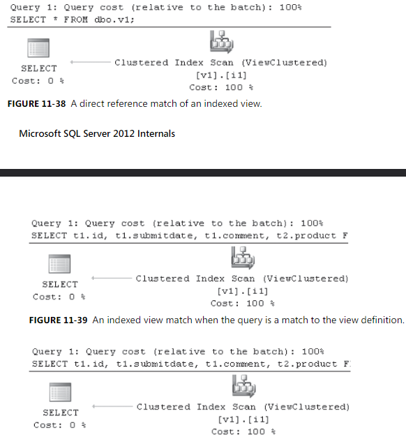

  Although they are often the best plan choice, this isn't always the case.

  ```sql
  CREATE TABLE dbo.Table5 (
      col1 INT PRIMARY KEY IDENTITY
    , col2 INT
  ); 

  INSERT INTO dbo.Table5(col2) VALUES (10); 
  INSERT INTO dbo.Table5(col2) VALUES (20); 
  INSERT INTO dbo.Table5(col2) VALUES (30); 
  GO
    
  -- Create a view that returns values of col2 > 20 
  CREATE VIEW dbo.v2 WITH SCHEMABINDING 
  AS
    SELECT t5.col1, t5.col2 
    FROM  dbo.Table5 t5
    WHERE t5.col2 > 20; 
  GO 
    
  -- materialize the view 
  CREATE UNIQUE CLUSTERED INDEX i1 ON v2(col1); 
  GO  
    
  -- Query the view and filter the results to have col2 values equal to 10. 
  -- The optimizer can detect this is a contradiction and avoid matching the indexed view 
  -- (the trivial plan feature can "block" this optimization) 
  SELECT * 
  FROM  dbo.v2 
  WHERE col2 = CONVERT(INT, 10)
  ```
  
  [!IMPORTANT] **What is the contradiction on this query??**

  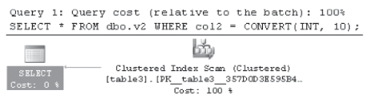

  SQL Server also supports matching indexed views in cases beyond exact matches of the query text to the view definition. It also supports using an indexed view for inexact matches in which the definition of the view is broader than the query submitted by the user. SQL Server then applies residual filters, projections.
    
  The code below demostrates view matching.

  ```sql
  -- Base Table 
  CREATE TABLE dbo.BaseTbl1 (
      col1 INT
    , col2 INT
    , col3 BINARY(4000)
  );

  CREATE UNIQUE CLUSTERED INDEX i1 ON dbo.BaseTbl1(col1); 
  GO 

  -- Populate base table 
  SET NOCOUNT ON; 

  DECLARE @i INT = 0; 

  WHILE @i < 50000 
  BEGIN 
  INSERT INTO basetbl1(col1, col2) VALUES (@i, 50000-@i); 

  SET @i += 1; 
  END; 
  GO 

  -- Ceate a view over the 2 integer columns 
  CREATE VIEW dbo.v3 WITH SCHEMABINDING 
  AS  
    SELECT col1, col2 
    FROM dbo.basetbl1; 
  GO

  -- Index that on col2 (base table is only indexed on col1)
  CREATE UNIQUE CLUSTERED INDEX iv1 on dbo.v3(col2);

  -- The indexed view still matches for both a restricted -- column set and a restricted row set 
  SELECT col1 
  FROM dbo.basetbl1 
  WHERE col2 > 2500

  SELECT col1 + 1
  FROM dbo.basetbl1 
  WHERE col2 > 2500
  ```
    
  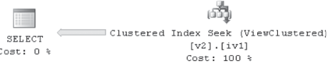

  The projection isn’t explicitly listed as a separate Compute Scalar operator in this query because SQL Server 2012 has special logic to remove projections that don’t compute an expression. The filter operator in the index matching code is translated into an index seek against the view. If you modify the query to compute an expression, Figure 11-44 demonstrates the residual Compute Scalar added to the plan.

  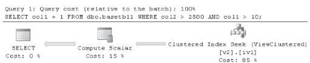

- **Partitioned tables**

  Table and index partitioning can help you manage large databases better and minimize downtime.
  Physically, partitioned tables and indexes are really N tables or N indexes that store a fraction of the rows. When comparing this to their nonpartitioned equivalents, the difference in the plan is often that the partitioned case requires iterating over a list of tables or a list of indexes to return all the rows.
  SQL Server represents partitioning in most cases by storing the partitions within the operator that accesses the partitioned table or index. This provides a number of benefits, such as enabling parallel scans to work properly.

  ```sql
  -- Create Partition Function
  CREATE PARTITION FUNCTION pf2008(date) AS RANGE RIGHT FOR VALUES ('2012-10-01', '2012-11-01', '2012-12-01'); 

  -- Check partition function
  SELECT * FROM sys.partition_functions WHERE name = 'pf2008';

  -- Create Scheme Partition
  CREATE PARTITION SCHEME ps2008 AS PARTITION pf2008 ALL TO ([PRIMARY]);

  -- Check Partition Scheme
  SELECT * FROM sys.partition_schemes WHERE name = 'ps2008';

  -- Create Table on Partition Scheme
  CREATE TABLE dbo.PTNSales(
      saledate DATE
    , salesperson INT
    , amount MONEY
  ) ON ps2008(saledate);


  INSERT INTO dbo.PTNSales (saledate, salesperson, amount) VALUES ('2012-10-20', 1, 250.00); 
  INSERT INTO dbo.PTNSales (saledate, salesperson, amount) VALUES ('2012-11-05', 2, 129.00); 
  INSERT INTO dbo.PTNSales (saledate, salesperson, amount) VALUES ('2012-12-23', 2, 98.00); 
  INSERT INTO dbo.PTNSales (saledate, salesperson, amount) VALUES ('2012-10-03', 1, 450.00);  
    
  SELECT * FROM dbo.PTNSales WHERE (saledate) NOT BETWEEN '2012-11-01' AND '2012-11-30';
  ```

  You can see that the base case doesn’t require an extra join with a Constant Scan. This makes the query plans look like the nonpartitioned cases more often, which should make understanding the query plans easier. One benefit of this model is that getting parallel scans over partitioned tables is now possible. The following example creates a large partitioned table and then performs a COUNT(*) operation that generates a parallel scan.

  ```sql
  CREATE PARTITION FUNCTION pfparallel(INT) AS RANGE RIGHT FOR VALUES (100, 200, 300); 
  GO

  CREATE PARTITION SCHEME psparallel AS PARTITION pfparallel ALL TO ([PRIMARY]); 
  GO
  
  CREATE TABLE testscan(randomnum INT, value INT, data BINARY(3000)) 
  ON psparallel(randomnum); 
  GO
  
  SET NOCOUNT ON; 
  
  BEGIN TRANSACTION; 
    DECLARE @i INT=0; 
    
    WHILE @i < 100000 
    BEGIN 
      INSERT INTO testscan(randomnum, value) 
      VALUES (rand()*400, @i); 
      
      SET @i+=1; 
    END; 
  COMMIT TRANSACTION; 
  GO 
    
  -- now let's demonstrate a parallel scan over a partitioned table in SQL Server 2012 
  SELECT COUNT(*) FROM testscan;
  ```

  In SQL server, JOIN collocation is still represented by using the APPLY/NESTED LOOPS JOIN, but other cases use the traditional representation. The following example builds on the last example to demostrate that joining with the same partitiong scheme can be done using the collocated **join technique**. What DOES THIS MEAN?

  ```sql
  -- SQL Server join collocation uses the constant scan + apply model 
  SELECT * 
  FROM testscan t1 
  JOIN testscan t2 
  ON   t1.randomnum = t2.randomnum;
  ```

  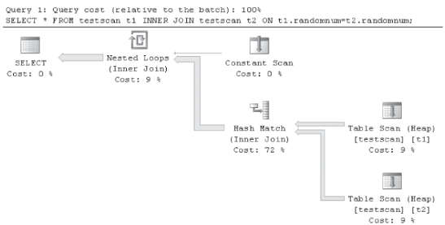

- **Windowing functions**

  Nothing

- **Data warehousing**

  SQL Server contains a number of special optimizations that speed the execution of data warehouse queries.
  Fact tables are usually so large that the use of nonclustered indexes is limited because of the large storage requirements to store these structures. Dimension tables are often indexed.
  First, SQL Server orders joins differently in data warehouses to try to perform as many limiting operations against the dimension tables as possible before performing a scan of the fact table.
  SQL Server also contains special bitmap operators that help reduce data movement across threads in parallel queries when using the star join pattern.
  SQL Server 2012 introduces significant changes in the space of relational data warehouse processing. First is a new kind of index called a columnstore. Second is a new query execution model called Batch Mode. Together, these two improvements can significantly improve runtime for data warehouse queries that use the star join pattern.

  - **Columnstore indexes**

    Columnstores in SQL Server 2012 are nonclustered indexes that use less space than a traditional B-tree index in SQL Server. They are intended to be created on the fact table of a data warehouse (and potentially also on large dimension tables). They achieve space savings by ignoring the standard practice of physically collocating all the column data for an index together for each row. Instead, they collocate values from each column together.
    The Sales fact table in Figure 11-52 conceptually shows how data is stored in different types of indexes. In traditional indexes, data is stored sequentially per row, aligned with the horizontal rectangle in Figure 11-52. In the columnstore index, data is stored sequentially per column.

    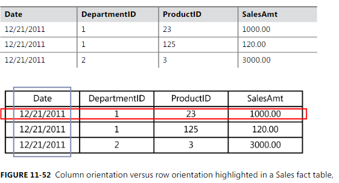

    From the perspective of the QO, having a significantly smaller index reduces the I/O cost to read the fact table and process the query. In traditional (non-columnstore) indexes, data warehouse configurations are designed so that the dimension tables fit into buffer pool memory, but the fact table doesn’t. 

  - **Columnstore limitations and workarounds**
  
    One limitation is that tables must be marked as read-only as long as the columnstore exists. In other words, you can’t perform INSERT, UPDATE, DELETE, or MERGE operations on the table while the columnstore index is active.
    With such a pattern, the index can potentially be dropped and re-created each evening around the daily extract, transform, and load (ETL) operation. Even when this isn’t true, most large fact tables use table partitioning to manage the data volume. You can load a partition of data at a time because the SWITCH PARTITION operation is compatible with the columnstore index. The use of partitioning allows data to be loaded in a closer-to-real-time model, with no downtime of the index on the fact table.
    The other columnstore restrictions in SQL Server 2012 relate to data types and which operations block the use of batch processing. Columnstore indexes support data types that are commonly used in data warehouses. Some of the more complex data types, including varchar(max), nvarchar(max), CLR types, and other types not often found in fact tables are restricted from using columnstore indexes.

  - **Batch mode processing**

    The changes made for this new execution model significantly reduce the CPU requirements to execute each query.
    The batch execution model improves CPU performance in multiple ways. First, it reduces the number of CPU instructions needed to process each row, often by a factor of 10 or more. The batch execution model specifically implements techniques that greatly reduce the number of blocking memory references required to execute a query, allowing the system to finish queries much more quickly than would be otherwise possible with the traditional rowbased model.

    - Grouping rows for repeated operations

    In batch mode, data is processed in groups of rows instead of one row at a time. The number of rows per group depends on the query’s row width and is designed to try to keep each batch around the right size to fit into the internal caches of a CPU core.

    - Column orientation within batches

    Like columnstore index, data within batches is allocated by column instead of by row. This allocation model allows some operations to be performed more quickly. Continuing the filter example, a filter in a rowbased processing model would have to call down to its child operator to get each row. This code could require the CPU cache to load new instructions and new data from main memory. In the batch model, the instructions to execute the filter instructions will likely be in memory already because this operation is being performed on a set of rows within a batch.

    - Data encoding
    
    The third major difference in the batch model is that data is stored within memory using a probabilistic representation to further reduce the number of times the CPU core needs to access memory that isn’t already in the CPU’s internal caches. 
    For example, a 64-bit nullableint field technically takes 64 bits for the data and another 1 bit for the null bit. Rather than store this in two CPU registersm the user data is encoded so that the most common values for 64 bit fields are stored within the main 64 bit word, and uncommon fields are stored outside the main 64 bit storage with a special encoding so that SQL Server can determine when the data is in batch vs out of batch.

    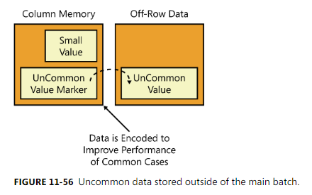
  
  - **Logical database design best practices**

    - You need to determine whether each column needs to support NULLs. If the column can be declared as NOT NULL, this helps batch processing fit values more easily
      into a CPU register.
    - You must design data warehouses to use the supported set of data types.
    - Data uniqueness must be enforced elsewhere, either through a constraint or in a UNIQUE (B-tree) index in the physical database design

  - **Plan shape**
  
    Taken in total, the typical desired shape for data warehouse star join plans in SQL Server 2012 will be as follows.

    - Join all dimension tables before a single scan of the fact table.
    - Use hash joins for all these joins.
    - Create bitmaps for each dimension and use them to scan the fact table.
    - Use GROUP BY both at the top (row-based) and pushed down toward the source operations (local aggregates in batch mode).
    - Use parallelism for the entire batch section of the query.
    
    Figure below shows the common query plan shape for batch execution plans in this scenario.

    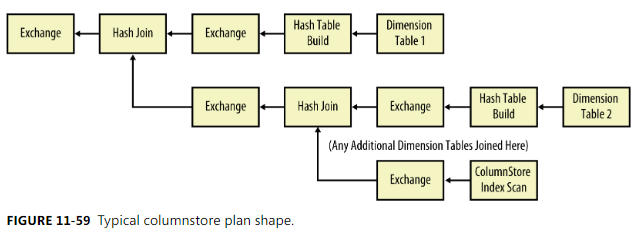

    When batch processing is used in a query, it usually outperforms the row-based approach, often by a significant amount (10x improvement is possible).

- **Updates**
  
  Updates are an interesting area within query processing. In addition to many of the challenges faced while optimizing traditional SELECT queries, update optimization also considers physical optimizations such as how many indexes need to be touched for each row, whether to process the updates one index at a time or all at once, and how to avoid unnecessary deadlocks while processing changes as quickly as possible.
  The term update processing actually includes all top-level commands that change data, such as INSERT, UPDATE, DELETE, and MERGE. As you see in this section, SQL Server treats these commands almost identically. Every update query in SQL Server is composed of the same basic operations.
  
  - It determines what rows are changed (inserted, updated, deleted, merged).
  - It calculates the new values for any changed columns.
  - It applies the change to the table and any nonclustered index structures.

  ```sql
  CREATE TABLE update1 (col1 INT PRIMARY KEY IDENTITY, col2 INT, col3 INT); INSERT INTO update1 (col2, col3) VALUES (2, 3);
  ```

  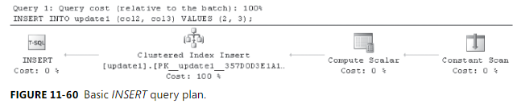

  The INSERT query uses a special operator called a **Constant Scan** that, in relational algebra, generates rows without reading them from a table. If you are inserting a row into a table, it doesn’t really have an existing table, so this operator creates a row for the insert operator to process. The **Compute Scalar** operation evaluates the values to be inserted. In the example, these are constants, but they could be arbitrary scalar expressions or scalar subqueries. Finally, the insert operator physically updates the primary key clustered index

  ```sql
  UPDATE update1 SET col2 = 5;
  ```

  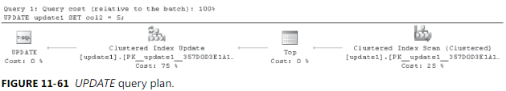

  The UPDATE query reads values from the clustered index, performs a Top operation, and then updates the same clustered index. The Top operation is actually a placeholder for processing ROWCOUNT and does nothing unless you’ve executed a SET ROWCOUNT N operation in your session. Also note that in the example, the UPDATE command doesn’t modify the key of the clustered index, so the row in the index doesn’t need to be moved. 

  ```sql
  DELETE FROM update1 WHERE col3 = 10;
  ```

  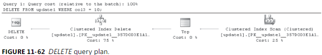

  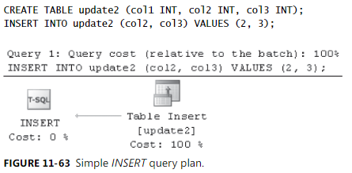

  When the table is a heap (it has no clustered index), a special optimization occurs that can collapse the operations into a smaller form. This is called a simple update (the word update is used generically here to refer to insert, update, delete, and merge plans), and it’s obviously faster. This single operator does all the work to insert into a heap, but it doesn’t support every feature in Update.

  ```sql
  CREATE TABLE update3 (col1 INT, col2 INT, col3 INT); 
  
  CREATE INDEX i1 ON update3(col1); 
  CREATE INDEX i2 ON update3(col2); 
  CREATE INDEX i3 ON update3(col3);  
  
  INSERT INTO update3(col1, col2, col3) VALUES (1, 2, 3);
  ```

  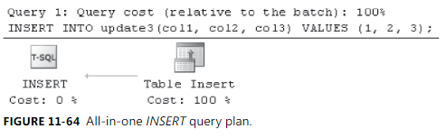

  This query needs to update all the indexes because a new row has been created. However, Figure shows that the plan has only one operator. If you look at the properties for this operator in Management Studio, as shown in Figure below, you can see that it actually updates all indexes in one operator. This is another one of the physical optimizations done to improve the performance of common update scenarios. This kind of insert is called an all-in-one or a per-row insert.

  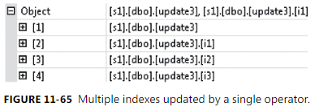

  By using the same table, you can try an UPDATE command to update some, but not all, of the indexes. Figure below shows the resulting query plan

  ```sql
  UPDATE update3 SET col2=5, col3=5;
  ```

  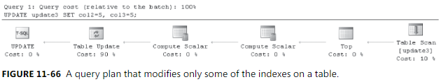

  Now things are becoming a bit more complex. The query scans the heap in the Table Scan operator, performs the ROWCOUNT Top (in versions before SQL Server 2012), performs two Compute Scalars, and then performs a Table Update. If you examine the properties for the Table Update, notice that it lists only indexes i2 and i3 because the Query Optimizer can statically determine that this command won’t change i1. One of the Compute Scalars calculates the new values for the columns. The other is yet another physical optimization that helps compute whether each row needs to modify each and every index.

  - **Halloween Protection**

    Halloween Protection describes a feature of relational databases that’s used to provide correctness in update plans.
    One simple way to perform an update is to have an operator that iterates through a B-tree index and updates each value that satisfies the filter. This works fine as long as the operator assigns a value to a constant or to a value that doesn’t apply to the filter. However, if the query attempts more complex operations such as increasing each value by 10%, in some cases the iterator can see rows that have already been processed earlier in the scan because the previous update moved the row ahead of the cursor iterating through the B-tree

    The typical protection against this problem is to scan all the rows into a buffer, and then process the rows from the buffer. In SQL Server, this is usually implemented by using a spool or a Sort operator.

  - **Split/Sort/Collpase**

    SQL Server contains a physical optimization called Split/Sort/Collapse, which is used to make wide update plans more efficient. The feature examines all the change rows to be changed in a batch and determines the net effect that these changes would have on an index. Unnecessary changes are avoided.

    ```sql
    CREATE TABLE update5 (col1 INT PRIMARY KEY); 

    INSERT INTO update5(col1) VALUES (1), (2), (3); 

    UPDATE update5 
    SET col1 = col1 + 1;
    ```

    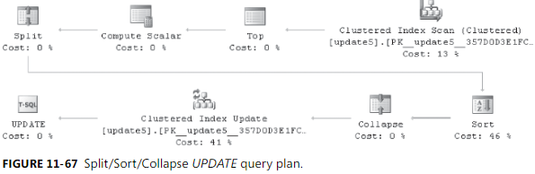

    This query is modifying a clustered index that has three rows with values 1, 2, and 3. After this query, you would expect the rows to have the values 2, 3, and 4. Rather than modify three rows, you can determine that you can just delete 1 and insert 4 to make the changes to this query.

    Now walk through what happens in each step. Before the split, the row data is shown in Table below.

    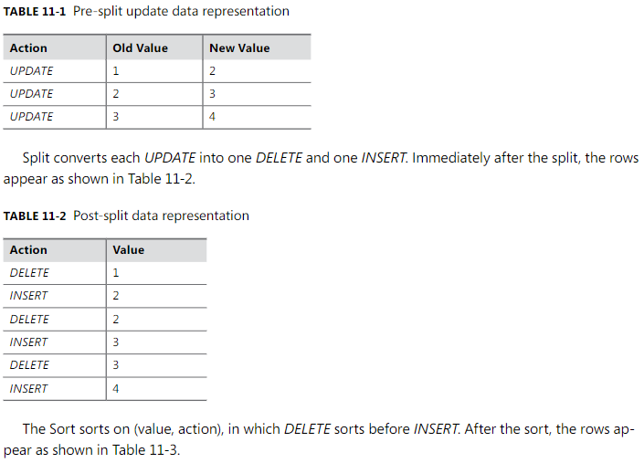

    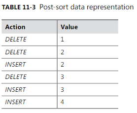

    The Collapse operator looks for (DELETE, INSERT) pairs for the same value and removes them. In this example, it replaces the DELETE and INSERT rows with UPDATE for the rows with the values 2 and 3. 

  - **Merge**

    Like the other queries, the source data is scanned, filtered, and modified. However, in the case of MERGE, the set of rows to be changed is then joined with the target source to determine what should be done with each row. An existing table is going to be updated with new data, some of which might already exist in the table. Therefore, MERGE is used to determine only the set of rows that are missing.

    ```sql
    CREATE TABLE AnimalsInMyYard (
        sightingdate DATE
      , Animal       NVARCHAR(200)
    );
    GO 

    INSERT INTO AnimalsInMyYard(sightingdate, Animal) VALUES ('2012-08-12', 'Deer'); 
    INSERT INTO AnimalsInMyYard(sightingdate, Animal) VALUES ('2012-08-12', 'Hummingbird'); 
    INSERT INTO AnimalsInMyYard(sightingdate, Animal) VALUES ('2012-08-13', 'Gecko'); 
    GO 

    CREATE TABLE NewSightings (
        sightingdate DATE
      , Animal NVARCHAR(200)
    ); 
    GO 
        
    INSERT INTO NewSightings(sightingdate, Animal) VALUES ('2012-08-13', 'Gecko'); 
    INSERT INTO NewSightings(sightingdate, Animal) VALUES ('2012-08-13', 'Robin'); 
    INSERT INTO NewSightings(sightingdate, Animal) VALUES ('2012-08-13', 'Dog'); 
    GO  
        
    -- Insert values we have not yet seen - do nothing otherwise
    MERGE AnimalsInMyYard A
    USING NewSightings N 
    ON (     A.sightingdate = N.sightingdate 
        AND A.Animal		= N.Animal
      ) WHEN NOT MATCHED 
    THEN 
      INSERT (sightingdate, Animal) VALUES (sightingdate, Animal);

    SELECT * FROM AnimalsInMyYard;
    ```

    **Take care when deciding to use MERGE.** Although it’s a powerful operator, it’s also easily misused. MERGE is best-suited for OLTP workloads with small queries that use a two-query pattern, like this:

      - Check for whether a row exists.
      - If it doesn’t exist, INSERT

  - **Wide update plans**

    SQL Server also has special optimization logic to speed the execution of large batch changes to a table. If a query is changing a large percentage of a table, SQL Server can create a plan that avoids modifying each B-tree with many individual updates. Instead, it can generate a per-index plan that determines all the rows that need to be changed, sorts them into the order of the index, and then applies the changes in a single pass through the index. These plans are called **per index or wide update plans**

    ```sql
    CREATE TABLE dbo.update6(col1 INT PRIMARY KEY, col2 INT, col3 INT); 
    CREATE INDEX i1 ON update6(col2); 
    GO 
    
    CREATE VIEW v1 WITH SCHEMABINDING AS 
      SELECT col1, col2 FROM dbo.update6; 
    GO 
    
    CREATE UNIQUE CLUSTERED INDEX i1 ON v1(col1); 
    
    UPDATE update6 SET col1 = col1 + 1
    ```

    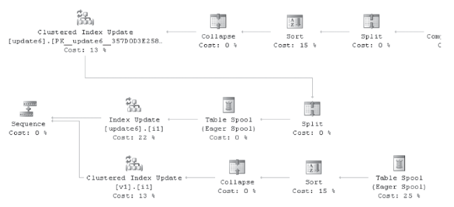

  - **Non-updating updates**
    
    Nothing important. Search on AI

  - **Sparse column updates**
    
    SQL Server provides a feature called sparse columns that supports creating more columns in a table than were previously supported, as well as creating rows that were technically greater than the size of a database page. 

  - **Partitioned updates**
    
    Updating partitioned tables is somewhat more complicated than nonpartitioned equivalents. Instead of a single physical table (heap) or B-tree, the query processor has to handle one heap or B-tree per partition. The following examples demonstrate how partitioning fits into these plans. The first example creates a partitioned table and then inserts a single row into it. Figure BELOW shows the plan.
    
    ```sql
    CREATE PARTITION FUNCTION pfinsert(INT) AS RANGE RIGHT FOR VALUES (100, 200, 300); 
    
    CREATE PARTITION SCHEME psinsert AS PARTITION pfinsert ALL TO ([PRIMARY]); 
    go 
    
    CREATE TABLE testinsert(ptncol INT, col2 INT) 
    ON psinsert(ptncol); 
    go 
    
    INSERT INTO testinsert(ptncol, col2) VALUES (1, 2);
    ```
    
    Looking at the query plan notice that this matches the bahaviour you would expect from a nonpartitioned table. Changing partitions can be a somewhat expensive operation, especially when many of the rows in the table are being changed in a single statement. The Split/Sort/Collapse logic can also be used to reduce the number of partition switches that happen, improving runtime performance. In the following example, a large number of rows are inserted into the partitioned table, and the QO chooses to sort on the virtual partition ID column before inserting to reduce the number of partition switches at run time. Figure below shows the Sort optimization in the query plan.

    ```sql
    CREATE TABLE #nonptn(ptncol INT, col2 INT) 
    
    DECLARE @i int = 0 
    WHILE @i < 10000 
    BEGIN
      INSERT INTO #nonptn(ptncol) VALUES (RAND()*1000) 
      SET @i+=1 
    END 
    GO 
    
    INSERT INTO testinsert 
    SELECT * FROM #nonptn
    ```

  - **Locking**
    
    One special locking mode is called a U (for Update) lock. This special lock type is compatible with other S (shared) locks but incompatible with other U locks.
    The following code demonstrates how to examine the locking behavior of an update query plan. Figure below shows the query plan used in this example, and the other shows the locking output from sp_lock.

    ```sql
    CREATE TABLE lock(col1 INT, col2 INT); 
    CREATE INDEX i2 ON lock(col2); 
    
    INSERT INTO lock (col1, col2) VALUES (1, 2); 
    INSERT INTO lock (col1, col2) VALUES (10, 3);  
    
    SET TRANSACTION ISOLATION LEVEL REPEATABLE READ; 
    
    BEGIN TRANSACTION; 
      UPDATE lock 
      SET col1 = 5 
      WHERE col1 > 5; 
      
      EXEC sp_lock; 
    ROLLBACK;
    ```

    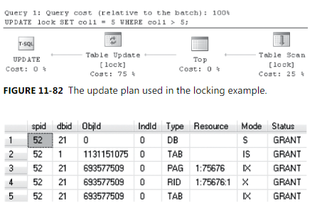

    You can run a slightly different query that shows that the locks vary based on the query plan selected. Figure below shows a seek based update plan. In the second example, the U lock is taken by the nonclustered index, whereas the base table contains the X lock. So, this U lock protection works only when going through the same access paths because it’s taken on the first access path in the query plan. Figure 11-85 shows the locking behavior of this query.

    ```sql
    BEGIN TRANSACTION; 
      UPDATE lock 
      SET col1 = 5 
      WHERE col2 > 2; 
      EXEC sp_lock;
    ```

    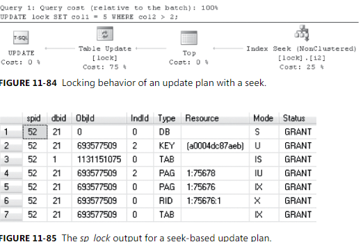

  - **Partition-Level lock esclation**

    Nothing

- **Distributed query**

  SQL Server includes a feature called Distributed Query, which accesses data on different SQL Server instances, other database sources, and non-database tabular data such as Microsoft Office Excel files or comma-separated text files.

  Distributed Query supports several distinct use cases.

  - You can use Distributed Query to move data from one source to another.
  - You can use Distributed Query to integrate nontraditional sources into a SQL Server query.
  - You can use Distributed Query for reporting. Because multiple sources can be queried in a single query, you can use Distributed Query to gather data into a single source and generate reports.
  - You can use Distributed Query for scale-out scenarios.

  Distributed Query is implemented within the Query Optimizer’s plan-searching framework. Distributed queries initially are represented by using the same operators as regular queries. Each base table represented in the QO tree contains metadata collected from the remote source. The information collected is very similar to the information that the QP collects for local tables, including column data, index data, and statistics.

  ```sql
  EXEC sp_addlinkedserver 'remote', N'SQL Server'; 
  go 
  
  SELECT * FROM remote.Northwind.dbo.customers 
  WHERE ContactName = 'Marie Bertrand';
  ```

  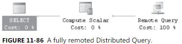

  The Distributed Query feature, introduced in SQL Server 7.0, has some limitations that you should consider when designing scenarios that use it:

  - Not every feature in SQL Server is supported via the remote query mechanism, such as some XML and UDT-based functionality. 
  - The costing model used within SQL Server is good for general use but sometimes generates a plan that’s substantially slower than optimal.

- **Plan hinting**

  - **Debugging plan issues**

    Determining when to use a hint requires an understanding of the workings of the QO and how it might not be making a correct decision, and then an understanding of how the hint might change the plan generation process to address the problem. This section explains how to identify cardinality estimation errors and then use hints to correct poor plan choices because these are usually something that can be fixed without buying new hardware or otherwise altering the host machine. The primary tool to identify cardinality estimation errors is the statistics profile output in SQL Server. 

    Other tools exist to track down performance issues with query plans. Using SET STATISTICS TIME ON is a good way to determine runtime information for a query.

    ```sql
    SET STATISTICS PROFILE ON; 
    SELECT * FROM sys.objects;
    ```

    Looking at the statistics profile output to find an error can help identify where the QO has used bad information to make a decision. If the QO makes a poor decision even with up-to-date statistics, this might mean that the QO has an out-of-model condition. 

  - **{HASH | ORDER} GROUP**
  
    SQL Server has two possible implementations for GROUP BY (and DISTINCT).

    - It can be implemented by sorting the rows and then grouping adjacent rows with the same grouping values.
    - It can hash each group into a different memory location.
    
    This hint is a good way to affect system performance, especially in larger queries and in situations when many queries are being run at once on a system.

  - **{MERGE | HASH | CONCAT} UNION**

    UNION ALL is a faster operation, in general because it takes rows from each input and simply returns them all. UNION must compare rows from each side and ensure that no duplicates are returned. Essentially, UNION performs a UNION ALL and then a GROUP BY operation over all output columns. 

    ```SQL
    CREATE TABLE t1 (col1 INT); 
    CREATE TABLE t2 (col1 INT); 
    go 
    
    INSERT INTO t1(col1) VALUES (1), (2); 
    INSERT INTO t2(col1) VALUES (1);  
    
    SELECT * FROM t1  
    UNION  
    SELECT * FROM t2 
    OPTION (MERGE UNION)
    ```

    As you can see, each hint forces a different query plan pattern:

    - With common input sizes, MERGE UNION is useful
    - CONCAT UNION is best at low-cardinality plans (one sort)
    - HASH UNION works best when a small input can be used to make a hash table against which the other inputs can be compared

  - **FORCE ORDER, {LOOP | MERGE | HASh} JOIN**

    When estimating the number of rows that qualify a join, the best algorithm depends on factors such as the cardinality of the inputs, the histograms over those inputs, The available memory to store data in memory such as hash tables, and what indexes are available. If the cardinality or histograms aren’t representative of the input, a poor join order or algorithm can result. 

    Places where I’ve seen these hints be appropriate in the past are as follows.

    - Small, OLTP-like queries where locking is a concern.
    - Larger DW with many joins, complex data correlations, and enough of a fixed query pattern that you can reason about the join order in ways that make sense for all queries.
    - Systems that extend beyond traditional relational application design. Examples SQL store with Full-Tect or XQuery components.

  - **INDEX = <indexname> | <indexid>**
    Is very effective in forcing the QO to use a specific index qhen compiling a plan.

  - **FORCESEEK**

    It tells the QO that it needs to generate a seek predicate when using an index. In a few cases, the QO can determine that an index scan is better than a seek when compiling the query.
    Earlier version of this hint semantically meant **SEEK ON THE FIRST COLUMN OF THE INDEX**.
    The primary scenario where this hint is interesting is to avoid locks in OLTP applications. This hint precludes an index scan, so it can be effective if you have a high-scale OLTP application where locking is a concern in scaling and concurrency. The hint avoids the possibility of the plan taking more locks than desired.

  - **FAST <number rows>**

    The QO assumes that the user will read every row produced by a query. Although this is often true, some user scenarios, such as manually paging through results, don’t follow this pattern; in these cases, the client reads some small number of rows and then closes the query result.
    So, when a client wants only a few rows but doesn’t specify a query that returns only a few rows, the latency of the first row can be slower because of the startup costs for stop-and-go operators such as hash joins, spools, and sorts.
    The FAST <number_rows> hint supplies the costing infrastructure with a hint from the user about how many rows the user will want to read from a query. 

  - **MAXDOP <N>**

    MAXDOP stands for maximum degree of parallelism, which describes the preferred degree of fan-out to be used when this query is run. A parallel query can consume memory and threads, blocking other queries that want to begin execution. In some cases, reducing the degree of parallelism for one or more queries is beneficial to the overall health of the system to lower the resources required to run a long-running query. 

  - **OPTIMIZE FOR**

    When estimating cardinality for parameterized queries, the QO usually uses a less accurate estimate of the average number of distinct values in the column or sniffs the parameter value from the context. This sniffed value is used for cardinality estimation and plan selection. So parameter sniffing can help pick a plan that’s good for a specific case. Because most data sets have nonuniform column distributions, the value sniffed can affect the runtime of the query plan. If a value representing the common distribution is picked, this might work very well in the average case and less optimally in the outlier case.
    If the outlier is used to sniff the value, the plan picked might perform noticeably worse than it would have if the average case value had been sniffed. The OPTIMIZE FOR hint allows the query author to specify the actual values to use during compilation. This can be used to tell the QO.

    ```SQL
    CREATE TABLE param1 (col1 INT, col2 INT);
    GO
    
    SET NOCOUNT ON; 
    BEGIN TRANSACTION; 
      DECLARE @a INT = 0;
    
      WHILE @a < 5000
      BEGIN 
        INSERT INTO param1(col1, col2) VALUES (@a, @a); 
        SET @a+=1; 
      END; 
    
      WHILE @a < 10000 
      BEGIN 
        INSERT INTO param1(col1, col2) VALUES (5000, @a); 
        SET @a+=1; 
      END; 
    COMMIT TRANSACTION; 
    GO
    
    CREATE INDEX i1 ON param1(col1); 
    go 
    CREATE INDEX i2 ON param1(col2); 
    go 
    
    DECLARE @b INT; 
    DECLARE @c INT; 
    SELECT * FROM param1 WHERE col1 = @b AND col2 = @c;
    ```

    ```sql
    DECLARE @b INT; 
    DECLARE @c INT; 
    SELECT * FROM param1 WHERE col1 = @b AND col2 = @c
    OPTION (optimize for (@b=5000))
    ```

  - **PARAMETERIZATION {SIMPLE ! FORCED}**

    FORCED parameterization always replaces most literals in the query with parameters. Because the plan quality can suffer, you should use FORCED with care, and you should have an understanding of the global behavior of your application. Usually, FORCED mode should be used only in an OLTP system with many almost equivalent queries that (almost) always yield the same query plan.

  - **NOEXPAND**

    By default, the QP expands view definitions when parsing and binding the query tree. The NOEXPAND hint **causes the QP to force the use of the indexed view** in the final query plan. In many cases, this can speed up the execution of the query plan because the indexed view often precomputes an expensive portion of a query.

  - **USE PLAN**

    Directs the QO to try to generate a plan that looks like the plan in the supplied XML string.
    The common user of this hint is a DBA or database developer who wants to fix a plan regression in the QO. If a baseline of good/expected query plans is saved when the application is developed or first deployed, these can be used later to force a query plan to change back to what was expected if the QO later determines to change to a different plan that’s not performing well.

    The following example demonstrates how to retrieve a plan hint from SQL Server and then apply it as a hint to a subsequent compilation to guarantee the query plan.

    ```sql
    CREATE TABLE customers(id INT, name NVARCHAR(100)); 
    CREATE TABLE orders(orderid INT, customerid INT, amount MONEY); 
    go 
    
    SET SHOWPLAN_XML ON; 
    go 
    SELECT * FROM customers c INNER JOIN orders o ON c.id = o.customerid;
    ```

    After you copy the XML, you need to escape single quotes before you can use it in the USE PLAN hint. Usually, I copy the XML into an editor and then search for single quotes and replace them with double quotes. Then you can copy the XML into the query using the OPTION (USE PLAN ‘<xml . . ./>’) hint.

    ```sql
    SET SHOWPLAN_XML OFF; 
    SELECT * FROM customers  c INNER JOIN orders o ON c.id = o.customerid  
    OPTION (USE PLAN '<ShowPlanXML xmlns="http://schemas.microsoft.com/sqlserver/2004/07/showplan" Version="1.0" . . .');
    ```

#### **1.4.3. EXECUTOR**

The QE runs the execution plan that the QO produced, acting as a dispatcher for all commands in the execution plan. This module goes through each command of the execution plan until the batch is complete. Most commands require interaction with the storage engine to modify or retrieve data and to manage transactions and locking. You can find more information on query execution and execution plans in Chapter 10, “Query execution.”

- **Introducing query processing and execution**
  
  This section iterators, discusses how to read and understand query plans, explores some of the most common query execution operators, and shows how SQL Server combines these operators
  to execute even the most complex queries.

  - **Iterators**

    SQL Server breaks queries down into a set of dundamental building blocks called operators or iterators. Iterators can have no children, have one, two, or more children, and can be
    combined into trees called qiery plans.
    An iterator reads input rows either from a data source such as a table or from its children and produces output rows, which it returns to its parent. **All version of SQL Serve**
    **tradicionally use a row at a time model, it is operators process only one row at a time. This approach is now called row-based processing. A new processing approach introduced with SQL Server 2012, called batch mode processing, uses operators that can process batches of rows at a time and will be explained at the end of this chapter in the section Columnstore indexes and batch processing.**
    **An iterator doesn't need specialized knowledge of its children or parent.**

  - **Properties of Iterators**

    Three important properties of iterators can affect query performance and are worth special attention: memory consumption, nonblocking vs. blocking, and dynamic cursor support.

    - **Memory consumption**

      All iterators require some small fixed amount of memory to store state, perform calculations, and so forth. SQL Server doesn’t track this fixed memory or try to reserve this memory before executing a query. When SQL Server caches an executable plan, it caches this fixed memory so that it doesn’t need to allocate it again and to speed up subsequent executions of the cached plan.

      The amount of memory required by a memory-consuming operator is generally proportional to the number of rows processed. To ensure that the server doesn’t run out of memory and that queries containing memory-consuming iterators don’t fail, SQL Server estimates how much memory these queries need and reserves a memory grant before executing such a query.

      Memory-consuming iterators can affect performance in a few ways.
      
      - Queries with memory-consuming iterators might have to wait to acquire the necessary memory grant. This waiting can directly affect performance by delaying execution.
      - If a memory-consuming iterator requests too little memory, it might need to spill data to disk during execution. Spilling can significantly affect query and system performance adversely because of the extra I/O overhead. Moreover, if an iterator spills too much data, it can run out of disk space on tempdb and fail.

      The primary memory-consuming iterators are sort, hash join, and hash aggregation.
    
    - **Nonblocking vs. blocking iterators**

      Iterators can be classified into two categories.

      - Iterators that consume input rows and produce output rows at the same time (in the GetRow method) These iterators are often referred to as nonblocking.
      - Iterators that consume all input rows (generally in the Open method) before producing any output rows These iterators are often referred to as “blocking” or “stop-and-go.”

      The compute scalar iterator is a simple example of a nonblocking iterator. It reads an input row, computes a new output value using the input values from the current row, immediately outputs the new value, and continues to the next input row.
      
      The sort iterator is a good example of a blocking iterator. The sort can’t determine the first output row until it has read and sorted all input rows.

    - **Dynamic cursor support**

      The iterators used in a dynamic cursor query plan have special properties. Among other things, a dynamic cursor plan must be able to return a portion of the result set on each fetch request, must be able to scan forward or backward, and must be able to acquire scroll locks as it returns rows. To support this functionality, an iterator must be able to save and restore its state, must be able to scan forward or backward, must process one input row for each output row it produces, and must be nonblocking. Not all iterators have all these properties, however.

- **Reading query plans**

  SQL Server supports three showplan options: Graphical, text, and XML

  - **Graphical Plans**
    
    Nothing

  - **Text Plans**

    The text showplan option represents each iterator on a separate line. SQL Server uses indentation and vertical bars (| characters) to show the child–parent relationship between the iterators in the query tree.
    Two types of text plans are available: SET SHOWPLAN_TEXT ON, which displays just the query plan, and SET SHOWPLAN_ALL ON, which displays the query plan as well as most of the same estimates and statistics included in the graphical plan ToolTips window and Properties sheet.

  - **XML**

    The ability to nest XML elements makes XML a much more natural choice than text for representing the tree structure of a query plan. XML plans comply with a published XSD schema (at http://schemas.microsoft.com/sqlserver/2004/07/showplan/showplanxml.xsd)

  - **Estimated vs Actual Query Plans**
    
    Nothing

  - **Query Plan display Options**

    The <RelOp> element for each memory-consuming operator (in this example, just the sort) includes a <MemoryFractions> element, which indicates the portion of the total memory grant used by that operator. Two fractions are available: The input fraction refers to the portion of the memory grant used while the operator is reading input rows, and the output fraction refers to the portion of the memory grant used while the operator is producing output rows. Generally, during the input phase of an operator’s execution, it must share memory with its children; during the output phase of an operator’s execution, it must share memory with its parent. Because the sort is the only memory-consuming operator in the plan in this example, it uses the entire memory grant. Thus, the fractions are both one.

- **Analyzing Plans**

  This section focuses on understanding the most common query operators and give some insight into when and how SQL Server uses them to construct a variety of interesting query plans.

  - **1. Scans and seeks**

      Scans and seeks are the iterators that SQL Server uses to read data from tables and indexes. A scan processes an entire table or the entire leaf level of an index, whereas a seek efficiently returns rows from one or more ranges of an index based on a predicate.

      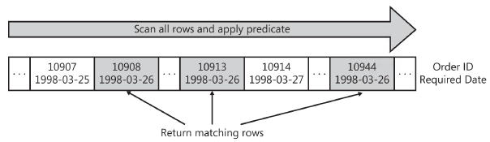

      a scan is an efficient strategy if the table is small or if many of the rows qualify for the predicate. However, if the table is large, and most of the rows do not qualify, a scan touches many more pages and rows and performs many more I/Os than is necessary.

      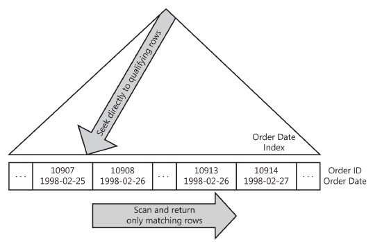

      A seek is generally a more efficient strategy when using a highly selective seek predicate.

      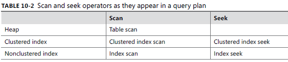

      - 1.1 **Seekable predicates and covered columns**

        Before SQL Server can perform an index seek, it must determine whether the keys of the index are suitable for evaluating a predicate in the query.

        - 1.1.1 **Single-column indexes**

          SQL Server can use single-column indexes to answer most simple comparisons including equality and inequality comparisons. 
          More-complex expressions, such as functions over a column and LIKE predicates with a leading wildcard character, generally prevent SQL Server from using an index seek.
          Suppose that column Col1 has a single-column index. We can use this index to seek on these predicates.
          
          - [Col1] = 3.14
          - [Col1] > 100
          - [Col1] BETWEEN 0 AND 99
          - [Col1] LIKE ‘abc%’
          - [Col1] IN (2, 3, 5, 7)

          However, we can’t use the index to seek on these predicates.

          - ABS([Col1]) = 1
          - [Col1] + 1 = 9
          - [Col1] LIKE ‘%abc’

        - 1.1.2 **Composite indexes**

          With a composite index, the order of the keys matters. It determines the sort order of the index and affects the set of seek predicates that SQL Server can evaluate using the index.

          If we have an index on two columns, we can use only the index to satisfy a predicate on the second column if we have an equality predicate on the first column. Even if we can’t use the index to satisfy the predicate on the second column, we might be able to use it on the first column. In this case, we introduce a “residual” predicate for the predicate on the second column. This predicate is evaluated just like any other scan predicate.

          In these cases, column Col2 needs a residual predicate

          - [Col1] > 100 AND [Col2] > 100
          - [Col1] LIKE ‘abc%’ AND [Col2] = 2

          Finally, we can’t use the index to seek on the next set of predicates because we can’t seek even on column Col1.

          - [Col2] = 0
          - [Col1] + 1 = 9 AND [Col2] BETWEEN 1 AND 9
          - [Col1] LIKE ‘%abc’ AND [Col2] IN (1, 3, 5)
      
        - 1.1.3 **Identifying index keys**

        **Covered columns** The heap or clustered index for a table contains all columns in the table.

  - **2. Bookmark lookup (Key Lookup)**

      Consider a query qith a predicate on a nonclustered index key tyhat selects columns not covered by the index. Look at the following query:

      ```sql
      SELECT OrderId, CustomerId FROM Orders WHERE OrderDate = '1998-02-26'
      ```

      The nonclustered index OrderDate covers only the OrderId column

      SQL Server has a solution for this problem. For each row that it fetches from the nonclustered index, it can look up the value of the remaining columns (for instance, the CustomerId column in the example) in the clustered index. This operation is called a bookmark lookup. A bookmark is a pointer to the row in the heap or clustered index.

      In a graphical plan, SQL Server uses the Key Lookup icon to make the distinction between a typical clustered index seek and a bookmark lookup very clear.

      **The Key lookup are I/O random**

      Bookmark lookup isn’t a cheap operation. Assuming (as is commonly the case) that no correlation exists between the nonclustered and clustered index keys, each bookmark lookup performs a random I/O into the clustered index or heap. Random I/Os are very expensive.

  - **3. JOINS**

      SQL Server supports three physical join operators: **Nested Loop Join, Merge Join, and Hash Join**

      No “best” join operator exists, and no join operator is inherently good or bad. We can’t draw any conclusions about a query plan merely from the presence of a particular join operator.

      - 3.1 **Nested Loops Join**

        **It compares each row from one table to each row from the other table, looking for rows that satisfy the join predicate.**

        The following pseudocode shows the nested loops join algorithm:

        ```sql
        for each row R1 in the outer table
          for each row R2 in the inner table
            if R1 joins with R2
              return(R1, R2)
        ```

        Consider this query:

        ```sql
        SELECT O.[OrderId]
        FROM [Customers] C JOIN [Orders] O ON C.[CustomerId] = O.[CustomerId]
        WHERE C.[City] = N'London'

        Rows Executes
        46    1 |--Nested Loops(Inner Join, OUTER REFERENCES:([C].[CustomerID]))
        6     1 |--Index Seek(OBJECT:([Customers].[City] AS [C]),
                      SEEK:([C].[City]=N'London') ORDERED FORWARD)
        46    6 |--Index Seek(OBJECT:([Orders].[CustomerID] AS [O]),
                      SEEK:([O].[CustomerID]=[C].[CustomerID]) ORDERED FORWARD)
        ```

        The outer table in this plan is Customers; the inner table is Orders. Hence, according to the nested loops join algorithm, SQL Server begins by seeking on the Customers table. The join takes one customer at a time and performs an index seek on the Orders table for each customer.
        The prior example illustrated two important techniques that SQL Server uses to boost the performance of a nested loops join: correlated parameters and, more importantly, an index seek based on those correlated parameters on the inner side of the join.
        The rules for determining whether a join predicate is suitable for use with an index seek are identical to the rules for determining whether any other predicate is suitable for an index seek. Consider the following query,

        ```sql
        SELECT E1.[EmployeeId], COUNT(*)
        FROM [Employees] E1 JOIN [Employees] E2
        ON E1.[HireDate] < E2.[HireDate]
        GROUP BY E1.[EmployeeId]
        ```

        Because the HireDate column has no index, this query generates a simple nested loops join with a predicate but without any correlated parameters and without an index seek:

        ```sql
        Compute Scalar(DEFINE:([Expr1004]=CONVERT_IMPLICIT(int,[Expr1007],0)))
          Stream Aggregate(GROUP BY:([E1].[EmployeeID]) DEFINE:([Expr1007]=Count(*)))
            Nested Loops(Inner Join, WHERE:([E1].[HireDate]<[E2].[HireDate]))
              Clustered Index Scan(OBJECT:([Employees].[PK_Employees] AS [E1]))
              Clustered Index Scan(OBJECT:([Employees].[PK_Employees] AS [E2]))
        ```

        Now consider the following identical query that has been rewritten to use a CROSS APPLY:

        ```sql
        SELECT E1.[EmployeeId], ECnt.Cnt
        FROM [Employees] E1 CROSS APPLY (
        SELECT COUNT(*) Cnt
        FROM [Employees] E2
        WHERE E1.[HireDate] < E2.[HireDate] ) ECnt
        ```

        Although these two queries are identical and will always return the same results, the plan for the query with CROSS APPLY uses a nested loops join with a correlated parameter:

        ```sql
        |--Nested Loops(Inner Join, OUTER REFERENCES:([E1].[HireDate]))
        |--Clustered Index Scan(OBJECT:([Employees].[PK_Employees] AS [E1]))
        |--Compute Scalar(DEFINE:([Expr1004]=CONVERT_IMPLICIT(int,[Expr1007],0)))
        |--Stream Aggregate(DEFINE:([Expr1007]=Count(*)))
        |--Clustered Index Scan (OBJECT:([Employees].[
        ```
              
        - **Join predicates and logical join types**
          It supports all join predicates including equijoin (equality) predicates and inequality predicates. The nested loops join supports the following logical join operators.

          - Inner join
          - Left outer join
          - Cross join
          - Cross apply and outer apply
          - Left semi-join and left anti-semi-join
        
          The nested loops join doesn’t support the following logical join operators.
          
          - Right and full outer join
          - Right semi-join and right anti-semi-join

        - **Full outer joins**
          The nested loops join can’t directly support full outer join. However, the optimizer can transform [Table1] FULL OUTER JOIN [Table2] into [Table1] LEFT OUTER JOIN [Table2] UNION ALL [Table2] LEFT ANTI-SEMI-JOIN [Table1].  

        - **Costing**

          **WARNING**
          QUE ES UN ANTI-SEMIJOIN, SEMI-JOIN, EQUI-JOIN, ETC

      - 3.2 **Merge Join**

        The merge join requires at least one equijoin predicate. Moreover, the inputs to the merge join must be sorted on the join keys.
        The merge join works by simultaneously reading and comparing the two sorted inputs one row at a time. At each step, it compares the next row from each input. If the rows are equal, it outputs a joined row and continues. If the rows aren’t equal, it discards the lesser of the two inputs and continues.
        As soon as it reaches the end of either input, the merge join stops scanning.
        Pseudocode:

        ```sql
        get first row R1 from input 1
        get first row R2 from input 2
        while not at the end of either input
        begin
        if R1 joins with R2
        begin
        output (R1, R2)
        get next row R2 from input 2
        end
        else if R1 < R2
        get next row R1 from input 1
        else
        get next row R2 from input 2
        end
        ```

        With a merge join each table is read at most once, and the total cost is proportional to the sum of the number of rows in the inputs.

        - **One-to-many vs. many-to-many merge join**

          Nothing
        
        - **Sort merge join vs. index merge join**

          SQL Server can get sorted inputs for a merge join in two ways: It can explicitly sort the inputs using a sort operator or it can read the rows from an index. In general, a plan using an index to achieve sort order is cheaper than a plan using an explicit sort.

        - **Join predicates and logical join types**
          Merge joins support multiple equijoin predicates as long as the inputs are sorted on all the join keys.
        
        Merge join also support residual predicates

        Merge joins support all outer and semi-join variations

        Examples

        ```sql
        SELECT O.[OrderId], C.[CustomerId], C.[ContactName]
        FROM [Orders] O 
        JOIN [Customers] C
          ON O.[CustomerId] = C.[CustomerId]
        ```
        
        Because no predicates exist other than the join predicates, both tables must be scanned in their entirety. Moreover, the CustomerId column of both tables has covering indexes. Thus, the optimizer chooses a merge join plan:

        ```sql
        |--Merge Join(Inner Join, MERGE:([C].[CustomerID])=([O].[CustomerID]), RESIDUAL:(...))
        |--Clustered Index Scan(OBJECT:([Customers].[PK_Customers] AS [C]), ORDERED FORWARD)
        |--Index Scan(OBJECT:([Orders].[CustomerID] AS [O]), ORDERED FORWARD)
        ```

        Now consider a slightly more complex example. The following query returns a list of orders that are shipped to cities different from the city on file for the customer who placed the order:

        ```sql
        SELECT O.[OrderId], C.[CustomerId], C.[ContactName]
        FROM [Orders] O JOIN [Customers] C
        ON O.[CustomerId] = C.[CustomerId] AND O.[ShipCity] <> C.[City]
        ORDER BY C.[CustomerId]
        ```

        The ORDER BY clause encourages the optimizer to choose a merge join. (This point will be explained in a moment.) Here is the query plan:

        ```sql
        |--Merge Join(Inner Join, MERGE:([C].[CustomerID])=([O].[CustomerID]),
            RESIDUAL:(... AND [O].[ShipCity]<>[C].[City]))
        |--Clustered Index Scan(OBJECT:([Customers].[PK_Customers] AS [C]), ORDERED FORWARD)
        |--Sort(ORDER BY:([O].[CustomerID] ASC))
        |--Clustered Index Scan(OBJECT:([Orders].[PK_Orders] AS [O]))
        ```

      - 3.3 **Hash Join**

        Hash joins parallelize and scale better than any other join and are great at minimizing response times for data warehouse queries.
        Hash joins require at least one equijoin predicate, support residual predicates, and support all outer and semi-joins. Unlike merge joins, hash joins don’t require ordered input sets.
        The hash join algorithm executes in two phases known as build and probe. During the build phase, it reads all rows from the first input, hashes the rows on the equijoin keys, and creates or builds an in-memory hash table. During the probe phase, it reads all rows from the second input, hashes these rows on the same equijoin keys, and looks or probes for matching rows in the hash table.
        Pseudocode:

        ```sql
          for each row R1 in the build table
            begin
            calculate hash value on R1 join key(s)
            insert R1 into the appropriate hash bucket
            end
          for each row R2 in the probe table
          begin
          calculate hash value on R2 join key(s)
          for each row R1 in the corresponding hash bucket
          if R1 joins with R2
          output (R1, R2)
          end
        ```

        The hash join is blocking on its build input. That is, it must read and process its entire build inut before it can return any rows. The hash join requires a memory grant to store the hash table.

        - **Memory and spilling**

          Before a hash join begins execution, SQL Server tries to estimate how much memory it will need to build its hash table. It uses the cardinality. To minimize the memory required, the optimizer chooses the smaller of the two tables as the build table.
          If the hash join migth run out of memory during the build phase. It begins spilling to disk. This process of running out of memory and spilling buckets to diskk can repeat multiple times until the build phase is complete.
          The hash join performs a similar process during the probe phase.

        - **Left deep vs. right deep vs. bushy hash join trees** 
          
          The shape and order of joins in a query plan can significantly affect the performance of the plan -left deep, righ deep, and bushy

          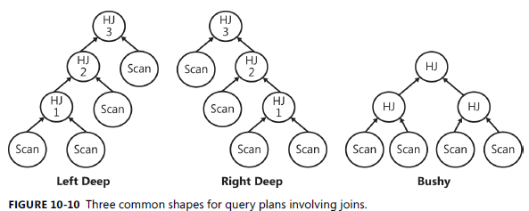

          Example

          ```sql
          SELECT O.[OrderId], O.[OrderDate], C.[CustomerId], C.[ContactName]
          FROM [Orders] O 
          JOIN [Customers] C
          ON O.[CustomerId] = C.[CustomerId]

          |--Hash Match(Inner Join, HASH:([C].[CustomerID])=([O].[CustomerID]), RESIDUAL:(...))
            |--Clustered Index Scan(OBJECT:([Customers].[PK_Customers] AS [C]))
            |--Clustered Index Scan(OBJECT:([Orders].[PK_Orders] AS [O]))
          ```

        - **Summary of join properties**

          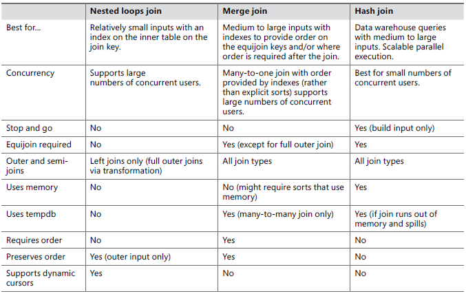

  - **4. Aggregations**

      SQL Server supports two physical operators for performing aggregations: **Stream Aggregate and Hash Aggregate**

      - 4.1 **Scalar Aggregation**

        Scalar aggregates are queries with aggregate functions in the select list and no GROUP BY clause. Scalar aggregates always return a single row. SQL Server always implements scalar aggregates using the stream aggregate operator.

        ```sql
        SELECT COUNT(*) FROM [Orders]

          |--Compute Scalar(DEFINE:([Expr1003]=CONVERT_IMPLICIT(int,[Expr1004],0)))
            |--Stream Aggregate(DEFINE:([Expr1004]=Count(*)))
              |--Index Scan(OBJECT:([Orders].[OrderDate]))
        
        SELECT MIN([OrderDate]), MAX([OrderDate]) FROM [Orders]

          |--Stream Aggregate(DEFINE:([Expr1003]=MIN([Orders].[OrderDate]),
            [Expr1004]=MAX([Orders].[OrderDate])))
          |--Index Scan(OBJECT:([Orders].[OrderDate]))

        SELECT AVG([Freight]) FROM [Orders]

        |--Compute Scalar(DEFINE:([Expr1003]=CASE WHEN [Expr1004]=(0)
          THEN NULL
          ELSE [Expr1005]/CONVERT_IMPLICIT(money,[Expr1004],0)
          END))
          |--Stream Aggregate(DEFINE:([Expr1004]=COUNT_BIG([Orders].[Freight]),
            Expr1005]=SUM([Orders].[Freight])))
            |--Clustered Index Scan(OBJECT:([Orders].[PK_Orders]))
        ```

        The CASE expression is needed to make sure that SQL Server does not attempt to divide by zero.

        ```sql
        SELECT SUM([Freight]) FROM [Orders]

          |--Compute Scalar(DEFINE:([Expr1003]=CASE WHEN [Expr1004]=(0)
            THEN NULL
            ELSE [Expr1005]
            END))
            |--Stream Aggregate(DEFINE:([Expr1004]=COUNT_BIG([Orders].[Freight]),
              [Expr1005]=SUM([Orders].[Freight])))
            |--Clustered Index Scan(OBJECT:([Orders].[PK_Orders]))
        ```

        - 4.1.1 **Scalar distinct**
          
          ```sql
          SELECT COUNT(DISTINCT [ShipCity]) FROM [Orders]

          |--Compute Scalar(DEFINE:([Expr1003]=CONVERT_IMPLICIT(int,[Expr1006],0)))
            |--Stream Aggregate(DEFINE:([Expr1006]=COUNT([Orders].[ShipCity])))
              |--Sort(DISTINCT ORDER BY:([Orders].[ShipCity] ASC))
                |--Clustered Index Scan(OBJECT:([Orders].[PK_Orders]))
          ```

        - 4.1.2 **Multiple distinct**

          ```sql
          SELECT COUNT(DISTINCT [ShipAddress]), COUNT(DISTINCT [ShipCity])
          FROM [Orders]

          |--Nested Loops(Inner Join)
            |--Compute Scalar(DEFINE:([Expr1003]=CONVERT_IMPLICIT(int,[Expr1009],0)))
              |--Stream Aggregate(DEFINE:([Expr1009]=COUNT([Orders].[ShipAddress])))
                |--Sort(DISTINCT ORDER BY:([Orders].[ShipAddress] ASC))
                  |--Clustered Index Scan(OBJECT:([Orders].[PK_Orders]))

            |--Compute Scalar(DEFINE:([Expr1004]=CONVERT_IMPLICIT(int,[Expr1010],0)))
              |--Stream Aggregate(DEFINE:([Expr1010]=COUNT([Orders].[ShipCity])))
                |--Sort(DISTINCT ORDER BY:([Orders].[ShipCity] ASC))
                |--Clustered Index Scan
                  (OBJECT:([Orders].[PK_Orders]))
          ```

      - 4.2 **Stream Aggregation**

        Now that we’ve seen how to compute scalar aggregates, look at how SQL Server computes general-purpose aggregates that involve a GROUP BY clause.

        The algorithm Stream aggregate relies on data arriving sorted by the GROUP BY column(s). Like a merge join, if a query includes a GROUP BY clause with more than one column, the stream aggregate can use any sort order that includes all the columns. The sort order might be delivered by an index or by an explicit sort operator. The sort order ensures that sets of rows with the same value for the GROUP BY columns will be adjacent to one another.
        Pseudocode

        ```sql
        clear the current aggregate results
        clear the current group by columns
        for each input row
          begin
            if the input row does not match the current group by columns
              begin
                output the current aggregate results (if any)
                clear the current aggregate results
                set the current group by columns to the input row
              end
            update the aggregate results with the input row
          end
        ```

        For example, to compute a SUM, the stream aggregate considers each input row. If the input row belongs to the current group, the stream aggregate updates the current SUM by adding the appropriate value from the input row to the running total. If the input row belongs to a new group, the stream aggregate outputs the current SUM, resets the SUM to zero, and starts a new group.

        Example

        ```sql
        SELECT [ShipAddress], [ShipCity], COUNT(*)
        FROM [Orders]
        GROUP BY [ShipAddress], [ShipCity]

        SELECT [ShipAddress], [ShipCity], COUNT(*)
        FROM [Orders]
        GROUP BY [ShipAddress], [ShipCity]
        ORDER BY [ShipAddress], [ShipCity]

        SELECT [CustomerId], COUNT(*)
        FROM [Orders]
        GROUP BY [CustomerId]
        ``` 

        Select distinct If we have an index to provide order, SQL Server can also use the stream aggregate to implement SELECT DISTINCT.

        ```sql
        SELECT DISTINCT [CustomerId] FROM [Orders]

        SELECT [CustomerId] FROM [Orders] GROUP BY [CustomerId]

        /* Both queries use the same plan: */
        |--Stream Aggregate(GROUP BY:([Orders].[CustomerID]))
          |--Index Scan(OBJECT:([Orders].[CustomerID]), ORDERED FORWARD)
    
        SELECT [EmployeeId], COUNT(DISTINCT [CustomerId])
        FROM [Orders]
        GROUP BY [EmployeeId]

        CREATE INDEX [EmployeeCustomer] ON [Orders] (EmployeeId, CustomerId)
        
        |--Compute Scalar(DEFINE:([Expr1003]=CONVERT_IMPLICIT(int,[Expr1006],0)))
          |--Stream Aggregate(GROUP BY:([Orders].[EmployeeID])
            DEFINE:([Expr1006]=COUNT([Orders].[CustomerID])))
            |--Stream Aggregate(GROUP BY:([Orders].[EmployeeID], [Orders].[CustomerID]))
              |--Index Scan(OBJECT:([Orders].[EmployeeCustomer]), ORDERED FORWARD)
        
        DROP INDEX [Orders].[EmployeeCustomer]

        SELECT [EmployeeId], COUNT(*), COUNT(DISTINCT [CustomerId])
        FROM [Orders]
        GROUP BY [EmployeeId]
        ```

      - 4.3 **Hash Aggregation**

        Is similar to hash join. It doesn't require sort order, requieres memory and is blocking. Hash aggregate excels at efficiently aggregating very large data sets and in parallel plans, scales better than stream aggregate.

        ```sql
        for each input row
          begin
            calculate hash value on group by column(s)
            check for a matching row in the hash table
            if matching row not found
              insert a new row into the hash table
            else
              update the matching row with the input row
          end
        output all rows in the hash table
        ```

        Hash aggregate computes all the groups simultaneously. Like a hash join, a hash aggregate uses a hash table to store these groups. With each new input row, it checks the hash table to see whether the new row belongs to an existing group. If it does, it simply updates the existing group. If it doesn’t, it creates a new group. Because the input data is unsorted, any row can belong to any group. Thus, a hash aggregate can’t output any results until it finishes processing every input row

        **Memory and spilling** A hash aggregate, however, stores only one row for each group, so the total memory requirement is actually proportional to the number and size of the output groups or rows. If a hash aggregate runs out of memory, it must begin spilling rows to a workfile in tempdb.

        Example

        ```sql
        SELECT [ShipCountry], COUNT(*)
        FROM [Orders]
        GROUP BY [ShipCountry]
        ```

        **The ShipCountry column has only 21 unique values. Because a hash aggregate requires less memory as the number of groups decreases, and a sort requires memory proportional to the number of input rows, this time the optimizer chooses a plan with a hash aggregate:**

        ```sql
        |--Compute Scalar(DEFINE:([Expr1003]=CONVERT_IMPLICIT(int,[Expr1006],0)))
          |--Hash Match(Aggregate, HASH:([Orders].[ShipCountry]), RESIDUAL:(...)
            DEFINE:([Expr1006]=COUNT(*)))
            |--Clustered Index Scan(OBJECT:([Orders].[PK_Orders]))
        
        SELECT [ShipCountry], COUNT(*)
        FROM [Orders]
        GROUP BY [ShipCountry]
        ORDER BY [ShipCountry]

        |--Compute Scalar(DEFINE:([Expr1003]=CONVERT_IMPLICIT(int,[Expr1006],0)))
          |--Stream Aggregate(GROUP BY:([Orders].[ShipCountry]) DEFINE:([Expr1006]=Count(*)))
            |--Sort(ORDER BY:([Orders].[ShipCountry] ASC))
              |--Clustered Index Scan(OBJECT:([Orders].[PK_Orders]))
        ```

        **If the table gets big enough and the number of groups remains small enough, eventually the optimizer will decide that using the hash aggregate and sorting after the aggregation are cheaper.**

        ```sql
        SELECT [ShipCountry], COUNT(*)
        FROM [BigOrders]
        GROUP BY [ShipCountry]
        ORDER BY [ShipCountry]
        ```

        **As the following plan shows, the optimizer concludes that using the hash aggregate and sorting 21 rows are better than sorting 4,150 rows and using a stream aggregate:**

        ```sql
        |--Sort(ORDER BY:([BigOrders].[ShipCountry] ASC))
          |--Compute Scalar(DEFINE:([Expr1004]=CONVERT_IMPLICIT(int,[Expr1007],0)))
            |--Hash Match(Aggregate, HASH:([BigOrders].[ShipCountry]),
              RESIDUAL:(...) DEFINE:([Expr1007]=COUNT(*)))
              |--Clustered Index Scan(OBJECT:([BigOrders].[OrderID]))
        ```
      
        **Distinct** Just like a stream aggregate, a hash aggregate can be used to implement distinct operations.

        ```sql
        SELECT DISTINCT [ShipCountry] FROM [Orders]

        |--Hash Match(Aggregate, HASH:([Orders].[ShipCountry]), RESIDUAL:(...))
          |--Clustered Index Scan(OBJECT:([Orders].[PK_Orders]))
        ```

        Finally, hash aggregate can be used to implement distinct aggregates, including multiple distincts. The basic idea is the same as for stream aggregate. SQL Server computes each aggregate separately and then joins the results.

        ```sql
        SELECT [ShipCountry], COUNT(DISTINCT [EmployeeId]), COUNT(DISTINCT [CustomerId])
        FROM [HugeOrders]
        GROUP BY [ShipCountry]

        |--Compute Scalar(DEFINE:([HugeOrders].[ShipCountry]=[HugeOrders].[ShipCountry]))
          |--Hash Match(Inner Join, HASH:([HugeOrders].[ShipCountry])=
            ([HugeOrders].[ShipCountry]),RESIDUAL:(...))
            |--Compute Scalar(DEFINE:([HugeOrders].[ShipCountry]=[HugeOrders].[ShipCountry]))
              |--Compute Scalar(DEFINE:([Expr1005]=CONVERT_IMPLICIT(int,[Expr1012],0)))
                |--Hash Match(Aggregate, HASH:([HugeOrders].[ShipCountry]),RESIDUAL:(...)
                DEFINE:([Expr1012]=COUNT([HugeOrders].[CustomerID])))
        ```

        - This plan uses both a hash aggregate and a stream aggregate in the computation of COUNT(DISTINCT [EmployeeId]). The hash aggregate eliminates duplicate values from the EmployeeId column; the sort and stream aggregate computes the counts.

        - SQL Server uses a pair of hash aggregates to compute COUNT(DISTINCT [Customer-Id]). The bottommost hash aggregate eliminates duplicate values from the CustomerId column, whereas the topmost computes the counts.

        - Because the hash aggregate doesn’t return rows in any particular order, SQL Server can’t use a merge join without introducing another sort. Instead, the optimizer chooses a hash join for this plan.

  - **5. Unions**

    Two types of unions queries are available: UNION ALL and UNION

    ```sql
    SELECT [FirstName] + N' ' + [LastName], [City], [Country] FROM [Employees]
    UNION ALL
    SELECT [ContactName], [City], [Country] FROM [Customers]

    |--Concatenation
    |--Compute Scalar(DEFINE:([Expr1003]=([Employees].[FirstName] + N' ')+
      [Employees].[LastName]))
      |--Clustered Index Scan(OBJECT:([Employees].[PK_Employees]))
        |--Clustered Index Scan(OBJECT:([Customers].[PK_Customers]))

    SELECT [City], [Country] FROM [Employees]
    UNION
    SELECT [City], [Country] FROM [Customers]

    |--Sort(DISTINCT ORDER BY:([Union1006] ASC, [Union1007] ASC))
      |--Concatenation
        |--Clustered Index Scan(OBJECT:([Employees].[PK_Employees]))
          |--Clustered Index Scan(OBJECT:([Customers].[PK_Customers]))
    ```

    **Another essentially identical alternative plan is to replace the sort distinct with a hash aggregate. A sort distinct requires memory proportional to the number of input rows before the duplicates are eliminated; a hash aggregate requires memory proportional to the number of output rows after the duplicates are eliminated. Thus, a hash aggregate requires less memory than the sort distinct when many duplicates occur, and the optimizer is more likely to choose a hash aggregate when it expects many duplicates.**

    ```sql
    SELECT [ShipCountry] FROM [Orders]
    UNION
    SELECT [ShipCountry] FROM [BigOrders]

    |--Hash Match(Aggregate, HASH:([Union1007]), RESIDUAL:(...))
      |--Concatenation
        |--Clustered Index Scan(OBJECT:([Orders].[PK_Orders]))
          |--Clustered Index Scan(OBJECT:([BigOrders].[OrderID]))


    SELECT [EmployeeId], [FirstName] + N' ' + [LastName] AS [ContactName],
    [City], [Country]
    INTO [NewEmployees]
    FROM [Employees]

    ALTER TABLE [NewEmployees] ADD CONSTRAINT [PK_NewEmployees] PRIMARY KEY ([EmployeeId])

    CREATE INDEX [ContactName] ON [NewEmployees]([ContactName])
    CREATE INDEX [ContactName] ON [Customers]([ContactName])

    SELECT [ContactName] FROM [NewEmployees]
    UNION ALL
    SELECT [ContactName] FROM [Customers]
    ORDER BY [ContactName]

    |--Merge Join(Concatenation)
      |--Index Scan(OBJECT:([NewEmployees].[ContactName]), ORDERED FORWARD)
        |--Index Scan(OBJECT:([Customers].[ContactName]), ORDERED FORWARD)

    SELECT [ContactName] FROM [NewEmployees]
    UNION
    SELECT [ContactName] FROM [Customers]

    |--Merge Join(Union)
      |--Stream Aggregate(GROUP BY:([NewEmployees].[ContactName]))
        |--Index Scan(OBJECT:([NewEmployees].[ContactName]), ORDERED FORWARD)
          |--Stream Aggregate(GROUP BY:([Customers].[ContactName]))
            |--Index Scan(OBJECT:([Customers].[ContactName]), ORDERED FORWARD)
    ```

    **This time the plan has a merge join (union) or merge union operator. The merge union eliminates duplicate rows that appear in both of its inputs; it does not eliminate duplicate rows from either individual input. That is, if a name appears in both the NewEmployees and the Customers tables, the merge union will eliminate that duplicate name. However, if a name appears twice in the NewEmployees table or twice in the Customers table, the merge union by itself does not eliminate it. Thus, the optimizer has also added stream aggregates above each index scan to eliminate any duplicates from the individual tables. As discussed earlier, aggregation operators can be used to implement distinct operations.**

    ```sql
    DROP TABLE [NewEmployees]
    DROP INDEX [Customers].[ContactName]
    ```

    The hash union operator is similar to a hash aggregate with two inputs. A hash union builds a hash table on its first input and eliminates duplicates from it just like a hash aggregate. It then reads its second input and, for each row, probes its hash table to see whether the row is a duplicate of a row from the first input. If the row isn’t a duplicate, the hash union returns it. Because the hash union doesn’t insert rows from the second input into the hash table, it doesn’t eliminate duplicates that appear only in its second input. To use a hash union, the optimizer either must explicitly eliminate duplicates from the second input or must know that the second input has no duplicates. Example

    ```sql
    CREATE TABLE [BigTable] ([PK] int PRIMARY KEY, [Dups] int, [Pad] char(1000))
    CREATE TABLE [SmallTable] ([PK] int PRIMARY KEY, [NoDups] int UNIQUE, [Pad] char(1000))
    
    SET NOCOUNT ON
    
    DECLARE @i int
    SET @i = 0
    BEGIN TRAN
        WHILE @i < 100000
        BEGIN
          INSERT [BigTable] VALUES (@i, 0, NULL)
          SET @i = @i + 1
          IF @i % 1000 = 0
          BEGIN
            COMMIT TRAN
          BEGIN TRAN
        END
    END
    COMMIT TRAN
    SELECT [Dups], [Pad] FROM [BigTable]
    UNION
    SELECT [NoDups], [Pad] FROM [SmallTable]

        |--Hash Match(Union)
          |--Clustered Index Scan(OBJECT:([BigTable].[PK_BigTable]))
            |--Clustered Index Scan(OBJECT:([SmallTable].[PK_SmallTable]))
    ```

  - **6. Advanced index operations**

    - **Dynamic index seeks**

      ```sql
      SELECT [OrderId]
      FROM [Orders]
      WHERE [ShipPostalCode] IN (N'05022', N'99362')

      |--Index Seek(OBJECT:([Orders].[ShipPostalCode]), SEEK:([Orders].[ShipPostalCode]=N'05022'
        OR [Orders].[ShipPostalCode]=N'99362') ORDERED FORWARD)
      
      DECLARE @SPC1 nvarchar(20), @SPC2 nvarchar(20)
      SELECT @SPC1 = N'05022', @SPC2 = N'99362'
      SELECT [OrderId]
      FROM [Orders]
      WHERE [ShipPostalCode] IN (@SPC1, @SPC2)

      |--Nested Loops(Inner Join, OUTER REFERENCES:([Expr1009],[Expr1010], [Expr1011]))
        |--Merge Interval
          | |--Sort(TOP 2, ORDER BY:([Expr1012] DESC, [Expr1013] ASC,
            [Expr1009] ASC, [Expr1014] DESC))
          | |--Compute Scalar (DEFINE:([Expr1012]=((4)&[Expr1011]) = (4) AND
            NULL = [Expr1009],[Expr1013]=(4)&[Expr1011],[Expr1014]=(16)&[Expr1011]))
            | |--Concatenation
              | |--Compute Scalar(DEFINE:([@SPC2]=[@SPC2], [@SPC2]=[@SPC2], [Expr1003]=(62)))
                | |--Constant Scan
                  | |--Compute Scalar(DEFINE:([@SPC1]=[@SPC1],
                  [@SPC1]=[@SPC1], [Expr1006]=(62)))
                    | |--Constant Scan
      ```

      **The more complex plan works by eliminating duplicates from the IN list at execution time. The two constant scans and the concatenation operator generate a “constant table” with the two IN list values. Then the plan sorts the parameter values, and the merge interval operator eliminates the duplicates. Finally, the nested loops join executes the index seek once for each unique value.**

      ```sql
      DECLARE @OD1 datetime, @OD2 datetime
      SELECT @OD1 = '1998-01-01', @OD2 ='1998-01-04'
      SELECT [OrderId]
      FROM [Orders]
      WHERE [OrderDate] BETWEEN @OD1 AND DATEADD(day, 6, @OD1)
      OR [OrderDate] BETWEEN @OD2 AND DATEADD(day, 6, @OD2)
      ```

      **Again, the plan includes a pair of constant scans and a concatenation operator. However, this time, rather than return discrete values from an IN list, the constant scans return ranges. Unlike the prior example, eliminating duplicates is no longer sufficient. Now the plan needs to handle ranges that aren’t duplicates but do overlap. The sort ensures that ranges that might overlap are next to one another and the merge interval operator collapses overlapping ranges. In the example, the two date ranges (1998-01-01 to 1998-01-07 and 1998-01-04 to 1998-01-10) do in fact overlap, and the merge interval collapses them into a single range (1998-01-01 to 1998-01-10).**
      These plans are referred to as dynamic index seeks because the range(s) that SQL Server actually fetches aren’t statically known at compile time and are determined dynamically during execution.
    
    - **Index unions**

      ```sql
      SELECT [OrderId]
      FROM [Orders]
      WHERE [OrderDate] BETWEEN '1998-01-01' AND '1998-01-07'
      OR [ShippedDate] BETWEEN '1998-01-01' AND '1998-01-07'
      ```

      SQL Server has two strategies that it can use to execute a query such as this one. One option is to use a clustered index scan (or table scan) and apply the entire predicate to all rows in the table. This strategy is reasonable if the predicates aren’t very selective and if the query will end up returning many rows. However, if the predicates are reasonably selective and if the table is large, the clustered index scan strategy isn’t very efficient. The other option is to use both indexes. This plan looks like the following:

      ```sql
      |--Sort(DISTINCT ORDER BY:([Orders].[OrderID] ASC))
        |--Concatenation
          |--Index Seek(OBJECT:([Orders].[OrderDate]),
          SEEK:([Orders].[OrderDate] >= '1998-01-01' AND
          [Orders].[OrderDate] <= '1998-01-07')
          ORDERED FORWARD)
      
          |--Index Seek(OBJECT:([Orders].[ShippedDate]),
          SEEK:([Orders].[ShippedDate] >= '1998-01-01' AND
          [Orders].[ShippedDate] <= '1998-01-07')
          ORDERED FORWARD)
      
      The optimizer effectively rewrote the query as a union:
      
      SELECT [OrderId]
      FROM [Orders]
      WHERE [OrderDate] BETWEEN '1998-01-01' AND '1998-01-07'
      UNION
      SELECT [OrderId]
      FROM [Orders]
      WHERE [ShippedDate] BETWEEN '1998-01-01' AND '1998-01-07'
      ```

      By using both indexes, this plan gets the benefit of the index seek. However, the plan might generate duplicates if, as is likely in this example, any of the orders were both placed and shipped during the first week of 1998. To ensure that the query plan doesn’t return any rows twice, the optimizer adds a sort distinct. This type of plan is referred to as an index union.

      ```sql
      SELECT [OrderId]
      FROM [Orders]
      WHERE [OrderDate] = '1998-01-01'
      OR [ShippedDate] = '1998-01-01'
      ```

      **Now have a merge concatenation and a stream aggregate. Because we have equality predicates on the leading column of each index, the index seeks return rows sorted on the second column (the OrderId column) of each index. Because index seeks return sorted rows, this query is suitable for a merge concatenation. Moreover, because the merge concatenation returns rows sorted on the merge key (the OrderId column), the optimizer can use a stream aggregate instead of a sort to eliminate duplicates. This plan is generally a better choice because the sort distinct uses memory and could spill data to disk if it runs out of memory, whereas the merge concatenation and stream aggregate don’t use memory.**

      ```sql
      SELECT [OrderId], [OrderDate], [ShippedDate]
      FROM [BigOrders]
      WHERE [OrderDate] = '1998-01-01'
      OR [ShippedDate] = '1998-01-01'
      ```

    - **Index intersections**

      ```sql
      SELECT [OrderId]
      FROM [Orders]
      WHERE [OrderDate] = '1998-02-26'
      AND [ShippedDate] = '1998-03-04'

      /* The optimazer has effectively reqritten this query as a join */

      SELECT O1.[OrderId]
      FROM [Orders] O1 JOIN [Orders] O2
      ON O1.[OrderId] = O2.[OrderId]
      WHERE O1.[OrderDate] = '1998-02-26'
      AND O2.[ShippedDate] = '1998-03-04'

      /* This query plan is referred to as an index intersection. Just as an index union can use different operators depending on the plan, so can index intersection. */

      SELECT [OrderId]
      FROM [BigOrders]
      WHERE [OrderDate] BETWEEN '1998-02-01' AND '1998-02-04'
      AND [ShippedDate] BETWEEN '1998-02-09' AND '1998-02-12'

      /* The inequality predicates mean the index seeks no longer return rows sorted by the OrderId column; therefore, SQL Server can’t use a merge join without first sorting the rows. Rather than sort, the optimizer chooses a hash join:*/
      |--Hash Match(Inner Join, HASH:([BigOrders].[OrderID], [Uniq1002])=([BigOrders].[OrderID], [Uniq1002]), RESIDUAL:(...))
        |--Index Seek(OBJECT:([BigOrders].[OrderDate]),
        SEEK:([BigOrders].[OrderDate] >= '1998-02-01' AND
        [BigOrders].[OrderDate] <= '1998-02-04')
        ORDERED FORWARD)
        
        |--Index Seek(OBJECT:([BigOrders].[ShippedDate]),
        SEEK:([BigOrders].[ShippedDate] >= '1998-02-09' AND
        [BigOrders].[ShippedDate] <= '1998-02-12')
        ORDERED FORWARD)
      ```
      
  - **7. Subqueries**

    Subqueries are essentially joins.
    Subqueries can be categorized in three ways:

    - **Noncorrelated vs. correlated subqueries** A noncorrelated subquery has no dependencies on the outer query, can be evaluated independently of the outer query, and returns the same result for each row of the outer query. A correlated subquery does have a dependency on the outer query. It can only be evaluated in the context of a row from the outer query and might return a different result for each row of the outer query.

    - **Scalar vs. multirow subqueries** A scalar subquery returns or is expected to return a single row (that is, a scalar), whereas a multirow subquery might return a set of rows.

    - **The clause of the outer query in which the subquery appears**

    - **7.1 Noncorrelated scalar subqueries**

      The following query returns a list of orders in which the freight charge exceeds the average freight charge for all orders:
      
      ```sql
      SELECT O1.[OrderId], O1.[Freight]
      FROM [Orders] O1
      WHERE O1.[Freight] > ( SELECT AVG(O2.[Freight]) FROM [Orders] O2 )

      SELECT O.[OrderId]
      FROM [Orders] O
      WHERE O.[CustomerId] = ( SELECT C.[CustomerId] FROM [Customers] C WHERE C.[ContactName] = N'Maria Anders' )
      ```

      The ANY aggregate is a special internal-only aggregate that, as its name suggests, returns any row. Because this plan raises an error if the scan of the Customers table returns more than one row, the ANY aggregate has no real effect. This is the same reeasonn the following query doesn't compile:

      ```sql
      SELECT COUNT(*), C.[CustomerId]
      FROM [Customers] C
      WHERE C.[ContactName] = N'Maria Anders'
      ```

      Often, creating a unique index or rewriting the query eliminates the assert operator and improves the query plan. For example:

      ```sql
      SELECT O.[OrderId]
      FROM [Orders] O JOIN [Customers] C
      ON O.[CustomerId] = C.[CustomerId]
      WHERE C.[ContactName] = N'Maria Anders'

      /* Although writing this query as a simple join is the best option, consider what happens if a unique index is created on the ContactName column: */

      CREATE UNIQUE INDEX [ContactName] ON [Customers] ([ContactName])
      
      SELECT O.[OrderId]
      FROM [Orders] O
      WHERE O.[CustomerId] = ( SELECT C.[CustomerId] FROM [Customers] C WHERE C.[ContactName] = N'Maria Anders' )

      DROP INDEX [Customers].[ContactName]

      /* Because of the unique index, the optimizer knows that the subquery can produce only one row, eliminates the now unnecessary stream aggregate and assert operators, and converts the query into a join*/     
      ```

    - **7.2 Correlated scalar subqueries**

      It returns those ordes in which the freight charge exceeds the averga freight charge of all previously placed orders:

      ```sql
      SELECT O1.[OrderId]
      FROM [Orders] O1
      WHERE O1.[Freight] > ( SELECT AVG(O2.[Freight]) FROM [Orders] O2 WHERE O2.[OrderDate] < O1.[OrderDate] )
      ```

      SQL Server evaluated the subquery first and then executed the main query. This time SQL Server evaluates the main query first and then evaluates the subquery once for each row from the main query:

      ```sql
      |--Filter(WHERE:([O1].[Freight]>[Expr1004]))
        |--Nested Loops(Inner Join, OUTER REFERENCES:([O1].[OrderDate]))
          |--Clustered Index Scan(OBJECT:([Orders].[PK_Orders] AS [O1]))
            |--Index Spool(SEEK:([O1].[OrderDate]=[O1].[OrderDate]))
              |--Compute Scalar(DEFINE:([Expr1004]=
              CASE WHEN [Expr1011]=(0)
              THEN NULL
              ELSE [Expr1012]
              /CONVERT_IMPLICIT(money,[Expr1011],0) END))
          
          |--Stream Aggregate (DEFINE:([Expr1011]=
          COUNT_BIG([O2].[Freight]),[Expr1012]=SUM([O2].[Freight])))
            |--Index Spool(SEEK:([O2].[OrderDate] <[O1].[OrderDate]))
              |--Clustered Index Scan
              (OBJECT:([Orders].[PK_Orders] AS [O2]))
      ```

      **The index spool immediately above the scan of [O2] is an eager index spool or index-on-the-fly spool. It builds a temporary index on the OrderDate column of the Orders table. It’s called an eager spool because it “eagerly” loads its entire input set and builds the temporary index as soon as it’s opened.**
      **The stream aggregate computes the average freight charge for each execution of the subquery. The index spool above the stream aggregate is a lazy index spool. It merely caches subquery results. If it encounters any OrderDate a second time, it returns the cached result rather than recomputing the subquery. It’s called a lazy spool because it “lazily” loads results on demand only. Finally, the filter at the top of the plan compares the freight charge for each order to the subquery result ([Expr1004]) and returns those rows that qualify.**
      **We can determine the types of spools more easily from the complete SHOWPLAN_ALL output or from the graphical plan.**

      Next, look at another example of a correlated scalar subquery. Suppose that we want to find those orders for which the freight charge exceeds the average freight charge for all orders placed by the same customer:

      ```sql
      SELECT O1.[OrderId], O1.[Freight]
      FROM [Orders] O1
      WHERE O1.[Freight] > ( SELECT AVG(O2.[Freight]) FROM [Orders] O2 WHERE O2.[CustomerId] = O1.[CustomerId] )

      /* This query is very similar to the previous one, yet a substantially different plan results: */

      |--Nested Loops(Inner Join)
      |--Table Spool
      | |--Segment
      | |--Sort(ORDER BY:([O1].[CustomerID] ASC))
      | |--Clustered Index Scan (OBJECT:([Orders].[PK_Orders] AS [O1]),
        WHERE:([O1].[CustomerID] IS NOT NULL))
      |--Nested Loops(Inner Join, WHERE:([O1].[Freight]>[Expr1004]))
      |--Compute Scalar(DEFINE:([Expr1004]=
        CASE WHEN [Expr1012]=(0)
        THEN NULL
        ELSE [Expr1013]
        /CONVERT_IMPLICIT(money,[Expr1012],0)
        END))
      |--Stream Aggregate(DEFINE:([Expr1012]=
      COUNT_BIG([O1].[Freight]),[Expr1013]=SUM([O1].[Freight])))
      | |--Table Spool
      |--Table Spool
      ```

      **The segment operator breaks the rows into groups (or segments) with the same value for the CustomerId column. Because the rows are sorted, sets of rows with the same CustomerId value will be consecutive. Next, the table spool—a segment spool—reads and saves one of these groups of rows that share the same CustomerId value.**
      **When the spool finishes loading a group of rows, it returns a single row for the entire group. The topmost nested loops join executes ist inner input. The two leaf level table spools replay the group of rows that the originalk segment spool saved.**
      **The stream aggregate compues the average freight for each group of rowsa. The result of the stream aggregate is a single row. The inner of the two nested loops compares each spooled row against this average and returns those rows that qualify. Finally the segment spool truncates its worked and repeats the process beginning with reading the next group with the next CustomerId value**

      Finally, suppose that we want to compute the order with the maximum freight charge placed by each customer

      ```sql
      SELECT O1.[OrderId], O1.[Freight]
      FROM [Orders] O1
      WHERE O1.[Freight] = ( SELECT MAX(O2.[Freight]) FROM [Orders] O2 WHERE O2.[CustomerId] = O1.[CustomerId] )

      |--Top(TOP EXPRESSION:((1)))
      |--Segment
      |--Sort(ORDER BY:([O1].[CustomerID] DESC, [O1].[Freight] DESC))
      |--Clustered Index Scan
      (OBJECT:([Orders].[PK_Orders] AS [O1]),
      WHERE:([O1].[Freight] IS NOT NULL AND
      [O1].[CustomerID] IS NOT NULL))
      ```

      **This plan sorts the Orders table by the CustomerId and Freight columns. As in the previous example, the segment operator breaks the rows into groups or segments with the same value for the CustomerId column. The top operator is a segment top. Unlike a typical top, which returns the top N rows for the entire input set, a segment top returns the top N rows for each group. The top is also a “top with ties.” A top with ties returns more than N rows if the Nth row has any duplicates or ties. In this query plan, because the sort ensures that the rows with the maximum freight charge are ordered first within each group, the top returns the row or rows with the maximum freight charge from each group. This plan is very efficient because it processes the Orders table only once.**

    - **7.3 Removing correlations**

      Example. The fgollowing query uses a noncorrelated subquery to return orders placed by customers who live in London

      ```sql
      SELECT O.[OrderId]
      FROM [Orders] O
      WHERE O.[CustomerId] IN
      (
      SELECT C.[CustomerId]
      FROM [Customers] C
      WHERE C.[City] = N'London'
      )

      /* We can easily write the same query using a correlated subquery: */

      SELECT O.[OrderId]
      FROM [Orders] O
      WHERE EXISTS ( SELECT * FROM [Customers] C WHERE C.[CustomerId] = O.[CustomerId] AND C.[City] = N'London' )

      /* One query includes a noncorrelated subquery; the other includes a correlated subquery. However, the optimizer generates the same plan for both queries: */

      |--Nested Loops(Inner Join, OUTER REFERENCES:([C].[CustomerID]))
      |--Index Seek(OBJECT:([Customers].[City] AS [C]),
      SEEK:([C].[City]=N'London')
      ORDERED FORWARD)
      |--Index Seek(OBJECT:([Orders].[CustomerID] AS [O]),
      SEEK:([O].[CustomerID]= [C].[CustomerID])
      ORDERED FORWARD)
      ```

      **In the second query, the optimizer removes the correlation from the subquery so that it can scan the Customers table first (on the outer side of the nested loops join). If the optimizer didn’t remove the correlation, the plan would need to scan the Orders table first to generate a CustomerId value before it could scan the Customers table.**

      For more complex example of subquery decorrelation.

      ```sql
      /* CHECK THE ANALYSIS THAT I DID WITH THE SCRIPTS */

      SELECT O1.[OrderId], O1.[Freight], ( SELECT AVG(O2.[Freight]) FROM [Orders] O2 WHERE O2.[CustomerId] = O1.[CustomerId] ) Avg_Freight
      FROM [Orders] O1

      |--Compute Scalar(DEFINE:([Expr1004]=[Expr1004]))
        |--Hash Match(Right Outer Join,HASH:([O2].[CustomerID])=([O1].[CustomerID]),
          RESIDUAL:(...))
          |--Compute Scalar(DEFINE:([Expr1004]=CASE WHEN [Expr1013]=(0)
          THEN NULL
          ELSE [Expr1014]
          /CONVERT_IMPLICIT(money,[Expr1013],0)
          END))
            | |--Stream Aggregate(GROUP BY:([O2].[CustomerID])
              DEFINE:([Expr1013]=COUNT_BIG([O2].[Freight]),
              [Expr1014]=SUM([O2].[Freight])))
                | |--Sort(ORDER BY:([O2].[CustomerID] ASC))
                  | |--Clustered Index Scan
                  (OBJECT:([Orders].[PK_Orders] AS [O2]))
                    |--Clustered Index Scan(OBJECT:([Orders].[PK_Orders] AS [O1]))
      ```

    - **7.4 Subqueries in CASE expressions**

      ```sql
      CREATE TABLE [MainTable] ([PK] int PRIMARY KEY, [Col1] int, [Col2] int, [Col3] int)
      CREATE TABLE [WhenTable] ([PK] int PRIMARY KEY, [Data] int)
      CREATE TABLE [ThenTable] ([PK] int PRIMARY KEY, [Data] int)
      CREATE TABLE [ElseTable] ([PK] int PRIMARY KEY, [Data] int)

      INSERT [MainTable] VALUES (1, 11, 101, 1001)
      INSERT [MainTable] VALUES (2, 12, 102, 1002)
      INSERT [WhenTable] VALUES (11, NULL)
      INSERT [ThenTable] VALUES (101, 901)
      INSERT [ElseTable] VALUES (102, 902)
      
      SELECT
        M.[PK],
        CASE 
          WHEN EXISTS (SELECT * FROM [WhenTable] W WHERE W.[PK] = M.[Col1])
            THEN (SELECT T.[Data] FROM [ThenTable] T WHERE T.[PK] = M.[Col2])
        ELSE (SELECT E.[Data] FROM [ElseTable] E WHERE E.[PK] = M.[Col3])
        END AS Case_Expr
      FROM [MainTable] M

      DROP TABLE [MainTable], [WhenTable], [ThenTable], [ElseTable]
      ```

      **As we might expect, this query plan begins by scanning MainTable, which returns two rows. Next, the plan executes the WHEN clause of the CASE expression. The plan implements the EXISTS subquery using a left semi-join with WhenTable. In this case, the query must return all rows from MainTable, regardless of whether these rows have a matching row in WhenTable.**

  - **8. Parallelism**

      SQL Server can execute queries using multiple CPUs simultaneously; this capability is referred to as parallel query execution.

      Although parallelism can be used to reduce the response time of a single query, this speedup comes at a cost: It increases the overhead associated with executing a query. Although this overhead is relatively small, it does make parallelism inappropriate for small queries.

      Parallelism is primarily useful on servers running a relatively small number of concurrent queries.

      SQL Server parallelizes queries by horizontally partitioning the input data into approximately equal-sized sets, assigning one set to each CPU, and then performing the same operation (such as aggregate, join, and so on) on each set.

      The query optimizer decides whether to execute a query in parallel. For the optimizer even to consider a parallel plan, the following criteria must be met.

        - SQL Server must be running on a multiprocessor, multicore, or hyperthreaded machine.
        - The process affinity configuration must allow SQL Server to use at least two processors.
        - The max degree of parallelism advanced configuration option must be set to zero (the default) or to more than one.
        - The estimated cost to run a serial plan for a query is higher than the value set in cost threshold for parallelism.

      - **Degree of parallelism (DOP)**

        SQL Server decides the DOP at the start of execution as follows:
        
        1. If the query includes a MAXDOP N query hint, SQL Server sets the maximum DOP for the query to N or to the number of available processors if N is zero
        2. If the query doesn’t include a MAXDOP N query hint, SQL Server sets the maximum DOP to the setting of the max degree of parallelism advanced configuration option. As with the MAXDOP N query hint, if this option is set to zero (the default), SQL Server sets the maximum DOP to the number of available processors
        3. SQL Server calculates the maximum number of concurrent threads that it needs to execute the query plan (as shown momentarily, this number can exceed the DOP) and compares this result to the number of available threads. If not enough threads are available, SQL Server reduces the DOP, as necessary. In the extreme case, SQL Server switches the parallel plan back to a serial plan.
      
      - **Parallelism operator (also know as exchange)**

        The exchange iterator is unique in that it’s really two iterators: a producer and a consumer. For example, as Figure 10-22 illustrates, a repartition exchange running at DOP2 consists of two producers and two consumers.

        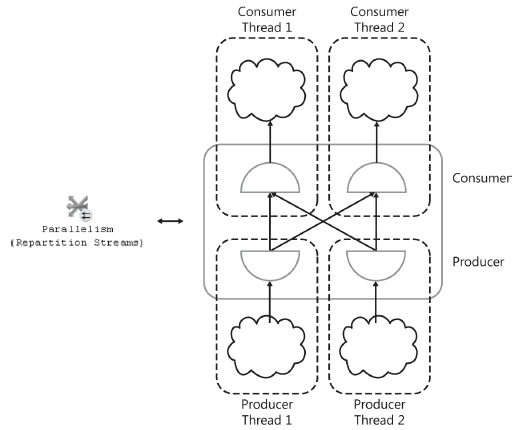

        Although the data flow between most iterators is pull-based (an iterator calls GetRow on its child when it’s ready for another row), the data flow in between an exchange producer and consumer is push-based. That is, the producer fills a packet with rows and “pushes” it to the consumer. This model allows the producer and consumer threads to execute independently.

      - **Parallel scan**

        The scan operator is one of the few operators that is parallel “aware.” The threads that compose a parallel scan work together to scan all rows in a table. Rows or pages aren’t assigned beforehand to a particular thread. Instead, the storage engine dynamically hands out pages or ranges of rows to threads.

        **At the beginning of a parallel scan, each thread requests a set of pages or a range of rows from the parallel page supplier. The threads then begin processing their assigned pages or rows and begin returning results. When a thread finishes with its assigned set of pages, it requests the next set of pages or the next range of rows from the parallel page supplier.**

        Start with a simple example

        ```sql
        CREATE TABLE [HugeTable1] (
          [Key] int,
          [Data] int,
          [Pad] char(200),
          CONSTRAINT [PK1] PRIMARY KEY ([Key]) )

        SET NOCOUNT ON

        DECLARE @i int
        BEGIN TRAN
          SET @i = 0
          WHILE @i < 250000
          BEGIN
            INSERT [HugeTable1] VALUES(@i, @i, NULL)
            SET @i = @i + 1
            IF @i % 1000 = 0
            BEGIN
              COMMIT TRAN
              BEGIN TRAN
            END
        END
        COMMIT TRAN
        
        SELECT [Key], [Data], [Pad]
        INTO [HugeTable2]
        FROM [HugeTable1]
        
        ALTER TABLE [HugeTable2]
        ADD CONSTRAINT [PK2] PRIMARY KEY ([Key])
        
        -- Now try the simplest possible query:
        SELECT [Key], [Data] FROM [HugeTable1]

        /* Despite the large table, this query results in a serial plan: */
        |--Clustered Index Scan(OBJECT:([HugeTable1].[PK1]))
        ```

        Now

        ```sql
        SELECT [Key], [Data]
        FROM [HugeTable1]
        WHERE [Data] < 1000

        /* This query results in a parallel plan: */

        |--Parallelism(Gather Streams)
        |--Clustered Index Scan(OBJECT:([HugeTable1].[PK1]),
          WHERE:([HugeTable1].[Data]<CONVERT_IMPLICIT(int,[@1],0)))
        ```

        **Because the Data column doesn’t have an index, SQL Server can’t perform an index seek and must evaluate the predicate for each row. By running this query in parallel, SQL Server distributes the cost of evaluating the predicate across multiple CPUs.**

        ```sql
        SELECT [Key], [Data]
        FROM [HugeTable1]
        WHERE [Data] < 1000
        ORDER BY [Key]

        /* The optimizer recognizes a clustered index that can return rows sorted by the Key column. To exploit this index and avoid an explicit sort, the optimizer adds a merging or order-preserving exchange to the plan: */

        |--Parallelism(Gather Streams, ORDER BY:([HugeTable1].[Key] ASC))
          |--Clustered Index Scan(OBJECT:([HugeTable1].[PK1]),
          WHERE:([HugeTable1].[Data]<CONVERT_IMPLICIT(int,[@1],0)) ORDERED FORWARD)
        ```
      
      - **Load balancing**

        ```sql
        SELECT MIN([Data]) FROM [HugeTable1]
        ```

        This query scans the entire table, but because of the aggregate it uses a parallel plan. The aggregate also ensures that the query returns only one row.

        ```sql
        |--Stream Aggregate(DEFINE:([Expr1003]=MIN([partialagg1004])))
          |--Parallelism(Gather Streams)
            |--Stream Aggregate(DEFINE:([partialagg1004]=MIN([HugeTable1].[Data])))
              |--Clustered Index Scan(OBJECT:([HugeTable1].[PK1]))
        ```

        Now repeat the experiment, but this time run an expensive serial query at the same time.

        ```sql
        SELECT MIN(T1.[Key] + T2.[Key])
        FROM [HugeTable1] T1 CROSS JOIN [HugeTable2] T2
        OPTION (MAXDOP 1)
        ```

      - **Parallel nested loops join**

        SQL Server parallelizes a nested loops join by distributing the outer rows (that is, the rows from the first input) randomly among the nested loops join threads. For example, if two threads are running a nested loops join, SQL Server sends about half of the rows to each thread.

        ```sql
        SELECT T1.[Key], T1.[Data], T2.[Data]
        FROM [HugeTable1] T1 JOIN [HugeTable2] T2
        ON T1.[Key] = T2.[Key]
        WHERE T1.[Data] < 500

        /* Now analyze the STATISTICS PROFILE output for this plan: */
        Rows Executes
        500 1 |--Parallelism(Gather Streams)
        500 2 |--Nested Loops(Inner Join, OUTER REFERENCES:([T1].[Key], [Expr1004])
              WITH UNORDERED PREFETCH)
        500 2 |--Clustered Index Scan (OBJECT:([HugeTable1].[PK1] AS [T1]),
              WHERE:([T1].[Data]<(500)))
        500 500 |--Clustered Index Seek (OBJECT:([HugeTable2].[PK2] AS [T2]),
              SEEK:([T2].[Key]=[T1].[Key])
              ORDERED FORWARD)
        ```

      - **Round-robin exchange**

        In some cases, SQL Server must add a round-robin exchange to distribute the rows.

        ```sql
        SELECT T1_Top.[Key], T1_Top.[Data], T2.[Data]
        FROM ( SELECT TOP 100 T1.[Key], T1.[Data] FROM [HugeTable1] T1 ORDER BY T1.[Data] ) T1_Top,
            [HugeTable2] T2
        WHERE T1_Top.[Key] = T2.[Key]

        Here is the corresponding plan:

        |--Parallelism(Gather Streams)
        |--Nested Loops(Inner Join, OUTER REFERENCES:([T1].[Key],
        [Expr1004]) WITH UNORDERED PREFETCH)
        |--Parallelism(Distribute Streams, RoundRobin Partitioning)
        | |--Top(TOP EXPRESSION:((100)))
        | |--Parallelism(Gather Streams, ORDER BY:([T1].[Data] ASC))
        | |--Sort(TOP 100, ORDER BY:([T1].[Data] ASC))
        | |--Clustered Index Scan (OBJECT:([HugeTable1].[PK1] AS [T1]))
        |--Clustered Index
        ```

        > [!WARNING]  
        > Search for more info about it!
      
        The top iterator can only be correctly evaluated in a serial plan thread. Thus, SQL Server must add a stop (that is, a distribute streams) exchange above the top iterator and can’t use the parallel scan to distribute the rows among the join threads. Instead, SQL Server parallelizes the join by having the stop exchange use round-robin partitioning to distribute the rows among the join threads.

      - **Parallel nested loops join performance**

        The parallel scan has one major advantage over the round-robin exchange. A parallel scan automatically and dynamically balances the workload among the threads; a round-robin exchange doesn’t.
          
      - **Inner-side parallel execution**

        This chapter noted earlier that with one exception, SQL Server always executes the inner side of a parallel nested loops join as a serial plan. The exception occurs when the optimizer knows that the outer input to the nested loops join is guaranteed to return only a single row and when the join has no correlated parameters.

        ```sql
        SELECT T1.[Key], T1.[Data], T2.[Key]
        FROM [HugeTable1] T1 JOIN [HugeTable2] T2
        ON T1.[Data] = T2.[Data]
        WHERE T1.[Key] = 0
        ```
          
      - **Parallel merge join**

        SQL Server parallelizes merge joins by distributing both sets of input rows among the individual merge join threads using hash partitioning. Unlike the parallel plan examples so far, merge join also requires that its input rows be sorted. In a parallel merge join plan, as in a serial merge join plan, SQL Server can use an index scan to deliver rows to the merge join in the correct sort order. However, in a parallel plan, SQL Server must also use a merging exchange to preserve the order of the input rows.
        Although, as discussed previously, the optimizer tends to favor plans that don’t require a merging exchange; including an ORDER BY clause in a join query can encourage such a plan. Consider the following query:
      
        ```sql
        SELECT T1.[Key], T1.[Data], T2.[Key]
        FROM [HugeTable1] T1 JOIN [HugeTable2] T2
        ON T1.[Key] = T2.[Data]
        ORDER BY T1.[Key]
        ```

      - **Parallel has join**

        SQL Server uses one of two different strategies to parallelize a hash join. One strategy uses hash partitioning just like a parallel merge join; the other strategy uses broadcast partitioning and is often called a broadcast hash join.
      
      - **Hash partitioning**

        The more common strategy for parallelizing a hash join involves distributing the build rows and the probe rows among the individual hash join threads using hash partitioning. After the data is hash partitioned among the threads, the hash join instances all run completely independently on their respective data sets. Unlike merge joins, hash joins don’t require that input rows be delivered in any particular order and, as a result, don’t require merging exchanges.

        ```sql
        SELECT T1.[Key], T1.[Data], T2.[Key]
        FROM [HugeTable1] T1 
        JOIN [HugeTable2] T2
        ON T1.[Data] = T2.[Data]
        ```

      - **Broadcast partitioning**

        Consider what happens if SQL Server tries to parallelize a hash join using hash partitioning, but only a small number of rows exist on the build side of the hash join. Fewer rows than hash join threads means that some threads might receive no rows at all. In this case, those threads would have no work to do during the probe phase of the join and would remain idle. 
        To reduce the risk of skew problems, when the optimizer estimates that the number of build rows is relatively small, it might choose to broadcast these rows to all the hash join threads.

        ```sql
        SELECT T1.[Key], T1.[Data], T2.[Key]
        FROM [HugeTable1] T1 JOIN [HugeTable2] T2
        ON T1.[Data] = T2.[Data]
        WHERE T1.[Key] < 100
        ```

        Although broadcast hash joins do reduce the risk of skew problems, they aren’t suitable for all scenarios. In particular, broadcast hash joins use more memory than their hash-partitioned counterparts.

      - **Bitmap filtering**

        ```sql
        SELECT T1.[Key], T1.[Data], T2.[Key]
        FROM [HugeTable1] T1 JOIN [HugeTable2] T2
        ON T1.[Data] = T2.[Data]
        WHERE T1.[Key] < 10000
        ```

        The predicate T1.[Key] < 10000 eliminates 96 percent of the build rows from HugeTable1. It also indirectly eliminates 96 percent of the rows from HugeTable2 because they no longer join with rows from HugeTable1.

        ```sql
        |--Parallelism(Gather Streams)
        |--Hash Match(Inner Join, HASH:([T1].[Data])=([T2].[Data]), RESIDUAL:(…))
        |--Bitmap(HASH:([T1].[Data]), DEFINE:([Bitmap1004]))
        | |--Parallelism(Repartition Streams, Hash Partitioning,
        PARTITION COLUMNS:([T1].[Data]))
        | |--Clustered Index Seek(OBJECT:([HugeTable1].[PK1] AS [T1]),
        SEEK:([T1].[Key] < (10000)) ORDERED FORWARD)
        |--Parallelism(Repartition Streams, Hash Partitioning,
        PARTITION COLUMNS:([T2].[Data]))
        |--Clustered Index Scan(OBJECT:([HugeTable2].[PK2] AS [T2]),
        WHERE:(PROBE([Bitmap1004],[Northwind2].[dbo].[HugeTable2].[Data] as [T2].
        [Data],N'[IN ROW]')))
        ```

        As its name suggests, the bitmap operator builds a bitmap. Just like the hash join, the bitmap operator hashes each row of HugeTable1 on the join key and sets the corresponding bit in the bitmap. When the scan of HugeTable1 and the hash join build are complete, SQL Server transfers the bitmap to the probe side of the join, typically to the exchange operator.

      - **Inserts, updates, and deletes**

        Data modification plans consist of two sections: a “read cursor” and a “write cursor.” The read cursor determines which rows will be affected by the data modification statement.
        The write cursor executes the actual INSERTS, UPDATES, DELETES, or MERGES.
        Consider the following UPDATE statement. This statement is guaranteed to violate the foreign key constraint on the ShipVia column and will fail.

        ```sql
        UPDATE [Orders]
        SET [ShipVia] = 4
        WHERE [ShipCity] = N'London'

        /* This statement uses the following query plan: */

        |--Assert(WHERE:(CASE WHEN [Expr1023] IS NULL THEN (0) ELSE NULL END))
        |--Nested Loops(Left Semi Join, OUTER REFERENCES:([Orders].[ShipVia]),
        DEFINE:([Expr1023] = [PROBE VALUE]))
        |--Clustered Index Update(OBJECT:([Orders].[PK_Orders]),
        OBJECT:([Orders].[ShippersOrders]),
        SET:([Orders].[ShipVia] = [Expr1019]))
        | |--Compute Scalar(DEFINE:([Expr1021]=[Expr1021]))
        | |--Compute Scalar(DEFINE:([Expr1021]=CASE WHEN [Expr1003]
        THEN (1)
        ELSE (0) END))
        | |--Compute Scalar(DEFINE:([Expr1019]=(4)))
        | |--Compute Scalar(DEFINE:([Expr1003]=
        CASE WHEN [Orders].[ShipVia] = (4)
        THEN (1) ELSE (0) END))
        | |--Top(ROWCOUNT est 0)
        | |--Clustered Index Scan
        (OBJECT:([Orders].[PK_Orders]),
        WHERE:([Orders].[ShipCity]=N'London') ORDERED)
        |--Clustered Index Seek(OBJECT:([Shippers].[PK_Shippers]),
        SEEK:([Shippers].[ShipperID]=[Orders].[ShipVia]) ORDERED FORWARD)
        ```

        The read cursor for this plan consists solely of the clustered index scan of the Orders table, whereas the write cursor consists of the entire remainder of the plan.

      - **Understanding data warehouse**

        A data warehouse is a decision support system for business decision making, designed to execute queries from users as well as reporting and analytical applications. Because of these different purposes, both systems also have different workloads: A data warehouse usually must support complex and large queries, compared with the typically small transactions of an OLTP system.

        Another main difference between OLTP databases and data warehouses is the degree of normalization found in them. An OLTP system uses normalized data, usually at a third normal form, while a data warehouse uses a denormalized dimensional model.

        Dimensional data modeling on data warehouses relies on the use of fact and dimension tables. Fact tables contain facts or numerical measures of the business, which can participate in calculations, whereas dimension tables are the attributes or descriptions of the facts. Fact tables also usually have foreign keys to link them to the primary keys of the dimension tables.

        Data warehouses also usually follow star and snowflake schema structures. A star schema contains a fact table and a single table for each dimension. Snowflake schemas are similar to star schemas to the extent that they also have a fact table, but dimension tables can also be normalized, and each dimension can have more than one table. Fact tables are typically huge and can store millions or billions of rows, compared to dimension tables, which are significantly smaller. The size of data warehouse databases tends to range from hundreds of gigabytes to terabytes.

        Queries that join a fact table to dimension tables are called star join queries. SQL Server includes special optimizations for star join queries (which we’ll look at shortly), can automatically detect star and snowflake schemas, and can reliably identify fact and dimension tables.

        Regarding optimizations for star join queries, the use of Cartesian (or cross) products of the dimension tables with multicolumn index lookups on a fact table is interesting to consider.

        In “Optimizing Star Join Queries for Data Warehousing in Microsoft SQL Server,” defined three different approaches to optimizing star join queries based on the selectivity of the fact table, as shown next. As mentioned previously, selectivity is a measure of the number of records that are estimated to be returned by a query, with smaller numbers represent higher selectivity (fewer rows).

        For highly selective queries that return up to 10 percent of the rows in the fact table, the query optimizer can produce a plan with nested loops joins, index seeks and bookmark lookups. For medium selectivity queries, which return anywhere from 10 to 75 percent of the records in the fact table, SQL Server might recommend hash joins with bitmap filters in combination with fact table scans or fact table range scans. Finally, for the least selective queries, processing more than 75 percent of the fact table, the query optimizer mostly will recommend regular hash joins with fact table scans.

        Bitmap filtering is an optimization for star join queries that was introduced with SQL Server 2008 and is available only in the Enterprise, Developer, and Evaluation editions.

        Optimized bitmap filtering works with hash joins that, as shown earlier, use two inputs, the smaller of which (the build table) is being completely read into memory.

        Next is an example of optimized bitmap filtering. Run the following query:

        ```sql
        USE AdventureWorksDW2012;
        GO
        SELECT *
        FROM dbo.FactInternetSales AS f
        JOIN dbo.DimProduct AS p ON f.ProductKey = p.ProductKey
        JOIN dbo.DimCustomer AS c ON f.CustomerKey = c.CustomerKey
        WHERE p.ListPrice > 50 AND c.Gender = 'M';
        ```

        ```sql
        DBCC OPTIMIZER_WHATIF(CPUs, 8)
        ```

        After running the previous statement, the query optimizer produces plans as in a system with eight processors. This command affects only your current session that you can reset to the state it was before by using the ResetAll parameter.

        ```sql
        DBCC OPTIMIZER_WHATIF(ResetAll)
        ```

        You can also use the Status parameter to see the current configuration; to see the output of this command you also need to run DBCC TRACEON(3604) first. Keep in mind that all these parameters are case sensitive.

        ```sql
        DBCC OPTIMIZER_WHATIF(Status)
        ```

- **Using columnstore indexes and batch processing**

  This section shows you the query processing aspect of the technology. Columnstore indexes are complemented with a new vector-based query execution capability with operators that can process batches of rows at a time. Batch processing alone provides performance benefits by reducing the overhead of data movement between operators along with the fact that these new processing algorithms are also optimized for the latest generation of processors. To take benefit of the columnstore indexes technology, you need only to create an index on fact tables and probably also large dimension tables (with more than 10 million rows); changing the queries or anything else on the application isn’t needed.

  Several existing operators can now run either in row mode or batch mode: hash join, hash aggregate, project, and filter. The same is true for the new columnstore index scan operator. A new operator, batch hash table build, can run in batch mode only.

  Finally, a plan might switch from batch to row processing dynamically if the system doesn’t have enough memory or threads, and sometimes this could be evidence of a performance problem.

  ```sql
  USE AdventureWorksDW2012;
  GO
  CREATE NONCLUSTERED COLUMNSTORE INDEX csi_FactInternetSales
  ON dbo.FactInternetSales ( ProductKey, OrderDateKey, DueDateKey, ShipDateKey, CustomerKey, PromotionKey, CurrencyKey, SalesTerritoryKey, SalesOrderNumber,
                             SalesOrderLineNumber, RevisionNumber, OrderQuantity, UnitPrice, ExtendedAmount, UnitPriceDiscountPct, DiscountAmount, ProductStandardCost,
                             TotalProductCost, SalesAmount, TaxAmt, Freight, CarrierTrackingNumber, CustomerPONumber, OrderDate, DueDate, ShipDate );
  ```

  Then we can run a typical star join query. The following query is joining the FactInternetSale fact table with the DimDate dimension table, grouping on MonthNumberOfYear and aggregating data on the SalesAmount column to get the total of sales by month for the calendar year 2005

  ```sql
  SELECT d.MonthNumberOfYear, SUM(SalesAmount) AS TotalSales
  FROM dbo.FactInternetSales AS f
  JOIN dbo.DimDate AS d
  ON f.OrderDateKey = d.DateKey
  WHERE CalendarYear = 2005
  GROUP BY d.MonthNumberOfYear;
  ```

  It's really running in the row execution mode:

  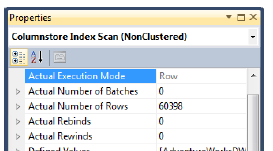

  You can drop the columnstore index before continuing.

  ```sql
  DROP INDEX csi_FactInternetSales ON dbo.FactInternetSales;
  ```

  Now test with a bigger table with millions of records. By the way, if you don’t have disk space for millions of records or don’t want to wait to create those big tables, you can use a trick with the undocumented ROWCOUNT and PAGECOUNT options of the UPDATE STATISTICS statement. For example, you can run the following statement to create a copy of the FactInternetSales table:

  ```sql
  SELECT * INTO dbo.FactInternetSalesCopy
  FROM dbo.FactInternetSales;
  ```

  Run the following statement:

  ```SQL
  UPDATE STATISTICS FactInternetSalesCopy WITH ROWCOUNT = 10000000, PAGECOUNT = 1000000;
  ```

  The UPDATE STATISTICS statement will update the page and row count in the catalog views and the query optimizer will use this information to generate a plan according to this data. You can drop it by running the following statement:

  ```sql
  DROP TABLE dbo.FactInternetSalesCopy;
  ```

  This exercise uses the table and columnstore index created in Chapter 7. The table name is dbo.FactInternetSalesBig and has more than 30 million rows. Update your query to use this table as shown here:

  ```sql
  SELECT d.MonthNumberOfYear, SUM(SalesAmount) AS TotalSales
  FROM dbo.FactInternetSalesBig AS f
  JOIN dbo.DimDate AS d
  ON f.OrderDateKey = d.DateKey
  WHERE CalendarYear = 2005
  GROUP BY d.MonthNumberOfYear;
  ```

  Running the star join query again will give you a totally different plan, this time running some operators in parallel and, more important, some operators in the batch mode.

  - **Addeding new data**

    The most noticeable limitation of columnstore indexes, at least on the SQL Server 2012 release, is that tables containing these indexes are non-updatable. This means no INSERT, UPDATE, DELETE, or MERGE operations are allowed in the table as soon as a columnstore index is created.

    Three common workarounds to this limitation, which Microsoft has said will go away in a future release of SQL Server, are to do the following.

    - Drop/disable, create/rebuild the columnstore index. 
    - Use partition switching. 
    - Use UNION ALL.

  - **Hints**

    You can use the new IGNORE_NONCLUSTERED_COLUMNSTORE_INDEX hint to ask the query optimizer to avoid using any columnstore index, as shown next:

    ```sql
    SELECT d.MonthNumberOfYear, SUM(SalesAmount) AS TotalSales
    FROM dbo.FactInternetSalesBig AS f
    JOIN dbo.DimDate AS d
    ON f.OrderDateKey = d.DateKey
    WHERE CalendarYear = 2005
    GROUP BY d.MonthNumberOfYear
    OPTION (IGNORE_NONCLUSTERED_COLUMNSTORE_INDEX);
    ```

### **1.5. The Storage Engine**

The SQL Server storage engine includes all components involved with the accessing and managing of data in your database. In SQL Server 2012, the storage engine is composed of three main areas: access methods, locking and transaction services, and utility commands.

**When SQL Server needs to locate data, it calls the access methods code**, which sets up and requests scans of data pages and index pages and prepares the OLE DB rowsets to return to the relational engine. Similarly, when data is to be inserted, the access methods code can receive an OLE DB rowset from the client. **The access methods** code contains components to open a table, retrieve qualified data, and update data. It **doesn’t actually retrieve the pages; instead, it makes the request to the buffer manager, which ultimately serves up the page in its cache or reads it to cache from disk.** When the scan starts, a look-ahead mechanism qualifies the rows or index entries on a page. The retrieving of rows that meet specified criteria is known as a qualified retrieval. The access methods code is used not only for SELECT statements but also for qualified UPDATE and DELETE statements (for example, UPDATE with a WHERE clause) and for any data modification operations that need to modify index entries. The following sections discuss some types of access methods.

- **Access Method**

To be Complete

- **Buffer Manager**

  To be Complete

- **Transaction Manager**

  A core feature of SQL Server is its ability to ensure that transactions are atomic—that is, all or nothing. Also, transactions must be durable, which means that if a transaction has been committed, it must be recoverable by SQL Server no matter what.
  **Write-ahead logging makes possible the ability to always roll back work in progress or roll forward committed work that hasn’t yet been applied to the data pages. Write-ahead logging ensures that the record of each transaction’s changes is captured on disk in the transaction log before a transaction is acknowledged as committed, and that the log records are always written to disk before the data pages where the changes were actually made are written. Writes to the transaction log are always synchronous—that is, SQL Server must wait for them to complete. Writes to the data pages can be asynchronous because all the effects can be reconstructed from the log if necessary. The transaction management component coordinates logging, recovery, and buffer management,**

  <r>RELEER ESTO PARA QUE ME QUDE 100% CLARO

  The transaction management component delineates the boundaries of statements that must be grouped to form an operation. It handles transactions that cross databases within the same SQL Server instance and allows nested transaction sequences.
  For a distributed transaction to another SQL Server instance the transaction management component coordinates with the Microsoft Distributed Transaction Coordinator (MS DTC) service, using operating system remote procedure calls. The transaction management component marks save points that you designate within a transaction at which work can be partially rolled back or undone.

  **The transaction management component also coordinates with the locking code regarding when locks can be released, based on the isolation level in effect. It also coordinates with the versioning code to determine when old versions are no longer needed and can be removed from the version store.**


### **1.6. The SQLOS**

  **Capitulo 2 Microsft SQL Server 2012 Internal book**

  - **INTRO**

    The SQL Server Operating System (SQLOS) is a separate application layer at the lowest level of the SQL Server Database Engine that both SQL Server and SQL Reporting Services run atop. Earlier versions of SQL Server have a thin layer of interfaces between the storage engine and the actual operating system through which SQL Server makes calls to the operating system for memory allocation, scheduler resources, thread and worker management, and synchronization objects. However, the services in SQL Server that need to access these interfaces can be in any part of the engine. SQL Server requirements for managing memory, schedulers, synchronization objects, and so forth have become more complex. Rather than each part of the engine growing to support the increased functionality, a single application layer has been designed to manage all operating system resources specific to SQL Server.

    The two main functions of SQLOS are **scheduling** and **memory management**, both of which are discussed in detail in this chapter. Other functions of SQLOS include the following.

    - **Synchronization** This object type includes spinlocks, mutexes (mutual exclusions), and special reader/writer locks on system resources.
    - **Memory brokers** Memory brokers distribute memory allocation between various components within SQL Server but don’t perform any allocations, which are handled by the Memory Manager.
    - **SQL Server exception handling** This involves dealing with user errors as well as system-generated errors.
    - **Deadlock detection** This mechanism doesn’t just involve locks but checks for any tasks holding onto resources that are mutually blocking each other. 
    - **Extended Events** Tracking extended events is similar to the SQL Trace capability but is much more efficient because the tracking runs at a much lower level than SQL Trace. Also, because the Extended Event layer is so low and deep, many more types of events can be tracked. 
    - **Asynchronous I/O** The difference between asynchronous and synchronous is what part of the system is actually waiting for an unavailable resource. When SQL Server requests a synchronous I/O, if the resource isn’t available, the Windows kernel puts the thread on a wait queue until the resource becomes available. For asynchronous I/O, SQL Server requests that Windows initiate an I/O. Windows starts the I/O operation and doesn’t stop the thread from running. SQL Server then places the server session in an I/O wait queue until it gets the signal from Windows that the resource is available.
    - **CLR hosting** Hosting Common Language Runtime (CLR) inside the SQLOS allows managed .NET code to be used natively inside SQL Server.

  - **NUMA Architecture**

    Non-Uniform Memory Access (NUMA) architectures have become common in most datacenters today. The SQLOS has automatically recognized the existence of hardware NUMA support and optimizes scheduling and memory management by default.

    Only a few years ago, hardware NUMA required specialized hardware configurations using multiple server nodes that functioned as a single server. Modern server processor architectures from AMD and Intel now offer hardware NUMA in most standard server configurations through the inclusion of an onboard memory controller for each processor die and interconnected paths between the physical sockets on the server motherboard. Regardless of the specific hardware implementation of NUMA, SQLOS performs the same internal configuration of SOS Memory Nodes and uses the same optimizations for memory management and scheduling.

    The main benefit of NUMA is scalability, which has definite limits when you use symmetric multiprocessing (SMP) architecture. With SMP, all memory access is posted to the same shared memory bus. This works fine for a relatively small number of CPUs, but problems appear when you have many CPUs competing for access to the shared memory bus. The trend in hardware has been to have more than one system bus, each serving a small set of processors. NUMA limits the number of CPUs on any one memory bus. Each processor group has its own memory and possibly its own I/O channels. However, each CPU can access memory associated with other groups coherently, as discussed later in the chapter. Each group is called a NUMA node, which are linked to each other by a high-speed interconnection. The number of CPUs within a NUMA node depends on the hardware vendor. Accessing local memory is faster than accessing the memory associated with other NUMA nodes—the reason for the name Non-Uniform Memory Access. Figure below shows a NUMA node with four CPUs.

    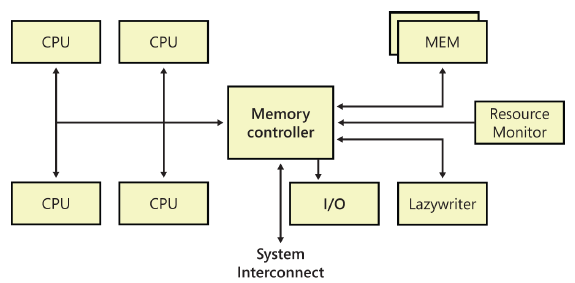

    SQL Server 2012 allows you to subdivide one or more physical NUMA nodes into smaller NUMA nodes, referred to as software NUMA or soft-NUMA. You typically use soft-NUMA when you have many CPUs but no hardware NUMA, because soft-NUMA allows for the subdividing of CPUs but not memory. You can also use soft-NUMA to subdivide hardware NUMA nodes into groups of fewer CPUs than is provided by the hardware NUMA. Your soft-NUMA nodes can also be configured to listen on their own ports.
    Only the SQL Server scheduler and Server Name Indication (SNI) are soft-NUMA–aware. Memory nodes are created based on hardware NUMA and therefore aren’t affected by soft-NUMA.
    TCP/IP, Virtual Interface Adapters (VIAs), Named Pipes, and shared memory can take advantage of NUMA round-robin scheduling, but only TCP and VIA can set the processor affinity to a specific set of NUMA nodes.

    **<r>BUSCAR INFO QUE LE EXPLIQUE A UN SER HUMANO QUE MIERDA ES LA NUMA Y COMO ES SU ARQUITECTURA</r>**

    - The Scheduler

      Because the Windows scheduler knew nothing about the needs of a relational database system, it treated SQL Server worker threads the same as any other process running on the operating system. However, a high-performance system such as SQL Server functions best when the scheduler can meet its special needs. SQL Server 7.0 and all subsequent versions are designed to handle their own scheduling to gain a number of advantages, including the following.

      - A private scheduler can support SQL Server tasks by using fibers as easily as it supports using threads.
      - Context switching and switching into kernel mode can be avoided as much as possible.

      One major difference between the SOS Scheduler and the Windows scheduler is that the SQL Server scheduler runs as a cooperative rather than as a preemptive scheduler. It relies on the workers, threads, or fibers to yield voluntarily often enough so that one process or thread doesn’t have exclusive control of the system. Each task that executes inside SQL Server has a quantum of 4 milliseconds on the scheduler.

      - Understanding SQL Server schedulers

        In SQL Server 2012, each actual CPU (whether hyperthreaded or physical) has a scheduler created for it when SQL Server starts. This is true even if the Affinity Mask server configuration options are configured so that SQL Server is set to not use all available physical CPUs. In SQL Server 2012, each scheduler is set to either ONLINE or OFFLINE based on the process affinity settings; the default is that all schedulers are ONLINE.

        Introduced for the first time in SQL Server 2008 R2, process affinity replaced the ‘affinity mask’ sp_configure option and is accomplished through the use of ALTER SERVER CONFIGURATION for setting processor affinity in SQL Server. Changing the process affinity value can change the status of one or more schedulers to OFFLINE, which you can do without having to restart your SQL Server. Note that when a scheduler is switched from ONLINE to OFFLINE due to a configuration change, any work already assigned to the scheduler is first completed and no new work is assigned.

    - SQL Server workers

      You can think of the SQL Server scheduler as a logical CPU used by SQL Server workers. 

      A worker can be either a thread or a fiber bound to a logical scheduler. If the Affinity Mask configuration option is set (as discussed in Chapter 1, “SQL Server 2012 architecture and configuration”), or process affinity has been configured using ALTER SERVER CONFIGURATION, each scheduler is mapped to a particular CPU. Thus, each worker is also associated with a single CPU.

      Each scheduler is assigned a worker limit based on the configured Max Worker Threads and the number of scheduler.

      A worker can’t move from one scheduler to another, but as workers are destroyed and created, it can appear as though workers are moving between schedulers.

      Workers are created when the scheduler receives a request (a task to execute) and no workers are idle. A worker can be destroyed if it has been idle for at least 15 minutes or if SQL Server is under memory pressure. Each worker can use at least half a megabyte of memory on a 32-bit system and at least 2 MB on a 64-bit system, so destroying multiple workers and freeing their memory can yield an immediate performance improvement on memory-starved systems.

      SQL Server actually handles the worker pool very efficiently, and you might be surprised to know that even on very large systems with hundreds or even thousands of users, the actual number of SQL Server workers might be much lower than the configured value for Max Worker Threads.

    - SQL Server tasks

      **The unit of work for a SQL Server worker is a request**, which you can think of as being equivalent to a single batch sent from the client to the server. When a request is received by SQL Server, it’s bound to a task that’s assigned to a worker, and that worker processes the entire request before handling any other request. If a request executes using parallelism, then multiple child tasks, and therefore workers, can be created based on the degree of parallelism being used to execute the request and the specific operation being performed.

      Keep in mind that a session ID (SPID) isn’t the same as a task. A SPID is a connection or channel over which requests can be sent, but an active request isn’t always available on any particular SPID. In SQL Server 2012, a SPID isn’t bound to a particular scheduler. Each SPID has a preferred scheduler, which is one that most recently processed a request from the SPID. The SPID is initially assigned to the scheduler with the lowest load. However, when subsequent requests are sent from the same SPID, if another scheduler has a load factor that is less than a certain percentage of the average of the scheduler’s entire load factor, the new task is given to the scheduler with the smallest load factor. One restriction is that all tasks for one SPID must be processed by schedulers on the same NUMA node. The exception to this restriction is when a query is being executed as a parallel query across multiple CPUs. The optimizer can decide to use more available CPUs on the NUMA node processing the query so that other CPUs (and other schedulers) can be used.

    - Threads vs. fibers

      > [!NOTE]
      > The scheduler in SQL Server 7.0 and SQL Server 2000 was called the User Mode Scheduler (UMS) to reflect that it ran primarily in user mode, as opposed to kernel mode. SQL Server 2005 and later versions call the scheduler the SOS Scheduler and improve on UMS even more.

      As mentioned earlier, the UMS was designed to work with workers running on either threads or fibers. 

      Windows fibers have less overhead associated with them than threads do, and multiple fibers can run on a single thread. You can configure SQL Server to run in fiber mode by setting the Lightweight Pooling option to 1. Although using less overhead and a “lightweight” mechanism sounds like a good idea, you should evaluate the use of fibers carefully.

      Certain SQL Server components don’t work—or don’t work well—when SQL Server runs in fiber mode. These components include SQLMail and SQLXML. Other components, such as heterogeneous and CLR queries, aren’t supported at all in fiber mode because they need certain thread-specific facilities provided by Windows.

      Fiber mode was actually intended just for special niche situations in which SQL Server reaches a limit in scalability due to spending too much time switching between thread contexts or switching between user mode and kernel mode. In most environments, the performance benefit gained by fibers is quite small compared to the benefits you can get by tuning in other areas. If you’re certain you have a situation that could benefit from fibers, be sure to test thoroughly before you set the option on a production server. Also, you might even want to contact Microsoft Customer Support Services.

    - NUMA and schedulers

      With a NUMA configuration, every node has some subset of the machine’s processors and the same number of schedulers. If the machine is configured for hardware NUMA, the number of processors on each node is preset, but for soft-NUMA that you configure yourself, you can decide how many processors are assigned to each node.

      You still have the same number of schedulers as processors, however. When SPIDs are first created, they are assigned round-robin to nodes. The Scheduler Monitor then assigns the SPID to the least loaded scheduler on that node. As mentioned earlier, if the SPID is moved to another scheduler, it stays on the same node. A single processor or SMP machine is treated as a machine with a single NUMA node. Just like on an SMP machine, no hard mapping occurs between schedulers and a CPU with NUMA, so any scheduler on an individual node can run on any CPU on that node. However, if you have set the Affinity Mask configuration option, each scheduler on each node is fixed to run on a particular CPU.

      Every hardware NUMA memory node has its own lazywriter as well as its own I/O Completion Port (IOCP), which is the network listener. 

      Every node also has its own Resource Monitor, which a hidden scheduler manages (you can see the hidden schedulers in sys.dm_os_schedulers). Each Resource Monitor has its own SPID, which you can see by querying the sys.dm_exec_requests and sys.dm_os_workers DMVs:

      ```sql
      SELECT session_id, CONVERT (varchar(10), t1.status) AS status, CONVERT (varchar(20), t1.command) AS command, CONVERT (varchar(15), t2.state) AS worker_state
      FROM sys.dm_exec_requests AS t1
      JOIN sys.dm_os_workers AS t2
      ON t2.task_address = t1.task_address
      WHERE command = 'RESOURCE MONITOR';
      ```

      Every node has its own Scheduler Monitor, which runs on any SPID and in a preemptive mode. The Scheduler Monitor thread wakes up periodically and checks each scheduler to see whether it has yielded since the last time the Scheduler Monitor woke up (unless the scheduler is idle). The Scheduler Monitor raises an error (17883) if a non-idle thread hasn’t yielded. This error can occur when an application other than SQL Server is monopolizing the CPU. The Scheduler Monitor knows only that the CPU isn’t yielding; it can’t ascertain what kind of task is using it. The Scheduler Monitor is also responsible for sending messages to the schedulers to help them balance their workload.

    - Dynamic affinity

      In SQL Server 2012 (in all editions except SQL Server Express), processor affinity can be controlled dynamically. When SQL Server starts up, all scheduler tasks are started, so each CPU has one scheduler. If process affinity has been set, some schedulers are then marked as offline and no tasks are assigned to them.

      When process affinity is changed to include additional CPUs, the new CPU is brought online. The Scheduler Monitor then notices an imbalance in the workload and starts picking workers to move to the new CPU. When a CPU is brought offline by changing process affinity, the scheduler for that CPU continues to run active workers, but the scheduler itself is moved to one of the other CPUs that are still online. No new workers are given to this scheduler, which is now offline, and when all active workers have finished their tasks, the scheduler stops.


    - Binding schedulers to CPUs

      Remember that, normally, schedulers aren’t bound to CPUs in a strict one-to-one relationship, even though you have the same number of schedulers as CPUs. A scheduler is bound to a CPU only when process affinity is set, even if you specify that process affinity use all the CPUs, which is the default setting.

      Configuring process affinity using ALTER SERVER CONFIGURATION SET PROCESS AFFINITY CPU requires only that you specify the specific CPUIDs. 

      For an eight-processor machine, a process affinity set with ALTER SERVER CONFIGURATION SET PROCESS AFFINITY CPU = 0 TO 1 means that only CPUs 0 and 1 are used and two schedulers are bound to the two CPUs. If you set the process affinity set with ALTER SERVER CONFIGURATION SET PROCESS AFFINITY CPU 0 TO 7, all the CPUs are used, just as with the default. 

      In addition to being able to set process affinity based on specific CPUIDs, SQL Server 2012 can set process affinity based on NUMA nodes using ALTER SERVER CONFIGURATION SET PROCESS AFFINITY NUMANODE = <NUMA node range spec>. The NUMA node range specification is identical to the CPU range specification. If you want an instance to use only the CPUs within a specific NUMA node, you simply specify that NUMA NodeID for the process affinity.

    - Observing scheduler internals

        SQL Server 2012 has several DMVs that provide information about schedulers, workers, and tasks. 

        - [sys.dm_os_schedulers]
          This view returns one row per scheduler in SQL Server. Each scheduler is mapped to an individual processor in SQL Server. Interesting columns include the following:
            - [parent_node_id] The ID of the node that the scheduler belongs to. This represents a NUMA node.
            - [scheduler_id]   The ID of the scheduler. All schedulers that run regular queries have IDs of less than 1048576.
            - [cpu_id]         The CPUID assigned to the scheduler. A cpu_id of 255 no longer indicates no affinity as it did in SQL Server 2005.
            - [is_online]      If SQL Server is configured to use only some of the available processors on the server, this can mean that some schedulers are mapped to processors not in the affinity mask. If that’s the case, this column returns 0, meaning that the scheduler isn’t being used to process queries or batches.
            - [current_tasks_count] The number of current tasks associated with this scheduler, including the following. (When a task is completed, this count is decremented.):
                • Tasks waiting on a resource to be acquired before proceeding
                • Tasks that are currently running or that can run but are waiting to be executed
            - [runnable_tasks_count] The number of tasks waiting to run on the scheduler.
            - [current_workers_count] The number of workers associated with this scheduler, including workers not assigned any task.
            - [active_workers_count] The number of workers assigned a task.
            - [work_queue_count] The number of tasks waiting for a worker. If current_workers_count is greater than active_workers_count, this work queue count should be 0 and shouldn’t grow.
            - [pending_disk_io_count] The number of pending I/Os. Each scheduler has a list of pending I/Os that are checked on every context switch to determine whether the I/Os are completed. The count is incremented when the request is inserted and decremented when the request is completed. This number doesn’t indicate the state of the I/Os.
            - [load_factor] The internal value that indicates the perceived load on this scheduler. This value determines whether a new task should be put on this scheduler or another scheduler. It’s useful for debugging purposes when schedulers appear to be unevenly loaded.

        - [sys.dm_os_workers]
            This view returns a row for every worker in the system. Interesting columns include the following:
            - [is_preemptive] A value of 1 means that the worker is running with preemptive scheduling. Any worker running external code is run under preemptive scheduling.
            - [is_fiber] A value of 1 means that the worker is running with lightweight pooling.

        - [sys.dm_os_threads]
            This view returns a list of all SQLOS threads running under the SQL Server process. Interesting columns include the following:
            - [started_by_sqlserver] The thread initiator. A 1 means that SQL Server started the thread; 0 means that another component, such as an extended procedure from within SQL Server, started the thread.
            - [creation_time] The time when this thread was created.
            - [stack_bytes_used] The number of bytes actively being used on the thread.
            - [affinity] The CPU mask on which this thread is running. This depends on the value configured by the ALTER SERVER CONFIGURATION SET PROCESS AFFINITY statement, which might be different from the scheduler in the case of soft-affinity.
            - [locale] The cached locale LCID for the thread.

        - [sys.dm_os_tasks]
            This view returns one row for each task that is active in the instance of SQL Server. Interesting columns include the following:
            - [task_state] The state of the task. The value can be one of the following:
                • PENDING  Waiting for a worker thread
                • RUNNABLE Capable of being executed, but is waiting to receive a quantum
                • RUNNING  Currently running on the scheduler
                • SUSPENDED Has a worker but is waiting for an event
                • DONE Completed
                • SPINLOOP Processing a spinlock, as when waiting for a signal
            - [context_switches_count] The number of scheduler context switches that this task has completed.
            - [pending_io_count] The number of physical I/Os performed by this task.
            - [pending_io_byte_count] The total byte count of I/Os performed by this task.
            - [pending_io_byte_average] The average byte count of I/Os performed by this task.
            - [scheduler_id] The ID of the parent scheduler. This is a handle to the scheduler information for this task.
            - [session_id] The ID of the session associated with the task.

        - [sys.dm_os_waiting_tasks]
          This view returns information about the queue of tasks waiting on some resource. Interesting columns include the following:
          - [session_id] The ID of the session associated with the task.
          - [exec_context_id] The ID of the execution context associated with the task.
          - [wait_duration_ms] The total wait time (in milliseconds) for this wait type. This time is inclusive of signal_wait_time.
          - [wait_type] The name of the wait type.
          - [resource_address] The address of the resource for which the task is waiting.
          - [blocking_task_address] The task currently holding this resource.
          - [blocking_session_id] The ID of the session of the blocking task.
          - [blocking_exec_context_id] The ID of the execution context of the blocking task.
          - [resource_description] The description of the resource being consumed.


        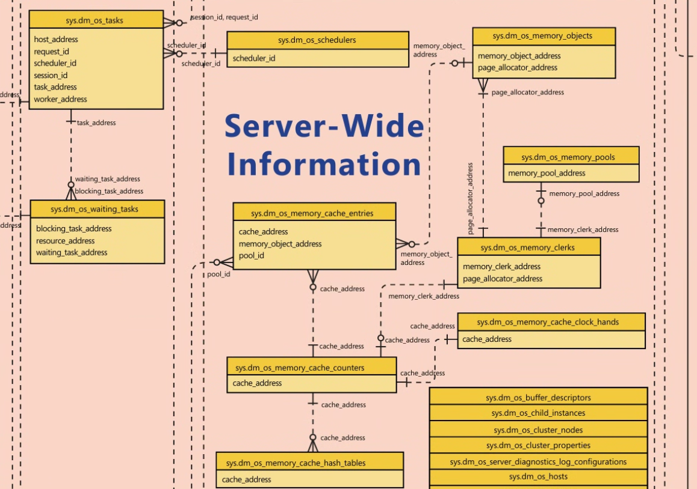

    - Understanding the Dedicated Administrator Connection (DAC)

      Under extreme conditions, such as a complete lack of available resources, SQL Server can enter an abnormal state in which no further connections can be made to the SQL Server instance. SQL Server 2005 introduced a special connection called the Dedicated Administrator Connection (DAC) that was designed to be accessible even when no other access can be made.

      You can connect to the DAC using the command-line tool SQLCMD and specifying the -A (or /A) flag. This method of connection is recommended because it uses fewer resources than the graphical user interface (GUI). 

      Through SSMS, you can specify that you want to connect using DAC by preceding the name of your SQL Server with ADMIN: in the Connection dialog box. For example, to connect to a default SQL Server instance on a machine named TENAR, you enter ADMIN:TENAR. To connect to a named instance called SQL2008 on the same machine, you enter ADMIN:TENAR\SQL2008.

      The DAC is a special-purpose connection designed for diagnosing problems in SQL Server and possibly resolving them. 

      Under normal circumstances, you can check whether a DAC is in use by running the following query when not connected to the DAC. If a DAC is active, the query returns the SPID for the DAC; otherwise, it returns no rows:

      ```sql
          SELECT s.session_id
          FROM sys.tcp_endpoints as e
          JOIN sys.dm_exec_sessions as s
          ON e.endpoint_id = s.endpoint_id
          WHERE e.name = N'Dedicated Admin Connection';
      ```

      Keep the following points in mind about using the DAC.
      - By default, the DAC is available only locally. However, administrators can configure SQL Server to allow remote connection by using the Remote Admin Connections configuration option.
      - The user login to connect via the DAC must be a member of the sysadmin server role.
      - There are only a few restrictions on the SQL statements that can be executed on the DAC. (For example, you can’t run parallel queries or commands—for example, BACKUP or RESTORE—using the DAC.) However, you are recommended not to run any resource-intensive queries that might exacerbate the problem that led you to use the DAC. The DAC connection is created primarily for troubleshooting and diagnostic purposes. In general, you use the DAC for running queries against the DMO, some of which you’ve seen already and many more of which are discussed later in this book.
      - A special thread is assigned to the DAC that allows it to execute the diagnostic functions or queries on a separate scheduler. This thread can’t be terminated; you can kill only the DAC session, if needed. The DAC has no lazywriter thread, but it does have its own I/O Completion Port (IOCP), a worker thread, and an idle thread.


  - **Memory**

    > [!IMPORTANT]  
    > El Buffer Manager es el Buffer Cache?

    Because memory management is a huge topic, covering every detail of it would require a whole book in itself. SQL Server 2012 introduces a significant rewrite of the SQLOS Memory Manager and has the first significant changes in memory management since SQLOS was introduced in SQL Server 2005. The goal of this section is twofold:

    - To provide enough information about how SQL Server uses its memory resources so that you can determine whether memory is being managed well on your system.
    - To describe the aspects of memory management that you have control over so that you can understand when to exert that control

    By default, SQL Server 2012 manages its memory resources almost completely dynamically. When allocating memory, SQL Server must communicate constantly with the operating system, which is one of the reasons the SQLOS layer of the engine is so important.

    - **The buffer pool and the data cache**

        **The main memory component in SQL Server is the buffer pool.**
        All memory not used by another memory component remains in the buffer pool to be used as a data cache for pages read in from the database files on disk.The buffer manager manages disk I/O functions for bringing data and index pages into the data cache so that data can be shared among users.

        Other components requiring memory can request a buffer from the buffer pool.
        A buffer is a page in memory that has the same size as a data or index page. You can think of it as a page frame that can hold one page from a database.
        Most buffers taken from the buffer pool for other memory components go to other kinds of memory caches, the largest of which is typically the cache for procedure and query plans, which is usually called the plan cache.

        **<r>CONSULTAR CON CHATGPT SI EL DIAGRAMA QUE ARME EN RELACION A ESTO ESTA BIEN?</r>**

    - **Column store object pool**

        In addition to the buffer pool, SQL Server 2012 includes a new cache store specifically optimized for usage by the new column store indexing feature. The column store object pool allocates memory from the any-page allocator just like the buffer pool, but rather than cache data pages, the memory allocations are used for column store index objects. 

        The memory for the column store object pool is tracked by a separate memory clerk, CACHESTORE_COLUMNSTOREOBJECTPOOL, in SQLOS. 

    - **Access to in-memory data pages**

        Access to pages in the data cache must be fast. Even with real memory, scanning the whole data cache for a page would be ridiculously inefficient when you have gigabytes of data. Pages in the data cache are therefore hashed for fast access. Hashing is a technique that uniformly maps a key via a hash function across a set of hash buckets. A hash table is a structure in memory that contains an array of pointers (implemented as a linked list) to the buffer pages. 

        Given a dbid-fileno-pageno identifier (a combination of the database ID, file number, and page number), the hash function converts that key to the hash bucket that should be checked. 

        Similarly, it takes only a few memory reads for SQL Server to determine that a desired page isn’t in cache and must be read in from disk.

    - **Page management in the data cache**

        **You can use a data page or an index page only if it exists in memory**.
        Therefore, a buffer in the data cache must be available for the page to be read into. Keeping a supply of buffers available for immediate use is an important performance optimization.

        In SQL Server 2012, a single mechanism is responsible both for writing changed pages to disk and for marking as free those pages that haven’t been referenced for some time. SQL Server maintains a linked list of the addresses of free pages, and any worker needing a buffer page uses the first page of this list.

        Every buffer in the data cache has a header that contains information about the last two times the page was referenced and some status information, including whether the page is dirty (that is, it has been changed since it was read into memory or from disk).

        The reference information is used to implement the page replacement policy for the data cache pages, which uses an algorithm called LRU-K (Least Recently Used (LRU)). An LRU-K algorithm keeps track of the last K times a page was referenced and can differentiate between types of pages, such as index and data pages, with different frequency levels. SQL Server 2012 uses a K value of 2, so it keeps track of the two most recent accesses of each buffer page.

        The data cache is periodically scanned from start to end by the lazywriter process, which functions similar to a ticking clock hand, processing 16 pages in the data cache for each tick. **Because the buffer cache is all in memory**, these scans are quick and require no I/O. During the scan, a value is associated with each buffer based on the time the buffer was last accessed. When the value gets low enough, the dirty page indicator is checked. If the page is dirty, a write is scheduled to commit the modifications to disk.
        
        Instances of SQL Server use write-ahead logging so that the write of the dirty data page is blocked while the log page recording the modification is first written to disk. 
        
        **After the modified page is flushed to disk or if the page wasn’t dirty to start with, it is freed.** 
        The association between the buffer page and the data page that it contains is removed by deleting information about the buffer from the hash table, and the buffer is put on the free list.

    - **The free buffer list and the lazywriter**

        **The work of scanning the buffer pool, writing dirty pages, and populating the free buffer list is primarily performed by the lazywriter.**
        
        Each instance of SQL Server has one lazywriter thread for each SOS Memory node created in SQLOS, with every instance having at least one lazywriter thread. As explained earlier, the lazywriter works like a clock hand and ticks, with each tick processing 16 buffers in the data cache.
        
        The location of the previous tick is tracked internally, and the buffers in the data cache are scanned sequentially from start to finish as the lazywriter ticks during execution. When the end of the data cache is reached, the process repeats from the beginning of the data cache on the next tick.

        If the instance experiences memory pressure in the data cache, individual workers can assist the lazywriter as they allocate memory, and the number of pages available on the free list is too low. When this condition occurs, the individual workers execute an internal routine, HelpLazyWriter, which performs an additional lazywriter tick on the worker thread, processing the next 16 buffers in the data cache and returning buffers that exceed the current time of last access value to the free list. 
        
        When SQL Server uses memory dynamically, it must constantly be aware of the amount of free memory available in Windows. One SQLOS component is the Resource Monitor, which, among other tasks, monitors the Windows operating system for low memory notifications by using the QueryMemoryResourceNotification Windows Server application programming interface (API) to get status. If the available memory in Windows drops below 32 MB for servers with 4 GB of RAM or 64 MB for servers with 8 GB or higher, a LowMemoryResourceNotification flag is set. This notification is returned by the QueryMemoryResourceNotification call, and Resource Monitor forces the external clock hands on the internal caches in SQLOS to sweep the caches to clean up and reduce memory usage, allowing SQL Server to return memory to Windows. As memory is released by SQLOS to Windows, it can be committed by other applications or, if a stable state occurs, the Windows operating system sets a HighMemoryResourceNotification when the available memory on the server is three times the low memory notification size. When this occurs, the Resource Monitor detects the change in notification, and the SQLOS can then commit additional memory from Windows, if required.

    - **Checkpoints**

        The checkpoint process also scans the buffer cache periodically and writes all the dirty data pages for a particular database to disk. 
        The difference between the checkpoint process and the lazywriter is that the checkpoint process never puts buffers on the free list.

        The only purpose of the checkpoint process is to ensure that pages modified before a certain time are written to disk, so that the number of dirty pages in memory is always kept to a minimum, which in turn ensures that the length of time SQL Server requires for recovery of a database after a failure is kept to a minimum.
        
        When a checkpoint occurs, SQL Server writes a checkpoint record to the transaction log, which lists all active transactions. This allows the recovery process to build a table containing a list of all the potentially dirty pages. Checkpoints occur automatically at regular intervals but can also be requested manually. Checkpoints are triggered when any of the following occurs:
        
        * A database owner (or backup operator) explicitly issues a CHECKPOINT command to perform a checkpoint in that database.
        * A backup or database snapshot is created of a database.
        * The log is filling up (more than 70 percent of capacity) and the database is in autotruncate mode.
        * The recovery time exceeds the Recovery Interval server configuration option. A Recovery Interval setting of 1 means that checkpoints occur about every minute as long as transactions are being processed in the database. A default recovery interval of 0 means that SQL Server chooses an appropriate value; for the current version, this is one minute.
        * The recovery time exceeds the Target Recovery Time database configuration option.
        * An orderly shutdown of SQL Server is requested, without the NOWAIT option. A checkpoint operation is then run in each database on the instance. An orderly shutdown occurs when you explicitly shut down SQL Server, unless you do so by using the SHUTDOWN WITH NOWAIT command. An orderly shutdown also occurs when the SQL Server service is stopped through Service Control Manager or the net stop command from an operating system prompt.

        You can also use the sp_configure Recovery Interval option to influence checkpointing frequency, balancing the time to recover against any effect on runtime performance. If you’re interested in tracing when checkpoints actually occur, you can use the SQL Server Extended Events sqlserver.checkpoint_begin and sqlserver.checkpoint_end to monitor checkpoint activity.
        
        The checkpoint process goes through the buffer pool, scanning the pages nonsequentially. When it finds a dirty page, it looks to see whether any physically contiguous (on the disk) pages are also dirty so that it can do a large block write. But this means that it might, for example, write buffers 12, 13, 14, 15, 16, and 17 when it sees that buffer 14 is dirty. (These pages have contiguous disk locations even though they can be in different memory regions in the buffer pool. In this case, the noncontiguous pages in the buffer pool can be written as a single operation called a gather-write.) The process continues to scan the buffer pool until it gets to page 17.

        In some cases, checkpoints might issue a substantial amount of I/O, causing the I/O subsystem to get inundated with write requests, which can severely affect read performance. On the other hand, relatively low I/O activity can be utilized during some periods. SQL Server 2012 includes a command-line option that allows throttling of checkpoint I/Os. Use the SQL Server Configuration Manager and add the –k parameter, followed by a decimal number, to the list of startup parameters for the SQL Server service. The value specified indicates the number of megabytes per second that the checkpoint process can write. Backups might require slightly more time to finish because a checkpoint process that a backup initiates is also delayed. Before enabling this option on a production system, make sure that you have enough hardware to sustain the I/O requests posted by SQL Server and that you have thoroughly tested your applications on the system. The –k option doesn’t apply to indirect checkpoints.

    - **Memory management in other caches**

        **Buffer pool memory not used for the data cache is used for other types of caches, primarily the plan cache.**
        The page replacement policy for other caches, as well as the mechanism by which pages that can be freed are searched for, are quite a bit different than for the data cache.

        SQL Server 2012 uses a common caching framework that all caches except the data cache use. The framework consists of the Resource Monitor and a set of three stores: **cache stores, user stores (which don’t actually have anything to do with users), and object stores.**
        
        **The plan cache** is the main example of a cache store, and **the metadata cache** is the prime example of a user store. Both cache stores and user stores use the same LRU mechanism and the same costing algorithm to determine which pages can stay and which can be freed. Object stores, on the other hand, are just pools of memory blocks and don’t require LRU or costing. One example of the use of an object store is the SNI, which uses the object store for pooling network buffers.
        
        For the rest of this section, the discussion of stores refers only to cache stores and user stores.

        The Resource Monitor is in charge of moving the external hands whenever it notices memory pressure. When the Resource Monitor detects memory pressure, it writes an entry into one of many in-memory ring buffers maintained by SQLOS for storing diagnostics information about SQL Server. A ring buffer is a memory structure that functions as a first-in-first-out queue with a fixed or variable number of entries that can be maintained within the memory structure. The ring buffer entries from the Resource Monitor can be monitored as follows:

        ```sql
        SELECT *
        FROM sys.dm_os_ring_buffers
        WHERE ring_buffer_type=N'RING_BUFFER_RESOURCE_MONITOR';
        ```

        If the memory pressure is external to SQL Server, the value of the IndicatorsSystem node is 2. If the memory pressure is internal to SQL Server, the value of the IndicatorsProcess node is 2. 
        
        Also, if you look at the DMV sys.dm_os_memory_cache_clock_hands—specifically at the removed_last_round_count column—you can look for a value that is very large compared to other values. A dramatic increase in that value strongly indicates memory pressure. 
        
        **The companion website for this book contains a comprehensive white paper titled “Troubleshooting Performance Problems in SQL Server 2008,” which includes many details on tracking down and dealing with memory problems. Buscar este paper para ver cuales son las queries**


    - **The Memory Broker**

        Because so many SQL Server components need memory, and to make sure that each component uses memory efficiently, SQL Server uses a Memory Broker, whose job is to analyze the behavior of SQL Server with respect to memory consumption and to improve dynamic memory distribution. The Memory Broker is a centralized mechanism that dynamically distributes memory between the buffer pool, the query executor, the Query Optimizer, and all the various caches, and it attempts to adapt its distribution algorithm for different types of workloads.
        
        You can monitor Memory Broker behavior by querying the Memory Broker ring buffer as follows:
        ```sql
        SELECT *
        FROM sys.dm_os_ring_buffers
        WHERE ring_buffer_type=N'RING_BUFFER_MEMORY_BROKER';
        ```

    - **Memory sizing**

        SQL Server memory involves more than just the buffer pool. As mentioned earlier in this discussion, SQL Server 2012 included a rewrite of the Memory Manager in SQLOS and no longer allocates or manages memory in the same manner as previous versions of SQL Server. 

        In SQL Server 2012, the sys.dm_os_memory_clerks DMV has been reworked to reflect the changes to the Memory Manager and, therefore, no longer has separate single_page_kb and multi_pages_kb columns. Instead, a new pages_kb column reflects the total memory allocated by a component from the any-page allocator in SQLOS:

        ```sql
        SELECT type, sum(pages_kb) AS pages_kb
        FROM sys.dm_os_memory_clerks
        WHERE pages_kb != 0
        GROUP BY type;
        ```

    - **Buffer pool sizing**

        When SQL Server starts, it computes the size of the virtual address space (VAS) of the SQL Server process.

        A 32-bit machine can directly address only 4 GB of memory and, by default, Windows itself reserves the top 2 GB of address space for its own use, which leaves only 2 GB as the maximum size of the VAS for any application, such as SQL Server. If you need to access more than 3 GB of RAM with SQL Server 2012, you have to use a 64-bit platform.

        On a 64-bit platform, the Windows policy option Lock Pages in Memory is available, although it’s disabled by default. This policy determines which accounts can make use of a Windows feature to keep data in physical memory, preventing the system from paging the data to virtual memory on disk.

        A DMV called [sys.dm_os_sys_info] contains one row of general-purpose SQL Server configuration information, including the following columns:
        - physical_memory_kb: The amount of physical memory available
        - virtual_memory_kb: The amount of virtual memory available to the process in user mode
        - commited_kb: The committed memory in kilobytes in the Memory Manager; doesn’t include reserved memory in the Memory Manager
        - commit_target_kb: The amount of memory, in kilobytes, that SQL Server Memory Manager can consume

        Also, a DMV called [sys.dm_os_process_memory] contains one row of information about the SQL Server process memory usage, including the following columns:
        - physical_memory_in_use_kb: The size of the process working set in KB
        - large_page_allocations_kb: The amount of physical memory allocated by using large page APIs
        - locked_page_allocations_kb: The amount of memory pages locked in memory
        - total_virtual_address_space_kb: The total size of the user mode part of the virtual address space
        - virtual_address_space_reserved_kb: The total amount of virtual address space reserved by the process
        - virtual_address_space_committed_kb: The amount of reserved virtual address space that has been committed or mapped to physical pages
        - virtual_address_space_available_kb: The amount of virtual address space that’s currently free

    - **DMVs for memory internals**

        SQL Server includes several DMO that provide information about memory and the various caches.

        - [sys.dm_os_memory_clerks]
            This view returns one row per memory clerk that’s currently active in the instance of SQL Server. You can think of a clerk as an accounting unit. following query returns a list of all the types of clerks.

            ```SQL
            SELECT DISTINCT type
            FROM sys.dm_os_memory_clerks;
            ```

            Interesting columns include the following.
                • [pages_kb] The amount of page memory allocated in kilobytes for this memory clerk.
                • [virtual_memory_reserved_kb] The amount of virtual memory reserved by a memory clerk.
                • [virtual_memory_committed_kb] The amount of memory committed by the clerk. The amount of committed memory should always be less than the amount of Reserved Memory.
                • [awe_allocated_kb] The amount of memory in kilobytes locked in the physical memory and not paged out by Windows.

        - [sys.dm_os_memory_cache_counters]
            This view returns a snapshot of the health of each cache of type userstore and cachestore. It provides runtime information about the cache entries allocated, their use, and the source of memory for the cache entries. Interesting columns include the following.
            • [pages_kb] The amount of memory in kilobytes allocated in the cache.
            • [pages_in_use_kb] The amount of memory in kilobytes (KB) that is allocated and used in the cache.
            • [entries_count] The number of entries in the cache.
            • [entries_in_use_count] The number of entries in use in the cache.

        - [sys.dm_os_memory_cache_hash_tables]
            This view returns a row for each active cache in the SQL Server instance. This view can be joined to [sys.dm_os_memory_cache_counters] on the cache_address column. Interesting columns include the following.
            • [buckets_count] The number of buckets in the hash table.
            • [buckets_in_use_count] The number of buckets currently being used.
            • [buckets_min_length] The minimum number of cache entries in a bucket.
            • [buckets_max_length] The maximum number of cache entries in a bucket.
            • [buckets_avg_length] The average number of cache entries in each bucket. **If this number gets very large, it might indicate that the hashing algorithm isn’t ideal.**
            • [buckets_avg_scan_hit_length] The average number of examined entries in a bucket before the searched-for item was found. **As above, a big number might indicate a less-than-optimal cache. You might consider running DBCC FREESYSTEMCACHE to remove all unused entries in the cache stores.**

        - [sys.dm_os_memory_cache_clock_hands] 
            This DMV, discussed earlier, can be joined to the other cache DMVs using the cache_address column. Interesting columns include the following.
            • [clock_hand] The type of clock hand, either external or internal. Remember that every store has two clock hands.
            • [clock_status] The status of the clock hand: suspended or running. A clock hand runs when a corresponding policy kicks in.
            • [rounds_count] The number of rounds the clock hand has made. All the external clock hands should have the same value in this column.
            • [removed_all_rounds_count] The number of entries removed by the clock hand in all rounds.

    - **Read-ahead**

        SQL Server supports a mechanism called read-ahead, whereby the need for data and index pages can be anticipated and pages can be brought into the buffer pool before they’re actually needed. This performance optimization allows large amounts of data to be processed effectively and typically keeps the necessary pages in the buffer pool before they are needed by the execution engine.
        
        Read-ahead is managed completely internally, and no configuration adjustments are necessary.
        
        Read-ahead comes in two types: **one for table scans on heaps** and **one for index ranges**. 
        **For table scans**, the table’s allocation structures are consulted to read the table in disk order. Up to 32 extents (32 * 8 pages/extent * 8,192 bytes/page = 2 MB) of read-ahead might be outstanding at a time. Up to eight contiguous extents (64 contiguous pages) can be read at a time are read with a single 512 KB scatter read from one file. If the table is spread across multiple files in a file group, SQL Server attempts to distribute the read-ahead activity across the files evenly.
        **For index ranges**, the scan uses level 1 of the index structure (the level immediately above the leaf) to determine which pages to read ahead. When the index scan starts, read-ahead is invoked on the initial descent of the index to minimize the number of reads performed. For instance, for a scan of WHERE state = ‘WA’, read-ahead searches the index for key = ‘WA’, and it can tell from the level-1 nodes how many pages must be examined to satisfy the scan. If the anticipated number of pages is small, all the pages are requested by the initial read-ahead; if the pages are noncontiguous, they’re fetched in scatter reads. If the range contains a large number of pages, the initial read-ahead is performed and thereafter, every time another 16 pages are consumed by the scan, the index is consulted to read in another 16 pages. This has several interesting effects.
        
        - Small ranges can be processed in a single read at the data page level whenever the index is contiguous.
        - The scan range (for example, state = ‘WA’) can be used to prevent reading ahead of pages that won’t be used because this information is available in the index.
        - Read-ahead isn’t slowed by having to follow page linkages at the data page level. (Read-ahead can be done on both clustered indexes and nonclustered indexes.)

    **<r>As you can see, memory management in SQL Server is a huge topic, and this discussion provided you with only a basic understanding of how SQL Server uses memory. This information should give you a start in interpreting the wealth of information available through the DMVs and troubleshooting. The companion website includes a white paper that offers many more troubleshooting ideas and scenarios.</r>**

    > [!WARNING]
    > QQ
    > SOS Schduler que es?
    > Cual es la diferencia entre whether hyperthreaded or physical?
    > What "a fiber bound" is?
    > What "Windows fibers" is?
    > What "SQL Server runs in fiber mode" is?
    > Terminar de entender que es el Affinity Mask?
    > No entendi un porogon del 1.1.2.5 Dynamic affinity!!

  - **Configuration**

    This book, SQL Server 2012 Internals, covers only the main features of the core database engine. 

    - **SQL Server metadata**

      Three types of system metadata objects are intended for general use: Compatibility Views, Catalog Views, and Dynamic Management Objects.

    - **Compatibility Views**

    - **Catalog views**

      The SQL Server Books Online topic, “Mapping System Tables to System Views,” categorizes its objects into two lists: those appearing only in master and those appearing in all databases.
      As views, these metadata objects are based on an underlying Transact-SQL (T-SQL) definition. The most straightforward way to see the definition of these views is by using the object_definition function. (You can also see the definition of these system views by using sp_helptext or by selecting from the catalog view sys.system_sql_modules.) So to see the definition of sys.tables, you can execute the following:
      SELECT object_definition (object_id('sys.tables'));

    - **Dynamic Management Objects**

      Metadata with names starting with sys.dm_, such as the just-mentioned sys.dm_exec_cached_plans, are considered Dynamic Management Objects. Although Dynamic Management Objects include both views and functions, they are usually referred to by the abbreviation DMV.

      They are all in the sys schema and have a name that starts with dm_, followed by a code indicating the area of the server with which the object deals. The main categories are:

      - **dm_exec_** This category contains information directly or indirectly related to the execution of user code and associated connections. For example, sys.dm_exec_sessions returns one row per authenticated session on SQL Server.
      - **dm_os_** This category contains low-level system information such as memory and scheduling. For example, sys.dm_os_schedulers is a DMV that returns one row per scheduler.
      - **dm_tran_** This category contains details about current transactions. For example, sys.dm_tran_locks returns information about currently active lock resources.
      - **dm_logpool** This category contains details about log pools used to manage SQL Server 2012’s log cache, a new feature added to make log records more easily retrievable when needed by features such as AlwaysOn.
      - **dm_io_** This category keeps track of input/output activity on network and disks. For example, the function sys.dm_io_virtual_file_stats returns I/O statistics for data and log files. 
      - **dm_db_** This category contains details about databases and database objects such as indexes. For example, the sys.dm_db_index_physical_stats function returns size and fragmentation information for the data and indexes of the specified table or view.

    - **Other metadata**

    - **System functions**
      
      Most SQL Server system functions are **property functions**. Property functions provide individual values for many SQL Server objects as well as for SQL Server databases and the SQL Server instance itself. The values returned by the property functions are scalar as opposed to tabular, so they can be used as values returned by SELECT statements and as values to populate columns in tables. The following property functions are available in SQL Server 2012:
      
      * SERVERPROPERTY
      * COLUMNPROPERTY
      * DATABASEPROPERTYEX
      * INDEXPROPERTY
      * INDEXKEY_PROPERTY
      * OBJECTPROPERTY
      * OBJECTPROPERTYEX
      * SQL_VARIANT_PROPERTY
      * FILEPROPERTY
      * FILEGROUPPROPERTY
      * FULLTEXTCATALOGPROPERTY
      * FULLTEXTSERVICEPROPERTY
      * TYPEPROPERTY
      * CONNECTIONPROPERTY
      * ASSEMBLYPROPERTY

      In addition to the property functions, the system functions include functions that are merely shortcuts for catalog view access. For example, to find out the database ID for the AdventureWorks2012 database, you can either query the sys.databases catalog view or use the DB_ID() function. Both of the following SELECT statements should return the same result:

      ```sql
      SELECT database_id
      FROM sys.databases
      WHERE name = 'AdventureWorks2012';
      SELECT DB_ID('AdventureWorks2012');
      ```

    - **System stored procedures**

      System stored procedures are the original metadata access tool, in addition to the system tables themselves. Most of the system stored procedures introduced in the very first version of SQL Server are still available. However, catalog views are a big improvement over these procedures: You have control over how much of the metadata you see because you can query the views as though they were tables. With the system stored procedures, you have to accept the data that it returns.

    - **Summary**

      Terminar de entender la/s diferencias entre [Catalog View], [Dynamic Management Objects] y [Other Metadata]

  - **Components of the SQL Server Engine**

    Below figure shows the general architecture of SQL Server and its four major components: The Protocol Layer, The Query Processor (also called the relational engine), The Storage Engine, and The SQLOS. Every batch submitted to SQL Server for execution, from any client application, must interact with these four components.

    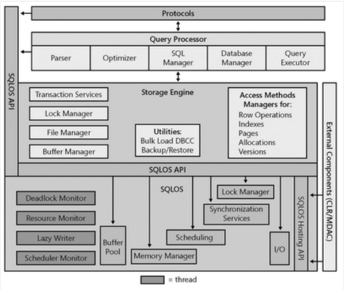

  - **Protocols**

    When an application communicates with the Database Engine, the application programming interfaces (APIs) exposed by the protocol layer formats the communication using a Microsoft-defined format called a tabular data stream (TDS) packet. The SQL Server Network Interface (SNI) protocol layer on both the server and client computers encapsulates the TDS packet inside a standard communication protocol, such as TCP/IP or Named Pipes. On the server side of the communication, the network libraries are part of the Database Engine. On the client side, the network libraries are part of the SQL Native Client. The configuration of the client and the instance of SQL Server determine which protocol is used. You can configure SQL Server to support multiple protocols simultaneously, coming from different clients. Each client connects to SQL Server with a single protocol. If the client program doesn’t know which protocols SQL Server is listening on, you can configure the client to attempt multiple protocols sequentially. The following protocols are available:

    * Shared Memory The simplest protocol to use, with no configurable settings. Clients using the Shared Memory protocol can connect to only a SQL Server instance running on the same computer, so this protocol isn’t useful for most database activity. Use this protocol for troubleshooting when you suspect that the other protocols are configured incorrectly. Clients using MDAC 2.8 or earlier can’t use the Shared Memory protocol. If such a connection is attempted, the client is switched to the Named Pipes protocol.

    * Named Pipes A protocol developed for local area networks (LANs). A portion of memory is used by one process to pass information to another process, so that the output of one is the input of the other. The second process can be local (on the same computer as the first) or remote (on a network computer).

    * TCP/IP The most widely used protocol over the Internet. TCP/IP can communicate across interconnected computer networks with diverse hardware architectures and operating systems. It includes standards for routing network traffic and offers advanced security features. Enabling SQL Server to use TCP/IP requires the most configuration effort, but most networked computers are already properly configured.

  - **Query processor**

    As mentioned earlier, the query processor is also called the relational engine. It includes the SQL Server components that determine exactly what your query needs to do and the best way to do it. In Figure 1-2, the query processor is shown as two primary components: Query Optimization and query execution. This layer also includes components for parsing and binding (not shown in the figure). By far the most complex component of the query processor—and maybe even of the entire SQL Server product—is the Query Optimizer, which determines the best execution plan for the queries in the batch. Chapter 11, “The Query Optimizer,” discusses the Query Optimizer in great detail; this section gives you just a high-level overview of the Query Optimizer as well as of the other components of the query processor.
    The query processor also manages query execution as it requests data from the storage engine and processes the results returned. Communication between the query processor and the storage engine is generally in terms of Object Linking and Embedding (OLE) DB rowsets. (Rowset is the OLE DB term for a result set.)

  - **Parsing and binding components**

    It checks for proper syntax and spelling of keywords. After a query is parsed, a binding component performs name resolution to convert the object names into their unique object ID values. After the parsing and binding is done, the command is converted into an internal format that can be operated on. This internal format is known as a query tree. If the syntax is incorrect or an object name can’t be resolved, an error is immediately raised that identifies where the error occurred. However, other types of error messages can’t be explicit about the exact source line that caused the error.

  - **The Query Optimizer**

    The Query Optimizer takes the query tree and prepares it for optimization. Statements that can’t be optimized, such as flow-of-control and Data Definition Language (DDL) commands, are compiled into an internal form. Optimizable statements are marked as such and then passed to the Query Optimizer.

    The Query Optimizer is concerned mainly with the Data Manipulation Language (DML) statements SELECT, INSERT, UPDATE, DELETE, and MERGE, which can be processed in more than one way; the Query Optimizer determines which of the many possible ways is best. It compiles an entire command batch and optimizes queries that are optimizable. The query optimization and compilation result in an execution plan.

    The first step in producing such a plan is to normalize each query, which potentially breaks down a single query into multiple, fine-grained queries. After the Query Optimizer normalizes a query, it optimizes it, which means that it determines a plan for executing that query. Query optimization is cost-based; the Query Optimizer chooses the plan that it determines would cost the least based on internal metrics that include estimated memory requirements, CPU utilization, and number of required I/Os. The Query Optimizer considers the type of statement requested, checks the amount of data in the various tables affected, looks at the indexes available for each table, and then looks at a sampling of the data values kept for each index or column referenced in the query. The sampling of the data values is called distribution statistics. (Chapter 11 discusses statistics in detail.) Based on the available information, the Query Optimizer considers the various access methods and processing strategies that it could use to resolve a query and chooses the most cost-effective plan.

    The Query Optimizer also uses pruning heuristics to ensure that optimizing a query doesn’t take longer than required to simply choose a plan and execute it. The Query Optimizer doesn’t necessarily perform exhaustive optimization; some products consider every possible plan and then choose the most cost-effective one. The advantage of this exhaustive optimization is that the syntax chosen for a query theoretically never causes a performance difference, no matter what syntax the user employed. But with a complex query, it could take much longer to estimate the cost of every conceivable plan than it would to accept a good plan, even if it’s not the best one, and execute it.

    After normalization and optimization are completed, the normalized tree produced by those processes is compiled into the execution plan, which is actually a data structure. Each command included in it specifies exactly which table is affected, which indexes are used (if any), and which criteria (such as equality to a specified value) must evaluate to TRUE for selection. This execution plan might be considerably more complex than is immediately apparent. In addition to the actual commands, the execution plan includes all the steps necessary to ensure that constraints are checked. Steps for calling a trigger are slightly different from those for verifying constraints. If a trigger is included for the action being taken, a call to the procedure that comprises the trigger is appended. If the trigger is an instead-of trigger, the call to the trigger’s plan replaces the actual data modification command. For after triggers, the trigger’s plan is branched to right after the plan for the modification statement that fired the trigger, before that modification is committed. The specific steps for the trigger aren’t compiled into the execution plan, unlike those for constraint verification.

  - **The Query Executor**

    The query executor runs the execution plan that the Query Optimizer produced, acting as a dispatcher for all commands in the execution plan. This module goes through each command of the execution plan until the batch is complete. Most commands require interaction with the storage engine to modify or retrieve data and to manage transactions and locking.

  - **The storage engine**

    The SQL Server storage engine includes all components involved with the accessing and managing of data in your database. In SQL Server, the storage engine is composed of three main areas: access methods, locking and transaction services, and utility commands.

  - **Access methods**

    When SQL Server needs to locate data, it calls the access methods code, which sets up and requests scans of data pages and index pages and prepares the OLE DB rowsets to return to the relational engine. Similarly, when data is to be inserted, the access methods code can receive an OLE DB rowset from the client. The access methods code contains components to open a table, retrieve qualified data, and update data. It doesn’t actually retrieve the pages; instead, it makes the request to the buffer manager, which ultimately serves up the page in its cache or reads it to cache from disk. When the scan starts, a look-ahead mechanism qualifies the rows or index entries on a page. The retrieving of rows that meet specified criteria is known as a qualified retrieval. The access methods code is used not only for SELECT statements but also for qualified UPDATE and DELETE statements (for example, UPDATE with a WHERE clause) and for any data modification operations that need to modify index entries. The following sections discuss some types of access methods.

    - **Row and index operations** 
      
      You can consider row and index operations to be components of the access methods code because they carry out the actual method of access. Each component is responsible for manipulating and maintaining its respective on-disk data structures—namely, rows of data or B-tree indexes, respectively. They understand and manipulate information on data and index pages.
      The row operations code retrieves, modifies, and performs operations on individual rows. It performs an operation within a row, such as “retrieve column 2” or “write this value to column 3.” As a result of the work performed by the access methods code, as well as by the lock and transaction management components (discussed shortly), the row is found and appropriately locked as part of a transaction. After formatting or modifying a row in memory, the row operations code inserts or deletes a row. The row operations code needs to handle special operations if the data is a large object (LOB) data type—text, image, or ntext—or if the row is too large to fit on a single page and needs to be stored as overflow data. 
      The index operations code maintains and supports searches on B-trees, which are used for SQL Server indexes. An index is structured as a tree, with a root page and intermediate-level and lower-level pages. (A very small tree might not have intermediate-level pages.) A B-tree groups records with similar index keys, thereby allowing fast access to data by searching on a key value. The B-tree’s core feature is its ability to balance the index tree (B stands for balanced). Branches of the index tree are spliced together or split apart as necessary so that the search for any particular record always traverses the same number of levels and therefore requires the same number of page accesses.

    - **Page allocation operations** 
      
      The allocation operations code manages a collection of pages for each database and monitors which pages in a database have already been used, for what purpose they have been used, and how much space is available on each page. Each database is a collection of 8 KB disk pages spread across one or more physical files. SQL Server uses 13 types of disk pages. The ones this book discusses are data pages, two types of Large Object (LOB) pages, row-overflow pages, index pages, Page Free Space (PFS) pages, Global Allocation Map and Shared Global Allocation Map (GAM and SGAM) pages, Index Allocation Map (IAM) pages, Minimally Logged (ML) pages, and Differential Changed Map (DIFF) pages. Another type, File Header pages, won’t be discussed. All user data is stored on data, LOB, or row-overflow pages. Index rows are stored on index pages, but indexes can also store information on LOB and row-overflow pages. PFS pages keep track of which pages in a database are available to hold new data. Allocation pages (GAMs, SGAMs, and IAMs) keep track of the other pages; they contain no database rows and are used only internally. BCM and DCM pages are used to make backup and recovery more efficient.

    - **Versioning operations** 
      
      Another type of data access, which was added to the product in SQL Server 2005, is access through the version store. Row versioning allows SQL Server to maintain older versions of changed rows. The row-versioning technology in SQL Server supports snapshot isolation as well as other features of SQL Server 2012, including online index builds and triggers, and the versioning operations code maintains row versions for whatever purpose they are needed.

  - **Transaction services**

    A core feature of SQL Server is its ability to ensure that transactions are atomic—that is, all or nothing. Also, transactions must be durable, which means that if a transaction has been committed, it must be recoverable by SQL Server no matter what—even if a total system failure occurs one millisecond after the commit was acknowledged. 

    Transactions must adhere to four properties, called the ACID properties: atomicity, consistency, isolation, and durability. 

    In SQL Server, if work is in progress and a system failure occurs before the transaction is committed, all the work is rolled back to the state that existed before the transaction began. 

    Write-ahead logging makes possible the ability to always roll back work in progress or roll forward committed work that hasn’t yet been applied to the data pages. Write-ahead logging ensures that the record of each transaction’s changes is captured on disk in the transaction log before a transaction is acknowledged as committed, and that the log records are always written to disk before the data pages where the changes were actually made are written.

    Writes to the transaction log are always synchronous—that is, SQL Server must wait for them to complete. Writes to the data pages can be asynchronous because all the effects can be reconstructed from the log if necessary. The transaction management component coordinates logging, recovery, and buffer management, topics discussed later in this book; this section looks just briefly at transactions themselves.

    **The transaction management component** 
    delineates the boundaries of statements that must be grouped to form an operation. It handles transactions that cross databases within the same SQL Server instance and allows nested transaction sequences. (However, nested transactions simply execute in the context of the first-level transaction; no special action occurs when they are committed. Also, a rollback specified in a lower level of a nested transaction undoes the entire transaction.) For a distributed transaction to another SQL Server instance (or to any other resource manager), the transaction management component coordinates with the Microsoft Distributed Transaction Coordinator (MS DTC) service, using operating system remote procedure calls. The transaction management component marks save points that you designate within a transaction at which work can be partially rolled back or undone.
    The transaction management component also coordinates with the locking code regarding when locks can be released, based on the isolation level in effect. It also coordinates with the versioning code to determine when old versions are no longer needed and can be removed from the version store. The isolation level in which your transaction runs determines how sensitive your application is to changes made by others and consequently how long your transaction must hold locks or maintain versioned data to protect against those changes.

    Concurrency models SQL Server 2012 supports two concurrency models for guaranteeing the ACID properties of transactions:
      - **Pessimistic concurrency** This model guarantees correctness and consistency by locking data so that it can’t be changed. Every version of SQL Server prior to SQL Server 2005 used this currency model exclusively; it’s the default in both SQL Server 2005 and later versions.
      - **Optimistic currency** SQL Server 2005 introduced optimistic concurrency, which provides consistent data by keeping older versions of rows with committed values in an area of tempdb called the version store. With optimistic concurrency, readers don’t block writers and writers don’t block readers, but writers still block writers. The cost of these non-blocking operations must be considered. To support optimistic concurrency, SQL Server needs to spend more time managing the version store. Administrators also have to pay close attention to the tempdb database and plan for the extra maintenance it requires.

    **Five isolation-level semantics are available in SQL Server 2012. Three of them support only pessimistic concurrency: Read Uncommitted, Repeatable Read, and Serializable. Snapshot isolation level supports optimistic concurrency. The default isolation level, Read Committed, can support either optimistic or pessimistic concurrency, depending on a database setting.**

    The behavior of your transactions depends on the isolation level and the concurrency model you are working with. 

    A complete understanding of isolation levels also requires an understanding of locking because the topics are so closely related.

    **Locking operations** Locking is a crucial function. SQL Server lets you manage multiple users simultaneously and ensures that the transactions observe the properties of the chosen isolation level. Even though readers don’t block writers and writers don’t block readers in snapshot isolation, writers do acquire locks and can still block other writers, and if two writers try to change the same data concurrently, a conflict occurs that must be resolved. 

    <r>Read the book related to this topic.


  - **Services of the SQL Server**

    - **Service Broker**

      SQL Server BrowserOne related service that deserves special attention is the SQL Server Browser service, particu-larly important if you have named instances of SQL Server running on a machine. SQL Server Browser listens for requests to access SQL Server resources and provides information about the various SQL Server instances installed on the computer where the Browser service is running.Prior to SQL Server 2000, only one installation of SQL Server could be on a machine at one time, and the concept of an “instance” really didn’t exist.SQL Server always listened for incom-ing requests on port 1433, but any port can be used by only one connection at a time. When SQL Server 2000 introduced support for multiple instances of SQL Server, a new protocol called SQL Server Resolution Protocol (SSRP) was developed to listen on UDP port 1434. This listener could reply to clients with the names of installed SQL Server instances, along with the port numbers or named pipes used by the instance. SQL Server 2005 replaced SSRP with the SQL Server Browser service, which is still used in SQL Server 2012.If the SQL Server Browser service isn’t running on a computer, you can’t connect to SQL Server on that machine unless you provide the correct port number. Specifically, if the SQL Server Browser service isn’t running, the following connections won’t work:
      - Connecting to a named instance without providing the port number or pipe
      - Using the DAC to connect to a named instance or the default instance if it isn’t us-ing TCP/IP port 1433
      - Enumerating servers in SQL Server Management Studio. You are recommended to have the Browser service set to start automatically on any machine on which SQL Server will be accessed using a network connection.

    - **SQL Server system configuration**

      Although discussing operating system and hardware configuration and tuning is beyond the scope of this book, a few issues are very straightforward but can have a major effect on the performance of SQL Server.

    - **SQL Server configuration settings**

      SQL Server 2012 has 69 server configuration options that you can query, using the catalog view sys.configurations.
      You should change configuration options only when you have a clear reason for doing so and closely monitor the effects of each change to determine whether the change improved or degraded performance.
      You first need to change the show advanced options setting to be 1:

      ```sql
      EXEC sp_configure 'show advanced options', 1; RECONFIGURE;
      GO
      ```
      
      To see which options are advanced, you can query the sys.configurations view and examine a column called is_advanced, which lets you see which options are considered advanced:

      ```sql
      SELECT * FROM sys.configurations
      WHERE is_advanced = 1;
      GO
      ```

      If you use the sp_configure stored procedure, no changes take effect until the RECONFIGURE command runs. In some cases, you might have to specify RECONFIGURE WITH OVERRIDE if you are changing an option to a value outside the recommended range. Dynamic changes take effect immediately on reconfiguration, but others don’t take effect until the server is restarted. If after running RECONFIGURE an option’s run_value and config_value as displayed by sp_configure are different, or if the value and value_in_use in sys.configurations are different, you must restart the SQL Server service for the new value to take effect. You can use the sys.configurations view to determine which options are dynamic:

      ```sql
      SELECT * FROM sys.configurations
      WHERE is_dynamic = 1;
      GO
      ```

    - **Memory Options**

      Min Server Memory and Max Server Memory By default, SQL Server adjusts the total amount of the memory resources it will use. However, you can use the Min Server Memory and Max Server Memory configuration options to take manual control. The default setting for Min Server Memory is 0 MB, and the default setting for Max Server Memory is 2147483647. 

    - **Scheduling options**

      SQL Server 2012 has a special algorithm for scheduling user processes using the SQLOS, which manages one scheduler per logical processor and ensures that only one process can run on a scheduler at any specific time. The SQLOS manages the assignment of user connections to workers to keep the number of users per CPU as balanced as possible. 

      Five configuration options affect the behavior of the scheduler: **Lightweight Pooling, Affinity Mask, Affinity64 Mask, Priority Boost, and Max Worker Threads.**

        - **Lightweight Pooling** 

          By default, SQL Server operates in thread mode, which means that the workers processing SQL Server requests are threads. As described earlier, SQL Server also lets user connections run in fiber mode. Fibers are less expensive to manage than threads. The Lightweight Pooling option can have a value of 0 or 1; 1 means that SQL Server should run in fiber mode. Using fibers can yield a minor performance advantage, particularly when you have eight or more CPUs and all available CPUs are operating at or near 100 percent. However, the tradeoff is that certain operations, such as running queries on linked servers or executing extended stored procedures, must run in thread mode and therefore need to switch from fiber to thread. The cost of switching from fiber to thread mode for those connections can be noticeable and in some cases offsets any benefit of operating in fiber mode. If you’re running in an environment that uses a high percentage of total CPU resources, and if System Monitor shows a lot of context switching, setting Lightweight Pooling to 1 might yield some performance benefit.

        - **Max Worker Threads** 

          SQL Server uses the operating system’s thread services by keeping a pool of workers (threads or fibers) that take requests from the queue. It attempts to divide the worker threads evenly among the SQLOS schedulers so that the number of threads available to each scheduler is the Max Worker Threads setting divided by the number of CPUs. Having 100 or fewer users means having usually as many worker threads as active users (not just connected users who are idle). With more users, having fewer worker threads than active users often makes sense. Although some user requests have to wait for a worker thread to become available, total throughput increases because less context switching occurs. The Max Worker Threads default value of 0 means that the number of workers is configured by SQL Server, based on the number of processors and machine architecture. For example, for a four-way 32-bit machine running SQL Server, the default is 256 workers. This doesn’t mean that 256 workers are created on startup. It means that if a connection is waiting to be serviced and no worker is available, a new worker is created if the total is now below 256. If, for example, this setting is configured to 256 and the highest number of simultaneously executing commands is 125, the actual number of workers won’t exceed 125. It might be even smaller than that because SQL Server destroys and trims away workers that are no longer being used.
          You should probably leave this setting alone if your system is handling 100 or fewer simultaneous connections. In that case, the worker thread pool won’t be greater than 100. Table below lists the default number of workers, considering your machine architecture and number of processors. (Note that Microsoft recommends 1,024 as the maximum for 32-bit operating systems.)

        Default settings for Max Worker Threads

        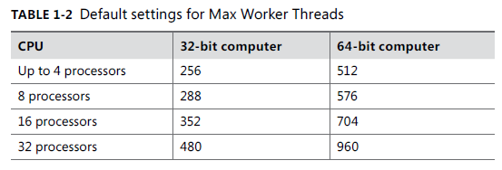

        Even systems that handle 5,000 or more connected users run fine with the default setting. When thousands of users are simultaneously connected, the actual worker pool is usually well below the Max Worker Threads value set by SQL Server because from the perspective of the database, most connections are idle even if the user is doing plenty of work on the client.


    - **Disk I/O options**

      <r>No options are available for controlling the disk read behavior of SQL Server.<r> All tuning options to control read-ahead in previous versions of SQL Server are now handled completely internally. One option is available to control disk write behavior; it controls how frequently the checkpoint process writes to disk.

      **Recovery interval** This option can be configured automatically. SQL Server setup sets it to 0, which means autoconfiguration. In SQL Server 2012, this means that the recovery time should be less than one minute.

      This option lets database administrators control the checkpoint frequency by specifying the maximum number of minutes that recovery should take, per database. SQL Server estimates how many data modifications it can roll forward in that recovery time interval. SQL Server then inspects the log of each database (every minute, if the recovery interval is set to the default of 0) and issues a checkpoint for each database that has made at least that many data modification operations since the last checkpoint. For databases with relatively small transaction logs, SQL Server issues a checkpoint when the log becomes 70 percent full, if that is less than the estimated number.

      The frequency of checkpoints in each database depends on the amount of data modifications made, not on a time-based measure. So a database used primarily for read operations won’t have many checkpoints issued. To avoid excessive checkpoints, SQL Server tries to ensure that the value set for the recovery interval is the minimum amount of time between successive checkpoints.

      SQL Server provides a new feature called indirect checkpoints that allow the configuration of checkpoint frequency at the database level using a database option called TARGET_RECOVERY_TIME. 

      As you’ll see, most writing to disk doesn’t actually happen during checkpoint operations. Checkpoints are just a way to guarantee that all dirty pages not written by other mechanisms are still written to the disk in a timely manner. **For this reason, you should keep the checkpoint options at their default values.**

      **Affinity I/O Mask and Affinity64 I/O Mask** These two options control the affinity of a processor for I/O operations and work in much the same way as the two options for controlling processing affinity for workers. Setting a bit for a processor in either of these bitmasks means that the corresponding processor is used only for I/O operations.You’ll probably never need to set these options. 

      These are some options to reduce the I/O **Backup Compression DEFAULT**, **Filestream access level**.


    - **Query Processing Options**

      SQL Server has several options for controlling the resources available for processing queries. As with all the other tuning options, your best bet is to leave the default values unless thorough testing indicates that a change might help.

      - **Min Memory Per Query** When a query requires additional memory resources, the number of pages that it gets is determined partly by this option. This option is relevant for sort operations that you specifically request using an ORDER BY clause; it also applies to internal memory needed by merge-join operations and by hash-join and hash-grouping operations.
      This configuration option allows you to specify a minimum amount of memory (in kilobytes) that any of these operations should be granted before they are executed. Sort, merge, and hash operations receive memory very dynamically, so you rarely need to adjust this value. 

      - **Query wait** This option controls how long a query that needs additional memory waits if that memory isn’t available. A setting of –1 means that the query waits 25 times the estimated execution time of the query, but it always waits at least 25 seconds with this setting. A value of 0 or more specifies the number of seconds that a query waits. If the wait time is exceeded, SQL Server generates error 8645: Server: Msg 8645, Level 17, State 1, Line 1. A time out occurred while waiting for memory resources to execute the query. Re-run the query.

      <r>Keep in mind that this option affects only queries that have to wait for memory needed by hash and merge operations. Queries that have to wait for other reasons aren’t affected.</r>

      - **Blocked Process Threshold** This option allows administrators to request a notification when a user task has been blocked for more than the configured number of seconds. When Blocked Process Threshold is set to 0, no notification is given. You can set any value up to 86,400 seconds.
      
      When the deadlock monitor detects a task that has been waiting longer than the configured value, an internal event is generated. You can choose to be notified of this event in one of two ways. You can create an Extended Events session to capture events of type blocked_process_report. As long as a resource stays blocked on a deadlock-detectable resource, the event is raised every time the deadlock monitor checks for a deadlock.

      Alternatively, you can use event notifications to send information about events to a service broker service. You also can use event notifications, which execute asynchronously, to perform an action inside a SQL Server 2012 instance in response to events, with very little consumption of memory resources. Because event notifications execute asynchronously, these actions don’t consume any resources defined by the immediate transaction.

      - **Index Create Memory** The Min Memory Per Query option applies only to sorting and hashing used during query execution; it doesn’t apply to the sorting that takes place during index creation. Another option, Index Create Memory, lets you allocate a specific amount of memory (in kilobytes) for index creation.

      - **Query Governor Cost Limit** You can use this option to specify the maximum number of seconds that a query can run. If you specify a non-zero, non-negative value, SQL Server disallows execution of any query that has an estimated cost exceeding that value. Specifying 0 (the default) for this option turns off the query governor, and all queries are allowed to run without any time limit.

      - **Max Degree Of Parallelism and Cost Threshold For Parallelism** SQL Server 2012 lets you run certain kinds of complex queries simultaneously on two or more processors. The queries must lend themselves to being executed in sections; the following is an example:

      ```sql
      SELECT AVG(charge_amt), category FROM charge GROUP BY category
      ```

      If the charge table has 1 million rows and 10 different values for category, SQL Server can split the rows into groups and have only a subset of them processed on each processor. For example, with a four-CPU machine, categories 1 through 3 can be averaged on the first processor, categories 4 through 6 can be averaged on the second processor, categories 7 and 8 can be averaged on the third, and categories 9 and 10 can be averaged on the fourth. Each processor can come up with averages for only its groups, and the separate averages are brought together for the final result.

      During optimization, the Query Optimizer always finds the cheapest possible serial plan before considering parallelism. If this serial plan costs less than the configured value for the Cost Threshold For Parallelism option, no parallel plan is generated. Cost Threshold For Parallelism refers to the cost of the query in seconds; the default value is 5. (As in the preceding section, this isn’t an exact clock-based number of seconds.) If the cheapest serial plan costs more than this configured threshold, a parallel plan is produced based on assumptions about how many processors and how much memory will actually be available at runtime. This parallel plan cost is compared with the serial plan cost, and the cheaper one is chosen. The other plan is discarded.

      A parallel query execution plan can use more than one thread; a serial execution plan, used by a nonparallel query, uses only a single thread. The actual number of threads used by a parallel query is determined at query plan execution initialization and is the Degree of Parallelism (DOP). The decision is based on many factors, including the Affinity Mask setting, the Max Degree Of Parallelism setting, and the available threads when the query starts executing.

      You can observe when SQL Server is executing a query in parallel by querying the DMV sys.dm_os_tasks. A query running on multiple CPUs has one row for each thread, as follows:

      ```sql
          SELECT task_address, task_state, context_switches_count, pending_io_count, pending_io_byte_count, pending_io_byte_average, scheduler_id, session_id,
                 exec_context_id, request_id, worker_address, host_address
          FROM sys.dm_os_tasks
          ORDER BY session_id, request_id;
      ```

  - **Resource Governor**

    - **Code example**

      ```sql
      --- Create a resource pool for production processing and set limits.
      USE master;
      GO
      CREATE RESOURCE POOL pProductionProcessing
      WITH (MAX_CPU_PERCENT = 100, MIN_CPU_PERCENT = 50);
      GO

      -- Create a workload group for production processing and configure the relative importance.
      CREATE WORKLOAD GROUP gProductionProcessing
      WITH(IMPORTANCE = MEDIUM)

      -- Assign the workload group to the production processing resource pool.
      USING pProductionProcessing;
      GO
      -- Create a resource pool for off-hours processing and set limits.
      CREATE RESOURCE POOL pOffHoursProcessing
      WITH (MAX_CPU_PERCENT = 50,MIN_CPU_PERCENT = 0);
      GO

      -- Create a workload group for off-hours processing and configure the relative importance.
      CREATE WORKLOAD GROUP gOffHoursProcessing
      WITH(IMPORTANCE = LOW)

      -- Assign the workload group to the off-hours processing resource pool.
      USING pOffHoursProcessing;
      GO
      -- Any changes to workload groups or resource pools require that the resource governor be reconfigured.
      ALTER RESOURCE GOVERNOR RECONFIGURE;
      GO

      USE master;
      GO
      CREATE TABLE tblClassifierTimeTable (
        strGroupName  sysname not null,
        tStartTime    time not null,
        tEndTime      time not null
      );
      GO

      -- Add time values that the classifier will use to determine the workload group for a session.
      INSERT into tblClassifierTimeTable VALUES('gProductionProcessing', '6:35 AM', '6:15 PM');
      GO

      -- Create the classifier function
      CREATE FUNCTION fnTimeClassifier()
      RETURNS sysname
      WITH SCHEMABINDING
      AS
      BEGIN
          DECLARE @strGroup sysname
          DECLARE @loginTime time

          SET @loginTime = CONVERT(time,GETDATE())

          SELECT TOP 1 @strGroup = strGroupName
          FROM dbo.tblClassifierTimeTable
          WHERE tStartTime <= @loginTime and tEndTime >= @loginTime

          IF(@strGroup is not null)
          BEGIN
              RETURN @strGroup
          END

          -- Use the default workload group if there is no match on the lookup.
          RETURN N'gOffHoursProcessing'
      END;
      GO

      -- Reconfigure the Resource Governor to use the new function
      ALTER RESOURCE GOVERNOR with (CLASSIFIER_FUNCTION = dbo.fnTimeClassifier);
      ALTER RESOURCE GOVERNOR RECONFIGURE;
      GO
      ```

    - **Resource Governor metadata**
      You want to consider three specific catalog views when working with the Resource Governor.
      - [sys.resource_governor_configuration] This view returns the stored Resource Governor state
      - [sys.resource_governor_resource_pools] This view returns the stored resource pool configuration. Each row of the view determines the configuration of an individual pool.
      - [sys.resource_governor_workload_groups] This view returns the stored workload group configuration.

      Also, three DMVs are devoted to the Resource Governor.
      - [sys.dm_resource_governor_workload_groups] This view returns workload group statistics and the current in-memory configuration of the workload group.
      - [sys.dm_resource_governor_resource_pools] This view returns information about the current resource pool state, the current configuration of resource pools, and resource pool statistics.
      - [sys.dm_resource_governor_configuration] This view returns a row that contains the current in-memory configuration state for the Resource Governor.

      Finally, six other DMVs contain information related to the Resource Governor.
      - [sys.dm_exec_query_memory_grants] This view returns information about the queries that have acquired a memory grant or that still require a memory grant to execute. Queries that don’t have to wait for a memory grant don’t appear in this view. The following columns are added for the Resource Governor: group_id, pool_id, is_small, and ideal_memory_kb.

      - [sys.dm_exec_query_resource_semaphores] This view returns the information about the current query-resource semaphore status.
      - [sys.dm_exec_sessions] This view returns one row per authenticated session on SQL Server. 
      - [sys.dm_exec_requests] This view returns information about each request executing within SQL Server.
      - [sys.dm_exec_cached_plans] This view returns a row for each query plan cached by SQL Server for faster query execution. 
      - [sys.dm_os_memory_brokers] This view returns information about allocations internal to SQL Server that use the SQL Server Memory Manager. The following columns are added for the Resource Governor: pool_id, allocations_kb_per_sec, predicated_allocations_kb, and overall_limit_kb.

  - **Extended Events**

    - **Core Concepts**

      Extended Events uses two-part naming for all objects that can be used in defining an event session. Objects are referenced by package name and the object name.
      In SQL Server 2012 there are seven packages for use by event sessions.
      The packages and objects in Extended Events available for use in user-defined event sessions can be determined using the capabilities column within the DMV, which will either be NULL or will return a value of 0 for a bitwise AND operation for a value of 1:

      ```sql
      SELECT * FROM sys.dm_xe_packages AS p WHERE (p.capabilities IS NULL OR p.capabilities & 1 = 0);
      ```

    - **Events**

      Events correspond to well-known points in SQL Server code. The following query lists of all events available in SQL Server 2012 from the sys.dm_xe_objects metadata view:
      
      ```sql
      SELECT p.name AS package_name,o.name AS event_name,o.description
      FROM sys.dm_xe_packages AS p
      JOIN sys.dm_xe_objects AS o
      ON p.guid = o.package_guid
      WHERE (p.capabilities IS NULL OR p.capabilities & 1 = 0)
        AND (o.capabilities IS NULL OR o.capabilities & 1 = 0)
        AND o.object_type = N'event';
      ```
      
      Events in XE are categorized using the Event Tracing for Windows (ETW) method of categorizing events—using channels and keywords. The channel specifies the type of event and can be Admin, Analytic, Debug, or Operational. The following describes each event channel.
      
      - Admin events are expected to be of most use to systems administrators. This channel includes events such as error reports and deprecation announcements.
      - Analytic events fire regularly—potentially thousands of times per second on a busy system—and are designed to be aggregated to support analysis about system performance and health. This channel includes events around topics such as lock acquisition and SQL statements starting and completing.
      - Debug events are expected to be used by DBAs and support engineers to help diagnose and solve engine-related problems. This channel includes events that fire when threads and processes start and stop, various times throughout a scheduler’s life cycle, and for other similar themes.
      - Operational events are expected to be of most use to operational DBAs for managing the SQL Server service and databases. This channel’s events relate to databases being attached, detached, started, and stopped, as well as issues such as the detection of database page corruption.

    - **Actions**

      Actions in Extended Events provide the capability to execute additional operations when an event fires inside the engine.
      The most common usage of actions is to add global state data to a firing event—for example, session_id, nt_username, client_app_name, query_hash, query_plan_hash, and many others. To see a list of the available actions, you should query sys.dm_xe_objects:

      ```sql
      SELECT p.name AS package_name, o.name AS action_name, o.description
      FROM sys.dm_xe_packages AS p
      JOIN sys.dm_xe_objects AS o
      ON p.guid = o.package_guid
      WHERE (p.capabilities IS NULL OR p.capabilities & 1 = 0)
        AND (o.capabilities IS NULL OR o.capabilities & 1 = 0)
        AND o.object_type = N'action';
      ```

    - **Predicates**

      Predicates provide the ability to filter the events during event execution. Predicates can be defined by using events data columns or against global state data exposed as pred_source objects in the Extended Events metadata. The available pred_source objects can be found in sys.dm_xe_objects using the following query:

      ```sql
      SELECT p.name AS package_name, o.name AS source_name, o.description
      FROM sys.dm_xe_objects AS o
      JOIN sys.dm_xe_packages AS p
      ON o.package_guid = p.guid
      WHERE (p.capabilities IS NULL OR p.capabilities & 1 = 0)
        AND (o.capabilities IS NULL OR o.capabilities & 1 = 0)
        AND o.object_type = N'pred_source';
      ```

      Predicates in Extended Events also can be defined using common Boolean expressions similar to the standard syntax used in Transact-SQL WHERE clause criteria. However, Extended Events also contains 77 comparison functions in SQL Server 2012 that you can use for defining the filtering criteria for events in text. These comparison functions are exposed as pred_compare objects in the metadata and can be found in sys.dm_xe_objects using the following query:

      ```sql
      SELECT p.name AS package_name, o.name AS source_name, o.description
      FROM sys.dm_xe_objects AS o
      JOIN sys.dm_xe_packages AS p
      ON o.package_guid = p.guid
      WHERE (p.capabilities IS NULL OR p.capabilities & 1 = 0)
        AND (o.capabilities IS NULL OR o.capabilities & 1 = 0)
        AND o.object_type = N'pred_compare';
      ```

    - **Types and Maps**

      In Extended Events, two kinds of data types can be defined: scalar types and maps. A scalar type is a single value—something like an integer, a single Unicode character, or a binary large object. A map, on the other hand, is very similar to an enumeration in most object-oriented systems. Types and maps, like the other objects, are visible in the sys.dm_xe_objects DMV. To see a list of both types and maps supported by the system, use the following query:

      ```sql
      SELECT * FROM sys.dm_xe_objects WHERE object_type IN (N'type', N'map');
      ```

      The following query returns all the wait types exposed by the SQL Server engine, along with the map keys (the integer representation of the type) used within Extended Events that describe waits:
      
      ```sql
      SELECT * FROM sys.dm_xe_map_values WHERE name = N'wait_types';
      ```

    - **Targets**

      After all this takes place, the final package of event data needs to go somewhere to be collected. This destination for event data is one or more targets. The list of available targets can be seen by running the following query:

      ```sql
      SELECT p.name AS package_name, o.name AS target_name,o.description
      FROM sys.dm_xe_packages AS p
      JOIN sys.dm_xe_objects AS o ON p.guid = o.package_guid
      WHERE (p.capabilities IS NULL OR p.capabilities & 1 = 0)
        AND (o.capabilities IS NULL OR o.capabilities & 1 = 0)
        AND o.object_type = N'target';
      ```

      Extended Events targets can be classified into two different types of operations: data collecting and data aggregating.

  - **Extended Events DDL and querying**

    - **Creating an event session**
      
      The primary DDL hook for Extended Events is the CREATE EVENT SESSION statement, which allows you to create sessions and map all the various Extended Events objects. An ALTER EVENT SESSION statement also exists, allowing you to modify a session that has already been created.
      The following T-SQL statement creates a session and shows how to configure all the Extended Events features and options reviewed in this chapter:

      ```sql
      CREATE EVENT SESSION [statement_completed]
      ON SERVER
      ADD EVENT sqlserver.sp_statement_completed
      ( ACTION (sqlserver.session_id) WHERE (sqlserver.is_system = 0)),
      ADD EVENT sqlserver.sql_statement_completed
      ( ACTION (sqlserver.session_id) WHERE (sqlserver.is_system = 0))
      ADD TARGET package0.ring_buffer
      ( SET max_memory=4096 )
      WITH ( MAX_MEMORY = 4096KB,
            EVENT_RETENTION_MODE = ALLOW_SINGLE_EVENT_LOSS,
            MAX_DISPATCH_LATENCY = 1 SECONDS,
            MEMORY_PARTITION_MODE = NONE,
            TRACK_CAUSALITY = OFF,
            STARTUP_STATE = OFF );
      ```

      The session is called statement_completed, and two events are bound: sp_statement_completed and sql_statement_completed, both exposed by the sqlserver package. These events fire inside the engine whenever a stored procedure, function, or trigger statement completes execution or when a SQL statement completes inside a SQL batch, respectively. Both events collect the session_id action when they fire, and they have been filtered on the is_system pred_source object to exclude system sessions from generating events.
      When the sql_statement_completed event fires for session ID 53, the event session invokes the session_id action. This action collects the session_id of the session that executed the statement that caused the event to fire and adds it to the event’s data. After the event data is collected, it’s pushed to the ring_buffer target, which is configured to use a maximum of 4,096 KB of memory.
      Some session-level options have also been configured. The session’s asynchronous buffers can’t consume more than 4,096 KB of memory, and if they fill up, events are allowed to be dropped. That’s probably not likely to happen, though, because the dispatcher has been configured to clear the buffers every second. Because memory isn’t partitioned across CPUs, three buffers are the result. Also, causality tracking isn’t in use. Finally, after the session is created, it exists only as metadata; it doesn’t start until the following statement is issued:

      ```sql
      ALTER EVENT SESSION [statement_completed]
      ON SERVER
      STATE=START;
      ```

    - **Querying event data**
      
      everything is on XML so you have to use XQuery and T-SQL. Below query is an example of querying data from an EX

      ```sql
      SELECT
        ed.value('(@name)[1]', 'varchar(50)') AS event_name,
        ed.value('(data[@name="source_database_id"]/value)[1]', 'bigint') AS source_database_id,
        ed.value('(data[@name="object_id"]/value)[1]', 'bigint') AS object_id,
        ed.value('(data[@name="object_type"]/value)[1]', 'bigint') AS object_type,
        COALESCE(ed.value('(data[@name="cpu"]/value)[1]', 'bigint'),
        ed.value('(data[@name="cpu_time"]/value)[1]', 'bigint')) AS cpu,
        ed.value('(data[@name="duration"]/value)[1]', 'bigint') AS duration,
        COALESCE(ed.value('(data[@name="reads"]/value)[1]', 'bigint'),
        ed.value('(data[@name="logical_reads"]/value)[1]', 'bigint')) AS reads,
        ed.value('(data[@name="writes"]/value)[1]', 'bigint') AS writes,
        ed.value('(action[@name="session_id"]/value)[1]', 'int') AS session_id,
        ed.value('(data[@name="statement"]/value)[1]', 'varchar(50)') AS statement
      FROM ( SELECT CONVERT(XML, st.target_data) AS target_data
            FROM sys.dm_xe_sessions s
            INNER JOIN sys.dm_xe_session_targets st ON
            s.address = st.event_session_address
            WHERE s.name = N'statement_completed'
            AND st.target_name = N'ring_buffer' ) AS tab
      CROSS APPLY target_data.nodes('//RingBufferTarget/event') t(ed);
      ```

      You can also read from the event_file target via T-SQL, using the sys.fn_xe_file_target_read_file table-valued function.

    - **Stopping an removing the event session**

      Stopping and removing the event session
      After you finish reading data from the event session, it can be stopped using the following code:

      ```sql
      ALTER EVENT SESSION [statement_completed]
      ON SERVER
      STATE=STOP;
      ```

      Stopping the event session doesn’t remove the metadata. To eliminate the session from the server completely, you must drop it using the following statement:

      ```sql
      DROP EVENT SESSION [statement_completed]
      ON SERVER;
      ```

### **1.7. Plan Caching and Recompilation**

Because query optimization can be complex and time consuming, SQL frequently and beneficially reuses plans that have already been generated and saved in the plan cache, rather than produce a completely new plan. However, in some cases, using a previously created plan might not be ideal for the current query execution, and creating a new plan might result in better performance.

- **The plan cache**

  **Understanding that the plan cache in SQL Server isn’t actually a separate area of memory is important.**

  - **Plan Cache metadata**

    The view is **<r>sys.dm_exec_cached_plans**, which contains one row for each plan in cache, and we look at the columns **<r>usecounts, cacheobjtype, and objtype** (the value in **<r>usecounts** allow you to see how may times a plan has been reused). Also, the value in the column **<r>plan_handle** is used with the table value function **<r>sys.dm_exec_sql_text**

    **<r>sys.dm_exec_cached_plans**
    https://learn.microsoft.com/en-us/sql/relational-databases/system-dynamic-management-views/sys-dm-exec-cached-plans-transact-sql?view=sql-server-ver17

    ```sql
    SELECT usecounts, cacheobjtype, objtype, [text]
    FROM sys.dm_exec_cached_plans P
    CROSS APPLY sys.dm_exec_sql_text(plan_handle)
    WHERE cacheobjtype = 'Compiled Plan'
    AND [text] NOT LIKE '%dm_exec_cached_plans%';
    ```

    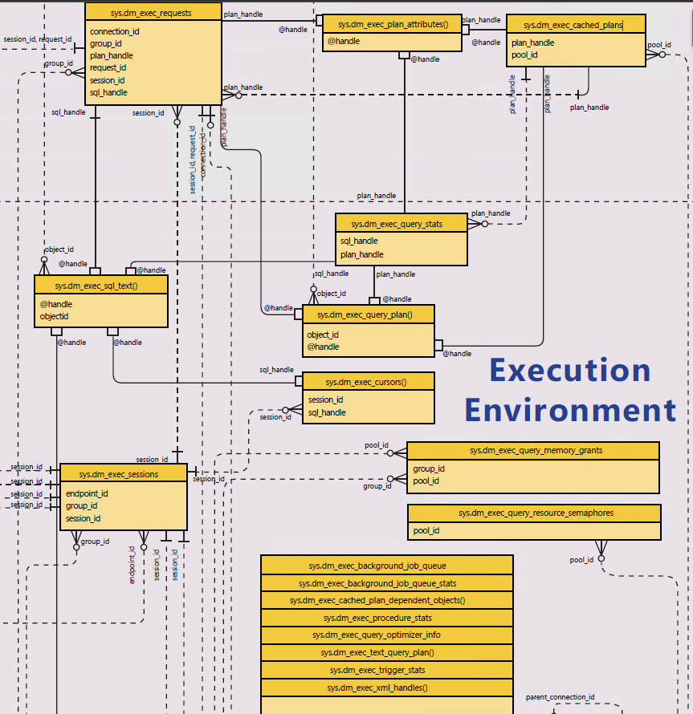

  - **Clearing Plan Cache**

    You can use any of the following commands.

    1. **<r>DBCC FREEPROCCACHE** This command removes all cached plans from memory. To remove a specific plan from cache, all plans with the same sql_handle value, or all plans in a specific resource governor resource pool.

    2. **<r>DBCC FREESYSTEMCACHE** This command clears out all SQL Server memory caches, in addition to the plan caches.

    3. **<r>DBCC FLUSHPROCINDB (<dbid>)** This command allows you to specify a particular database ID, and then clears all plans from that particular database.

- **Caching Mechanisms**

  SQL Server can avoid compilations of previously executed queries by using four mechanisms to make plan caching accessible in a wide set of situations.

  1. Adhoc query
  2. Autoparameterization
  3. Prepared queries, using either **sp_executesql** or the prepare and execute method invoked through your API
  4. Stored procedures or other compiled objects (triggers, TVFs, etc.)

  To determine which mechanism is being used for each plan in cache, you should look at the values in the **cacheobjtype** and **objtype** columns in the **sys.dm_exec_cached_plans** view. 

  * The **cacheobjtype** column can have one of six possible values.
    
    1. Compiled Plan
    
       A fully compiled execution plan for a query or stored procedure. This is what SQL Server executes.

    2. Compiled Plan Stub

       A placeholder (a pointer) for a plan that hasn’t been fully compiled yet. Usually used for Adhoc queries that are deferred or for queries that are yet to be optimized. The stub is initially stored in the cache. When the same query executes again with the same structure, SQL Server may replace the stub with the fully compiled plan.

    3. Parse Tree
       
       The syntax tree representation of a query. 
       A Parse Tree exists when the qeury was PARSED but not fully compiled. SQL parses this query into a tree structure (columns, tables, predicates) before creating an execution plan. Storing the parse tree allows reuse in case the plan needs recompilation.


    4. Extended Proc
      
       Cached plans for extended stored procedures (legacy, DLL-based procedures e.g., xp_cmdshell, xp_logininfo, etc). These are older SQL Server constructs that call external code.
       Extended procs are not compiled plans in the same way as T-SQL batches — they are native DLL entry points that SQL Server caches for reuse.
       
       ```sql
       EXEC xp_fileexist 'C:\Sample\myfile.txt';
       ```

       Here, xp_fileexist is an extended stored procedure that interacts with the OS. Its plan is cached as an Extended Proc.
       

    5. CLR Compiled Func

       Execution plans for CLR (Common Language Runtime) functions, i.e., user-defined functions written in .NET languages (C#, VB.NET).

       ```sql
       CREATE FUNCTION dbo.AddNumbers(@a INT, @b INT)
       RETURNS INT
       AS EXTERNAL NAME MyClrAssembly.[MyNamespace.MyClass].AddNumbers;
       GO

       SELECT dbo.AddNumbers(3, 5);
       ```

       The plan for calling this CLR function is cached as a CLR Compiled Func.

    6. CLR Compiled Proc

       Execution plans for CLR stored procedures, similar to CLR functions but for procedures.
       
       ```sql
       CREATE PROCEDURE dbo.PrintHello
       AS EXTERNAL NAME MyClrAssembly.[MyNamespace.MyClass].PrintHello;
       GO

       EXEC dbo.PrintHello;
       ```

       The plan to execute this CLR procedure is cached as a CLR Compiled Proc.

    This section looks at only **Compiled Plan** and **Compiled Plan Stub**. Notice that the usecount query limits the results to row having one of these two values in the query.

  * The **objtype** column has 11 different possible values:

    1. Proc (stored procedure)
    2. Prepared (prepared statement)
    3. Adhoc (ad hoc query)
    4. ReplProc (replication filter procedure)
    5. Trigger
    6. View
    7. Default (default constraint or default object)
    8. UsrTab (user table)
    9. SysTab (system table)
    10. Check (CHECK constraint)
    11. Rule (rule object)

  - 1. **Ad hoc query caching**

    If the caching metadata indicates a **cacheobjtype** value of **Compiled Plan** and an **objtype** value of **Adhoc**, the plan is considered to be an ad **hoc plan**. When SQL Server caches the plan from an ad hoc query, the cached plan is reused only if a subsequent batch matches exactly.

    ```sql
    /* 1 */
    SELECT * FROM Person.Person WHERE LastName = 'Raheem';
    SELECT * FROM Person.Person WHERE LastName = 'Garcia';
    SELECT * FROM Person.Person WHERE LastName = 'Raheem';

    /* 2 */
    USE AdventureWorks2022
    GO
    DBCC FREEPROCCACHE;
    GO

    SELECT * FROM Person.Person WHERE LastName = 'Raheem';
    GO
    SELECT * FROM Person.Person WHERE LastName = 'Garcia';
    GO
    SELECT * FROM Person.Person WHERE LastName = 'Raheem';
    GO

    SELECT usecounts, cacheobjtype, objtype, [text]
    FROM   sys.dm_exec_cached_plans P
    CROSS APPLY sys.dm_exec_sql_text (plan_handle)
    WHERE cacheobjtype = 'Compiled Plan'
      AND [text] NOT LIKE '%dm_exec_cached_plans%';

    /* 3 */
    USE AdventureWorks2022;

    DBCC FREEPROCCACHE;
    GO

    SELECT * FROM Person.Person WHERE LastName = 'Raheem';
    GO
    -- Try it again
    SELECT * FROM Person.Person WHERE LastName = 'Raheem';
    GO
    SELECT * FROM Person.Person
    WHERE LastName = 'Raheem';
    GO
    SELECT * FROM Person.Person WHERE lastname = 'Raheem';
    GO
    select * from Person.Person where LastName = 'Raheem';
    GO

    SELECT usecounts, cacheobjtype, objtype, [text]
    FROM sys.dm_exec_cached_plans P
    CROSS APPLY sys.dm_exec_sql_text (plan_handle)
    WHERE cacheobjtype = 'Compiled Plan'
    AND [text] NOT LIKE '%dm_exec_cached_plans%';
    ```

    A few special kinds of statements are always considered to be ad hoc.

    A. A statement used with **EXEC**, as in:

    ```sql
    EXEC('SELECT FirstName, LastName, Title FROM Employees WHERE EmployeeID = 6')
    ```

    B. A statement submitted using **sp_executesql**, if no parameters are supplied.

    Queries that you submit via your application with sp_prepare and sp_prepexec aren’t considered to be ad hoc.

    - 1.1 Optimizing for ad hoc workloads

      If most of your queries are ad hoc and never reused, caching their execution plans might seem like a waste of memory.
      you can enable in those cases where you expect most of your queries to be ad hoc. When this option is enabled, SQL Server caches only a stub of the query plan the first time any ad hoc query is compiled, and only after a second compilation is the stub replaced with the full plan.

    - 1.2 Controlling the optimize for ad hoc workloads setting

      Enabling the Optimize for Ad Hoc Workloads option is very straightforward, as shown in the following code:

      ```sql
      EXEC sp_configure 'optimize for ad hoc workloads', 1;
      RECONFIGURE;
      ```

    - 1.3 The compiled plan stub

      The stub that SQL Server caches when Optimize for Ad Hoc Workloads is enabled is only about 300 bytes in size and doesn’t contain any part of a query execution plan.
      The usecounts value in the cache metadata is always 1 for compiled plan stubs because they are never reused.
      When a query or batch that generated a compiled plan stub is recompiled, the stub is replaced with the full compiled plan.

      ```sql
      EXEC sp_configure 'optimize for ad hoc workloads', 1;
      RECONFIGURE;
      GO
      USE AdventureWorks2012;
      DBCC FREEPROCCACHE;
      GO
      SELECT * FROM Person.Person WHERE LastName = 'Raheem';
      GO
      SELECT usecounts, cacheobjtype, objtype, size_in_bytes, [text]
      FROM sys.dm_exec_cached_plans P
      CROSS APPLY sys.dm_exec_sql_text (plan_handle)
      WHERE cacheobjtype LIKE 'Compiled Plan%'
      AND [text] NOT LIKE '%dm_exec_cached_plans%';
      GO
      SELECT * FROM Person.Person WHERE LastName = 'Raheem';
      GO
      SELECT usecounts, cacheobjtype, objtype, size_in_bytes, [text]
      FROM sys.dm_exec_cached_plans P
      CROSS APPLY sys.dm_exec_sql_text (plan_handle)
      WHERE cacheobjtype LIKE 'Compiled Plan%'
      AND [text] NOT LIKE '%dm_exec_cached_plans%';
      GO
      ```

  - 2. **Parametrization**

    - 2.1 Simple parameterization

      For certain queries, SQL Server can decide to treat one or more of the constants as parameters. When this happens, subsequent queries that follow the same basic template can use the same plan. For example, these two queries that run in the AdventureWorks2022 database can use the same plan:

      ```sql
      USE AdventureWorks2022
      GO
      DBCC FREEPROCCACHE;
      GO
      SELECT FirstName, LastName, Title FROM Person.Person WHERE BusinessEntityID = 6;
      GO
      SELECT FirstName, LastName, Title FROM Person.Person WHERE BusinessEntityID = 2;
      GO
      SELECT usecounts, cacheobjtype, objtype, size_in_bytes, [text]
      FROM sys.dm_exec_cached_plans P
      CROSS APPLY sys.dm_exec_sql_text (plan_handle)
      WHERE cacheobjtype = 'Compiled Plan'
      AND [text] NOT LIKE '%dm_exec_cached_plans%';
      GO
      ```

      

      > [!WARNING]
      > On SQL 2022 the result is different.

      > [!NOTE]  
      > Don’t confuse a shell query with a plan stub. A shell query contains the complete text of the query and uses about 16 KB of memory. 
      > Shell queries are created only for those plans that SQL Server thinks are parameterizable. A plan stub, as mentioned previously, uses 
      > about only 300 bytes of memory and is created only for unparameterizable, ad hoc queries, and only when the Optimize for Ad Hoc 
      > Workloads option is set to 1.

      By default, SQL Server is very conservative about deciding when to parameterize automatically. SQL Server automatically parameterizes queries only if the query template is considered to be safe. A template is safe if the plan selected doesn’t change, even if the actual parameter values change.

      - Drawbacks of simple parameterization

        SQL Server makes its own decision as to the data type of the parameter. Looking at the Person.Person table, SQL Server chose to assume a parameter of type tinyint. If you rerun the batch and use a value that doesn’t fit into the tinyint range SQL Server can’t use the same autoparameterized query.

        ```sql
        USE AdventureWorks2022
        GO
        DBCC FREEPROCCACHE;
        GO
        SELECT FirstName, LastName, Title FROM Person.Person WHERE BusinessEntityID = 6;
        GO
        SELECT FirstName, LastName, Title FROM Person.Person WHERE BusinessEntityID = 622;
        GO

        SELECT usecounts, cacheobjtype, objtype, [text]
        FROM sys.dm_exec_cached_plans P
        CROSS APPLY sys.dm_exec_sql_text (plan_handle)
        WHERE cacheobjtype = 'Compiled Plan'
        AND [text] NOT LIKE '%dm_exec_cached_plans%';
        GO
        ```

        **The only way to force SQL Server to use the same data type for both queries is to enable PARAMETERIZATION FORCED for the database**

        ```sql
        USE AdventureWorks2022;
        GO

        ALTER DATABASE AdventureWorks2012 SET PARAMETERIZATION FORCED;
        GO

        SET STATISTICS IO ON;
        GO
        
        DBCC FREEPROCCACHE;
        GO
        
        SELECT * FROM Person.Person WHERE PersonType = 'EM';
        GO
        SELECT * FROM Person.Person WHERE PersonType = 'IN';
        GO
        
        SELECT usecounts, cacheobjtype, objtype, [text]
        FROM sys.dm_exec_cached_plans P
        CROSS APPLY sys.dm_exec_sql_text (plan_handle)
        WHERE cacheobjtype = 'Compiled Plan'
        AND [text] NOT LIKE '%dm_exec_cached_plans%';
        GO
        
        ALTER DATABASE AdventureWorks2022 SET PARAMETERIZATION SIMPLE;
        GO
        ```

        When you run this code, you see that the first SELECT required 847 logical reads and the second required 56,642.
        In this example, forcing SQL Server to treat the constant as a parameter isn’t a good thing.
        So what can you do if you have many queries that shouldn’t be parameterized and many others that should be?

        The SQL Server Performance Monitor includes an object called SQLServer:SQL Statistics that has several counters dealing with automatic parameterization. You can monitor these counters to determine whether many unsafe or failed automatic parameterization attempts have been made. If these numbers are high, you can inspect your applications for situations in which the application developers can take responsibility for explicitly marking the parameters.


    - 2.2 Forced parametrization

      If your application uses many similar queries that you know could benefit from the same plan but aren’t autoparameterized, either because SQL Server doesn’t consider the plans safe or because they use one of the disallowed constructs, SQL Server provides an alternative. A database option called **PARAMETERIZATION FORCED** can be enabled with the following command:

      ```sql
      ALTER DATABASE <database_name> SET PARAMETERIZATION FORCED;
      ```

      Be careful when setting this option on for the entire database because assuming that all constants should be treated as parameters during optimization and then reusing existing plans frequently can lead to very poor performance.

  - 3. **Prepared queries**

    One construct is the SQL Server stored procedure sp_executesql, which is called from within a T-SQL batch; the other is to use the prepare-and-execute method from the client application.

    - 3.1 The sp_executesql procedure

      The stored procedure sp_executesql is halfway between ad hoc caching and stored procedures.

      Here’s the general syntax for the procedure:

      ```sql
      EXEC sp_executesql @batch_text, @batch_parameter_definitions, param1,...paramN
      ```

      Repeated calls with the same values for @batch_text and @batch_parameter_definitions use the same cached plan, with the new parameter values specified. The plan is reused as long as the plan hasn’t been removed from cache and is still valid.
      The same cached plan can be used for all the following queries:

      ```sql
      EXEC sp_executesql N'SELECT FirstName, LastName, Title FROM Person.Person WHERE BusinessEntityID = @p', N'@p int', 6;
      EXEC sp_executesql N'SELECT FirstName, LastName, Title FROM Person.Person WHERE BusinessEntityID = @p', N'@p int', 2;
      EXEC sp_executesql N'SELECT FirstName, LastName, Title FROM Person.Person WHERE BusinessEntityID = @p', N'@p int', 6;
      ```

    - 3.2 The prepare and execute method
      Nothing

    - 3.3 Caching prepared queries
      Nothing
  
  - 4. **Compiled objects**

    When looking at the metadata in sys.dm_exec_cached_plans, we’ve seen compiled plans with objtype values of Adhoc and Prepared. The third objtype value is Proc, which you will see used when executing stored procedures, user-defined scalar functions, and multistatement table-valued functions (TVFs).

    - 4.1 Store Procedures

      Stored procedures and user-defined scalar functions are treated almost identically. The metadata indicates that a compiled plan with an objtype value of Proc is cached and can be reused repeatedly.

      To force recompilation for a single execution, you can use the EXECUTE...WITH RECOMPILE option.

      ```sql
      USE AdventureWorks2022;
      GO
      CREATE PROCEDURE P_Type_Customers @custtype nchar(2)
      AS
        SELECT BusinessEntityID, Title, FirstName, Lastname
        FROM Person.Person
        WHERE PersonType = @custtype;
      GO
      DBCC FREEPROCCACHE;
      GO
      SET STATISTICS IO ON;
      GO
      EXEC P_Type_Customers 'EM';
      GO
      EXEC P_Type_Customers 'IN';
      GO
      EXEC P_Type_Customers 'IN' WITH RECOMPILE;
      ```

    - 4.2 fUNCTIONS

      ```sql
      USE AdventureWorks2022;
      GO
      CREATE FUNCTION dbo.fnMaskIDNum (@ID char(9))
      RETURNS char(11)
      AS
      BEGIN
      SELECT @ID = 'xxx-xx-' + right (@ssn,4);
      RETURN @ID;
      END;
      GO
      DBCC FREEPROCCACHE;
      GO
      DECLARE @mask char(11);
      EXEC @mask = dbo. fnMaskIDNum '123456789';
      SELECT @mask;
      GO
      DECLARE @mask char(11);
      EXEC @mask = dbo. fnMaskIDNum '123661111';
      SELECT @mask;
      GO
      DECLARE @mask char(11);
      EXEC @mask = dbo. fnMaskIDNum '123661111' WITH RECOMPILE;
      SELECT @mask;
      GO
      ```

      If a scalar function is used within an expression, as in Listing 12-3, you can’t request recompilation:

      ```sql
      SELECT dbo. fnMaskIDNum (NationalIDNumber), LoginID, JobTitle
      FROM HumanResources.Employee;
      ```

      User-defined TVFs might or might not be treated like procedures, depending on how you define them. You can define a TVF as an inline function or as a multistatement function. However, neither method allows you to force recompilation when the function is called. Here are two functions that do the same thing:

      ```sql
      USE AdventureWorks2022;
      GO
      CREATE FUNCTION Fnc_Inline_Customers (@custID int)
      RETURNS TABLE
      AS
      RETURN
        (SELECT FirstName, LastName, Title FROM Person.Person WHERE BusinessEntityID = @custID);
      GO
      CREATE FUNCTION Fnc_Multi_Customers (@custID int)
      RETURNS @T TABLE (FirstName nvarchar(100), LastName varchar(100), Title nvarchar(16))
      AS
      BEGIN
        INSERT INTO @T
        SELECT FirstName, LastName, Title
        FROM Person.Person
        WHERE BusinessEntityID = @custID;
      RETURN
      END;
      GO
      ```

      Here are the calls to the functions:

      ```sql
      DBCC FREEPROCCACHE
      GO
      SELECT * FROM Fnc_Multi_Customers(6);
      GO
      SELECT * FROM Fnc_Inline_Customers(6);
      GO
      SELECT * FROM Fnc_Multi_Customers(2);
      GO
      SELECT * FROM Fnc_Inline_Customers(2);
      GO
      ```

      If you run the usecounts query, notice that only the multistatement function has its plan reused. The inline function is actually treated like a view, and the only way the plan can be reused would be if the exact same query were reexecuted.

- **Causes of recompilation**

  The reasons for these unexpected recompilations fall into one of two different categories: **correctness-based recompiles and optimality-based recompiles.**

  - **1. Correctness-based recompiles**

    SQL Server might choose to recompile a plan if it has reason to suspect that the existing plan might no longer be correct. This can happen when explicit changes are made to the underlying objects, such as changing a data type or dropping an index.

    Correctness-based recompiles fall into two general categories: schema changes and environmental changes. The following changes mark an object’s schema as changed:
    
      - Adding or dropping columns to or from a table or view
      - Adding or dropping constraints, defaults, or rules to or from a table
      - Adding an index to a table or an indexed view
      - Dropping an index defined on a table or an indexed view if the index is used by the plan
      - Dropping a statistic defined on a table that causes a correctness-related recompilation of any query plans that use that table
      - Adding or dropping a trigger from a table

    Also, running the procedure sp_recompile on a table or view changes the modification date for the object, which you can observe in the modify_date column in sys.objects.

    Other correctness-based recompiles are invoked when the environment changes by changing one of a list of SET options.

    The following is an example of retrieving all the plan attributes when you supply a plan_handle value:

    ```sql
    SELECT * FROM sys.dm_exec_plan_attributes (0x06001200CF0B831CB821AA05000000000000000000000000)
    ```

    To get the attributes to be returned in a row along with each plan_handle, you can use the PIVOT operator and list each attribute that you want to turn into a column. The next query retrieves the set_options, the object_id, and the sql_handle from the list of attributes:

    ```sql
    SELECT plan_handle, pvt.set_options, pvt.object_id, pvt.sql_handle
    FROM (SELECT plan_handle, epa.attribute, epa.value 
          FROM sys.dm_exec_cached_plans
          OUTER APPLY sys.dm_exec_plan_attributes(plan_handle) AS epa
          WHERE cacheobjtype = 'Compiled Plan' ) AS ecpa
   
          PIVOT (MAX(ecpa.value) FOR ecpa.attribute
          IN ("set_options", "object_id", "sql_handle")) AS pvt;
    ```

    The only objects for which recompilation is avoided is for cached plans with an objtype value of Proc—namely, stored procedures and multistatement TVFs. For these compiled objects, the usecounts query shows you the same plan being reused but doesn’t show additional plans with different set_options values.

  - **2. Optimality-based recompiles**

    SQL Server might also recompile a plan if it has reason to suspect that the existing plan is no longer optimal. The primary reasons for suspecting a non-optimal plan deal with changes to the underlying data. If any of the statistics used to generate the query plan have been updated since the plan was created, or if any of the statistics are considered stale, SQL Server recompiles the query plan.
    
    - **2.1 Updated statistics** Statistics can be updated either manually or automatically.
    - **2.2 Stale statistics** SQL Server detects out-of-date statistics when it first compiles a batch that has no plan in cache. It also detects stale statistics for existing plans. Figure 12-2 shows a flowchart of the steps involved in finding an existing plan and checking to see whether recompilation is required.

    

    Statistics are considered to be stale if a sufficient number of modifications have occurred on the column supporting the statistics. Each table has a recompilation threshold (RT) that determines how many changes can take place before any statistics on that table are marked as stale.
    The exact algorithms for determinning the RT.
    N indicates the cardinality of the table.

    - For both permanent and temporary tables, if N is less or equal to 500, the RT value is 500. This means that for a relatively small table, you must make at least 500 changes to trigger recompilation. For larger tables, at least 500 changes must be made, plus 20 percent of the number of rows.
    - For temporary tables, the algorithm is the same, with one exception. If the table is very small or empty (N is less than 6 before any data modification operations), you need only six changes to trigger a recompile. A procedure that creates a temporary table (which is empty when created) and then inserts six or more rows into that table must be recompiled as soon as the temporary table is accessed.

    You can get around this frequent recompilation of batches that create temporary tables by using the KEEP PLAN query hint. Use of this hint changes the recompilation thresholds for temporary tables and makes them identical to those for permanent tables. So if changes to temporary tables are causing many recompilations, and you suspect that the recompilations are affecting overall system performance, you can use this hint to see whether performance has improved. The hint can be specified as shown in this query:

    ```sql
    SELECT <column list>
    FROM dbo.PermTable A INNER JOIN #TempTable B ON A.col1 = B.col2
    WHERE <filter conditions>
    OPTION (KEEP PLAN)
    ```

    - **Table variables have no RT value.**

    - **Modification counters**
      Nothing
    
    - **Skipping the recompilation step**

      In several situations, SQL Server bypasses recompiling a statement for plan optimality reasons, such as the following.

      - When the plan is a trivial plan
      - If the query contains the OPTION hint KEEPFIXED PLAN
      - If automatic updates of statistics for indexes and statistics defined on a table or indexed view are disabled
      - If all the tables referenced in the query are read-only
    
    - **Multiple recompilations**

      Each batch or stored procedure can contain multiple query plans, one for each statement that can be optimized. Before SQL Server begins executing any of the individual query plans, it checks for correctness and optimality of that plan. If one of the checks fails, the corresponding statement is compiled again, and a possibly different query plan is produced. One reason this can happen is by mixing Data Definition Language (DDL) and Data Manipulation (DML) statements within your batch.

      In some cases, query plans can be recompiled even if the plan for the batch wasn’t cached. For example, a batch that contains a literal larger than 8 KB is never cached. However, if this batch creates a temporary table and then inserts multiple rows into that table, the insertion of the seventh row causes a recompilation because the recompilation threshold has been passed for temporary tables. Because of the large literal, the batch wasn’t cached, but the currently executing plan needs to be recompiled.
    
    - **Removing plans from cache**

      Plans are removed from cache based on memory pressure. However, other operations can cause plans to be removed from cache.
      The following operations flush the entire plan cache so that all batches submitted afterward will need a fresh plan.

      * Upgrading any database to SQL Server 2012
      * Running the DBCC FREEPROCCACHE or DBCC FREESYSTEMCACHE commands
      * Changing any of the following configuration options:

        * cross db ownership chaining
        * index create memory
        * cost threshold for parallelism
        * max degree of parallelism
        * max text repl size
        * min memory per query
        * min server memory
        * max server memory
        * query governor cost limit
        * query wait
        * remote query timeout
        * user options
      
      The following operations clear all plans associated with a particular database:
      
      * Running the DBCC FLUSHPROCINDB command
      * Detaching a database
      * Closing or opening an auto-close database
      * Modifying a collation for a database using the ALTER DATABASE...COLLATE command
      * Altering a database with any of the following commands:

        * ALTER DATABASE...MODIFY_NAME
        * ALTER DATABASE...MODIFY FILEGROUP
        * ALTER DATABASE...SET ONLINE
        * ALTER DATABASE...SET OFFLINE
        * ALTER DATABASE...SET EMERGENCY
        * ALTER DATABASE...SET READ_ONLY
        * ALTER DATABASE...SET READ_WRITE
        * ALTER DATABASE...COLLATE

    - **Dropping a database**

      **DBCC FREEPROCCACHE [ ( { plan_handle | sql_handle | pool_name } ) ] [ WITH NO_INFOMSGS ]**

      This command now allows you to specify one of three parameters to indicate which plan or plans you want to remove from cache:

      - **plan_handle**
      - **sql_handle**

      ```sql
      USE AdventureWorks2022;
      GO
      DBCC FREEPROCCACHE;
      GO
      SET ANSI_NULLS ON
      GO
      SELECT * FROM Person.Person WHERE PersonType = 'EM';
      GO
      SELECT * FROM Person.Person WHERE PersonType = 'SC';
      GO
      SET ANSI_NULLS OFF
      GO
      SELECT * FROM Person.Person WHERE PersonType = 'EM';
      GO

      SET ANSI_NULLS ON
      GO
      -- Now examine the sys.dm_exec_query_stats view and notice two different rows for the
      -- query searching for 'EM'
      SELECT execution_count, text, sql_handle, query_plan
      FROM sys.dm_exec_query_stats
      CROSS APPLY sys.dm_exec_sql_text(sql_handle) AS TXT
      CROSS APPLY sys.dm_exec_query_plan(plan_handle)AS PLN;
      
      -- The two rows containing 'EM' should have the same value for sql_handle;
      -- Copy that sql_handle value and paste into the command below:
      DBCC FREEPROCCACHE(0x02000000CECDF507D9D4D70720F581172A42506136AA80BA);
      GO
      
      -- If you examine sys.dm_exec_query_stats again, you see the rows for this query
      -- have been removed
      SELECT execution_count, text, sql_handle, query_plan
      FROM sys.dm_exec_query_stats
      CROSS APPLY sys.dm_exec_sql_text(sql_handle) AS TXT
      CROSS APPLY sys.dm_exec_query_plan(plan_handle)AS PLN;
      GO
      ```

- **Plan cache internals**

  - **Cache stores**

    The plan cache in SQL Server is made up of four separate memory areas, called cache stores.
    The names in parentheses are the values shown in the type column of sys.dm_os_memory_cache_counters.

    * **Object Plans (CACHESTORE_OBJCP)** Object Plans include plans for stored procedures, functions, and triggers.
    * **SQL Plans (CACHESTORE_SQLCP)** SQL Plans include the plans for ad hoc cached plans, autoparameterized plans, and prepared plans. 
    * **Bound Trees (CACHESTORE_PHDR)** Bound Trees are the structures produced by the algebrizer in SQL Server for views, constraints, and defaults.
    * **Extended Stored Procedures (CACHESTORE_XPROC)** Extended procs (Xprocs) are predefined system procedures, like sp_executesql and sp_tracecreate,

    Each plan cache store contains a hash table to keep track of all the plans in that particular store. Each bucket in the hash table contains zero, one, or more cached plans. The DMV sys.dm_os_memory_cache_hash_tables contains information about each hash table, including its size. You can query this view to retrieve the number of buckets for each of the plan cache stores by using the following query:

    ```sql
    SELECT type as 'plan cache store', buckets_count
    FROM sys.dm_os_memory_cache_hash_tables
    WHERE type IN ('CACHESTORE_OBJCP', 'CACHESTORE_SQLCP', 'CACHESTORE_PHDR', 'CACHESTORE_XPROC');
    ```

    The following query returns the size of all the cache stores holding plans, plus the size of the SQL Manager, which stores the T-SQL text of all the ad hoc and prepared queries:

    ```sql
    SELECT type AS Store, SUM(pages_in_bytes/1024.) AS KB_used
    FROM sys.dm_os_memory_objects
    WHERE type IN ('MEMOBJ_CACHESTOREOBJCP', 'MEMOBJ_CACHESTORESQLCP', 'MEMOBJ_CACHESTOREXPROC', 'MEMOBJ_SQLMGR')
    GROUP BY type;    
    ```

    - **Compiled Plans**

      The Object and SQL plan cache stores have two main types of plans: compiled plans and executable plans. You’ve already seen the three main objtype values that can correspond to a compiled plan: Adhoc, Prepared, and Proc. The compiled plans are considered valuable memory objects because they can be costly to re-create. SQL Server attempts to keep them in cache. When SQL Server experiences heavy memory pressure, the policies used to remove cache objects ensure that the compiled plans aren’t the first objects to be removed.
      A compiled plan is generated for an entire batch, not just for a single statement. For a multistatement batch, you can think of a compiled plan as an array of plans, with each element of the array containing a query plan for an individual statement.

    - **Execution contexts**

      Executable plans are runtime objects created when a compiled plan is executed. Each executable plan exists in the same cache store as the compiled plan on which it depends. Executable plans contain the particular runtime information for one execution of a compiled plan and include the actual runtime parameters, any local variable information, object IDs for objects created at runtime, the user ID, and information about the currently executing statement in the batch.
      When SQL Server starts executing a compiled plan, it generates an executable plan from that compiled plan. Each individual statement in a compiled plan gets its own executable plan,

  - **Plan cache metadata**

    - Handles

      The sys.dm_exec_cached_plans view contains a value called a plan_handle for every compiled plan.
      Is a hash value of the entire batch, and it-s guaranteed to be unique. The plan_handle remains the same even if individual statements in the batch are recompiled.

      The actual SQL Text of the batch or object is stored in another cache called the SQL Manager Cache (SQLMGR). You can retrieve the T-SQL Text cached in the SQLMGR cache by using a data value called the sql_handle. The sql_handle contains a hash of the entire batch text, and because it’s unique for every batch, the sql_handle can serve as an identifier for the batch text in the SQLMGR cache.

      Any specific T-SQL batch always has the same sql_handle, but it might not always have the same plan_handle. The relationship between sql_handle and plan_handle, therefore, is 1:N.

      Here is the same query that was discussed earlier to return attribute information and pivot it so that three of the attributes are returned in the same row as the plan_handle value:

      ```sql
      SELECT plan_handle, pvt.set_options, pvt.object_id, pvt.sql_handle
      FROM (SELECT plan_handle, epa.attribute, epa.value
            FROM sys.dm_exec_cached_plans
            OUTER APPLY sys.dm_exec_plan_attributes(plan_handle) AS epa
            WHERE cacheobjtype = 'Compiled Plan'
           ) AS ecpa
      
          PIVOT (MAX(ecpa.value) FOR ecpa.attribute
          IN ("set_options", "object_id", "sql_handle")) AS pvt;
      ```

      - 1. sys.dm_exec_query_plan

        This function can take either a sql_handle or a plan_handle as a parameter, and it returns the SQL Text that corresponds to the handle.
        The text column in the function's output contains the entire SQL batch text for ad hoc, prepared, and autoparameterized queries; for objects such as triggers, procedures, and functions, it gives the full object definition.

      - 2. sys.dm_exec_text_query_plan

        This table-valued function takes a plan_handle as a parameter and returns the associated query plan in XML format.

      - 3. sys.dm_exec_text_query_plan

        This table-valued function takes a plan_handle as a parameter and returns the same basic information as sys.dm_exec_query_plan. The differences between the two functions are as follows.

        * sys.dm_exec_text_query_plan can take optional input parameters to specify the start and end offset of statements with a batch.
        * The output of sys.dm_exec_text_query_plan returns the plan as text data, instead of XML data.

      - 4. sys.dm_exec_cached_plans

        This view is the one used most often for troubleshooting query plan recompilation issues.

        * **size_in_bytes** The number of bytes consumed by this cache object.
        * **cacheobjtype** The type of the cache object—that is, if it’s a Compiled Plan, a Parse Tree, or an Extended Proc.
        * **memory_object_address**

      - 5. sys.dm_exec_cached_plan_dependent_objects

        ```sql
        SELECT text, plan_handle, d.usecounts, d.cacheobjtype
        FROM sys.dm_exec_cached_plans
        CROSS APPLY sys.dm_exec_sql_text(plan_handle)
        CROSS APPLY sys.dm_exec_cached_plan_dependent_objects(plan_handle) d;
        ```

      - 6. sys.dm_exec_requests
        
        This view returns one row for every currently executing request within your SQL Server instance. you can use this view to help identify long-running queries.

        Keep in mind that the sql_handle points to the T-SQL for the entire batch. However, the sys.dm_exec_requests view contains the statement_start_offset and statement_end_offset columns, which indicate the position within the entire batch where the currently executing statement can be found.

        ```sql
        SELECT TOP 10 
          SUBSTRING(text, (statement_start_offset/2) + 1, ((CASE statement_end_offset WHEN -1 THEN DATALENGTH(text) ELSE statement_end_offset END - statement_start_offset)/2) + 1) AS query_text, *
        FROM sys.dm_exec_requests
        CROSS APPLY sys.dm_exec_sql_text(sql_handle)
        ORDER BY total_elapsed_time DESC;
        ```

      - 7. sys.dm_exec_query_stats

        For optimum troubleshooting, you can use sys.dm_exec_query_stats to return performance information for individual queries within a batch. The following query returns the top 10 queries by total CPU time, to help you identify the most expensive queries on your SQL Server instance:

        ```sql
        SELECT TOP 10 
          SUBSTRING(text, (statement_start_offset/2) + 1, ((CASE statement_end_offset WHEN -1 THEN DATALENGTH(text) ELSE statement_end_offset END - statement_start_offset)/2) + 1) AS query_text, *
        FROM sys.dm_exec_query_stats
        CROSS APPLY sys.dm_exec_sql_text(sql_handle)
        CROSS APPLY sys.dm_exec_query_plan(plan_handle)
        ORDER BY total_elapsed_time/execution_count DESC;
        ```

        This view has one row per query statement within a batch.
        This view contains two columns added in SQL Server 2008, which can help you identify similar queries with different plans.
        
        * **query_hash** This value is a hash of the query text and can be used to identify similar queries with the plan cache.
        * query_plan_hash This value is a hash of the query execution plan and can be used to identify similar plans based on logical and physical operators and a subset of the operator attributes. **To look for cases where you might not want to implement forced parameterization, you can search for queries that have similar query_hash values but different query_plan_hash values.**

      - 8. sys.dm_exec_procedure_stats
      
        This view returns one row for each cached stored procedure plan containing aggregate performance information for each procedure.

    - Cache size management

      This section looks at how SQL Server manages the size of plan cache and how it determines which plans to remove if no room is left in cache. Earlier, you saw a few situations in which plans would be removed from cache. These situations included global operations such as running DBCC FREEPROCCACHE to ALTER PROCEDURE.
    
      In most other situations, plans are removed from cache only when memory pressure is detected. The algorithm that SQL Server uses to determine when and how plans should be removed from cache is called the eviction policy. Each cache store can have its own eviction policy, but this section covers only the policies for the Object Plan store and the SQL Plan store.
      
      Determining which plans to evict is based on the plan’s cost, as discussed in the next section. When eviction starts is based on memory pressure. When SQL Server detects memory pressure, zero-cost plans are removed from cache, and the cost of all other plans is reduced by half.

      With memory pressure comes the term visible memory. Visible memory is the directly addressable physical memory available to the SQL Server memory manager. On a 64-bit SQL Server instance, visible memory has no special meaning because all memory is directly addressable.

      The term target memory refers to the maximum amount of memory that can be committed to the SQL Server process. You can see a value for visible memory, specified in kilobytes, in the visible_target_kb column in the sys.dm_os_sys_info DMV. This view also contains values for committed_kb and committed_targe_kb.

      SQL Server defines a cache store pressure limit value, which varies depending on the version you’re running and the amount of visible target memory.

      

      On a 64-bit SQL Server 2012 RTM instance with 28 GB of target memory, the plan cache pressure limit would be 75 percent of 4 GB plus 10 percent of the target memory over 4 GB (or 10 percent of 24 GB), which is 3 GB + 2.4 GB, or 5.4 GB.

    - Local memory pressure

      For example, in the situation described just a few paragraphs earlier, the plan cache pressure limit was computed to be 5.4 GB. If any cache store exceeds 62.5 percent of that value, or 3.375 GB, internal memory pressure is triggered.

      SQL Server also indicates memory pressure when the number of plans in a store exceeds four times the hash table size for that store. That means memory pressure can be triggered when either the SQL Store or the Object Store has more than 40,000 or 160,000 entries. The first query shown here is one you saw earlier, and it can be used to determine the number of buckets in the hash tables for the Object Store and the SQL Store, and the second query returns the number of entries in each of those stores:

      ```sql
      SELECT type as 'plan cache store', buckets_count
      FROM sys.dm_os_memory_cache_hash_tables
      WHERE type IN ('CACHESTORE_OBJCP', 'CACHESTORE_SQLCP');
      GO
      SELECT type, count(*) total_entries
      FROM sys.dm_os_memory_cache_entries
      WHERE type IN ('CACHESTORE_SQLCP', 'CACHESTORE_OBJCP')
      GROUP BY
      ```

      In SQL Server 2008 or later, with Optimize for Ad Hoc Workloads enabled, the actual size of the SQL cache store can be quite small (each Compiled Plan Stub is about 300 bytes) so the number of entries can grow to exceed the limit before the size of the store gets too large. If Optimize for Ad Hoc Workloads isn’t on, the size of the entries in cache is much larger, with a minimum size of 24 KB for each plan. To see the size of all the plans in a cache store, you need to examine sys.dm_exec_cached_plans:

      ```sql
      SELECT objtype, count(*) AS 'number of plans', SUM(size_in_bytes)/(1024.0 * 1024.0 * 1024.0) AS size_in_gb_single_use_plans
      FROM sys.dm_exec_cached_plans
      GROUP BY objtype;
      ```

      Remember that the ad hoc and prepared plans are both stored in the SQL cache store, so to monitor the size of that store, you have to add those two values together.

    - Global memory pressure
      Nothing
    
    - Costing of cache entries

      The decision of what plans to evict from cache is based on their cost. For ad hoc plans, the cost is considered to be zero, but it’s increased by 1 every time the plan is reused. For other types of plans, the cost is a measure of the resources required to produce the plan.

      For non–ad hoc queries, the cost is measured in units called ticks, with a maximum of 31. The cost is based on three factors: I/O, context switches, and memory. Each has its own maximum within the 31-tick total:

      * I/O Each I/O costs 1 tick, with a maximum of 19.
      * Compilation-related context switches Each switch costs 1 tick each, with a maximum of 8.
      * Compile memory

      The sys.dm_os_memory_cache_entries DMV can show you the current and original cost of any cache entry, as well as the components that make up that cost:

      ```sql
      SELECT text, objtype, refcounts, usecounts, size_in_bytes, disk_ios_count, context_switches_count, pages_kb as MemoryKB, original_cost, current_cost
      FROM sys.dm_exec_cached_plans p
      CROSS APPLY sys.dm_exec_sql_text(plan_handle)
      JOIN sys.dm_os_memory_cache_entries e
      ON   p.memory_object_address = e.memory_object_address
      WHERE cacheobjtype = 'Compiled Plan'
      AND type in ('CACHESTORE_SQLCP', 'CACHESTORE_OBJCP')
      ORDER BY objtype desc, usecounts DESC;
      ```

- **Objects in plan cache: The big picture**

  ```sql
  USE master
  GO
  CREATE VIEW sp_cacheobjects
  AS
  SELECT
    pvt.bucketid, CONVERT(nvarchar(18), pvt.cacheobjtype) AS cacheobjtype, pvt.objtype, CONVERT(int, pvt.objectid) AS objid, CONVERT(smallint, pvt.dbid) AS dbid,
    CONVERT(smallint, pvt.dbid_execute) AS dbidexec, CONVERT(smallint, pvt.user_id) AS uid, pvt.refcounts, pvt.usecounts, pvt.size_in_bytes / 8192 AS pagesused,
    CONVERT(int, pvt.set_options) AS setopts, CONVERT(smallint, pvt.language_id) AS langid, CONVERT(smallint, pvt.date_format) AS dateformat,
    CONVERT(int, pvt.status) AS status, CONVERT(bigint, 0) as lasttime, CONVERT(bigint, 0) as maxexectime, CONVERT(bigint, 0) as avgexectime, 
    CONVERT(bigint, 0) as lastreads, CONVERT(bigint, 0) as lastwrites, CONVERT(int, LEN(CONVERT(nvarchar(max), fgs.text)) * 2) as sqlbytes,
    CONVERT(nvarchar(3900), fgs.text) as sql
  FROM (
        SELECT ecp.*, epa.attribute, epa.value
        FROM sys.dm_exec_cached_plans ecp
        OUTER APPLY sys.dm_exec_plan_attributes(ecp.plan_handle) epa
       ) AS ecpa
  PIVOT(
        MAX(ecpa.value) for ecpa.attribute IN ("set_options", "objectid", "dbid", "dbid_execute", "user_id", "language_id", "date_format", "status")
       ) AS pvt
  OUTER APPLY sys.dm_exec_sql_text(pvt.plan_handle) fgs;
  ```

  - **Multiple plans in cache**

    SQL Server tries to limit the number of plans for a query or a procedure. Because plans are reentrant, this is easy to accomplish. You should be aware of some situations that cause multiple query plans for the same procedure to be saved in cache. The most likely situation is a difference in certain SET options.

    Because using the unqualified object name can lead to possible ambiguity, the query processor doesn’t assume that an existing plan can be reused. However, the situation is different if sue issues this command:

    ```sql
    SELECT * FROM dbo.Sales;
    ```
  
  - **When to use stored procedures and other caching mechanisms**

    Keep the following guidelines in mind when you are deciding whether to use stored procedures or one of the other query mechanisms.

    * Stored procedures These objects should be used when multiple connections are executing batches in which the parameters are known.
    * Ad hoc caching
    * Simple or forced parameterization This option can be useful for applications that can’t be easily modified.
    * The sp_executesql procedure This procedure can be useful when the same batch might be used multiple times and when the parameters are known.
    * The prepare and execute methods These methods are useful when multiple users are executing batches in which the parameters are known, or when a single user will definitely use the same batch multiple times.

  - **Troubleshooting plan cache issues**

    To start addressing problems with plan cache usage and management, you must determine that existing problems are actually caused by plan-caching issues.

    - Wait statistics indicatinf plan cache problems

      To determine that plan-caching behavior is causing problems, one of the first things to look at is your wait statistics in SQL Server.

      http://blogs.msdn.com/b/psssql/archive/2009/11/03/the-sql-server-wait-type-repository.aspx

      If these resources are near the top of the list returned from the previous query, you should investigate your plan cache usage.
      
      * **CMEMTHREAD** waits This wait type indicates contention on the memory object from which cache descriptors are allocated.
      * **SOS_RESERVEDMEMBLOCKLIST** waits This wait type can indicate the presence of cached plans for queries with a large number of parameters or with a large number of values specified in an IN clause.
      * **RESOURCE_SEMAPHORE_QUERY_COMPILE** waits This wait type indicates a large number of concurrent compilations. If you notice a high value for RESOURCE_SEMAPHORE_QUERY_COMPILE waits, you can examine the entries in the plan cache through the sys.dm_exec_cached_plans view:

      ```sql
      SELECT usecounts, cacheobjtype, objtype, bucketid, text
      FROM sys.dm_exec_cached_plans
      CROSS APPLY sys.dm_exec_sql_text(plan_handle)
      WHERE cacheobjtype
      ```
    
    - Other caching issues

      In addition to looking at the wait types that can indicate problems with caching, some other coding behaviors can negatively affect plan reuse.

      * **Verify parameter types, both for prepared queries and autoparameterization**
      * **Monitor plan cache size and data cache size** In general, as more queries are run, the amount of memory used for data-page caching should increase along with the amount of memory used for plan caching. One of the easiest places to get a comparison of the pages used for plan caching and the pages used for data caching is the performance counters. Look at the following counters: SQL Server: Plan Cache/Cache Pages(_Total) and SQLServer: BufferManager/Database pages.
    
    - Handling problem with compilation and recompilation

      Recompiling is performed when an existing module or statement is determined to be no longer valid or no longer optimal. All recompiles are considered compiles, but not vice versa. For example, when no plan is in cache, or when a plan is executing a procedure using the WITH RECOMPILE option or executing a procedure that was created with the WITH RECOMPILE option, SQL Server considers it a compile but not a recompile. If these tools indicate that you have excessive compilation or recompilation, you can consider the following actions.
      
      * If the recompile is caused by a change in a SET option.
      * Recompilation thresholds for temporary tables are lower than for regular tables. You can consider changing the temporary tables to table variables, for which statistics aren’t maintained. Because no statistics are maintained, changes in statistics can’t induce recompilation. Another alternative is to use the KEEP PLAN query hint, which sets the recompile threshold for temporary tables to be the same as for permanent tables.
      * To avoid all recompilations that are caused by changes in statistics, whether on a permanent or a temporary table, you can specify the KEEPFIXED PLAN query hint.
      * Another way to prevent recompiles caused by statistics changes is by turning off the automatic updates of statistics for indexes and columns, isn't a good idea. This method should be considered only as a last resort after exhausting all other options.
      * All T-SQL code should use two-part object names (for example, Inventory.ProductList) to indicate exactly what object is being referenced, which can help avoid recompilation.
      * Don’t use DDL within conditional constructs such as IF statements.

- **Optimization hints and plan guides**

  One way to encourage plan reuse that has already been discussed in this chapter is to enable the PARAMETERIZATION FORCED database option.
  This section specifically describes only those hints that affect recompilation, as well as the mother of all hints, USE PLAN. Finally, this section covers a SQL Server feature called plan guides.

  - **Optimization hints**

    - RECOMPILE
      
      The RECOMPILE hint forces SQL Server to recompile a query. It’s particularly useful when only a single statement within a batch needs to be recompiled. You know that SQL Server compiles your T-SQL batches as a unit, determining the execution plan for each statement in the batch, and it doesn’t execute any statements until the entire batch is compiled. This means that if the batch contains a variable declaration and assignment, the assignment doesn’t actually take place during the compilation phase. When the following batch is optimized, SQL Server doesn’t have a specific value for the variable:
    
      ```SQL
      USE AdventureWorks2022;
      DECLARE @PersonName nvarchar(100);
      SET @PersonName = 'Abercrombie';
      SELECT * FROM Person.Person WHERE LastName <= @PersonName;
      ```

      The plan for the SELECT statement shows that SQL Server is scanning the entire clustered index because during optimization, SQL Server had no idea what value it would be searching for and couldn’t use the histogram in the index statistics to get a good estimate of the number of rows. If you had replaced the variable with the constant ’Abercrombie’, SQL Server could have determined that only a very few rows would qualify and would have chosen to use the nonclustered index that has LastName as the leading value. The RECOMPILE hint can be very useful here because it tells the optimizer to come up with a new plan for the single SELECT statement right before that statement is executed, which is after the SET statement is executed:

      ```SQL
      USE AdventureWorks2022;
      DECLARE @PersonName nvarchar(100);
      SET @PersonName = 'Abercrombie';
      SELECT * FROM Person.Person WHERE LastName <= @PersonName
      OPTION (RECOMPILE);
      ```

    - OPTIMIZE FOR

      The OPTIMIZE FOR hint tells the optimizer to optimize the query as though a particular value has been used for a variable or parameter. Keep in mind that the OPTIMIZE FOR hint doesn’t force a query to be recompiled.
    
    - KEEP PLAN

      The KEEP PLAN hint relaxes the recompile threshold for a query, particularly for queries accessing temporary tables. As you saw earlier in this chapter, a query accessing a temporary table can be recompiled when as few as six changes have been made to the table. If the query uses the KEEP PLAN hint, the recompilation threshold for temporary tables is changed to be the same as for permanent tables.

    - KEEPFIXED PLAN

      With this hint, queries are recompiled only when forced, or if the schema of the underlying tables is changed,
    
    - PARAMETERIZATION

      Hint overrides the PARAMETERIZATION option for a database

    - USE PLAN

      This hint as a way to force SQL Server to use a plan that you might not be able to specify using the other hints. The plan specified must be in XML format and can be obtained from a query that uses the desired plan by using the option SET SHOWPLAN_XML ON.
    
  - **Purpose of plan guides**

    Plan guides, introduced in SQL Server 2005, provide a solution by giving you a mechanism to add hints to a query without changing the query itself. Basically, a plan guide tells the Optimizer that if it tries to optimize a query having a particular format, it should add a specified hint to the query. SQL Server supports three kinds of plan guides: SQL, Object, and Template, as explained shortly.
  
    * Types of plan guides

      The three types of plan types can be created using the sp_create_plan_guide procedure. The general form of the sp_create_plan_guide procedure is as follows:

      ```sql
      sp_create_plan_guide 'plan_guide_name', 'statement_text', 'type_of_plan_guide', 'object_name_or_batch_text', 'parameter_list', 'hints'
      ```
    
      * Object plan guides

        A plan guide of type object indicates that you are interested in a T-SQL statement appearing in the context of a SQL Server object, which can be a stored procedure, a user-defined function, or a trigger in the database in which the plan guide is created. Suppose that you have a stored procedure called Person.GetPersonByCountry that takes a country as a parameter and, after some error checking and other validation, returns a set of rows for all customers in the specified country. Suppose further that your testing has determined that a parameter value of US gives you the best plan. Here is an example of a plan guide that tells SQL Server to use the OPTIMIZE FOR hint whenever the specified statement is found in the Person.GetPersonByCountry procedure:

        ```sql
        EXEC sp_create_plan_guide
          @name = N'plan_US_PersonCountry',
          @stmt = N'SELECT Title, FirstName, LastName, City, StateProvinceCode, CountryRegionCode
                    FROM Person.Person as p
                    JOIN Person.BusinessEntityAddress AS ea
                    ON p.BusinessEntityID = ea.BusinessEntityID
                    JOIN Person.Address AS a
                    ON ea.AddressID = a.AddressID
                    JOIN Person.StateProvince as sp
                    ON a.StateProvinceID = sp.StateProvinceID
                    WHERE sp.CountryRegionCode = @Country',
          @type = N'OBJECT',
          @module_or_batch = N'Person.GetPersonByCountry',
          @params = NULL,
          @hints = N'OPTION (OPTIMIZE FOR (@Country = N''US''))';
        ```

      * SQL Plan guides

        A plan guide of type SQL indicates that you are interested in a particular SQL statement, either as a standalone statement or in a particular batch.
        For a standalone statement, the @module_or_batch parameter to sp_create_plan_guide should be set to NULL so that SQL Server assumes that the batch and the statement have the same value. If the statement you are interested in is in a larger batch, the entire batch text needs to be specified in the @module_or_batch parameter. If a batch is specified for a SQL plan guide, the text of the batch needs to be exactly the same as it appears in the application.
        The following plan guide tells SQL Server to use only one CPU (no parallelization) when a particular query is executed as a standalone query:

        ```sql
        EXEC sp_create_plan_guide
        @name = N'plan_SalesOrderHeader_DOP1',
        @stmt = N'SELECT TOP 10 * FROM Sales.SalesOrderHeader ORDER BY OrderDate DESC',
        @type = N'SQL',
        @module_or_batch = NULL,
        @params = NULL,
        @hints = N'OPTION (MAXDOP 1)';
        ```

      * Template plan guides

        A plan guide of type Template can use only the PARAMETERIZATION FORCED or PARAMETERIZATION SIMPLE hints to override the PARAMETERIZATION database setting. Template guides are a bit trickier to work with because you have to have SQL Server construct a template of your query in the same format that it will be in after it’s parameterized. This isn’t hard because SQL Server provides a special procedure called sp_get_query_template, but to use template guides you need to perform several prerequisite steps. If you look at the two plan guide examples given previously, notice that the parameter called @params was NULL for both OBJECT and SQL plan guides. You only specify a value for @params with a TEMPLATE plan guide.
        To see an example execute these two queries:

        ```sql
        DBCC FREEPROCCACHE;
        GO
        SELECT * FROM Sales.SalesOrderHeader AS h
        INNER JOIN Sales.SalesOrderDetail AS d
        ON h.SalesOrderID = d.SalesOrderID
        WHERE h.SalesOrderID = 45639;
        GO
        SELECT * FROM Sales.SalesOrderHeader AS h
        INNER JOIN Sales.SalesOrderDetail AS d
        ON h.SalesOrderID = d.SalesOrderID
        WHERE h.SalesOrderID = 45640;
        ```

        If you’ve created the sp_cacheobjects view described earlier in the chapter, you could use that; otherwise, replace sp_cacheobjects with sys.syscacheobjects:

        ```sql
        SELECT objtype, dbid, usecounts, sql
        FROM sp_cacheobjects
        WHERE cacheobjtype = 'Compiled Plan';
        ```

        To create a plan guide to force statements of this type to be parameterized, you first need to call the procedure sp_get_query_template and pass two variables as output parameters. One parameter holds the parameterized version of the query, and the other holds the parameter list and the parameter data types.
        Finally, you call the sp_create_plan_guide procedure, which instructs the optimizer to use PARAMETERIZATION FORCED anytime it sees a query that matches this specific template. In other words, anytime a query that parameterizes to the same form as the query here, it uses the same plan already cached:

        ```sql
        DECLARE @sample_statement nvarchar(max);
        DECLARE @paramlist nvarchar(max);
        EXEC sp_get_query_template N'SELECT * FROM Sales.SalesOrderHeader AS h JOIN Sales.SalesOrderDetail AS d ON h.SalesOrderID = d.SalesOrderID
                                     WHERE h.SalesOrderID = 45639;',
                @sample_statement OUTPUT,
                @paramlist OUTPUT,
            
        EXEC sp_create_plan_guide @name = N'Template_Plan',
                @stmt = @sample_statement,
                @type = N'TEMPLATE',
                @module_or_batch = NULL,
                @params = @paramlist,
                @hints = N'OPTION(PARAMETERIZATION FORCED)';
        ```

        After creating the plan guide, run the same two statements as shown earlier, and then examine the plan cache:

        ```sql
        DBCC FREEPROCCACHE;
        GO
        SELECT * FROM AdventureWorks2008.Sales.SalesOrderHeader AS h
        JOIN AdventureWorks2008.Sales.SalesOrderDetail AS d
        ON h.SalesOrderID = d.SalesOrderID
        WHERE h.SalesOrderID = 45639;
        GO
        
        SELECT * FROM AdventureWorks2008.Sales.SalesOrderHeader AS h
        JOIN AdventureWorks2008.Sales.SalesOrderDetail AS d
        ON h.SalesOrderID = d.SalesOrderID
        WHERE h.SalesOrderID = 45640;
        GO
        
        SELECT objtype, dbid, usecounts, sql
        FROM sp_cacheobjects
        WHERE cacheobjtype = 'Compiled Plan';
        ```

        You should now see a prepared plan with the following parameterized form:

        ```sql
        (@0 int)select * from Sales.SalesOrderHeader as h
        join Sales.SalesOrderDetail as d
        on h.SalesOrderID = d.SalesOrderID
        where h.SalesOrderID = @0
        ```

      * Managing plan guides

        In addition to the sp_create_plan_guide and sp_get_query_template procedures, the other basic procedure for working with plan guides is sp_control_plan_guide. This procedure allows you to DROP, DISABLE, or ENABLE a plan guide by following this basic syntax:
        
        ```sql
        sp_control_plan_guide '<control_option>' [, '<plan_guide_name>']
        ```
        
        Six possible control_option values are available: DISABLE, DISABLE ALL, ENABLE, ENABLE ALL, DROP, and DROP ALL. The metadata view that contains information about plan guides in a particular database is sys.plan_guides.
      
      * Plan guide considerations
        
        Nothing
      
      * Plan guide validation

        Nothing
      
      * Freezing a plan from plan cache

        To find the corresponding plan in cache, search for a text value that matches the query:

        ```sql
        SELECT plan_handle
        FROM sys.dm_exec_query_stats AS qs CROSS APPLY sys.dm_exec_sql_text(qs.sql_handle) AS st
        WHERE st.text LIKE N'SELECT City,%';
        ```

- **Conclusion**

  Understanding how caching and reusing plans work helps you determine when using the cached plan can be the right choice and when you might need to make sure SQL Server comes up with a new plan to give your queries and applications the best performance.

### **1.8. Transactions and Concurrency**

- **Intro**

  We can define concurrency as the ability of multiple sessions to access or change shared data, at the same time. The greater the number of concurrent processes that can be active without interfering with each other, the greater the concurrency of the database system and the more scalable the system will be.
  
  Concurrency is reduced when a session that is changing data prevents other processes from reading that data, or when a session that is reading data prevents other sessions
  from changing that data. Concurrency is also affected when multiple sessions attempt to change the same data simultaneously and they cannot all succeed without sacrificing data consistency.

  In general, database systems can take two approaches to managing concurrent data access: **pessimistic** or **optimistic**, **pessimistic** concurrency is still the default.

- **Basic Terms**

  * A **session** is a single connection to SQL Server
  * **Locking** occurs when a SQL Server session takes "ownership" of a resource by acquiring a lock.
  * **Blocking** occurs when at least two sessions desire concurrent access to the same resource.
  * A **Deadlock** occurs when two sessions mutually block each other. Neither one can realease the resources it holds it acquires a lock on the resource the other session holds. A deadlock can also involve more than two sessions, trapped in a circular chain of dependencies.
  * **Pressure** is a term used to indicate a state where competition for access to a certain resource is causing performan issues.

- **Chapter I: Concurrency an Transactions**

  - **Intro**
    
    When using either the **pessimistic or optimistic** concurrency model, a conflict can occur if multiple sessions are "competing" to modify the same data at the same time.

    * **Preventable read phenomena** – The ANSI SQL Standard defines three phenomena (**dirty reads, non-repeatable reads and phantom reads**), which can be allowed or prevented, depending on the ANSI-standard transaction isolation level in use: **READ UNCOMMITTED**, **READ COMMITTED** (the default), **REPEATABLE READ**, or **SERIALIZABLE**
    
    * **Lost updates** – One session accidentally overwrites modifications performed by another
    
    * **Excessive blocking** – A "queue" of blocked processes forms

    * **Deadlocks** – Mutual blocking between sessions such that further progress is impossible.

    The pessimistic approach uses locks to block subsequent sessions from modifying a resource until the current session has completed its work. In the optimistic approach, we raise and handle an error, should conflict occur.

  - **Pessimistic vs Optimistic Concurrency**

    By default, SQL Server adopts a **pessimistic** approach to concurrency; it assumes that enough concurrent data modification operations are in the system such that problems will occur, and will lead to data integrity issues unless it takes measures to prevent them. Pessimistic concurrency avoids conflicts by acquiring locks while reading data, so no other sessions can modify that data. It also acquires locks while modifying data, so no other sessions can access that data for either reading or modifying. In other words, in a pessimistic concurrency environment, readers block writers and writers block readers.

    **Optimistic** concurrency, by contrast, assumes that there are sufficiently few conflicting data modification operations in the system that any single transaction is unlikely to modify data that another transaction is modifying. The default behavior of optimistic concurrency is to use a technology called row versioning. SQL Server maintains a timestamped version store in the tempdb database, containing all the previously committed versions of any data rows since the beginning of the oldest open transaction.
    If a transaction encounters an exclusive lock on data it needs to read, rather than wait till the lock is released it simply retrieves, from the version store, the version of the rows consistent with either when the current statement (READ_COMMITTED_SNAPSHOT mode) or transaction (SNAPSHOT mode) started.

  - **Transactions**

    - **Properties**

      The simplest definition of a transaction is that it is a single unit of work; a task or set of tasks that together form an "all-or-nothing" operation. If some event interrupts a transaction in the middle, so that not all of it was completed, the system should treat the transaction as if it never occurred at all.

      Transactions have four basic properties, called the ACID properties:

      * **Atomicity** – A transaction is treated as a single unit of work.
      * **Consistency** – A transaction will leave data in a meaningful state when it completes. A transaction cannot leave data in a state that violates uniqueness or referential integrity.
      * **Isolation** – The changes that one transaction makes should not interfere with the changes that another transaction makes; each transaction should be executed as if it were the only work that the database system was performing.
      * **Durability** – Once a transaction completes, its effects are permanent and recoverable.

    - **Transaction scope**

      SQL Server supports several different ways to define the beginning and end of a transaction. Two methods are available by default, and two are only available under
      specific conditions.
      
      The default types of transactions are auto-commit transactions and explicit transactions. 
      
      An auto-commit transaction is any single data modification operation. In other words, any INSERT, UPDATE or DELETE statement (as well as others, such as MERGE and BULK INSERT), by itself, is automatically a transaction. With an auto-commit transaction, there is no way to force a rollback, manually. A transaction rollback will only occur when there is a system failure.

      The non-default types of transactions are implicit transactions and batch-scoped transactions.

      For implicit transactions, a session must be in implicit transaction mode, invoked with a SET option: SET IMPLICIT_TRANSACTIONS ON. In implicit transaction mode, the start of any transaction is implied. In other words, any data manipulation language (DML) statement (such as INSERT, UPDATE, DELETE and even SELECT) will automatically start a transaction. Although, in this mode, the start of the transaction is implied, the end of the transaction must be explicit, and the transaction is not finished until we issue either a ROLLBACK TRAN or COMMIT TRAN. This mode is mainly for use by developers who have come to SQL Server from other database management systems, such as Oracle or DB2, which deal with transactions in a different way.

      We invoke batch-scoped transactions by requesting the option Multiple Active Result Sets (or MARS) in the client connection string. In those connections, SQL Server will roll back any batch that includes a BEGIN TRAN but does not include a COMMIT TRAN. The purpose of MARS is to avoid a problem called "application deadlock".
    
    - **Transaction Isolation**

      The ANSI SQL standard defines four levels of isolation for transactions. SQL Server supports all four of these levels, listed in order of increasing restrictiveness, in terms of the read phenomena permitted:
      
      * READ UNCOMMITTED – allows dirty reads, non-repeatable reads and phantom reads
      * READ COMMITTED – prevents dirty reads, allows non-repeatable reads and phantom reads
      * REPEATABLE READ – prevents dirty reads and non-repeatable reads but allows phantom reads
      * SERIALIZABLE – prevents all read phenomena.

      With the exception of READ UNCOMMITTED, each of these isolations levels is pessimistic in nature. In other words, when transactions are operating in one of these modes, SQL Server will acquire shared and exclusive locks in order to prevent data being read that is currently being modified by another transaction, and to prevent other transactions modifying data that is currently being read. In addition, SQL Server 2005 (and later) offers a new optimistic isolation level, called SNAPSHOT isolation, plus an optimistic alternative to READ COMMITTED isolation (READ_COMMITTED_SNAPSHOT), both of which can ensure consistent results without the need to acquire shared locks, and so can enhance concurrency.

      - **Controlling the isolation level**

        > [!IMPORTANT]
        > SET TRANSACTION ISOLATION LEVEL
        > [READ UNCOMMITTED | READ COMMITTED | REPEATABLE
        > READ | SNAPSHOT | SERIALIZABLE]
    
      - **Preventable read phenomena**

        The three behaviors, also called "preventable read phenomena," are:

        * Dirty reads
        * Non-repeatable reads
        * Phantom reads

        - **Dirty reads**

          This behavior occurs when a transaction reads uncommitted data. If one transaction has changed data but not committed the change, and another transaction is allowed to read that changed data, then there is a strong possibility that the data will be read in an inconsistent state.

        - **Non-repeatable reads**
        
          This behavior is also called inconsistent analysis. A read is non-repeatable if a query might get different values when reading the same data in two separate reads within the same transaction. This can happen when a separate transaction updates the same data, after the first read but before the second read.
        
        - **Phantom reads**

          Phantom occurs if two SELECT operations using the same predicate in the same transaction return a different number of rows.
      
      

      Note that, in SQL Server 2005 and later, there is both a pessimistic and an optimistic implementation of the default isolation level, READ COMMITTED. By default, transactions against a SQL Server database will use the pessimistic form of READ COMMITTED isolation, acquiring locks to prevent the read phenomena discussed previously. However, if we enable the READ_COMMITTED_SNAPSHOT option for that database then, by default, transactions will use the optimistic form of READ COMMITTED isolation, preventing read phenomena without the need for locking, via use of the tempdb version store. To see the behavior in each ANSI isolation level, we'll look at some example code.


  - **Initial Scripts**

    ```sql
    /* Create a database and table for testing the isolation levels */
    USE master
    GO

    IF EXISTS ( SELECT 1 FROM sys.databases WHERE name = 'IsolationDB' )
      DROP DATABASE IsolationDB ;
    GO

    CREATE DATABASE IsolationDB;
    GO

    USE IsolationDB;
    GO

    CREATE TABLE IsolationTest (
      col1 INT PRIMARY KEY ,
      col2 VARCHAR(20)
    );
    GO

    INSERT INTO IsolationTest VALUES ( 10, 'The first row' );
    INSERT INTO IsolationTest VALUES ( 20, 'The second row');
    INSERT INTO IsolationTest VALUES ( 30, 'The third row' );
    INSERT INTO IsolationTest VALUES ( 40, 'The fourth row');
    INSERT INTO IsolationTest VALUES ( 50, 'The fifth row' );
    GO

    SELECT * FROM dbo.IsolationTest;
    GO
    ```

  - **READ UNCOMMITTED**

    This level allows a transaction to read any data currently on a data or index page, regardless of whether or not the transaction that wrote that data has been committed.
    The potential problem with dirty reads is that the user who started the modification transaction might then decide to roll it back so, logically, those changes never occurred.

    ```sql
    -- Step 1:
    -- Start a transaction but don't commit it
    USE IsolationDB ;
    GO
    BEGIN TRAN
      UPDATE IsolationTest
      SET col2 = 'New Value' ;

    -- Step 2:
    -- Start a new connection and change your isolation level
    USE IsolationDB ;
    GO
    SET TRANSACTION ISOLATION LEVEL READ UNCOMMITTED ;
    SELECT *
    FROM IsolationTest ;

    -- Step 3:
    -- Return to the connection from Step 1 and issue a ROLLBACK
      ROLLBACK TRANSACTION ;
  
    -- Step 4:
    -- Rerun the SELECT statement in the connection from Step 2
      SELECT *
      FROM IsolationTest
    ```

    I strongly ecommend that you don't make extensive use of READ UNCOMMITTED isolation level within application code. This includes using the NOLOCK hint, which invokes READ UNCOMMITTED for a single table in a single query.

  - **READ COMMITTED**

    This is the default.

    **<r>It ensures that an operation will never read data, that another transaction has changed but not committed. So READ COMMITTED behavior has two aspects. Firstly, it prevents dirty reads but, secondly, it still allows non-repeatable reads and phantom reads.**

    * Firstly, prevent dirty reads

      ```sql
      -- CONN 1
      -- Step 1: Start a transaction but don't commit it
      USE IsolationDB ;
      GO

      BEGIN TRAN
        UPDATE IsolationTest
        SET col2 = 'New Value' ;

      -- CONN 2
      -- Step 2: Start a new connection and change your isolation level
      USE IsolationDB ;
      GO
      SET TRANSACTION ISOLATION LEVEL READ COMMITTED ;
      SELECT *
      FROM IsolationTest ;

      -- You should notice that the process blocks, and returns no data or messages. To finish up, perform the following two steps:

      -- CONN 1
      -- Step 3: Return to the connection from Step 1 and issue a ROLLBACK
        ROLLBACK TRANSACTION ;

      -- CONN 2
      -- Step 4: Rerun the SELECT statement in the connection from Step 2
        SELECT *
        FROM IsolationTest ;
      ```

    * Secondly, allow non-repeatable reads and phantom reads

      The default READ COMMITTED isolation level prevents other connections from reading data being modified (dirty reads), but only prevents other connections from hanging data being read, while the read operation is in progress. 
      
      Once it is complete, other transactions can change the data, even if the reading transaction is still open. As a result, there is no guarantee that we'll see the same data if we rerun the SELECT within the transaction.

      ```sql
      -- Step 1: Read data in the default isolation level
      USE IsolationDB
      SET TRANSACTION ISOLATION LEVEL READ COMMITTED ;

      BEGIN TRAN
        SELECT AVG(col1)
        FROM IsolationTest ;

      -- Step 2: In a new connection, update the table:
      USE IsolationDB ;

      UPDATE IsolationTest
      SET    col1 = 500
      WHERE  col1 = 50 ;

      -- Step 3: Go back to the first connection and run the same SELECT statement:
        SELECT AVG(col1)
        FROM IsolationTest;

      -- Step 4: issue a ROLLBACK
        ROLLBACK TRANSACTION ;
      ```
    
  - **READ COMMITTED SNAPSHOT (RCSI)**

    The alternative form of READ COMMITTED, called READ_COMMITTED_SNAPSHOT, uses optimistic concurrency. As one would expect, its behavior is the same as the default in terms of the read phenomena, i.e. it prevents dirty reads, but allows non-repeatable reads and phantom reads. **<r>However, this optimistic implementation of the READ** 
    **<r>COMMITTED level prevents dirty reads, without blocking other transactions.**

    ```sql
    -- Step 1: First close all other connections to make sure no one is using the IsolationDB datatabase.

    -- Step 2: Change the database option to enable "read committed snapshot"
    ALTER DATABASE IsolationDB SET READ_COMMITTED_SNAPSHOT ON ;

    -- Step 3: Start a transaction but don't commit it
    USE IsolationDB ;
    GO

    BEGIN TRAN
      UPDATE IsolationTest
      SET col2 = 'New Value' ;


    -- Step 4: Start a new connection and change your isolation level
    USE IsolationDB ;
    GO

    SET TRANSACTION ISOLATION LEVEL READ COMMITTED ;

    SELECT *
    FROM IsolationTest ;

    -- You should notice that the second connection is not blocked, but it does not return the changed data. 
    -- The results you get are the original committed data, before the UPDATE in Step 3 was performed no data or messages!
    -- In the initial example this second conn never return a result until we execute a ROLLBACK on the first conn.

    -- Step 5: Return to the connection from Step 1 and issue a ROLLBACK
    ROLLBACK TRANSACTION ;

    -- Step 6: Now close all other connections to make sure no one is using the IsolationDB datatabase
    ```

  - **REPEATABLE READ**

    This ensure that if a transaction re-reads data, or if a query is reissued within the same transaction, then the same data will be returned. In other words, issuing the same query twice within a transaction won't pick up any changes to data values that were made by another transaction. A second transaction cannot modify the data that a first transaction has read, as long as that first transaction has not yet committed or rolled back.

    ```sql
    -- Step 1: Read data in the Repeatable Read isolation level
    USE IsolationDB ;
    SET TRANSACTION ISOLATION LEVEL REPEATABLE READ ;

    BEGIN TRAN
      SELECT AVG(col1)
      FROM IsolationTest ;

      -- Step 2: In the second connection, update the table:
      USE IsolationDB ;

      UPDATE IsolationTest
      SET		col1 = 5000
      WHERE	col1 = 50 ;

      -- You should notice that the UPDATE process blocks, and returns no data or messages

      -- Step 3: Go back to the first connection and run the same SELECT statement:
      SELECT AVG(col1)
      FROM IsolationTest ;

    -- Step 4: issue a ROLLBACK
    ROLLBACK TRANSACTION ;
    ```

    However, this isolation level doesn't prevent all possible read phenomena. It protects only the data thas has already been read. Example:

    ```sql
    -- Close all connections and open two new ones
    -- Step 1:
    USE IsolationDB ;
    SET TRANSACTION ISOLATION LEVEL REPEATABLE READ

    BEGIN TRAN
      SELECT *
      FROM IsolationTest
      WHERE col1 BETWEEN 20 AND 40

    -- Step 2: In the second connection, insert new data
    USE IsolationDB ;
    INSERT INTO IsolationTest VALUES ( 25, 'New Row' ) ;

    -- Step 3: Go back to the first connection and rerun the SELECT
      SELECT *
      FROM IsolationTest
      WHERE col1 BETWEEN 20 AND 40 ;

    -- Step 4: issue a ROLLBACK
    ROLLBACK TRANSACTION ;
    ```

    Upon the second execution of the same SELECT statement, the new row appears, called a phantom. The row didn't even exist the first time we ran the SELECT statement, so it wasn't locked. We can prevent phantoms with the SERIALIZABLE isolation level.
  
  - **SERIALIZABLE**

    This level ensures that, if a query is reissued, no data will have changed and no new rows will appear. In other words, we won't see phantoms if the same query is issued twice within a transaction.

    ```sql
    -- Open two new connections
    -- Step 1: In the first connection, start a transaction
    USE IsolationDB ;
    SET TRANSACTION ISOLATION LEVEL SERIALIZABLE ;

    BEGIN TRAN
      SELECT *
      FROM IsolationTest
      WHERE col1 BETWEEN 20 AND 40 ;

      -- Step 2: In the second connection, insert new data. 
      -- Notice that the INSERT will block
      USE IsolationDB
      INSERT INTO IsolationTest
      VALUES ( 35, 'Another New Row' ) ;


      -- Step 3: Go back to the first connection and rerun the SELECT
      -- Notice no new rows
      SELECT *
      FROM IsolationTest
      WHERE col1 BETWEEN 20 AND 40 ;

      -- Step 4: issue a ROLLBACK
      ROLLBACK TRANSACTION;
    ```

  - **SNAPSHOT**

  - **Selecting the right isolation level**

    Nothing
  
  - **The Lost Update Problem**

    A lost update occurs when the results of one update overwrites the effects of another update, such that it's as if the first update never happened. None of the transaction isolation levels will permit lost updates; in other words, it's impossible for two transactions to update the same data, simultaneously, in such a way that the effect of one of the transactions is lost.

    We can avoid lost updates in SQL Server using either a pessimistic or an optimistic approach to concurrency. The difference between these two concurrency models lies in
    whether update conflicts can be avoided before they occur, or can be dealt with in some manner as they occur.

    Pessimistic concurrency readers block writers and writers block readers in a pessimistic concurrency environment. If pessimistic concurrency were implemented correctly in the ticket-selling application, the first clerk or customer to look at the data would cause the data to be locked, and the second clerk or customer could not even see what was available until the first one had made their decision.


- **Chapter II: Locking Basics**

  - **Intro**

    Locking is the activity that occurs when a SQL Server session takes "ownership" of a resource prior to performing a particular action on that resource, such as reading or updating it. Keep in mind that locking is just a logical concept and are good an necessary database mechanism.

    SQL Server makes all locking decisions internally and usually make the best choices.

  - **Locing Overview**

    Locking is an essential mechanism for allowing multiple users to access and operta on data in a way that avoids incosistencies in that data. If we write code in such a way that it forces SQL Server to acquire a very large number of locks, or to hold them for unnecessarily long periods then this will cause resource contention in the database, other user's transactions will be blocked from accessing the data they neeed, and the performance of these blocked transactions will be affected.

    In this section, we will review the following fundamental aspects of this locking mechanism:

    * **The unit of data locked (lock resource) - such as ROW, PAGE, or TABLE**
    * **The type of locks acquired (lock mode)  - such as SHARED, EXCLUSIVE, UPDATE, and so on**
    * **The duration of the lock                - How long the lock is held**
    * **Lock ownership                          - the scope of the lock**
    * **Lock metadata                           - How to review current locking using DMVs**
  
  - **The unit of data locked (lock resource) - such as ROW, PAGE, or TABLE**

    SQL Server can lock user data resources at the row, page, or table level. In general, SQL Server will attempt to acquire **<r>row-level locks**.
    When SQL Server locks a row in an index, it refers to it, and displays it, as a **<r>KEY lock**, but keep in mind that SQL Server locks the entire index row, not just the key column. Locks on rows in a heap table apper as **<r>RID (Row ID)**.

    SQL Server supports **<r>two kinds of KEY locks**, depending on the isolation level of the current transaction. If the isolation level is READ COMMITTED or REPEATABLE READ, SQL Server attempts to lock the index rows it accesses while processing the query.

    If the isolation level is SERIALIZABLE, we have a special situation, as SQL Server needs to prevent phantom reads. If a query scans a range of data within a transaction, SQL Server needs to lock enough of the table to ensure that another transaction cannot insert a new value into the range being scanned, which would then appear as a phantom if the query was reissued. For this, it employs **<r>key-range locks** (still referred to as KEY locks in the metadata, based on the locked resource). Key-range locks are not perfect, but they do give much greater concurrency than locking a whole page or the entire table.

  - **The type of locks acquired (lock mode)  - such as SHARED, EXCLUSIVE, UPDATE, and so on**
  
    These include shared locks, exclusive locks, and update locks, used to achieve the four required ANSI modes of transaction isolation. The lock mode specifies how restrictive the lock is and what other actions are possible while the lock is held.

    * **SHARED Locks**

      By default, SQL Server acquires shared (S) locks automatically when it reads data. A table, page, or individual row of a table or index can hold an S lock. In addition, to support SERIALIZABLE transaction isolation, SQL Server can place S locks on a range of index rows. As the name implies, many processes can hold S locks on the same data, but no process can acquire an exclusive lock on data that has an S lock on it (unless the process requesting the exclusive lock is the same process holding the S lock, and no other process has an S lock on the data). Usually, SQL Server releases S locks as soon as it has finished reading the data. However, use of a higher transaction isolation level, either REPEATABLE READ or SERIALIZABLE, changes this behavior, so that SQL Server holds S locks until the end of the transaction.

    * **EXCLUSIVE Locks**

      SQL Server automatically acquires exclusive (X) locks on data in order to modify that data, during an INSERT, UPDATE, or DELETE operation. Only one transaction at a time can hold an X lock on a particular data resource, and X locks remain until the end of the transaction. The changed data is usually unavailable to any other process until the transaction holding the lock either commits or rolls back. However, if a transaction uses the READ UNCOMMITTED transaction isolation level, it can read data exclusively locked by another transaction.

    * **UPDATE Locks**

      Update (U) locks are a hybrid of S and X locks. A transaction acquires a U lock when SQL Server executes a data modification operation, but first needs to perform a search to find the resource (for example, the row of data) to modify.
      Therefore, SQL Server places a U lock on the row, checks the row and, if it meets the criteria, converts it to an X lock.
      In order or avoid such deadlocks, if a transaction begins a search operation with the intention of eventually modifying data, then SQL Server acquires U locks until it finds the data to modify. U locks are compatible with S locks, but are incompatible with X locks or other U locks. So if two transactions were searching for the same resource, each with the intention of modifying it, then the first one to reach it would acquire a U lock, and then the second one would be blocked until the first was finished. Since the second transaction was blocked, the first is free to convert its U lock to an X lock, make the data modification and release its locks. Then the second transaction could make its change.

    * **INTENT Locks**

      The term "intent" is a qualifier to the modes just discussed. In other words, you can have intent shared (IS) locks, intent exclusive locks (IX), and even intent update locks (IU). For example, a transaction that holds an X lock on a row in the Customers table will also hold IX locks on both the page containing that row, and the Customers table. These Intent locks will prevent another transaction from locking the entire Customers table (acquiring an X lock on the table).
  
  - **The duration of the lock - How long the lock is held**

    The length of time that SQL Server holds a lock depends primarily on the mode of the lock and the transaction isolation level that is in effect. READ COMMITTED, SQL Server releases S locks as soon as it has read and processed the locked data. It holds an X lock until the end of the transaction. It holds a U lock until the end of the transaction, unless it promoted the U lock to an X lock, in which case the X lock, as with all X locks, remains for the duration of the transaction.

    If the transaction isolation level is REPEATABLE READ or SERIALIZABLE, S locks have the same duration as X locks. That is, SQL Server does not release them until the transaction is over.
  
  - **Lock ownership - the scope of the lock**

    We can think of lock ownership as the scope of the lock, and it can affect lock duration. There are three default values for the lock owner. The default lock
    owner values are below.

      * **TRANSACTION**
      * **SHARED_TRANSACTION_WORKSPACE** – Every connection in any database (other than master or tempdb) acquires a lock with this owner by. This locks are held as long as a connection is using a database.
      * **EXCLUSIVE_TRANSACTION_WORKSPACE** – SQL Server acquires a lock with this owner whenever it needs exclusive access to the database. This includes activities such as dropping the database, restoring the database, or changing certain database properties, such as the READ_ONLY status.
    
    The purpose of the SHARED_TRANSACTION_WORKSPACE lock owner is to prevent SQL Server from acquiring EXCLUSIVE_TRANSACTION_WORKSPACE locks, that is, to prevent a process from dropping, restoring, or changing readability status for a database, while the database is in use. The reason SQL Server does not acquire these locks for the master and tempdb databases is that these databases cannot be dropped, or have their readability status changed.
  
  - **Lock metadata - How to review current locking using DMVs**

    The best source of current lock information is the previously referenced sys.dm_tran_locks DMV. The sys.dm_tran_locks view has one row for each lock granted to any session, and one row for each requested lock for which a session is waiting.
    This DMV has these resource_type and resource_description are probably the most useful, providing the target resource for the requested lock (key, page, and so on) and the identity of the actual resource locked.

    

    

    Listing 2-2 shows how to do this, and wraps the SELECT into a view, called DBlocks, so that we can reuse it throughout the book.

    ```sql
    IF EXISTS ( SELECT 1 FROM sys.views WHERE name = 'DBlocks' )
      DROP VIEW DBlocks;
    GO

    CREATE VIEW DBlocks AS
      SELECT request_session_id AS spid, DB_NAME(resource_database_id) AS dbname,
             CASE WHEN resource_type = 'OBJECT' THEN OBJECT_NAME(resource_associated_entity_id)
                  WHEN resource_associated_entity_id = 0 THEN 'n/a'
             ELSE OBJECT_NAME(p.object_id)
             END AS entity_name,
             index_id, resource_type AS resource, resource_description AS description,
             request_mode AS mode, request_status AS status
      FROM sys.dm_tran_locks t
      LEFT JOIN sys.partitions p
      ON p.partition_id = t.resource_associated_entity_id
      WHERE resource_database_id = DB_ID()
        AND resource_type <> 'DATABASE';
    ```

    For OBJECT resources, we apply the object_name function to the resource_associated_entity_id column. For PAGE, KEY, and RID resources, we use the object_name function, with the ObjectID from the sys.partitions view. For other resources for which there is no resource_associated_entity_id, the code just returns n/a. We'll use this view in many examples later in this book.

    Columns in sys.dm_tran_locks:

      * request_mode
      * request_type
      * request_status      - Status can be one of three values: GRANT, CONVERT and WAIT.
      * request_session_id  - This value is the ID of the session that has requested the lock.
      * request_reference_count – This value is a rough count of the number of times the same requestor has requested this resource, and applies only to resources that are
                                  not automatically released at the end of a transaction.
      * request_exec_context_id
      * request_owner_type – The five possible values are: TRANSACTION, SHARED_TRANSACTION_WORKSPACE, EXCLUSIVE_TRANSACTION_WORKSPACE, CURSOR and SESSION.
      * request_owner_id – This value is currently used only for requests with an owner of TRANSACTION, and the owner ID is the transaction ID.
      * lock_owner_address – This value is the memory address of the internal data structure that is used to track this request.
  
  - **Locking Examples**

    - 1. **Example 1: SELECT with READ COMMITTED isolation level**

      ```sql
      USE AdventureWorks;
      SET TRANSACTION ISOLATION LEVEL READ COMMITTED;
      BEGIN TRAN
        SELECT *
        FROM Production.Product
        WHERE Name = 'Reflector' ;

        SELECT *
        FROM DBlocks
        WHERE spid = @@spid ;
      COMMIT TRAN
      ```

      There are no locks on the data in the Production.Product table because the batch was doing only SELECT operations, and so acquired only S locks. By default, SQL Server
      releases S locks as soon as it has finished reading the data so, by the time we execute the SELECT from the view, SQL Server no longer holds the locks.
    
    - 2. **Example 2: SELECT with REPEATABLE READ isolation level**

      ```sql
      USE AdventureWorks2022;
      SET TRANSACTION ISOLATION LEVEL REPEATABLE READ ;
      BEGIN TRAN
        SELECT *
        FROM Production.Product
        WHERE Name LIKE 'Racing Socks%';

        SELECT *
        FROM DBlocks
        WHERE spid = @@spid
        AND entity_name = 'Product';
      COMMIT TRAN
      ```

      This time, because the transaction isolation level is REPEATABLE READ, SQL Server holds the S locks until the transaction is finished and so we can see them in our results. The Production.Product table has a clustered index, so the rows of data are all index rows in the leaf level. As such, Figure 2-2 shows that the locks on the two individual data rows returned are KEY locks. The table also has a non-clustered index on the Name column and we can see two KEY locks at the leaf level of this non-clustered index, used to find the relevant rows. We can distinguish the clustered and non-clustered indexes by the value in the Index_ID column: the data rows have an Index_id value of 1, and the non-clustered index rows have an Index_ID value of 3 (the index_id value for non-clustered indexes can be any number between 2 and 999). Note that all these index rows have S locks, and the data and index pages, as well as the table itself, have IS locks.

      

    - 3. **Example 3: SELECT with SERIALIZABLE isolation level**

      ```sql
      USE AdventureWorks2022;
      SET TRANSACTION ISOLATION LEVEL SERIALIZABLE ;
      BEGIN TRAN
        SELECT *
        FROM Production.Product
        WHERE Name LIKE 'Racing Socks%';
        
        SELECT *
        FROM DBlocks
        WHERE spid = @@spid
        AND entity_name = 'Product';
      COMMIT TRAN
      ```
      
      This has many similarities to the previous results. The primary difference is the number and mode of the locks on the rows in the nonclustered index.

      The key-range locks prevent other transactions from inserting any new rows into the table that meet the condition of this query; that is, it's not possible to insert any new rows with a product name starting with Racing Socks. The key-range locks are held on ranges in the non-clustered index on Name (Index_id = 3) because that is the index used to find the qualifying rows.

      There are three KEY locks in the non-clustered index because SQL Server must lock three different ranges of data, as follows:
      
      * The range from the key preceding the first Racing Socks row in the index (which is Pinch Bolt) up to the first Racing Socks row (Racing Socks, L)
      * The range between the two rows starting with Racing Socks 
      * The range from the second Racing Socks row (Racing Socks, M ) to the next key in the index (Rear Brakes).
  
      So, in fact, while this transaction is in progress no other transaction could insert rows anywhere between Pinch Bolt and Rear Brakes. For example, we could not insert a product with the name Port Key or Racing Tights.
    
    - 4. **Example 4: Update with READ COMMITTED isolation level**

      ```sql
      USE AdventureWorks2022;
      SET TRANSACTION ISOLATION LEVEL READ COMMITTED ;

      BEGIN TRAN
        UPDATE Production.Product
        SET ListPrice = ListPrice * 0.6
        WHERE Name LIKE 'Racing Socks%' ;

        SELECT *
        FROM   DBlocks
        WHERE  spid = @@spid
          AND  entity_name = 'Product' ;
      COMMIT TRAN
      ```

      As discussed earlier, SQL Server acquires U locks while it looks for the rows to update. However, SQL Server escalates these to X locks upon performing the actual update and, by the time we look at the DBlocks view, the U locks are gone.
    
    - 5. **Example 5: Update with SERIALIZABLE isolation level (with an index)**

      ```sql
      USE AdventureWorks2022 ;
      SET TRANSACTION ISOLATION LEVEL SERIALIZABLE ;

      BEGIN TRAN
        UPDATE Production.Product
        SET ListPrice = ListPrice * 0.6
        WHERE Name LIKE 'Racing Socks%' ;
        
        SELECT *
        FROM DBlocks
        WHERE spid = @@spid
        AND entity_name = 'Product' ;
      COMMIT TRAN
      ```
      
      The range interval itself needs only an S lock to prevent insertions, but the searched keys have U locks, ensuring that no other process can attempt to UPDATE
      them.
    
    - 6. **Example 6: Update with SERIALIZABLE isolation level not using an index**

      ```sql
      USE AdventureWorks2022;
      SET TRANSACTION ISOLATION LEVEL SERIALIZABLE ;

      BEGIN TRAN
        UPDATE Production.Product
        SET ListPrice = ListPrice * 0.6
        WHERE Color = 'White' ;

        SELECT *
        FROM DBlocks
        WHERE spid = @@spid
        AND entity_name = 'Product' ;
      COMMIT TRAN
      ```
      
      The locks are in all the table itself. As there was no useful index, a clustered index scan on the entire table was required, and so all keys initially received the RangeS-U lock.

    - 7. **Example 7: Creating a table**

      ```sql
      USE AdventureWorks2022;
      SET TRANSACTION ISOLATION LEVEL READ COMMITTED;
      BEGIN TRAN
      SELECT *
      INTO newProducts
      FROM Production.Product
      WHERE ListPrice BETWEEN 1 AND 10;
  
      SELECT *
      ROM DBlocks
      WHERE spid = @@spid ;
      COMMIT TRAN
      ```
    
    - 8. **Example 8: RID locks**

      Our last example will look at the locks held when there is no clustered index on the table and a transaction updates the data rows.

      ```sql
      USE AdventureWorks2022;
      SET TRANSACTION ISOLATION LEVEL READ COMMITTED

      BEGIN TRAN
        UPDATE newProducts
        SET ListPrice = 5.99
        WHERE Name = 'Road Bottle Cage' ;
            
        SELECT *
        FROM DBlocks
        WHERE spid = @@spid
        AND entity_name = 'newProducts' ;
      COMMIT TRAN

      ```


- **Chapter III: Locking Basics**

  We will take a deeper looka at how and when SQL Server acquires thse, and other specialized types of locks, such as:

    - Lock compatibility
    - Lock mode concersion
    - Special intent locks
    - Key-range locks
  
  - **Lock Compatibility**

    Lock compatibility Matrix:

    

    In addition to the compatibilities indicated in the lock compatibility matrix, three more lock modes have compatibility issues of which we should be aware.
    
    * **Sch-S: schema stability lock**
      SQL Server acquires a Sch-S lock whenever it is compiling and optimizing a query. Do not block on any transactional. The only lock mode that will block Sch-S locks is Sch-M.
    
    * **Sch-M: schema modification lock**
      SQL Server acquires a Sch-M lock when performing certain DDL operations that change a table's definition. In other words, when a session is making a schema change to a table, no other sessions can do anything with the table.
    
    * **BU: bulk update lock**
      SQL Server acquires a BU lock on a table only if a session explicitly requests one, during a bulk insert operation into the table.
    
  - **Lock Mode Conversion**
    
    The lock mode is determined primarily by the operation being performed. S locks are acquired when reading (selecting) data, and X locks are acquired when writing (or modifying) data. X locks will never change to S locks, but an S lock could change to an X lock, if a new operation is performed on the same resource, in the same transaction.
  
    ```sql
    USE AdventureWorks2022;

    -- Create a new table
    IF OBJECTPROPERTY(OBJECT_ID('NewOrders'), 'IsUserTable') = 1
      DROP TABLE dbo.NewOrders;
    GO

    SELECT *
      INTO NewOrders
    FROM Sales.SalesOrderHeader;
    GO

    -- Create Index
    CREATE UNIQUE INDEX NewOrder_index ON NewOrders(SalesOrderID);
    GO

    -- Change isolation level and start transaction
    SET TRANSACTION ISOLATION LEVEL REPEATABLE READ;

    BEGIN TRAN

      -- SELECT data and examine the locks
      SELECT *
      FROM   dbo.NewOrders
      WHERE  SalesOrderID = 55555;

      -- SELECT view
      SELECT *
      FROM DBlocks
      WHERE spid = @@spid
      AND   entity_name = 'NewOrders';

      -- UPDATE data and examine the locks
      UPDATE dbo.NewOrders
      SET   SalesPersonID = 277
      WHERE SalesOrderID  = 55555;

      -- SELECT view
      SELECT *
      FROM DBlocks
      WHERE spid = @@spid
      AND   entity_name = 'NewOrders';

    ROLLBACK TRAN
    ```

  - **Special Intent Locks**

    In addition to the IS, IX, and IU locks we saw in Listing 3-1, there are three more types of intent locks that can be considered conversion locks.

    Note that these three types of locks will only occur when SQL Server acquires both an intent and a non-intent lock on the same resource. If two intent locks are requested, the stronger one will always replace the weaker one. For example, if a page had an IU lock and then an IX lock was requested, the IX lock would simply replace the IU lock.
  
    ```sql
    USE AdventureWorks2022;

    --Step 1: Create a new table and set the isolation level
    IF OBJECTPROPERTY(OBJECT_ID('NewOrders'), 'IsUserTable') = 1
      DROP TABLE dbo.NewOrders;
    GO

    SELECT *
      INTO dbo.NewOrders
    FROM Sales.SalesOrderHeader;
    GO

    CREATE UNIQUE INDEX NewOrder_index ON NewOrders(SalesOrderID);
    GO

    -- Start Transaction
    SET TRANSACTION ISOLATION LEVEL SERIALIZABLE;
    GO

    -- Example 1: Generate an SIX lock
    BEGIN TRAN
      -- Step 1: UPDATE dbo.NewOrders
      UPDATE dbo.NewOrders
      SET   ShipDate = ShipDate + 1
      WHERE SalesOrderID = 55555;
      GO

      -- Step 2: Check DBLock view
      SELECT *
      FROM   DBlocks
      WHERE  spid = @@spid
      AND   entity_name = 'NewOrders';
      GO

      -- Step 3: SELECT with TABLOCK
      SELECT *
      FROM   dbo.NewOrders WITH ( TABLOCK, REPEATABLEREAD )
      WHERE  SalesOrderID = 55555;
      GO

      -- Step 4: Check DBLock view
      SELECT *
      FROM DBlocks
      WHERE spid = @@spid
      AND entity_name = 'NewOrders';
      GO
    ROLLBACK TRAN
    GO


    -- Example 2: Generate an UIX lock
    BEGIN TRAN

      -- Step 1: UPDATE dbo.NewOrders table
      UPDATE dbo.NewOrders
      SET   ShipDate = ShipDate + 1
      WHERE SalesOrderID = 55555;
      GO

      -- Step 2: Check DBLock view
      SELECT *
      FROM DBlocks
      WHERE spid = @@spid
      AND entity_name = 'NewOrders';
      GO

      -- Step 3: SELECT with PAGLOCK + UPDLOCK
      SELECT *
      FROM  dbo.NewOrders WITH ( PAGLOCK, UPDLOCK )
      WHERE SalesOrderID = 55555;
      GO

      -- Step 4: Check DBLock view
      SELECT *
      FROM DBlocks
      WHERE spid = @@spid
      AND entity_name = 'NewOrders';
      GO

    ROLLBACK TRAN
    GO


    -- Example 3: Generate an SIU lock
    BEGIN TRAN
      -- Step 1: UPDATE dbo.NewOrders table
      UPDATE dbo.NewOrders
      SET   ShipDate = ShipDate + 1
      WHERE SalesOrderID = 55555;
      GO

      -- Step 2: Check DBLock view
      SELECT *
      FROM DBlocks
      WHERE spid = @@spid
      AND entity_name = 'NewOrders';
      GO

      -- Step 3: SELECT with PAGLOCK + REPEATABLEREAD
      SELECT *
      FROM  dbo.NewOrders WITH ( PAGLOCK, REPEATABLEREAD )
      WHERE SalesOrderID = 55555;
      GO

      -- Step 4: Check DBLock view
      SELECT *
      FROM  DBlocks
      WHERE spid = @@spid
      AND   entity_name = 'NewOrders';
      GO
    ROLLBACK TRAN
    GO
    ```

    - **Shared intent exclusive (SIX)**

      When SQL Server has one or more rows locked with X locks, the pages and the table that contains the rows will acquire IX locks. When the same transaction performs an operation that requires an S lock, SQL Server will acquire a SIX lock on the table.
    
    - **Update intent exclusive (UIX)**

      SQL Server never acquires U locks at the table level, so the only way to get a U lock and an IX lock together is on a page. Step 3 in Listing 3-2 illustrates this behavior. We execute the UPDATE statement first and, because a row is updated, that row gets an X lock, and the page and table acquire IX locks. When the subsequent SELECT is run, with hints forcing U locks on the pages accessed, the U lock on the page combines with the previous IX lock on the page, to give a UIX lock.
    
    - **Shared intent update (SIU)**
      Nothing
    
  - **Key-Range Locks**

    If the isolation level is SERIALIZABLE and a query scans a range of data within a transaction, SQL Server needs to lock enough of the table to ensure that another transaction cannot insert a new value into the range currently being scanned, because if we reissued the same query that value would then appear as a phantom.
    A key-range lock spans the range between two keys, and includes the key at the end, but not the key at the beginning.

    SQL Server can hold nine different key-range lock modes, and can only acquire these modes when a transaction is using SERIALIZABLE isolation level.

    We'll focus on the four, more frequently observed key-range lock modes here, and will use the script in Listing 3-3 to generate each of them.
  
    ```sql
    USE AdventureWorks2022;

    -- Step 1: Create a new table and set the isolation level
    IF OBJECTPROPERTY(OBJECT_ID('NewOrders'), 'IsUserTable') = 1
      DROP TABLE dbo.NewOrders;
    GO

    SELECT *
      INTO NewOrders
    FROM Sales.SalesOrderHeader;
    GO

    CREATE UNIQUE INDEX NewOrder_index ON NewOrders(SalesOrderID);
    GO

    SET TRANSACTION ISOLATION LEVEL SERIALIZABLE;
    GO

    -- Example 2: Generate RangeS-S locks
    BEGIN TRAN
      -- Step 1: SELECT on dbo.NewOrders
      SELECT *
      FROM  dbo.NewOrders
      WHERE SalesOrderID BETWEEN 55555 AND 55557;
      GO

      -- Step 2: SELECT the view lock
      SELECT *
      FROM  DBlocks
      WHERE spid = @@spid
      AND   entity_name = 'NewOrders';
      GO
    ROLLBACK TRAN
    GO

    -- Example 2: Generate RangeS-U locks
    BEGIN TRAN
      -- Step 1: SELECT on dbo.NewOrders
      UPDATE dbo.NewOrders
      SET   ShipDate = ShipDate + 1
      WHERE SalesOrderID BETWEEN 55555 AND 55557;
      GO

      -- Step 2: SELECT the view lock
      SELECT *
      FROM DBlocks
      WHERE spid = @@spid
      AND entity_name = 'NewOrders';
      GO
    ROLLBACK TRAN


    -- Example 3: Generate RangeX-X locks

      -- We need a clustered index to see these locks
      CREATE UNIQUE CLUSTERED INDEX NewOrder_index ON NewOrders(SalesOrderID)
      WITH DROP_EXISTING;
      GO

    BEGIN TRAN
      -- Step 1: UPDATE on dbo.NewOrders
      UPDATE dbo.NewOrders
      SET   ShipDate = ShipDate + 1
      WHERE SalesOrderID BETWEEN 55555 AND 55557;
      GO

      -- Step 2: SELECT the view lock
      SELECT *
      FROM   DBlocks
      WHERE  spid = @@spid
      AND   entity_name = 'NewOrders';
      GO
    ROLLBACK TRAN


    -- Example 4: Generate RangeI-N locks

    -- First delete a row so that there is a gap in the range for insertion
    DELETE FROM NewOrders WHERE SalesOrderID = 55556;

    -- Now select a range of rows
    BEGIN TRAN
      -- Step 1: SELECT on dbo.NewOrders
      SELECT *
      FROM  dbo.NewOrders
      WHERE SalesOrderID BETWEEN 55555 AND 55557;

      -- On another connection, try to insert a row into the locked range
      SET IDENTITY_INSERT NewOrders ON;
      GO
      
      INSERT INTO NewOrders
      (SalesOrderID ,RevisionNumber,OrderDate,DueDate,ShipDate,Status,OnlineOrderFlag,SalesOrderNumber,PurchaseOrderNumber
      ,AccountNumber,CustomerID,/*ContactID,*/SalesPersonID,TerritoryID,BillToAddressID,ShipToAddressID,ShipMethodID,CreditCardID
      ,CreditCardApprovalCode,CurrencyRateID,SubTotal,TaxAmt,Freight,TotalDue,Comment,rowguid,ModifiedDate)
      SELECT
      55556,3,getdate(),getdate() +14, getdate() +7 ,5 ,0 ,'SO55556', 'PO18444174099' ,'10-4020-000646',
      514,/*99,*/283 ,1,876, 876 ,5,806,'95555Vi4081',NULL,3400,272 ,14.99, 3686.99 ,NULL ,newid() ,getdate()
      GO

      -- Step 2: SELECT the view lock
      SELECT *
      FROM DBlocks
      WHERE entity_name = 'NewOrders';
      GO
    ROLLBACK TRAN

    -- STEP 6: Reset the isolation level
    SET TRANSACTION ISOLATION LEVEL READ COMMITTED;
    GO
    ```

    - **RangeS-S (shared key-range and shared resource lock)**

      The results from the DBlocks view shows that SQL Server acquired four RangeS-S locks on KEY resources and that the SELECT statement returns three rows. It is normal to see one more key-range lock than the number of rows affected, because the ranges are open at the lower-valued end.

      The four key-range locks, indicated by the four RangeS-S locks in DBlocks view, cover:

      • the range starting just after the key 55554 up to and including the key 55555
      • the range starting just after the key 55555 up to and including the key 55556
      • the range starting just after the key 55556 up to and including the key 55557
      • the range starting just after the key 55557 up to and including the key 55558.

      If an index is not used to retrieve the rows, and the table is a heap, there can't be range locks, because range locks are always ranges of keys. If operating in SERIALIZABLE isolation level and no useful index is found, for the range specified in the search clause, SQL Server will usually just resort to locking the entire table.
    
    - **RangeS-U (shared key-range and update resource lock)**

      If a non-clustered index is used to locate and update rows in a heap, while in SERIALIZABLE isolation level, and if the column being updated is not the indexed column used for access, the SQL Server will acquire a lock of Type RangeS-U. This means that there is an S lock on the range between the index keys, but the index key itself has a U lock. The rows in the heap will have the expected X lock on the RID.
    
    - **RangeX-X (exclusive key-range and exclusive resource lock)**

      In order to observe RangeX-X locks, the updated rows must be index keys.
    
    - **RangeI-N (insert key-range and no resource lock)**

      This kind of lock indicates an exclusive lock to prevent inserts on the range between keys and no lock on the keys themselves. The lock on the range is a special type, I, which only occurs as part of a key-range lock, and since there is no existing resource to lock, the second part of the name is N (for Null).
      We don't often see this type of lock because it is typically transient, held only until the correct location for insertion is found, and then escalated into an X lock.

    - **Conversion key-range locks**

      

  - **Lock Escalation**

    By default, SQL Server will acquire the finest-grain lock possible, in order to attain the greatest concurrency. In most cases, this means SQL Server will acquire row (RID or KEY) locks. However, if SQL Server determines that a query will access a range of rows within a clustered index, it may instead acquire page locks. After all, if every row on a page is going to be accessed, it's easier to manage a single page lock than dozens, or hundreds, of row locks. In other cases, primarily when there is no usable index to help process a query, SQL Server may lock an entire table right at the beginning of processing a query.
  
    - **Escalation based on SQL Server instance resource usage**

      When SQL Server ends up using more than 24% of its buffer pool (excluding AWE memory) to keep track of locks acquired and lock requests waiting, it will choose any session holding locks and escalate its fine-grained (row or page) locks into a table lock.

      Alternatively, we can specify that we want server-wide lock escalation to be triggered based on the total number of locks held by all sessions on the instance.

      SQL Server will start choosing sessions to have their locks escalated as soon as it has acquired 40% of that configured total number of locks.

    - **Escalation based on number of locks held by a single statement**

      SQL Server will also escalate locks when any individual session acquires more than 5,000 locks in a single statement. In this case, there is no randomness in choosing which session will get its locks escalated; it is the session that acquired the locks.

      ```sql
      USE AdventureWorks2022;

      SET TRANSACTION ISOLATION LEVEL READ COMMITTED;
      GO

      -- First show that if no one statement gets more than 5000 locks there will be no escalation.
      BEGIN TRAN
        -- Step 1: UPDATE Sales.SalesOrderHeader
        UPDATE Sales.SalesOrderHeader
        SET    DueDate = DueDate + 1
        WHERE  SalesOrderID < 46000;

        -- Step 2: UPDATE Sales.SalesOrderHeader
        UPDATE Sales.SalesOrderHeader
        SET    DueDate = DueDate + 1
        WHERE  SalesOrderID BETWEEN 46000 AND 50000;

        -- Step 3: SELECT the view lock
        SELECT *
        FROM  DBlocks
        WHERE mode = 'X'
        AND spid = @@spid; /* 6342 total locks */
      ROLLBACK TRAN;
      GO


      BEGIN TRAN
      -- Now show that if the same total number of locks are acquired in a single statement, we will get escalation and 
      -- the sys.dm_tran_locks query will only show 1 lock

        -- Step 1: UPDATE Sales.SalesOrderHeader table
        UPDATE Sales.SalesOrderHeader
        SET    DueDate = DueDate + 1
        WHERE  SalesOrderID <= 50000;

        -- Step 2: SELECT the view lock
        SELECT *
        FROM  DBlocks
        WHERE mode = 'X'
        AND   spid = @@spid; /* 1 lock */
      ROLLBACK TRAN;
      GO
      ```

  - **Other Types of Locks**

    - **Latches**

      Latches are similar to locks, but they are applied at the physical level, and are not as "expensive" to maintain and manage as locks, because latches use fewer system resources and their duration is usually quite short. Latches can be shared or exclusive, and can be granted or in a wait state.

      Latches are used to protect an internal structure for brief periods while it is being read or modified, not to ensure correct transaction behavior.

      Another way of considering the difference between a lock and a latch is that a lock is something we need to protect data integrity. On the other hand, latches are something that SQL Server needs, to protect the physical structure of the data. If a session were to try to update a page while SQL Server was reading or writing that page to disk, the page could become corrupted. Latches prevent this kind of violation of the data. Latches protect the physical integrity of the data; locks protect its logical integrity.
    
    - **Compile locks**

      Fortunately, this type of blocking has a very easy fix; if you always schema qualify your stored procedure names, this problem is greatly reduced.
    
  - **Non-Lock-Related Causes of Blocking**

    Nothing
   
- **Chapter IV: Controlling Locking**

  - **Controlling Concurrency and Locking Via the Isolation Level**

    We set the isolation level for the current connection with the following command:

    ```sql
    SET TRANSACTION ISOLATION LEVEL <level_specifier>
      Where the <level_specifier> can be one of the five values below.
    ```

    • READ UNCOMMITTED – A transaction operating in READ UNCOMMITTED isolation level takes no locks while performing SELECT operations so it cannot block on locks held by
    other transactions.
    
    • READ COMMITTED – The default isolation level, in which SQL Server holds shared locks only until the data has been read, and holds exclusive locks until the end of the transaction.

    • REPEATABLE READ – A transaction operating in REPEATABLE READ isolation level keeps shared locks and exclusive locks until the end of the transaction.
    
    • SERIALIZABLE – The most restrictive isolation level, SERIALIZABLE adopts a special locking mechanism, using key-range locks, and holds all locks until the end of the
    transaction, so that users can't insert new rows into those ranges.

    • SNAPSHOT – Has the outward appearance of SERIALIZABLE, but operates under a completely different concurrency model, optimistic concurrency.

  - **Setting a Lock Timeout**

    There may be times when, for certain connections, we wish to limit the length of time SQL Server should wait for a session to release a lock. This may happen in a system in which there are multiple reports or processing operations, but no particular sequence in which they must execute.

    The option SET LOCK_TIMEOUT tells SQL Server not to wait more than a specified number of milliseconds for a session to release a lock. Setting LOCK_TIMEOUT to zero means that SQL Server won't wait at all if it finds any locked data. Setting LOCK_TIMEOUT to -1 returns it to the default behavior of waiting indefinitely. We can check the current value by examining the parameterless function @@lock_timeout.

    If a session stays blocked for longer than the LOCK_TIMEOUT setting, SQL Server generates a lock timeout error. This error doesn't automatically roll back a transaction. Therefore, when SQL Server reaches its lock timeout value, it stops trying to modify rows in the current table and moves on to the next statement. Instead of the transaction being an atomic, all-or-nothing operation, we might be left with part of the transaction incompletely executed.

    If the required behavior is that specific queries don't wait at all on encountering a lock, an alternative to the LOCK_TIMEOUT setting, which applies to the entire session, is to use the NOWAIT hint. This hint sets a lock timeout of 0 for a single table in a single statement.

    If the transaction must be all or nothing, we can add TRY/CATCH error handling and include a specific test for Error 1222, which would then perform a ROLLBACK TRANSACTION on encountering the error. Alternatively, we could use the SET option SET XACT_ABORT ON, which instructs SQL Server to roll back the transaction any time any error occurs. This means that if Error 1222 occurs, SQL Server will roll back the transaction automatically. However, bear in mind that any other error, such as trying to insert a duplicate value into a unique index, will also cause the entire transaction to roll back.
  
  - **Locking Hints**

    Locking hints in SQL Server fall into the general category of table hints. Table hints apply to one table; if we want to apply the same hint to all tables, we must specify the hint after each table name. There is no way for a single hint to control locking behavior on every table in a query. To change the locking behavior on all tables, for a specified session, we must change the isolation level setting.

    The SQL Server 2008 documentation lists 15 table hints that control locking or SQL Server's response to locked data.

    

    The HOLDLOCK hint is available for backward compatibility only and is equivalent to the SERIALIZABLE hint. NOLOCK is equivalent to the preferred hint, READUNCOMMITTED. The four hints READUNCOMMITTED, READCOMMITTED, REPEATABLEREAD, and SERIALIZABLE mimic the behavior of the four ANSI isolation levels, but apply only to one table in one query. Four hints control the unit of locking: ROWLOCK, PAGLOCK, TABLOCK, and TABLOCKX.

    The UPDLOCK and XLOCK hints control the type of lock, but not the unit of locking. The XLOCK hint can help ensure that no other connection can access the locked resource, and that SQL Server holds the lock until the end of the transaction.

    The READPAST hint is a special kind of hint; lets a transaction skip locked rows, rather than be blocked.

    This hint can be useful in a work queue where a clerk needs to retrieve an order to process, but it doesn't matter exactly which one. The READPAST hint allows SQL Server to retrieve the first unlocked row it finds.

    The NOLOCK and READPAST hints, as well as the SET LOCK_TIMEOUT setting, allow us to specify what SQL Server does when it finds itself blocked from accessing the data it needs. It is important to understand the differences between these three options, and the code in Listing 4-1 compares them.

    ```sql
    -- Three ways to get around locked data
    -- Make sure all existing connections are closed first
    -- Open a new connection and execute the following batch:
    -- Connection 1:
    USE AdventureWorks2022;
    SELECT SalesOrderID ,
    DueDate ,
    CustomerID ,
    TotalDue
    FROM Sales.SalesOrderHeader
    WHERE CustomerID = 26;
    GO
    -- This will show you the 3 rows in the SalesOrderHeader table
    -- with the CustomerID value of 26
    -- Now in the same connection, execute this batch:
    BEGIN TRAN
    UPDATE Sales.SalesOrderHeader
    SET DueDate = '1/1/2200'
    WHERE SalesOrderID = 45578;
    GO
    -- Do not terminate this transaction!
    -------------------------------------------------
    -- On another connection, execute the following:
    -- Connection 2
    USE AdventureWorks2022;
    SELECT SalesOrderID ,
    DueDate ,
    CustomerID ,
    TotalDue
    FROM Sales.SalesOrderHeader WITH ( NOLOCK )
    WHERE CustomerID = 26;
    GO
    -- Note that with the NOLOCK hint, you'll see the new
    -- much later date, even though the change
    -- hasn't been committed
    ---------------------------------------------------------
    -- On another connection, execute the following:
    -- Connection 3
    USE AdventureWorks2022;
    SELECT SalesOrderID ,
    DueDate ,
    CustomerID ,
    TotalDue
    FROM Sales.SalesOrderHeader WITH ( READPAST )
    WHERE CustomerID = 26
    GO
    -- Note that with the READPAST hint, we will skip over
    -- the one locked row, only see two rows returned
    -------------------------------------------------------
    -- On another connection, execute the following:
    -- Connection 4
    USE AdventureWorks2022;
    SET LOCK_TIMEOUT 5000;
    GO
    SELECT *
    FROM Sales.SalesOrderHeader
    WHERE CustomerID = 26;
    GO
    -- The lock timeout has been set to 5 seconds. This
    -- batch will wait 5 seconds and then return error 1222.
    -- It will never return any rows.
    -- Return to Connection 1:
    ROLLBACK TRANSACTION;
    GO
    ```

  - **Sharing Locks Across Connections**

    Occasionally, however, it is useful to have the holding session issue an "entry pass" that will let only certain other sessions, such as those arising from the same application, access the data it has locked. This is the basic idea behind the "bound connections" feature. Bound connections allow sessions to share locks and help prevent a situation called "application deadlock," which is described in the following paragraphs.

    A SQL Server session that is holding locks on a resource does not lock itself from the resource; only other sessions are denied access. However, if a single application process actually initiates two separate sessions in SQL Server to perform its work, then SQL Server will treat them as two completely separate processes; if one of them requests a lock that is incompatible with locks already held by the other, then blocking will occur.

    In fact, it's possible to encounter a situation called an "application deadlock," which is not detected by SQL Server as a deadlock. An application opens one connection and starts reading data, retrieving it from SQL Server one row at a time. When it finds a row of interest, it uses another connection to submit an UPDATE request to SQL Server. The UPDATE is likely to block, because the first connection's SQL Server session may still be holding a shared lock on the row.
  
    One solution is to allow two or more different connections to share a lock space, by request, and so not lock each other out; by default, no sharing of the "lock space" occurs between connections, even if they belong to the same user and the same application. This capability is known as bound connections.

    - **Bound connections in action**
    
      ```sql
      -- Make sure all existing connections are closed first
      -- Open a new connection and execute the following batch:
      -- Connection 1:
      USE AdventureWorks;
      DECLARE @token VARCHAR(255);
      BEGIN TRAN
      EXEC sp_getbindtoken @token OUTPUT;
      SELECT @token;
      GO
      -- This should return something like the following:
      -- -----------dPe---5---.?j0U<_WP?1HMK-3/D8;@
      -- Use your mouse to select the complete token
      -- string that was returned from the last SELECT statement.
      -- Open a second Query window, and execute the
      -- following: (Be sure and paste in whatever bind token
      -- string you received; do not just use the one printed
      -- here.)
      -- Connection 2:
      EXEC sp_bindsession 'dPe---5---.?j0U<_WP?1HMK-3/D8;@1';
      GO
      ```

      Once the sp_bindsession is executed in the second window, the two sessions are bound together. Any data locked in the first session is accessible by the second; a transaction started by the first can be rolled back by the second.

      ```sql
      -- Go back to the first query window, where we are already in a transaction
      
      -- Connection 1:
      -- Execute the following batch:
      UPDATE Sales.SalesOrderHeader
      SET DueDate = '1/1/2200'
      WHERE CustomerID = 26;
      GO
      -- This should exclusively lock every row in the table for CustomerID 26
      -- Now go to the second query window and select from the locked table:
      -- Execute this batch in the second query window:
      -- Connection 2:
      SELECT *
      FROM Sales.SalesOrderHeader
      WHERE CustomerID = 26;
      GO
      ROLLBACK TRAN;
      GO
      -- Return to the original query window, where you
      -- started the transaction, and attempt to execute:
      -- Connection 1:
      ROLLBACK TRANSACTION;
      GO
      -- You should get an error message saying there is no
      -- corresponding BEGIN TRANSACTION statement.
      ```

      When we execute a ROLLBACK TRAN in the second session, we cannot then roll back the transaction in the first session. If we issued a ROLLBACK TRAN in the first session, we would see the message below.

      ```sql
      The transaction active in this session has been committed or aborted by another session
      Server: Msg 3903, Level 16, State 1, Line 1
      The ROLLBACK TRANSACTION request has no corresponding BEGIN TRANSACTION The transaction active in this session has been committed or aborted by another session.
      ```

    - **Bound connection metadata**

      SQL Server keeps track of bound connections in the system view sys.dm_tran_session_transactions. We can see that two different sessions share the same transaction_id value. The session with the is_local value of 1 is the initiating session, and the one with the is_bound value of 1 is the session that bounditself to the initiator.

      ```sql
      SELECT session_id, transaction_id, is_local, is_bound
      FROM sys.dm_tran_session_transactions
      GO
      ```

  - **User-Defined Locks**

    To define an application lock, we specify a name for the resource to be locked, a mode, an owner, and a timeout. We can take advantage of the supplied mechanisms for detecting blocking situations, and we can choose to lock anything we like.

    For a user-defined application lock, the only possible owners are a transaction or a session. SQL Server can grant two requests for locks on the same resource if the modes of the locks requested are compatible.

    For example, suppose we have a stored procedure, MySpecialProc, which only one user at a time should execute. By incorporating an application lock into MySpecialProc,
    we can ensure that, when a session is using that procedure, it is "locked," and any other session requesting to execute it will be blocked. The application lock is acquired by calling the sp_getapplock system stored procedure, which will be the first action performed by MySpecialProc. When the procedure has finished executing, we can use sp_releaseapplock to release the lock. Until this happens, or until the session terminates, no other session can execute this procedure as long as every session follows the protocol and uses sp_getapplock to request rights to the procedure before trying to execute it.

    ```sql
    USE AdventureWorks2022;
    GO
    CREATE PROC MySpecialProc
    AS
    DECLARE @err AS INT;
    EXEC @err = sp_getapplock 'ProcLock', 'Exclusive', 'session', 0;
    IF @err <> 0
    BEGIN
    RAISERROR('Could not acquire lock on MySpecialProc.', 16, 1);
    RETURN @err;
    END;
    PRINT 'MySpecialProc is running...';
    -- Body of procedure would go here
    -- The WAITFOR simulates the procedure execution and allows you
    -- to observe the APPLICATION lock from another connection
    WAITFOR DELAY '00:00:10';
    EXEC sp_releaseapplock 'ProcLock', 'session';
    RETURN;
    GO
    ```

- **Chapter V: Troubleshooting Pessimistic Concurrency**

  - **Intro**
    SQL Server controls access to a shared resource by acquiring locks on that resource, which ensure that readers of the resource block writers and writers block readers (as well as other writers). In most cases, locking will cause no problems but there are times, when user connections appear to "hang". This is when we need to leap into action and investigate possible concurrency issues, such as **excessive locking, blocking, deadlocking**
  
  - **Troubleshooing Locking**

    SQL Server locks resources to ensure the logical consistency of the database. Locking in SQL Server does not physically affect a data resource such as a row, page, table, or index: it is more like a reservation system that all tasks respect when they want access to some resource within the database.

    - **Detecting lock escalation**

      If a whole table is locked, rather than just individual rows, then this may cause blocking and reduce concurrency, so we need a way to detect it when it occurs, and take remedial action.

      We can use the **sys.dm_tran_locks** view to detect table locks:

      ```sql
      SELECT request_session_id, resource_type, DB_NAME(resource_database_id) AS DatabaseName, OBJECT_NAME(resource_associated_entity_id) AS TableName,
             request_mode, request_type, request_status
      FROM sys.dm_tran_locks AS L
      JOIN sys.all_objects   AS A 
        ON L.resource_associated_entity_id = A.object_id
      WHERE request_type   = 'LOCK'
        AND request_status = 'GRANT'
        AND request_mode IN ( 'X', 'S' )
        AND A.type        = 'U'
        AND resource_type = 'OBJECT'
        AND L.resource_database_id = DB_ID();
      ```
    
    - **Resolving lock escalation**

      If escalation has actually caused blocking problems, the best solution is usually to try to tune queries, ensuring that appropriate indexes are used and as few pages as possible need to be accessed, and as few locks as possible need to be acquired. In addition, a best practice is always to keep transactions as short as possible, so that SQL Server doesn't acquire and hold any non-essential locks. In addition, it is a best practice to reduce the batch sizes of mass inserts, updates, or deletes such that we prevent unwanted lock escalation.

    - **Controling escalation**

    - **Using ALTER TABLE SET LOCK_ESCALATION (SQL Server 2008 and later)**

      Locks never escalate from row to page, but they can escalate from row to table or from page to table. We can disable escalation for a table, but only if we use the
      ALTER TABLE SET LOCK_ESCALATION option:

      ```sql
      ALTER TABLE <table_name> SET (LOCK_ESCALATION = [TABLE | AUTO | DISABLE);
      ```

      * TABLE 
      * AUTO  - This indicates that if the table is partitioned, and a single statement updates more than 5,000 rows in a single partition, the row locks will be escalated
                to a partition lock.
      * DISABLE - This disallows escalation for this table, no matter how many locks SQL Server acquires. Note that this does not mean that SQL Server will never acquire
                  table-level locks for this table. Be careful when disabling escalation for a huge table, as this would mean SQL Server is forced to keep potentiallytens of thousands (or more!) page locks, which will require a substantial amount of memory.
      
    - **Using intent lock**

      Pre-SQL Server 2008, there is still a trick we can use to prevent escalation on a single table, and that is to force SQL Server to acquire an intent lock without actually locking any rows. Once one transaction has an intent lock, another transaction cannot escalate its locks to a table lock. For example.

      ```sql
      BEGIN TRAN
      SELECT *
      FROM Sales.SalesOrderDetail WITH ( UPDLOCK, HOLDLOCK )
      WHERE 1 = 0;
      WAITFOR DELAY '1:00:00'
      COMMIT
      ```
      
      Unfortunately, this technique could require keeping a transaction open indefinitely on the table, even though no rows are locked. In addition, if that table has triggers or foreign keys referencing other tables, SQL Server may still escalate locks on the referenced tables, so preventing lock escalation on a single table may not be as simple as we might wish.
    
    - **Using trace flags 1211 and 1224**

      In general, lock escalation does not cause immediate blocking problems. SQL Server will attempt to escalate a lock when it reaches any of the thresholds, but if there is a conflict, it will continue to acquire the individual locks, and keep trying to escalate the locks. SQL Server provides two trace flags that can control lock escalation for an entire SQL Server instance.
      
      • **Trace flag 1224** disables escalation due to exceeding the upper limit on the number of locks acquired for a statement, but escalation can still occur if the 
                            amount of memory used for locks exceeds the threshold.
      • **Trace flag 1211** disables escalation in all cases. Be very careful if considering turning this trace flag on, as SQL Server could end up acquiring an enormous 
                            number of locks.

  - **Troubleshooting Blocking**

    - **Detecting blocking problems**

      Brief periods of blocking may be normal in an active SQL Server system, depending upon the type of workload. However, when processes are blocked for extended periods of time, it can appear to end-users as if queries are running much more slowly.

      - **PerfMon counters**

        The Processes blocked counter in the **SQLServer:General Statistics** object will show the number of blocked processes. We can then add counters such as the Lock Waits counter from the **SQLServer:Wait Statistics** object to determine the number of locks being held, and the duration of the locks.
      
      - **DMVs**

        The **sys.dm_os_waiting_tasks** DMV returns a formatted list of all currently waiting tasks.

        Note that sys.dm_os_waiting_tasks returns information at the task level, as opposed to the session level. If a query is running in parallel, and one of its threads is blocking or being blocked, sys.dm_os_waiting_tasks will reveal which thread (or task) is actually involved in the blocking.

        SQL Server will sometimes report the blocking_session_id as a negative number. There are three possible codes for when the session_id might be negative.
          
          • -2 – The locked resource is owned by an orphaned distributed transaction.
          • -3 – The locked resource is owned by a deferred recovery transaction.
          • -4 – For a latch wait, internal latch state transitions prevent identification of the session id.

        Another nice feature is that sys.dm_os_waiting_tasks returns the duration of the wait.

        ```sql
        USE AdventureWorks
        GO
        -- Connection 1
        BEGIN TRAN
          UPDATE Sales.SalesOrderDetail
          SET OrderQty = OrderQty + 1
          WHERE SalesOrderID = 51100
          AND SalesOrderDetailID = 35974;
          -- do not commit this transaction yet

        -- Connection 2
        SELECT *
        FROM Sales.SalesOrderDetail
        WHERE SalesOrderID = 51100
        AND SalesOrderDetailID = 35974;
        -- this query will block

        -- Connection 3
        SELECT W.session_id AS waiting_session_id, W.waiting_task_address, W.wait_duration_ms, W.wait_type, W.blocking_session_id, W.resource_description
        FROM sys.dm_os_waiting_tasks AS W
        WHERE W.wait_duration_ms > 5000
        AND blocking_session_id IS NOT NULL;
        ```

        When reviewing the results, notice that the resource_description column contains a concatenated set of strings with information about the blocking session.

        To refine our focus to just lock-based blocking we can use a WAIT state.

        ```sql
        SELECT L.resource_type, DB_NAME(L.resource_database_id) AS DatabaseName, L.resource_associated_entity_id, L.request_session_id, L.request_mode, L.request_status
        FROM sys.dm_tran_locks AS L
        WHERE L.request_status = 'WAIT'
        ORDER BY DatabaseName, L.request_session_id ASC;
        ```

        It might be more convenient to see just the waiting locks and the granted locks on which they are waiting. The **sys.dm_tran_locks** DMV uses both the **resource_associated_entity_id** along with the **resource_description** to identify the locked resource, so we use those columns to join the view with itself and just return rows for the blocked and blocking locks.

        Listing 5-5 returns only the ID for the resource_associated_entity_id. Listing 5-6 takes this a step further and decodes the resource_associated_entity_id by looking it up in the sys.partitions catalog view.

        ```sql
        USE AdventureWorks2022
        GO
        SELECT L1.resource_type, DB_NAME(L1.resource_database_id) AS DatabaseName, 
              CASE L1.resource_type 
                  WHEN 'OBJECT' THEN OBJECT_NAME(L1.resource_associated_entity_id, L1.resource_database_id)
                  WHEN 'DATABASE' THEN 'DATABASE'
              ELSE 
                  CASE WHEN L1.resource_database_id = DB_ID() THEN ( SELECT OBJECT_NAME(object_id, L1.resource_database_id) 
                                                                      FROM sys.partitions 
                                                                      WHERE hobt_id = L1.resource_associated_entity_id )
                  ELSE NULL
                  END
              END AS ObjectName,
              L1.resource_description, L1.request_session_id, L1.request_mode, L1.request_status
        FROM sys.dm_tran_locks AS L1
        JOIN sys.dm_tran_locks AS L2
          ON L1.resource_associated_entity_id = L2.resource_associated_entity_id
        WHERE L1.request_status <> L2.request_status
          AND ( L1.resource_description = L2.resource_description
                OR ( L1.resource_description IS NULL AND L2.resource_description IS NULL )
              )
        ORDER BY L1.resource_database_id, L1.resource_associated_entity_id, L1.request_status ASC;
        ```

    - **Finding the cause of blocking**

      - **The blocker process report**

        SQL Server provides an XML report called the Blocked Process Report that we can generate by running SQL Trace and electing to see the event in the Errors and Warnings category. In addition, we must previously have configured the option called Blocked Process Threshold to a number of seconds greater than 0.

      - **Getting the query text from the DMVs**

        In cases where we can't use SQL Trace, we can use the tools that SQL Trace uses behind the scenes, namely the the sys.dm_os_waiting_tasks and sys.dm_tran_locks.

        We'll create this query in two steps. First, we'll join the two DMVs to get the best information from each. Then we'll add subqueries to extract the query text.

        ```sql
        SELECT 
          T.session_id AS waiting_session_id, DB_NAME(L.resource_database_id) AS DatabaseName, T.wait_duration_ms / 60000. AS Duration_in_minutes,
          T.waiting_task_address, L.request_mode, L.resource_type, L.resource_associated_entity_id, L.resource_description AS lock_resource_description,
          T.wait_type, T.blocking_session_id, T.resource_description AS blocking_resource_description
        FROM sys.dm_os_waiting_tasks AS T
        JOIN sys.dm_tran_locks       AS L 
          ON T.resource_address = L.lock_owner_address
        WHERE T.wait_duration_ms > 5000
          AND T.session_id > 50;
        ```

        Now we can go to the second step and get the actual query text for each session.

        ```sql
        SELECT 
          T.session_id AS waiting_session_id, DB_NAME(L.resource_database_id) AS DatabaseName, T.wait_duration_ms / 60000. AS duration_in_minutes,
          T.waiting_task_address, L.request_mode,
          ( SELECT 
              SUBSTRING(Q.text, ( R.statement_start_offset / 2 ) + 1,
                          ( ( CASE R.statement_end_offset
                                WHEN -1 THEN DATALENGTH(Q.text)
                              ELSE R.statement_end_offset
                              END - R.statement_start_offset ) / 2 ) + 1)
            FROM sys.dm_exec_requests AS R
            CROSS APPLY sys.dm_exec_sql_text(R.sql_handle) AS Q
            WHERE R.session_id = L.request_session_id ) AS waiting_query_text,
          L.resource_type, L.resource_associated_entity_id, T.wait_type, T.blocking_session_id, T.resource_description AS blocking_resource_description,
          CASE WHEN T.blocking_session_id > 0 THEN (  SELECT ST2.text 
                                                      FROM sys.sysprocesses AS P 
                                                      CROSS APPLY sys.dm_exec_sql_text(P.sql_handle) AS ST2
                                                      WHERE P.spid = T.blocking_session_id  )
          ELSE NULL
          END AS blocking_query_text
        FROM  sys.dm_os_waiting_tasks AS T
        JOIN  sys.dm_tran_locks       AS L
          ON  T.resource_address = L.lock_owner_address
        WHERE T.wait_duration_ms > 5000
          AND T.session_id > 50;
        ```
    
    - **Resolving blocking problems**

      - **Killing a session**

        The easiest way to resolve a blocking situation is to kill one of the sessions, using the KILL command.
      
      - **Resolving writer/writer blocking**

        We can consider the options below:

        - **Make data modification transactions shorter**
        - **Reduce the number of locks taken by writers**

          Reducing the batch sizes of bulk modifications processes could eliminate lock escalation, and the same technique can help reduce blocking. We might also try to separate the contending writers by running them at different scheduled times, such as moving bulk load operations to a period with low system usage.

      - **Resolving reader/writer blocking**

        - **Lower the isolation level to READ UNCOMMITTED**

          Prior to SQL Server 2005, one of the most common methods of resolving reader/writer blocking was to lower the isolation level, either by setting the reader's isolation level to READ UNCOMMITTED or placing a NOLOCK hint on the reader's query.

          This will remove blocking issues but there are significant risks attached to the method. First of all, the lack of shared locks means that SELECT statements can, and will, read uncommitted data.

          In addition, there is a small risk that a SELECT statement using a NOLOCK hint, or READ UNCOMMITTED isolation level, can fail. This can occur if SQL Server attempts to read a page that has been deleted, but where the DELETE operation is not complete and committed.

          When this occurs, we'll see Error 601, and the query will abort. The text of Error 601 is: Could not continue scan with NOLOCK due to data movement.

          However, that's not the only possible problem with NOLOCK. It is possible for SELECT statements using the NOLOCK hint or READ UNCOMMITTED isolation level to skip rows resulting from page splits that occurred while the SELECT was under way.

        - **Check for the correct isolation level**

        - **Use one of the snapshot-based isolation levels**

          For longer-term solutions, we may want to consider separating any problematic reader queries from the writer queries.
          Often, even in the most active OLTP databases, read activity greatly exceeds write activity. A majority of those reads may be able to read the data from another server or database.
          
          Another method for separating readers from writers would be to create a database snapshot of the current database on the SQL Server instance, a snapshot that has
          data current as of a specified time.

  - **Troubleshooting Deadlocking**

    - **Types of deadlock**

      In SQL Server, two main types of deadlock can occur: a **cycle deadlock** and a **conversion deadlock**. Figure 5-2, taken from the SQL Server Books Online, shows an example of a cycle deadlock. Transaction 1 starts, acquires an exclusive table lock on the Supplier table, and requests an exclusive table lock on the Part table. Simultaneously, Transaction 2 starts, acquires an exclusive lock on the Part table, and requests an exclusive lock on the Supplier table. The two transactions become deadlocked – caught in a "deadly embrace." Each transaction holds a resource needed by the other process. Neither can proceed and, without intervention, both would be stuck in deadlock forever.

      ```sql
      USE AdventureWorks
      -- On one connection, start Transaction 1:
      BEGIN TRAN
        UPDATE Purchasing.PurchaseOrderDetail
        SET OrderQty = OrderQty + 200
        WHERE ProductID = 922
        AND PurchaseOrderID = 499;
        GO

      -- Open a second connection, and start Transaction 2:
      BEGIN TRAN
      UPDATE Production.Product
      SET ListPrice = ListPrice * 0.9
      WHERE ProductID = 922;
      GO

        -- Go back to the first connection, and execute this update statement:
        UPDATE Production.Product
        SET ListPrice = ListPrice * 1.1
        WHERE ProductID = 922;
        GO

      -- At this point, this first connection should block. It is not deadlocked yet, however. It is waiting for a lock on the Production.Product table, and there is no 
      -- reason to suspect that it won't eventually get that lock. Now go back to the second connection, and execute this update statement:
      UPDATE Purchasing.PurchaseOrderDetail
      SET OrderQty = OrderQty - 200
      WHERE ProductID = 922
      AND PurchaseOrderID = 499;
      GO
      -- At this point a deadlock occurs.
      ```

      Figure 5-3 shows an example of a conversion deadlock. Process A and Process B both hold a shared lock on the same page. Each process wants to convert its shared lock to an exclusive lock but cannot do so because of the other process's lock. Again, intervention is required.

    - **Automatic deadlock detection**

      SQL Server automatically detects deadlocks and intervenes through the lock manager, which provides deadlock detection for locks. A separate thread, called LOCK_MONITOR
      checks the system for deadlocks every 5 seconds. As deadlocks occur, the deadlock detection interval is reduced and can go as low as 100 milliseconds. In fact, rather than wait for the next deadlock detection interval, the first few lock requests that cannot be satisfied, after a deadlock has been detected, will immediately trigger a deadlock search. If the deadlock frequency declines, the interval reverts to every 5 seconds.

      This LOCK_MONITOR thread checks for deadlocks by inspecting the list of waiting locks for any cycles.

      SQL Server attempts to choose, as the deadlock victim, the process that would be least expensive to roll back.

      That process is killed and is sent error message 1205. The transaction is rolled back, meaning all its locks are released, so other processes involved in the deadlock can proceed.

      Using the SET DEADLOCK_PRIORITY statement, we can determine the priority given to a process should it be involved in a deadlock; the higher the priority, the less likely it is to be chosen as the victim. There are 21 different priority levels, from –10 to 10. The value LOW is equivalent to –5, NORMAL is 0, and HIGH is 5.

    - **Finding the cause of deadlocks**

      To determine the cause of a deadlock, we need to know the resources involved and the types of locks acquired and requested. For this kind of information, SQL Server provides Trace Flag 1222 (this flag supersedes 1204, which was frequently used in earlier versions of SQL Server.) With this flag enabled, SQL Server will provide output in the form of a deadlock graph, showing the executing statements for each session, at the time of the deadlock.

      In order to find out the statements that took the initial locks on the resources that form the base of the conflict, we must run a SQL Trace that captures the history for each of the processes involved in the deadlock.

      When we enable Trace Flag 1222, the output is sent to the SQL Server error log.

      We can divide the Trace Flag 1222 XML output into three sections: the deadlock victim, the participant processes, and the resources.

      ```sql
      DBCC TRACEON(1222, -1);
      GO
      ```

    - **Deadlock victim**

      The first section of the 1222 output identifies the victim of the deadlock by using an internal process name.
    
    - **Processes**

      The next section identifies the victim and survivor processes and contains the most voluminous information.

    - **Deadlocked resources**

      Lastly, the 1222 output lists the resources involved in the deadlock.

      > [!NOTE]  
      > SI el flag 1222 aun existe en sql 2022 o si tiene algo mejor?
      > Ver bien el formato del XML
      > Pedirle a Chatgpt que me de ejercicios de bloqueos para resolver.

    - **Minimizing deadlocks**

      There is one technique that is only applicable to avoiding deadlock situations. In the example in Figure 5-2, the cycle deadlock could have been avoided if the transactions had decided on a protocol beforehand – for example, if they had decided to always access the Product table first and the PurchaseOrderDetail table second.

      Always try to have a standard protocol for the order in which transactions access tables.
      
- **Chapter VI: Optimistic Concurrency**

  Under the optimistic concurrency model, enabled via snapshot-based isolation, SQL Server can prevent some or all of these read phenomena (depending on the mode of snapshot-based isolation in use) without the need to acquire locks, therefore greatly reducing blocking in the database.

  In order to achieve this, optimistic concurrency uses a row versioning technique, whereby SQL Server stores in tempdb copies (versions) of all the previously committed
  versions of any data rows, since the beginning of the oldest open transaction

  The space in tempdb used to store previous versions of changed rows is the version store. When using this row versioning, readers do not block writers, and writers do not block readers.

  - **Overview of Row Versioning**

    With SQL Server 2005 and later, we have a better, optimistic alternative. In fact, two better options: **snapshot isolation** and **read committed snapshot isolation**.

    These snapshot-based isolation levels rely on row versioning, rather than locking, to prevent read phenomena. Row versioning works, as we'll discuss in more detail in the next section, by making any transaction that changes data store the old row versions in an area of tempdb called the version store. By keeping the old versions of the data around, a "snapshot" of the database (or a part of the database) can be constructed from these old versions.

    RCSI prevents dirty reads without the need for transactions to acquire shared locks when reading data. Instead of blocking when unable to acquire a shared lock, if a required database page is being modified, the reader retrieves, from the version store, the previously committed values of the set of rows it needs. In this case, it retrieves a snapshot of the data as it existed at the time the current statement started. RSCI does not prevent non-repeatable reads or phantoms.

    Use of SI prevents dirty reads, non-repeatable reads, and phantom reads, again without the need for reading transactions to acquire locks; the readers simply retrieve a snapshot of the data, as it existed at the time the current transaction started. 
    
    This is the big difference between optimistic and pessimistic concurrency: with the former, writers and readers will not block each other.

    However, that SQL Server still acquires locks during data modification operations, so writers will still block writers, and everything we've discussed previously about lock types, lock modes, and lock duration is still relevant to optimistic concurrency and row versioning.

    As you can imagine, to support the storing of multiple older versions of rows in the version store may require a lot of additional disk space in the tempdb database.

  - **How Row Versioning Works**

    When we update a row in a table or index, the new row is marked with a value called the transaction sequence number (XSN) of the transaction that is doing the update. The XSN is a monotonically increasing number, which is unique within each SQL Server database. When updating a row, the previous version of the row is stored in the version store, and the new version of the row contains a pointer to the old version of the row in the version store. The new row also stores the XSN value, reflecting the time the row was modified.

    Each old version of a row in the version store might, in turn, contain a pointer to an even older version of the same row. All the old versions of a particular row are chained together in a linked list, and SQL Server might need to follow several pointers in a list to reach the right version. The version store must retain versioned rows for as long as there are operations that might require them. As long as a transaction is open, all versions of rows that have been modified by that transaction must be kept in the version store, and version of rows read by a statement (RCSI) or transaction (SI) must be kept in the version store as long as that statement or transaction is open.

    In Figure 6-1, Transaction T3 generates the current version of the row, and it is stored in the normal data page. The previous versions of the row, generated by Transaction T2 and Transaction Tx, are stored in pages in the version store (in tempdb).

    

    Row-versioning-based isolation level has tradeoffs.

    Versioning slows the performance of UPDATE operations, due to the extra work involved in maintaining old versions. The same applies, to a much lesser extent, for DELETE operations, since the version store must maintain at most one older version of the deleted row.

    Once we configure a database to use one of the snapshot-based isolation levels, every UPDATE and DELETE operation will create a version.

    Under snapshot-based isolation, writers don't block readers, but simultaneous writers are still not allowed. In the default pessimistic model, the first writer will block all subsequent writers but, using SNAPSHOT isolation, subsequent writers could receive error messages
    regarding update conflicts, and the application would need to resubmit the original request. For reasons that we'll discuss in a later section, these update conflicts will occur only when using SI, not with the enhanced read committed snapshot isolation level.

  - **Snapshot-based Isolation Levels**

    SQL Server provides two types of snapshot-based isolation, both of which use row versioning to maintain the snapshot:

    * Read committed snapshot isolation (RCSI) – queries return committed data as of the beginning of the current statement
    * Snapshot isolation (SI) – queries return committed data as of the beginning of the current transaction.
  
  - **Enabling snapshot-based isolation**

    - **Enabling RCSI**

      We enable and disable the first type, RCSI, with the ALTER DATABASE command.

      ```sql
      ALTER DATABASE AdventureWorks
      SET READ_COMMITTED_SNAPSHOT ON
      ```

    - **Enabling SI**

      We must enable the second type of snapshot-based isolation, SI, in two places. First, we must enable it at the database level, just as for RCSI.

      ```sql
      ALTER DATABASE AdventureWorks
      SET ALLOW_SNAPSHOT_ISOLATION ON;
      ```

      It must also be set at the session level, just as for any of the non-default ANSI levels, using SET TRANSACTION ISOLATION LEVEL SNAPSHOT.

      When we ALTER a database to ALLOW_SNAPSHOT_ISOLATION, SQL Server waits for the completion of all currently active transactions and in the meantime the database status is set to IN_TRANSITION_TO_ON.

      Taking the database out of ALLOW_SNAPSHOT_ISOLATION mode is similar and, again, there is a transition phase.
      
        • SQL Server waits for the completion of all active transactions, and the database status is set to IN_TRANSITION_TO_OFF.
        • New snapshot transactions cannot start.
        • Existing snapshot transactions still execute snapshot scans, reading from the version store.
        • New transactions continue generating versions.
    
    - **Working with RCSI**

      RCSI is a statement-level snapshot isolation, which means any queries will see the most recent committed values as of the beginning of the statement (as opposed to the
      beginning of the transaction). Remember that RCSI is just a non-locking variation of READ COMMITTED isolation, so there is no guarantee that read operations are repeatable.

      Example. Before either transaction starts running, the ListPrice value of Product 922 is 3.99.

      

      In READ COMMITTED isolation, the only guarantee is that we won't read dirty (uncommitted) data. With pessimistic concurrency, SQL Server prevents us from reading the dirty data by locking it, and preventing other processes from reading that data, until the transaction commits or rolls back, and the data is no longer dirty. With optimistic concurrency, SQL Server prevents us from reading the dirty data by providing us with older versions of the data that were committed.
      
      The biggest benefit of RCSI is that we can introduce greater concurrency because readers do not block writers and writers do not block readers. Don't forget that writers do still block writers.

    - **Working with SI**

      SI offers a transactionally consistent view of the data. Any data read will be the most recent committed version, as of the beginning of the transaction, rather than the statement. This prevents, not only dirty reads, but also non-repeatable reads and phantom reads. A key point to keep in mind is that the transaction does not start at the BEGIN TRAN statement; for the purposes of SI, a transaction starts the first time the transaction accesses any data in the database.

      Example.

      If you're going to run this example, make sure you set READ_COMMITTED_SNAPSHOT to OFF for the database.

      Before either transaction starts running, the ListPrice value of Product 923 is 4.99.

      

      

    - **Viewing database state**

      We can enable a database for SI and/or RCSI but enabling one does not automatically enable or disable the other. We enable or disable each one individually using separate ALTER DATABASE commands.

      ```sql
      SELECT name, snapshot_isolation_state_desc, is_read_committed_snapshot_on, *
      FROM sys.databases
      ```
    
    - **Update conflicts**

      One crucial difference between the two optimistic concurrency levels is that SI can potentially result in update conflicts when a process.

      

      

      Conflicts are possible only with SI (and not with RCSI) because SI is transaction based, not statement based. If we executed the example in Example 6-3 in a RCSI-enabled database, the UPDATE statement executed by Transaction 2 would not use the old value of the data. It would be blocked when trying to read the current Quantity and then, when Transaction 1 finished, it would read the new updated Quantity as the current value and add 300 to that. Neither update would be lost.

      **When working in SI, be aware that conflicts can happen.**

      **If full SI really is required, then you might consider using the UPDLOCK query hint to prevent the conflicts.**

      ```sql
      SELECT Quantity
      FROM Production.ProductInventory WITH ( UPDLOCK )
      WHERE ProductID = 872;
      ```

      **The UPDLOCK hint will force SQL Server to acquire UPDATE locks for Transaction 2, on the selected row. When Transaction 1 then tries to update that row, it will block. It is not using SI, so it will not be able to see the previous value of Quantity. Transaction 2 can perform its UPDATE because Transaction 1 is blocked, and it will commit. Transaction 1 can then perform its UPDATE on the new value of Quantity, and neither UPDATE will be lost.**

    - **Summary of snapshot-based isolation levels**

      Table below lists both the similarities and the differences between the two types of snapshotbased isolation.

      

      

      

      

      

  - **The Version Store**

    As soon as we enable a SQL Server database for ALLOW_SNAPSHOT_ISOLATION or READ_COMMITTED_SNAPSHOT, all UPDATE and DELETE operations start generating versions of the previously committed rows, and they store those row versions in the version store, on data pages in tempdb. SQL Server must retain version rows in the version store only as long as there are snapshot transactions and queries that might need them.
  
    The first DMV we'll look at, sys.dm_tran_version_store, contains information about the actual rows in the version store.

    ```sql
    USE AdventureWorks;
    IF EXISTS ( SELECT 1
    FROM sys.tables
    WHERE name = 'NewProduct' )
    DROP TABLE NewProduct;
    GO
    SELECT *
    INTO NewProduct
    FROM Production.Product;
    GO
    ALTER DATABASE ADVENTUREWORKS SET ALLOW_SNAPSHOT_ISOLATION ON;
    GO
    SELECT name ,
    snapshot_isolation_state_desc ,
    is_read_committed_snapshot_on
    FROM sys.databases
    WHERE name = 'AdventureWorks';
    GO
    SELECT COUNT(*)
    FROM sys.dm_tran_version_store
    GO
    ```

    Having verified that ALLOW_SNAPSHOT_ISOLATION is ON (and making sure READ_COMMITTED_SNAPSHOT is OFF) and there are no rows in the version store, we can proceed. Listing 6-7 runs a simple UPDATE statement on the NewProduct table and then re-examines the version store. What we should see is that, as soon as we enable ALLOW_SNAPSHOT_ISOLATION, SQL Server starts storing row versions.

    ```sql
    UPDATE NewProduct
    SET ListPrice = ListPrice * 1.1;
    GO
    SELECT COUNT(*)
    FROM sys.dm_tran_version_store;
    GO
    ```

    To support row versioning, a row needs 14 additional bytes of overhead information: 8 bytes are for the pointer to the previous version of the row, and 6 bytes are to keep track of the XSN representing the time the row was modified.

    SQL Server will remove the extra 14 bytes of versioning information if we change the database to a non-snapshot isolation level.

  - **Management of the version store**

    SQL Server manages the version store size automatically, and maintains a cleanup thread to make sure it does not keep versioned rows around longer than needed.

    SQL Server performs the regular cleanup function as a background process, which runs every minute and reclaims all reusable space from the version store. If the disk gets so full that the files cannot grow, SQL Server will stop generating versions. If that happens, any snapshot query that needs to read a version that was not generated due to space constraints will fail.

    Monitoring the tempdb and the version store performance counters can help.

    * FRee space in tempdb
    * Version store size
    * Version generation rate and version cleanup rate
    * Update conflict ratio
    * Longest transaction running time
    * Snapshot transactions
  
  - **Snapshot transaction metadata**

    Two other important DMVs for observing snapshot transaction behavior are sys.dm_tran_transactions_snapshot, and sys.dm_tran_active_snapshot_database_transactions.

    All three of these views contain a column called transaction_sequence_num, which is the XSN discussed earlier.

    We can check current transaction number information using the view sys.dm_tran_current_transaction, which returns a single row containing the columns below.

      • transaction_id
      • transaction_sequence_num – The XSN of the current transaction, if it has one. Otherwise, this column returns 0.
      • transaction_is_snapshot
      • first_snapshot_sequence_num
      • last_transaction_sequence_num
      • first_useful_sequence_num
    
    In order to demonstrate how the values in the snapshot metadata are updated. It will not provide a complete overview, but it will allow you to start exploring the versioning metadata for your own queries. 

    ```sql
    USE AdventureWorks;
    GO
    IF EXISTS ( SELECT 1
    FROM sys.tables
    WHERE name = 't1' )
    DROP TABLE t1;
    GO
    CREATE TABLE t1
    (
    col1 INT PRIMARY KEY ,
    col2 INT
    );
    GO
    INSERT INTO t1
    VALUES ( 1, 10 ),
    ( 2, 20 ),
    ( 3, 30 );
    GO
    SET TRANSACTION ISOLATION LEVEL SNAPSHOT;
    GO
    BEGIN TRAN
    SELECT *
    FROM t1;
    GO
    SELECT *
    FROM sys.dm_tran_current_transaction;
    SELECT *
    FROM sys.dm_tran_version_store;
    SELECT *
    FROM sys.dm_tran_transactions_snapshot;
    -- The transaction is NOT committed or rolled back
    ```

    Listing 6-8b starts a new connection (Connection 2), runs an UPDATE, and examines some of the metadata for the current transaction.

    ```sql
    -- This is Connection 2:
    BEGIN TRAN
    GO
    UPDATE t1
    SET col2 = 100
    WHERE col1 = 1
    SELECT *
    FROM sys.dm_tran_current_transaction;
    GO
    ```

    Note that, although this second transaction has an XSN because it will generate versions, it is not running in SI, so the transaction_is_snapshot value is 0.

    Listing 6-8c starts our third transaction, to perform another SELECT.

    ```sql
    -- This is Connection 3:
    SET TRANSACTION ISOLATION LEVEL SNAPSHOT;
    GO
    BEGIN TRAN
    SELECT *
    FROM t1;
    GO
    SELECT *
    FROM sys.dm_tran_current_transaction;
    SELECT *
    FROM sys.dm_tran_transactions_snapshot;
    GO
    ```

    In the sys.dm_tran_current_transaction view, we'll see a new XSN for this transaction (XSN3), and that the value for first_snapshot_sequence_num and first_useful_sequence_num are both the same as XSN1. The query against the sys.dm_tran_transactions_snapshot view reveals that this transaction with XSN3 has two rows, indicating the two transactions that were active when this one started. Both XSN1 and XSN2 show up in the snapshot_sequence_num column.

    Having done so, go back to Connection 2, where we started the UPDATE, and COMMIT it. Now, go back to the first SELECT transaction in Connection 1 and rerun the SELECT statement (SELECT * FROM t1;), staying in the same transaction.

    Even though the UPDATE in Connection 2 has committed, we will still see the original data values because we are running a SNAPSHOT transaction. We can examine the sys.dm_tran_active_snapshot_database_transactions view with the queryin Listing 6-9.

    ```sql
    SELECT transaction_sequence_num, commit_sequence_num, is_snapshot, session_id, first_snapshot_sequence_num, max_version_chain_traversed, elapsed_time_seconds
    FROM sys.dm_tran_active_snapshot_database_transactions
    ```

    The transaction_sequence_num column contains XSN1, which is the XSN for the current connection. Because it includes the session_id, we can join it to sys.dm_exec_sessions to get information about the connection that is running the transaction, as shown in Listing 6-10.

    ```sql
    SELECT transaction_sequence_num, commit_sequence_num, is_snapshot, t.session_id, first_snapshot_sequence_num, max_version_chain_traversed,
          elapsed_time_seconds, host_name, login_name, transaction_isolation_level
    FROM sys.dm_tran_active_snapshot_database_transactions t
    JOIN sys.dm_exec_sessions s ON t.session_id = s.session_id
    ```

  - **Choosing a Concurrency Model**

    Pessimistic concurrency is the default in SQL Server. Transactional behavior is guaranteed by locking, at the cost of greater blocking. 

    In most situations, RCSI is recommended over SI for several reasons.

      • RCSI consumes less tempdb space than SI.
      • RCSI works with distributed transactions; SI does not.
      • RCSI does not produce update conflicts.
      • RCSI does not require any change in your applications.

    Use of SI can be considered in the following situations:
    
      • The probability is low that any transactions will have to be rolled back because of an update conflict.
      • Reports, based on long-running, multi-statement queries, need to be generated with point-in-time consistency.
    
    Optimistic concurrency does have benefits, but also be aware of the costs. To summarize the benefits:
      
      • SELECT operations do not acquire shared locks, so readers and writers will not block each other.
      • All SELECT operations will retrieve a consistent snapshot of the data.
      • The total number of locks needed is greatly reduced compared to pessimistic concurrency, so less system overhead is used.
      • SQL Server will need to perform fewer lock escalations.
      • Deadlocks will be less likely to occur.

    When weighing concurrency options, we must consider the cost of the snapshot-based isolation levels.

      • SELECT performance can be negatively affected when long-version chains must be scanned.
      • Row versioning requires additional resources in tempdb.
      • Whenever either of the snapshot-based isolation levels is enabled for a database, UPDATE and DELETE operations must generate row versions.
      • Row versioning information increases the size of every affected row by 14 bytes.
      • UPDATE performance might be slower due to the work involved in maintaining the row versions.
      • If SQL Server detects a conflict, it may roll back an UPDATE operation that is using SI. We must program our applications to deal with any conflicts that occur.
      • Carefully manage the space in tempdb.

    To maintain a production system using either of the snapshot-based isolation levels, be sure to allocate enough disk space for tempdb so that there is always at least 10 percent free space.

    The formula below provides a rough estimate of the size required by the version store.

    ```sql
    [size of common version store] = 2 * [version store data generated per minute] * [longest running time (minutes) of the transaction]
    ```

  - **Final Recommendations**

    * Understand SQL Server's default behavior for managing concurrency. let SQL Server handle the concurrency management.
    * Make sure your application developers know something about how SQL Server manages transactions. Many blocking problems are the result of an application starting a transaction and then not processing the data quickly (e.g. due to reading the rows one at a time from the results) in order to terminate the transaction.
    * Understand the difference between blocking and waiting.
    * Understand the difference between blocking and deadlocking.

## Anexo I

### PERFORMANCE (Articles / Courses)

- **Slow in the Application, Fast in SSMS?**

  - **Chapter I**

    I will try to straighten out why you get this seemingly inconsistent behaviour. I explain how SQL Server compiles a stored procedure, what parameter sniffing is and why it is part of the equation in the vast majority of these confusing situations. I explain how SQL Server uses the cache, and why there may be multiple entries for a procedure in the cache. Once you have come this far, you will understand how come the query runs so much faster in SSMS.

    - **Presumptions**

      The essence of this article applies to all versions of SQL Server from SQL 2005 and on. The article includes several queries to inspect the plan cache.
      For the examples in this article, I use the Northwind sample database.
      The majority of the screenshots and output in this article were collected with SSMS 18.8 against an instance of SQL Server running SQL 2019 CU8.

    - **How SQL Server Compiles a Stored Procedure**

      - **What is a Stored Procedure?**

        <r>SQL Server builds query plans for these types of objects:

        * <r>Stored procedures
        * <r>Scalar user-defined functions. (But see below.)
        * <r>Multi-step table-valued functions
        * <r>Triggers

        SQL Server does not build query plans. Specifically, SQL Server does not create query plans for views and inline-table functions. Queries like:

        ```sql
        SELECT abc, def FROM myview
        SELECT a, b, c FROM mytablefunc(9)
        ```

        are no different from ad-hoc queries that access the tables directly. When compiling the query, SQL Server expands the view/function into the query, and the optimizer works with the expanded query text.

        There is one more thing we need to understand about what constitutes a stored procedure. Say that you have two procedures, where the outer calls the inner one:

        ```sql
        CREATE PROCECURE Outer_sp AS
        ...
        EXEC Inner_sp
        ...
        ```

        I would guess most people think of Inner_sp as being independent from Outer_sp, and indeed it is. The execution plan for Outer_sp does not include the query plan for Inner_sp, only the invocation of it. However, there is a very similar situation where I've noticed that posters on SQL forums often have a different mental image, to wit dynamic SQL:

        ```sql
        CREATE PROCEDURE Some_sp AS
        DECLARE @sql    nvarchar(MAX),
                @params nvarchar(MAX)
        
        SELECT @sql = 'SELECT ...'
        ...
        EXEC sp_executesql @sql, @params, @par1, ...
        ```

        It is important to understand that this is no different from nested stored procedures. The generated SQL string is not part of Some_sp, nor does it appear anywhere in the query plan for Some_sp, but it has a query plan and a cache entry of its own. This applies, no matter if the dynamic SQL is executed through EXEC() or sp_executesql.

        With SQL 2019, Microsoft introduced inlining of scalar functions, which is a great improvement for performance. There is no specific syntax make a scalar function inlined, but instead SQL Server decides on its own whether it is possible to inline a certain function.

      - **How SQL Server Generates the Query Plan**

        When you enter a SP with CREATE PROC SQL Server verifies that the code is syntactically correct, and also checks that you don't refer to not existing columns. However, at this point SQL Server doesn't build any query plan, but merely stores the query text in the database.

        <r>It is not until a user executes the procedure, that SQL Server creates the plan. For each query, SQL Server looks at the distribution statistics it has collected about the data in the tables in the query. From this, it makes an estimate of what may be best way to execute the query. This phase is known as optimisation. While the procedure is compiled in one go, each query is optimised on its own, and there is no attempt to analyse the flow of execution. This has a very important ramification: the optimizer has no idea about the run-time values of variables. However, it does know what values the user specified for the parameters to the procedure.

      - **Parameters and Variables**

        ```sql
        USE Northwind
        GO

        CREATE OR ALTER PROCEDURE [dbo].[List_orders_1]
        AS
          SELECT * 
          FROM  dbo.Orders 
          WHERE OrderDate > '20000101'
        GO

        CREATE OR ALTER PROCEDURE [dbo].[List_orders_2] @fromdate DATETIME 
        AS
          SELECT * 
          FROM  dbo.Orders 
          WHERE OrderDate > @fromdate
        GO

        CREATE OR ALTER PROCEDURE [dbo].[List_orders_3] @fromdate DATETIME 
        AS
            DECLARE @fromdate_copy DATETIME

            SELECT @fromdate_copy = @fromdate

            SELECT * 
          FROM   dbo.Orders
          WHERE  OrderDate > @fromdate_copy
        GO 


          EXEC [dbo].[List_orders_1]
          EXEC [dbo].[List_orders_2] '20000101'
          EXEC [dbo].[List_orders_3] '20000101'
        ```

        If you check the QP fot the SPs, you will see the first two proc have identical plans. That is, SQL Server seeks the index on OrderDate, and uses a key lookup to get the other data. The plan for the third execution is different. In this case, SQL Server scans the table. Why this difference? To understand why the optimizer makes certain decisions, it is always a good idea to look at what estimates it is working with. If you hover with the mouse over the two Seek operators and the Scan operator:

        
        

        The interesting element is **Estimated Number of Rows Per Execution**. For the first two procedures, SQL Server estimates that one row will be returned, but for List_orders_3, the estimate is 249 rows. This difference in estimates explains the different choice of plans. Index Seek + Key Lookup is a good strategy to return a smaller number of rows from a table. But when more rows match the seek criteria, the cost increases, and there is a increased likelihood that SQL Server will need to access the same data page more than once. In the extreme case where all rows are returned, a table scan is much more efficient than seek and lookup. With a scan, SQL Server has to read every data page exactly once, whereas with seek + key lookup, every page will be visited once for each row on the page. The Orders table in Northwind has 830 rows, and when SQL Server estimates that as many as 249 rows will be returned, it (rightly) concludes that the scan is the best choice.

      - **Where do these estimates come from?**

        Why are the estimates different?

        On List_orders_1, the date is a constant, which means that the SQL Server only needs to consider exactly this case. It interrogates the statistics for the Orders table, which indicates that there are no rows with an OrderDate in the third millennium. (All orders in the Northwind database are from 1996 to 1998.) Since statistics are statistics, SQL Server cannot be sure that the query will return no rows at all, so it settles for an estimate of one single row.

        In the case of List_orders_2, the query is has a parameter. <r>When performing the optimisation, SQL Server knows that the proc was **invoked** with the value 2000-01-01. Since it does not any perform flow analysis, **it can't say for sure whether the parameter will have this value when the query is executed**. Nevertheless, it uses the input value to come up with an estimate, which is the same as for List_orders_1: one single row. **This strategy of looking at the values of the input parameters when optimising a stored procedure is known as parameter sniffing.**

        In the last proc, it's all different. The input value is copied to a local variable, but when SQL Server builds the plan, it has no understanding of this and says to itself I don't know what the value of this variable will be. Because of this, it applies a standard assumption, which for an inequality operation such as > is a 30 % hit-rate. 30 % of 830 is indeed 249.

        Here is a vatiation of the theme:

        ```sql
        CREATE OR ALTER PROCEDURE dbo.List_orders_4 @fromdate DATETIME = NULL 
        AS

          IF @fromdate IS NULL
            SELECT @fromdate = '19900101'
        
          SELECT * 
          FROM  dbo.Orders 
          WHERE OrderDate > @fromdate
        GO
        ```

        ```sql
        EXEC [dbo].[List_orders_2] '20000101'
        EXEC [dbo].[List_orders_4] NULL
          SELECT * FROM Orders WHERE OrderDate > NULL
        ```

        The EP is identical to the plan for List_orders_1 and List_orders_2. That is, Index Seek + Key Lookup, despite that all orders are returned. If you look at the pop-up for the Index Seek operator, you will see that it is identical to the pop-up for List_orders_2 but in one regard, the **actual number of rows**. When compiling the proc, SQL does not know that the value of @fromdate changes, but compiles the procedure under the assumption that @fromdate has the value NULL. Since all comparisons with NULL yield UNKNOWN, the query cannot return any rows at all, if @fromdate still has this value at run-time. If SQL Server would take the input value as the final truth, it could construct a plan with only a Constant Scan that does not access the table at all (run the query SELECT * FROM Orders WHERE OrderDate > NULL to see an example of this). But SQL Server must generate a plan which returns the correct result no matter what value @fromdate has at run-time. On the other hand, there is no obligation to build a plan which is the best for all values. Thus, since the assumption is that no rows will be returned, SQL Server settles for the Index Seek. (The estimate is still that one row will be returned. This is because SQL Server never uses an estimate of 0 rows.)

        Now create the SP 5

        ```sql
        CREATE OR ALTER PROCEDURE dbo.List_orders_5 @fromdate DATETIME = NULL 
        AS

          DECLARE @fromdate_copy DATETIME
          
          SELECT  @fromdate_copy  = COALESCE(@fromdate, '19900101')

          SELECT  @fromdate_copy

          SELECT * 
          FROM  dbo.Orders 
          WHERE OrderDate > @fromdate_copy
        GO
        ```

        ```SQL
        EXEC [dbo].[List_orders_5] NULL
        ```

        With List_orders_5 you always get a Clustered Index Scan.

      - **Key Points**
        
        In this section, we have learned three very important things:

        * A constant is a constant, and when a query includes a constant, SQL Server can use the value of the constant with full trust, and even take such shortcuts to not access a table at all, if it can infer from constraints that no rows will be returned.

        * For a parameter, SQL Server does not know the run-time value, but it "sniffs" the input value when compiling the query.

        * For a local variable, SQL Server has no idea at all of the run-time value, and applies standard assumptions. (Which the assumptions are depends on the operator and what can be deduced from the presence of unique indexes.)


    - **Put the query plan into the cache**

      In an OLTP db where plenty users run SPs with short and simple queries, this concern is very much real.

      For this reason, SQL Server caches the QP for a SP, so when the next user runs the procedure, the compilation phase can be skipped, and execution can commence directly. The plan will stay in the cache, until some event forces the plan out of the cache. Examples of such events are:

      * SQL Server's buffer cache is fully utilised.
      * Someone runs ALTER PROCEDURE on the procedure.
      * Someone runs sp_recompile on the procedure.
      * Someone runs the command DBCC FREEPROCCACHE which clears the entire plan cache.
      * SQL Server is restarted.
      
      There are other events that do not cause the entire procedure plan to be evicted from the cache, but which trigger recompilation of one or more individual statements in the procedure. Here are examples of such events:

      * Changing the definition of a table that appears in the statement.
      * Dropping or adding an index for a table appearing in the statement. 
      * New or updated statistics for a table in the statement. 
      * Someone runs sp_recompile on a table referred to in the statement.
    
    - **Diffente Plans for Different Settings**

      There can be mltiple plans for the same procedure in the cache. To understand this consider the example:

      ```sql
      CREATE OR ALTER PROCEDURE dbo.List_orders_6 
      AS
        SELECT *
        FROM   dbo.Orders
        WHERE  OrderDate > '12/01/1998'
      GO

        /* EXECUTION */
        SET DATEFORMAT dmy
        GO
        EXEC dbo.List_orders_6
        GO

        SET DATEFORMAT mdy
        GO
        EXEC dbo.List_orders_6
        GO
        ```

      If you run this, you will notice that the first execution returns many orders, whereas the second execution returns no orders. And if you look at the EP, you will see that they are different as well. Keep in mind that the entry for a SP in the Plan Cache is not tied to a certain session or user, but it is global to all connecte users.

      Instead the answer is that SQL Server creates a second cache entry for the second execution of the procedure. We can see this if we peek into the plan cache with this query:

      ```sql
      SELECT qs.plan_handle, a.attrlist AS [Attribute List]
      FROM   SYS.DM_EXEC_QUERY_STATS qs
      CROSS  APPLY SYS.DM_EXEC_SQL_TEXT(qs.sql_handle) est
      CROSS  APPLY (SELECT 
                epa.attribute + '=' + CONVERT(NVARCHAR(127), epa.value) + '   '
                    FROM   SYS.DM_EXEC_PLAN_ATTRIBUTES(qs.plan_handle) epa
                    WHERE  epa.is_cache_key = 1
                    ORDER  BY epa.attribute
                    FOR    XML PATH('')) AS a(attrlist)
      WHERE  est.objectid = object_id ('dbo.List_orders_6')
        AND  est.dbid     = db_id('Northwind')
      ```

      The DMV **sys.dm_exec_query_stats** has one entry for each query currently in the plan cache. If a procedure has multiple statements, there is one row per statement. 
      I use sql_handle to determine which procedure the cache entry relates to, so that we can filter out all other entries in the cache.
      I return the attributes that are cache keys. When there is more than one entry in the cache for the same procedure, the entries have at least one difference in the cache keys. A cache key is a run-time setting, which for one reason or another calls for a different query plan. 
      
      ```sql
      EXEC sp_recompile '[dbo].[List_orders_2]'
      GO
      
      SET DATEFORMAT dmy
      GO
      EXEC dbo.List_orders_2 '12/01/1998'
      GO

      SET DATEFORMAT mdy
      GO
      EXEC dbo.List_orders_2 '12/01/1998'
      GO    
      ```

      That is, the two query plans use the actual parameter value when the respective plan is built. The first query uses 12 Jan 1998, and the second 1 Dec 1998.

      A very important cache key is **set_options**. This is a bit mask that gives the setting of a number of SET options that can be ON or OFF. If you look further in the topic of **sys.dm_exec_plan_attributes**, you find a listing that details which SET option each bit describes. Thus, if two connections have any of these options set differently, the connections will use different cache entries for the same procedure.

      One way to translate the set_options attribute is to run this query:

      ```sql
      SELECT convert(binary(4), 4347)
      ```
      
      This tells us that the hex value for 4347 is 0x10FB. Then we can look in Books Online and follow the table to find out that the following SET options are in force: ANSI_PADDING, Parallel Plan, CONCAT_NULL_YIELDS_NULL, ANSI_WARNINGS, ANSI_NULLS, QUOTED_IDENTIFIER, ANSI_NULL_DFLT_ON and ARITHABORT.

      You can also use this table-valued function that I have written and run:

      ```sql
      SELECT Set_option 
      FROM   setoptions (4347) 
      ORDER BY Set_option
      ```

    - **The default settings**

      Microsoft did not change the defaults with full consistency, and even today the defaults depend on how you connect, as detailed in the table below.

      

      <r>By far the most common reason for slow in the application , fast in SSMS is parameter sniffing and different defaults for ARITHABORT

      ```sql
      SET ANSI_NULLS, QUOTED_IDENTIFIER OFF
      GO

      CREATE OR  ALTER PROCEDURE DBO.stupid @x INT 
      AS
        IF @x = NULL 
          PRINT "@x is NULL"
      GO
      ```

      ```sql
      SET ANSI_NULLS, QUOTED_IDENTIFIER ON
      GO
      EXEC stupid NULL
      ```

      When QUOTED_IDENTIFIER is OFF, double quote (") is a string delimiter on equal basis with single quote ('). When the setting is ON, double quotes delimit identifiers in the same way that square brackets ([]) do and the PRINT statement would yield a compilation error.

      > [!NOTE]  
      > IS NOT GIVING AN ERROR!!

      All these options and different defaults are certainly confusing, but here are some pieces of advice. First, remember that the first six of these seven options exist only to supply backwards compatibility, so there is little reason why you should ever have any of them OFF.

      > [!TIP]
      > Read about [SET ARITHABORT] https://learn.microsoft.com/en-us/sql/t-sql/statements/set-arithabort-transact-sql?view=sql-server-ver17
      > Ends a query when an overflow or divide-by-zero error occurs during query execution
      > Examples. The following example demonstrates the divide-by-zero and overflow errors that have SET ARITHABORT settings.
      
      ```sql
      /* SET ARITHABORT EXAMPLE */

      /* Create tables t1 and t2 and insert data values. */
      CREATE TABLE t1 ( a TINYINT, b TINYINT );  
      CREATE TABLE t2 ( a TINYINT );  
      GO  

      INSERT INTO t1 VALUES (1, 0);
      INSERT INTO t1 VALUES (255, 1);
      GO  

      /* SET ARITHABORT ON and testing. */
      PRINT '*** SET ARITHABORT ON';  
      GO  

      SET ARITHABORT ON;  
      GO  
      
      PRINT '*** Testing divide by zero during SELECT';  
      GO  
      SELECT a / b AS ab   
      FROM t1;  
      GO  
      
      PRINT '*** Testing divide by zero during INSERT';  
      GO  
      INSERT INTO t2  
      SELECT a / b AS ab    
      FROM t1;  
      GO  
      
      PRINT '*** Testing tinyint overflow';  
      GO  
      INSERT INTO t2  
      SELECT a + b AS ab   
      FROM t1;  
      GO  
      
      PRINT '*** Resulting data - should be no data';  
      GO  
      SELECT *   
      FROM t2;  
      GO  
      
      -- Truncate table t2.  
      TRUNCATE TABLE t2;  
      GO  
      
      -- SET ARITHABORT OFF and testing.  
      PRINT '*** SET ARITHABORT OFF';  
      GO  
      SET ARITHABORT OFF;  
      GO  
      
      -- This works properly.  
      PRINT '*** Testing divide by zero during SELECT';  
      GO  
      SELECT a / b AS ab    
      FROM t1;  
      GO  
      
      -- This works as if SET ARITHABORT was ON.  
      PRINT '*** Testing divide by zero during INSERT';  
      GO  
      INSERT INTO t2  
      SELECT a / b AS ab    
      FROM t1;  
      GO  

      PRINT '*** Testing tinyint overflow';  
      GO  
      INSERT INTO t2  
      SELECT a + b AS ab   
      FROM t1;  
      GO  
      
      PRINT '*** Resulting data - should be 0 rows';  
      GO  
      SELECT *   
      FROM t2;  
      GO  
      
      -- Drop tables t1 and t2.  
      DROP TABLE t1;  
      DROP TABLE t2;  
      GO  
      ```

      > Nothing is working on this script. It's from Microsoft page. Check again!


    - **The effects os Statement Recompile**

      The procedure below servers well to demostrate what happens.

      ```sql
      CREATE OR ALTER PROCEDURE dbo.List_orders_7 @fromdate DATETIME, @ix BIT 
      AS
        SELECT @fromdate = DATEADD(YEAR, 2, @fromdate)

        SELECT * 
        FROM  dbo.Orders 
        WHERE OrderDate > @fromdate

        IF @ix = 1 
        CREATE INDEX test ON dbo.Orders(ShipVia)

        SELECT * 
        FROM  dbo.Orders 
        WHERE OrderDate > @fromdate
      GO
      ```

      ```sql
      EXEC dbo.List_orders_7 '19980101', 1
      ```

      When you run this and look at the actual execution plan, you will see that the plan for the first SELECT is a Clustered Index Scan, which agrees with what we have learnt this far. SQL Server sniffs the value 1998-01-01 and estimates that the query will return 267 rows which is too many to read with Index Seek + Key Lookup. What SQL Server does not know is that the value of @fromdate changes before the queries are executed. Nevertheless, the plan for the second, identical, query is precisely Index Seek + Key Lookup and the estimate is that one row will be returned. This is because the CREATE INDEX statement sets a mark that the schema of the Orders table has changed, which triggers a recompile of the second SELECT statement. When recompiling the statement, SQL Server sniffs the value of the parameter which is current at this point, and thus finds the better plan.

      Run again but with different parameters:

      ```sql
      EXEC dbo.List_orders_7 '19960101', 0
      ```

      On this second execution, the first query is recompiled because of the added index, but this time the scan is the "correct" plan, since we retrieve about one third of the orders. However, since the second query is not recompiled now, the second query runs with the Index Seek from the previous execution, although now it is not an efficient plan.

      Before you continue, clean up:

      ```
      DROP INDEX test ON dbo.Orders
      DROP PROCEDURE dbo.Listorders_7
      ```

      > [!TIP]
      - <b>Please see the summary of this point</b>

      ```sql
      CREATE OR ALTER PROCEDURE dbo.List_orders_8 
      AS
        DECLARE @fromdate DATETIME

        SELECT  @fromdate = '20000101'

        SELECT * 
        FROM  dbo.Orders 
        WHERE OrderDate > @fromdate

        CREATE INDEX test ON Orders(ShipVia)

        SELECT * 
        FROM  dbo.Orders 
        WHERE OrderDate > @fromdate

        DROP INDEX test ON Orders
      GO

        EXEC dbo.List_orders_8
      ```

    - **Statement Recompile and table variable and Table-Value Parameters**

      Consider this script:

      ```sql
      ALTER DATABASE Northwind SET COMPATIBILITY_lEVEL = 140 -- SQL 2017
      GO

      CREATE OR ALTER PROCEDURE dbo.List_orders_9 
      AS
        
        -- Create variable table
        DECLARE @ids TABLE (a INT NOT NULL PRIMARY KEY)

        -- 830 Ids
        INSERT @ids (a)
          SELECT OrderID FROM dbo.Orders

        -- Select 
        SELECT COUNT(*)
        FROM   dbo.Orders O
        WHERE  EXISTS ( SELECT *
                FROM   @ids i
                WHERE  O.OrderID = i.a)

        -- Create Index on dbo.Orders
        CREATE INDEX test ON dbo.Orders(ShipVia)

        -- Select 
        SELECT COUNT(*)
        FROM   Orders O
        WHERE  EXISTS ( SELECT *
                FROM   @ids i
                WHERE  O.OrderID = i.a)

        -- Drop the inx
        DROP INDEX test ON dbo.Orders
      GO

        EXEC List_orders_9
        GO

        DROP PROCEDURE List_orders_9
        GO
      ```

      When you run this, you will get in total four execution plans. The two of interest are the second and fourth plans that come from the two identical SELECT COUNT(*) queries. I have included the interesting parts of the plans here:

      

      In the first plan, the one to the left, SQL Server estimates that there is one row in the table variable (recall that when it says "830 of 1", this means 830 actual and 1 estimated), and as a consequence of that estimate, the optimizer settles for a Nested Loops Join operator together with a Clustered Index Seek on the Orders table. This is a poor choice in this case, since all rows are returned. But @ids is a local variable, and SQL Server has no knowledge of how many rows there are in the table when the procedure is compiled initially. The creation of an index triggers a recompile of the second SELECT statement before it is executed, and in contrast to a local scalar variable, SQL Server "sniffs" the cardinality of @ids, and you can see in the screen shot to the right that the estimate is now 830, and this leads to a better plan choice with a Merge Join.

      If you are on SQL 2019, change 140 to 150 on the first line above and re-run. What you will find is that now the first execution also has a correct estimate for @ids, and the plan is a Merge Join. This is because of enhancement in SQL 2019. It is a common pattern to declare a table variable, populate it with many rows and then use it in a query. This often leads to poor performance, because the plan is optimised for one row in the table variable when there are many. For this reason, Microsoft introduced deferred compilation for statements that refers to table variables. That is, if the compatibility level is 150 or higher, SQL Server does not compile any query plan for the two SELECT statements when the procedure starts, but defers this until execution reaches those statements. The plan that is created at this point is put into cache and reused on further executions.

      Both these behaviours, the original behaviour with sniffing the local variable on statement recompile, and the deferred compilation introduced in SQL 2019 are generally beneficiary. However, there is a risk that you can run into issues akin to parameter sniffing. Say that for on first execution there are 2000 rows in the table variable, but on subsequent executions there are only three to five rows. These latter executions will then run with a plan optimised for 2000 rows, which may not be the best for these smaller executions.

      Finally, let's look at table-valued parameters. For these you will never get any blind assumption of one row, but SQL Server will sniff the cardinality of the parameter when it performs the initial compilation of the procedure. Here is an example:

      ```SQL
      -- Create table type
      CREATE TYPE temptype AS TABLE (a int NOT NULL PRIMARY KEY)
      GO

      -- Create the SP
      CREATE OR ALTER PROCEDURE dbo.List_orders_10 @ids temptype READONLY
      AS
        -- Select
        SELECT COUNT(*)
        FROM   Orders O
        WHERE  EXISTS (SELECT *
                FROM   @ids i
                WHERE  O.OrderID = i.a)
      GO

      -- Execute I
      DECLARE @ids temptype -- Table Type

      INSERT @ids (a)
        SELECT OrderID FROM dbo.Orders

      EXEC dbo.List_orders_10 @ids
      GO

      -- Execute II
      DECLARE @ids temptype

      INSERT @ids (a) 
        VALUES(11000)

      EXEC dbo.List_orders_10 @ids
      GO

      -- Drop objects
      DROP PROCEDURE List_orders_10
      DROP TYPE temptype

      ```

      The query plan for this procedure is the same as for the second SELECT query in dbo.List_orders_9, that is Merge Join + Clustered Index Scan of dbo.Orders, since SQL Server sees the 830 rows in @ids when the query is compiled. The execution plan is the same for the second execution of dbo.List_orders_10, although this time the execution plan is not optimal. We know why this happens: SQL Server reuses the cached execution plan.

    - **Summary Chapter I - The Story so far**

      In this chapter we have looked at how SQL Server compiles a stored procedure and what significance the actual parameter values have for compilation.
      <r>The plan can be reused later. We have also seen that there can be more than one entry for the same stored procedure in the cache.
      We have also lernt the SET option. The most important SET option is ARITHABORT, because the default for this option is different in an app and in SSMS.You have also understood that you can verify that this is the case by running this command in your query window: <r>SET ARITHABORT OFF
      and with great likelihood, you will now get the slow behaviour of the application also in SSMS. If this happens, you know that you have a performance problem related to parameter sniffing. What you may not know yet is how to address this performance problem, and in the following chapters I will discuss possible solutions, before I return to the theme of compilation, this time for ad-hoc queries, a.k.a. dynamic SQL.

  - **Chapter II**

    - **Replacing variables and parameters**

      Some times a SP is slow but when you execute the query outside the sp it's fast. The true is: <r>The query they are struggling with refer to variables, be that local variables or parameters.
      A similar mistake is to put the parameters into variables. From what ywe have learnt, SQL Server has no idea about the value for a @par1 when you declare it as a local variable and will make standar assumptions (30% of the table so execute a Cluster Index Scan)

      Options to tackle this are:

      1. Embed the query in <r>**sp_executesql**

      2. If the query refers to local variables, you should assign them in the block of dynamic SQL and not pass them as parameters so that you have the same presumptions as in the stored procedure. To avoid litter in the database, you could create a temporary stored procedure:

      ```sql
      CREATE OR ALTER PROC #Test @par1 INT 
      AS
        SELECT 1
      END;
      GO
      ```

    - **Blocking**

      The performance issue could be related to locking and blocking
    
    - **Indexed Views and Similar**

      You have a query in a SP that is slow. But when you put the query on a temporary SP, ot's fast. Whe you compare the query plans you find that the fast version uses an indexed vie, an index on a computed column, or a filtered index, but the slow SP doesn't.

      For the optimizer to consider any of these types of indexes, these settings must be ON: QUOTED_IDENTIFIER, ANSI_NULLS, ANSI_WARNINGS, ANSI_PADDING and CONCAT_NULL_YIELD_NULL. Furthermore, NUMERIC_ROUNDABORT must be off.

      <r>You can investigate tje stored settings for yout procedre with this query:

      ```sql
      SELECT 
          objectpropertyex(object_id('List_orders_10'), 'IsQuotedIdentOn') AS IsQuotedIdentOn
        , objectpropertyex(object_id('List_orders_10'), 'IsAnsiNullsOn')   AS IsAnsiNullsOn
      ```

      <r>You can use below query to find all procedures with bad settings:

      ```sql
      SELECT
          o.Name
      FROM  sys.sql_modules m
      JOIN  sys.objects     o
        ON  m.object_id = o.object_id
      WHERE (m.uses_quoted_identifier = 0 
          OR m.uses_ansi_nulls = 0)
        AND o.type NOT IN ('R', 'D')
        /* type = D = Default (constraint or stand-alone)
                  R = Rule (old-style, stand-alone) */
      ```
    
    - **An issue with Linked Servers**

      If the user does not have SELECT permission on all columns in the table, there may be statistics the optimizer is not able to retrieve. Furthermore, according to Books Online, there is a trace flag (9485) which permits the DBA to prevent SELECT permission to be sufficient for running DBCC SHOW_STATISTICS. And more importantly, if row-level security (a feature added in SQL 2016) has been set up for the table, only having SELECT permission is not sufficient as this could permit users to see data they should not have access to. That is, to run DBCC SHOW_STATISTICS on a table with row-level filtering enabled, you need membership in sysadmin, db_owner or db_ddladmin.

      Thus, when you encounter a performance problem where a query that accesses a linked server is slow in the application, but it runs fast when you test it from SSMS, you should always investigate the permissions on the remote database.

      If you determine that permissions on the remote database is the problem, what actions could you take? Granting users more permissions on the remote server is of course an easy way out, but absolutely not recommendable from a security perspective. Another alternative is to set up login-mapping so that users log on the remote server with a proxy user with sufficient powers. Again, this is highly questionable from a security perspective.

      Rather you would need to tweak the query. For instance, you can rewrite the query with OPENQUERY to force evaluation on the remote server. This can be particularly useful, if the query includes several remote tables, since for the query that runs on the remote server, the remote optimizer has full access to the statistics on that server. You can also use the full battery of hints and plan guides to get the plan you want.

      I would also recommend that you ask yourself: is that linked-server access needed? Maybe the databases could be on the same server? Could data be replicated? Some other solution? Personally, linked servers is something I try to avoid as much as possible. Linked servers often mean hassle, in my experience.

    - **Could it be MARS?**

      <r>**MARS = Multiple Active Result Sets**. If you set this property on a connection string, you can run multiple queries on the same connection in an interleaved fashion. It's mainly intended to permit you to submit UPDATE statements as you are iterating through a result set.

      Thus, if you find that a query that returns a lot of data runs slow in the application and a lot faster in SSMS, there is all reason to see whether the application specifies MultipleActiveResultSets=true in the connection string. If it does, ask yourself if you need it, and if not take it out.

  - **Chapter III**

    - **Getting information to solve parameter sniffing problems**

      The main problem still remains: how do you address the performance problem? From what you have read this far, if you have never seen the problem before and/or the situation is urgent, you can always do:

      ```sql
      EXEC sp_recompile [SP Name]
      ```

      As we have seen, this will flush the procedure from the plan cache, and next time it is invoked, there will be a new query plan. And if the problem never comes back, consider case closed.
    
    - **Getting the necessary facts**

      The base facts you need to troubleshoot performance issues related to parameter sniffing are:

      1. Which is the slow statement?
      2. What are the different query plans?
      3. What parameter values did SQL Server sniff?
      4. What are the table and index definitions?
      5. How do the distribution statistics look like? Is it up to date?
    
      1. **Which is the slow statement?**

          Yet another option is to use the stored procedure sp_sqltrace, written by Lee Tudor and which I am glad to host on my website. sp_sqltrace takes an SQL batch as parameter, starts a server-side trace, runs the batch, stops the trace and then summarises the result.
      
      2. **Gettin the query plan and parameters with management studio**

          The first Parameter Compiled Value is the sniffed value which is causing you trouble one way or another. Also that you can see the settings of some SET options that oare cache keys.

          **The query**
          This query will return the statments, the sniffed parameter values and the query plans for a SP:

          ```sql
          DECLARE @dbname NVARCHAR(256), @procname NVARCHAR(256)

          SELECT @dbname = 'Northwind', @procname = 'List_orders_6';

          WITH basedata AS (
            SELECT 
                qs.statement_start_offset/2 AS stmt_start
              , qs.statement_end_offset/2   AS stmt_end
              , est.encrypted AS isencrypted
              , est.text AS sqltext
              , epa.value AS set_options
              , qp.query_plan
              , CHARINDEX('<ParameterList>', qp.query_plan) + LEN('<ParameterList>') AS paramstart
              , CHARINDEX('</ParameterList>', qp.query_plan) AS paramend
            FROM   SYS.DM_EXEC_QUERY_STATS qs
            CROSS APPLY SYS.DM_EXEC_SQL_TEXT(qs.sql_handle) est
            CROSS APPLY SYS.DM_EXEC_TEXT_QUERY_PLAN(qs.plan_handle, qs.statement_start_offset, qs.statement_end_offset) qp
            CROSS APPLY SYS.DM_EXEC_PLAN_ATTRIBUTES(qs.plan_handle) epa
            WHERE  est.objectid  = OBJECT_ID(@procname)
              AND  est.dbid      = DB_ID(@dbname)
              AND  epa.attribute = 'set_options'
          ), 

          next_level AS (
            SELECT 
                stmt_start
              , set_options
              , query_plan
              , CASE WHEN isencrypted = 1 THEN '-- ENCRYPTED'
                  WHEN stmt_start >= 0 THEN SUBSTRING(sqltext, stmt_start + 1, CASE stmt_end WHEN 0 THEN datalength(sqltext) ELSE stmt_end - stmt_start + 1 END)
                END AS Statement
              , CASE WHEN paramend > paramstart THEN CAST (substring(query_plan, paramstart, paramend - paramstart) AS xml) END AS params
            FROM basedata
          )

          SELECT 
              set_options AS [SET]
            , n.stmt_start AS Pos
            , n.Statement
            , CR.c.value('@Column', 'nvarchar(128)') AS Parameter
            , CR.c.value('@ParameterCompiledValue', 'nvarchar(128)') AS [Sniffed Value]
            , CAST (query_plan AS xml) AS [Query plan]
          FROM   next_level n
          CROSS APPLY n.params.nodes('ColumnReference') AS CR(c)
          ORDER BY n.set_options, n.stmt_start, Parameter
          ```

          ```sql
          -- For Test
          CREATE OR ALTER PROCEDURE dbo.List_orders_11 @fromdate DATETIME, @custid NCHAR(5) 
          AS
            SELECT @fromdate = DATEADD(YEAR, 2, @fromdate)

            SELECT *
            FROM   dbo.Orders
            WHERE  OrderDate > @fromdate
              AND  CustomerID = @custid

            IF @custid = 'ALFKI' 
              CREATE INDEX test ON dbo.Orders(ShipVia)

            SELECT *
            FROM   Orders
            WHERE  CustomerID = @custid
              AND  OrderDate > @fromdate

            IF @custid = 'ALFKI' 
              DROP INDEX test ON dbo.Orders
          GO

          SET ARITHABORT ON
          EXEC dbo.List_orders_11 '19980101', 'ALFKI'
          GO

          SET ARITHABORT OFF
          EXEC dbo.List_orders_11 '19970101', 'BERGS'
          GO
          ```

          When you have executed this batch, you can run the query above. When I do this I see this result in SSMS (I have split up the screenshot on two images to keep a decent page width):

          

          The columns are:

          * SET - The set_options attribute for the plan (251 is the default settings and 4347 is the default settings + ARITHABORT ON. If you see other calues, you can use the function setoption to translate the bit mask).

          * POS - This is the position for the query in the procedure, counted in characters from the start of the batch that created the procedure, including any comments.
          * STATEMENTS
          * PARAMETER
          * SNIFFED VALUE
          * QUERY PLAN
      
          - **Live Query Plan**
          
          - **Getting the most recent actual execution plan**

            Starting with SQL 2019, there is a possibility to get the most recent actual execution plan for a query. To be able to use this feature, you need to enable the database-scoped configuration option LAST_QUERY_PLAN_STATS:

            ```sql
            ALTER DATABASE SCOPED CONFIGURATION SET LAST_QUERY_PLAN_STATS = ON
            ```

            The default for this setting is OFF. When this setting is ON, SQL Server will save a copy of the most recent actual execution plan for a query, which you can retrieve with the DMV sys.dm_exec_query_plan_stats. Here is a demo:

            ```sql
            DECLARE @dbname NVARCHAR(256), @procname NVARCHAR(256)
            SELECT @dbname = 'Northwind', @procname = 'dbo.List_orders_11'

            SELECT qp.query_plan
            FROM   (SELECT DISTINCT 
                        plan_handle
                      , sql_handle 
                    FROM sys.dm_exec_query_stats) qs
            CROSS  APPLY sys.dm_exec_sql_text(qs.sql_handle) est
            CROSS  APPLY sys.dm_exec_query_plan_stats(qs.plan_handle) qp
            WHERE  est.objectid  = object_id (@procname)
              AND  est.dbid      = db_id(@dbname)
            ```
        
          - **Getting query plan and Parameters from a Trace**

            Running a trace.
            The most versatile is Showplan XML Statistics Profile which gives you the same information as you see in SSMS when you enable Include Actual Execution Plan.

            A slightly better alternative is to use Lee Tudor's sp_sqltrace that I mentioned earlier. It has a parameter to request that query plans should be collected, and you can opt to collect only estimated plans or actual plans.

            You can also use Extended Events to get hold of the query plan by capturing the event query_post_execution_showplan, but it is not any better than Trace.
          
      4. **Getting Table and Index Definitions**

          > [!IDEA]
          > Create an Script to return Table definition

          Script to get index definition:

          ```sql
          DECLARE @tbl NVARCHAR(265)

          SELECT  @tbl = 'Orders'

          SELECT 
            o.name, i.index_id, i.name, i.type_desc, substring(ikey.cols, 3, len(ikey.cols)) AS key_cols, substring(inc.cols, 3, len(inc.cols)) AS included_cols,
              stats_date(o.object_id, i.index_id) AS stats_date, i.filter_definition
          FROM sys.objects o
          JOIN sys.indexes i 
          ON i.object_id = o.object_id
          OUTER APPLY ( SELECT ', ' + c.name + CASE ic.is_descending_key WHEN 1 THEN ' DESC' ELSE '' END
                        FROM   sys.index_columns ic
                        JOIN   sys.columns c 
                    ON   ic.object_id = c.object_id
                        AND   ic.column_id = c.column_id
                        WHERE  ic.object_id = i.object_id
                          AND  ic.index_id  = i.index_id
                          AND  ic.is_included_column = 0
                        ORDER BY ic.key_ordinal
                        FOR XML PATH('')) AS ikey(cols)
          OUTER  APPLY (SELECT ', ' + c.name
                  FROM sys.index_columns ic
                        JOIN sys.columns c 
                    ON ic.object_id = c.object_id
                        AND ic.column_id = c.column_id
                        WHERE ic.object_id = i.object_id
                          AND ic.index_id  = i.index_id
                          AND ic.is_included_column = 1
                        ORDER BY ic.index_column_id
                        FOR XML PATH('')) AS inc(cols)
          WHERE o.name = @tbl
          ORDER BY o.name, i.index_id
          ```

      5. **Finding information about statistics**

          > [!IDEA]
          > Create an Script to return Stast Table

          ```sql
          DECLARE @tbl NVARCHAR(265)

          SELECT  @tbl = 'Orders'

          SELECT 
              o.name, s.stats_id, s.name, s.auto_created, s.user_created, SUBSTRING(scols.cols, 3, len(scols.cols)) AS stat_cols
            , STATS_DATE(o.object_id, s.stats_id) AS stats_date, s.filter_definition
          FROM sys.objects o
          JOIN sys.stats s 
            ON s.object_id = o.object_id
          CROSS APPLY ( SELECT ', ' + c.name
                  FROM sys.stats_columns sc
                        JOIN sys.columns c 
                    ON sc.object_id = c.object_id
                        AND sc.column_id = c.column_id
                        WHERE sc.object_id = s.object_id
                          AND sc.stats_id  = s.stats_id
                        ORDER BY sc.stats_column_id
                        FOR XML PATH('')) AS scols(cols)
          WHERE o.name = @tbl
          ORDER BY o.name, s.stats_id
          ```

          Syntax of Update Stats

          ```sql
          UPDATE STATISTICS tbl WITH FULLSCAN, INDEX
          ```

          By addeding INDEX to the command, the FULLSCAN update is only performed for statistics for indexes.
          You can also update the statistics for a single index, using:

          ```sql
          UPDATE STATISTICS tbl index namd WITH FULLSCAN
          ```
  
  - **Chapter IV**

    - **Examples of how to fix parameter sniffing issues**

      Parameter sniffing in itself is not a problem. But sometimes parameter sniffing works against you. We can identify three typical situations:

      1. The query usage is such that parameter sniffing is entirely inappropiate.
      2. There is a specific pattern in the application where one group of calls is very different from the main bulk.
      3. The index structure for one or more tables is such that there is no perfect index for the query.

    - **A Non-Solution**

      First, adding SET ARITHABORT ON is not a solution.
    
    - **Best Index Depends on Input**

      Consider this procedure:

      ```sql
      CREATE OR ALTER PROCEDURE dbo.List_orders_12 @custid NCHAR(5), @fromdate DATETIME, @todate DATETIME 
      AS
        SELECT *
        FROM   dbo.Orders
        WHERE  CustomerID = @custid
          AND  OrderDate BETWEEN @fromdate AND @todate
      GO
      ```

      There is a non-clustered index on CustomerID and another one on OrderDate. Assume that the order activity among customers varies vividly. Many customers make just a handful a orders per year. But some customers are more active, and some real big guys may place several orders per day.

      In the Northwind database, the most active customer is SAVEA with 31 orders, whereas CENTC has only one order. Run the below:

      ```sql
      EXEC dbo.List_orders_12 'SAVEA', '19970811', '19970811' /* Filter for a day */
      GO

      EXEC sp_recompile 'dbo.List_orders_12'
      GO

      EXEC dbo.List_orders_12 'CENTC', '19960101', '19961231' /* Filter for a year */
      GO
      ```

      To solve the first the engine use OrderID filter for the second one use CustomerID index. To solve this sniffing issue we can:

      1. OPTION(RECOMPILE)
        With this hint, SQL Server will compile the query every time and since it knows that the plan is not going to be reused, it handles the values. In many cases, forcing recompilation every time is quite alright, but there are a few situations where it is not:

        A. The procedure is called with a very high frequency, and the compilation overhead hurts the system.
        B. The query is very complex and the compilation time has a noticiable negative impact on the response time.

    - **Dynamic search conditions**

      > [!IMPORTANT]
      > Read the document <r>**Dynamic SEarch Conditions**

      Short story, OPTION (RECOMPILE) often works very well here.

    - **Reviewing Indexing**

      Client contacted me because a performance issue. They had been able to isolate the problematic procedure, which included a query which looked something like this:

      ```sql
      SELECT DISTINCT c.*
      FROM Table_C c
      JOIN Table_B b 
        ON c.Col1 = b.Col2
      JOIN Table_A a 
        ON a.Col4 = b.Col1
      WHERE  a.Col1 = @p1
        AND  a.Col2 = @p2
        AND  a.Col3 = @p3
      ```

      When executed from the application, the query took 10-15 minutes. When they ran the procedure from SSMS, they found that response time was instant. That was then they called me.
      There were 3 indexes. When I run the query from SSMS use Index_1 when I ran it from app use the Index_2. I checked the statistics. The sp compiled with a value that it wasn't on the stats.
      This value was taken because the Client execute the maintenance at nigth so every morning the first SP execution use to take the APPLE value.

      For this particular query, there is a whole slew of possible measures to address the performance issue.

      1. OPTION (RECOMPILE)

      2. Add the "optimal" index on (Col1, Col2, Col3) INCLUDE (Col4).

          This was mmy first suggestion. Create a cover index for this query.

      3. Make the index on Col3 filtered or drop it entirely.

          This has two benefits:

            - The size of the index is reduced with more than 99%

            - The IX is no longer elegible for the problem query. Recall that SQL Server must select a plan which is correct for all input values, so even if the sniffed parameter value is APPLE,
              SQL Server cannot use the index, because the plan would yield incorrect result for KIWI value.

      4. Use an index hint to force use of any of the other indexes.
        
          e.g. WITH(INDEX = IX_Name)

      5. The query hint OPTIMIZE FOR.
        
          The hint tells SQL to ignore the input value, but instead compile the query as if the input value is XXX, the most common value in the column.

          e.g. OPTION(OPTIMIZE FOR (@p3 = 'KIWI')) // OPTION(OPTIMIZE FOR (@p3 UNKNOWN))

          Rather than hard-coding any particular value, we can tell SQL Server to make a blind assumption to completely kill parameter sniffing for the parameter (@p3)

      6. Copy @p3 to a local variable.

          This has the same effect as OPTIMIZE FOR UNKNOWN

      7. Change the application behaviour.

    - **The case of the Application Cache**

      ```sql
      CREATE OR ALTER PROCEDURE dbo.memdb_get_updated_customers @tstamp TIMESTAMP 
      AS
        SELECT CustomerID, CustomerName, Address, ..., tstamp
        FROM   Customers
        WHERE  tstamp > @tstamp
      END
      ```

      For a query like the above to be fast there has to be an index on tstamp, but will this index be used? From what I said above, the first thing in the morning, MemDb would run:

      ```sql
      EXEC memdb_get_updated_customers 0x
      ```

      Then a little later, it would run something like:

      ```sql
      EXEC memdb_get_updated_customers 0x000000000003E806
      ```

      It is not uncommon that during the night that query plans fall out of the cache because of nightly batches that consume a lot of memory. Or there is a maintenance job to rebuild indexes which triggers recompiles. So typically, when the morning refresh runs, there is not any plan in the cache, and the value sniffed is 0x. Given this value, will the optimizer use the index on tstamp? Yes, if it is the clustered index. But since a timestamp column is updated every time a row is updated, it is not a very good choice for the clustered index, and all our indexes on timestamp columns are non-clustered. (And for tables with a high update frequency, also a non-clustered index on a timestamp column may be questionable.) Thus, since the optimizer sees that the parameter indicates that all rows in the table will be retrieved, it settles for a table scan. This plan is put into cache, and subsequent calls also scan the table, even if they are only looking for the most recent rows. And it was this poor performance that I saw.

      When you have a situation like this, there are, just like in the previous example, several ways to skin the cat.

      - OPTION(RECOMPILE)
        Is not a good idea.

      - EXECUTE WITH RECOMPILE

        ```sql
        EXECUTE memdb_get_updated_customers WITH RECOMPILE
        ```

        As I noted previously, it is likely that there is no plan in the cache early in the morning, so you may ask what's the point? <r>**The point is that when you use WITH RECOMPILE with EXECUTE, the plan is not put into cache**. Thus, the refresh can run with the scan, but the plan in the cache will be built from the first delta retrieval. (And if the plan for reading the delta still is in the cache, that plan will remain in the cache.)

      - Using aWrapper Procedure

        If you have a situation where you realise that EXECUTE WITH RECOMPILE is the best solution, but it is not feasible to change the client, you can introduce a wrapper procedure. In this example the original procedure would be renamed to memdb_get_updated_customers_inner, and then you would write a wrapper that goes:

        ```sql
        CREATE PROCEDURE memdb_get_updated_customers @tstamp timestamp AS
          IF @tstamp = 0x
              EXECUTE memdb_get_updated_customers_inner @tstamp WITH RECOMPILE
          ELSE
              EXECUTE memdb_get_updated_customers_inner @tstamp
        ```

        In many cases this can be a plain and simple solution, particularly if you have a small number of such procedures. (In this system there are many.)

      - Different Code Paths
        
        Another approach would be to have different code paths for the cases:

        ```sql
        CREATE OR ALTER PROCEDURE dbo.memdb_get_updated_customers @tstamp TIMESTAMP 
        AS

          IF @tstamp = 0x
          BEGIN
              SELECT CustomerID, CustomerName, Address, ..., tstamp
              FROM   Customers
          END
          ELSE
          BEGIN
              SELECT CustomerID, CustomerName, Address, ..., tstamp
              FROM   Customers WITH (INDEX = timestamp_ix)
              WHERE  tstamp > @tstamp
          END
        ```

      - Different Procedures

        ```sql
        CREATE OR ALTER PROCEDURE dbo.memdb_get_transactions @transid INT 
        AS
          IF COALESCE(@transid, 0) = 0
              EXECUTE dbo.memdb_get_transactions_refresh
          ELSE
          BEGIN
              DECLARE @maxtransid INT

              SELECT  @maxtransid = MAX(transid) FROM dbo.transactions

              EXECUTE dbo.memdb_get_transactions_delta @transid, @maxtransid
        END
        ```

      - Fixed bad queries

        There may also be situations where the root cause to the problem is simply poorly written SQL. Consider this query:

        ```sql
        SELECT ...
        FROM   dbo.Orders
        WHERE  (CustomerID = @custid OR @custid IS NULL)
          AND  (EmployeeID = @empid  OR @empid  IS NULL)
          AND  CONVERT(VARCHAR, OrderDate, 101) = CONVERT(VARCHAR, @orderdate, 101)
        ```

        For this query, the index on OrderDate would be the obvious choice, but the way the query is written, SQL Server cannot seek that index, because OrderDate is entangled in an expression. This is sometimes referred to as the expression not being sargable, where sarg is short for search argument, that is, something that can be used as a seek predicate in a query. (Personally, I dislike the term "sargable", but since you may see people drop it from time to time, I figured that I should mention this piece of jargon.)

        Because the index on OrderDate has been disqualified, the optimizer may settle for any of the other indexes, depending on the input for the first parameter, causing poor performance for other types of searches. The remedy is to rewrite the query, for instance like:

        ```sql
        SELECT ...
        FROM   Orders
        WHERE  (CustomerID = @custid OR @custid IS NULL)
          AND  (EmployeeID = @empid  OR @empid  IS NULL)
          AND  OrderDate >= @orderdate
          AND  OrderDate < dateadd(DAY, 1, @orderdate)

  - **Chapter V**

    - **What is Dynamic SQL?**

      Dynamic SQL is any SQL which is not part of a SP, this include:

        * SQL statement executed with <r>**EXEC()** and <r>**sp_executesql**
        * SQL statement sent directly from the client
        * SQL statement submitted from modules written in the SQLCLR
      
      <r>Dynamic SQL comes in two flavours, unparameterised and parameterised. 
      In unparameterised SQL, the programmer composes the SQL string by concatenating the language elements with the parameter values. For instance, in T‑SQL:

      ```sql
      SELECT @sql = 'SELECT mycol FROM tbl WHERE keycol = ' + convert(varchar, @value)
      EXEC(@sql)
      ```

      In parameterised SQL, you pass parameters much like in a stored procedure. In T‑SQL:

      ```sql
      EXEC sp_executesql N'SELECT mycol FROM dbo.tbl WHERE keycol = @value', N'@value int', @value = @value
      ```

    - **The query text is the Hash Key**

      Quey plans for dynamic SQL are put into the plan cache, just like plans for SP. 
      As with SP, plans for dynamic SQL may be flushed from the cache for a number of reasons, and individual statements may be recompiled. Furthermore, there may be more than one plan for the same query text because of differences in SET options.

      <r>When SQL Server looks up a SP in the cache, it uses the name of the procedure. But that is not possible with a batch of dynamic SQL, as there is no name. Instead, SQL Server computes a hash from the query text and uses this hash as a key in the plan cache. And here is something very important: this hash value is computed without any normalisation whatsoever of the batch text.

      <r>The hash is computed from the text exactly as submitted, and any small difference will yield a different hash and a different cache entry.

      e.g.

      ```sql
      DBCC FREEPROCCACHE
      GO
      EXEC sp_executesql N'SELECT * FROM Orders WHERE OrderDate > @orderdate',
                        N'@orderdate datetime', '20000101'
      EXEC sp_executesql N'SELECT * FROM Orders WHERE OrderDate > @orderdate',
                        N'@orderdate datetime', '19980101'
      EXEC sp_executesql N'SELECT * FROM Orders WHERE OrderDate > @orderdate ',
                        N'@orderdate datetime', '19980101'
      ```

    - **The significance of the default schema**

      Another difference to SP is less obvious, and is best shown with an example. Run this and look at the execution plans:

      ```sql
      DBCC FREEPROCCACHE
      GO

      CREATE SCHEMA Schema2
      GO

      CREATE USER User1 WITHOUT LOGIN WITH DEFAULT_SCHEMA = dbo
      CREATE USER User2 WITHOUT LOGIN WITH DEFAULT_SCHEMA = Schema2

      GRANT SELECT ON Orders TO User1, User2
      GRANT SHOWPLAN TO User1, User2
      GO

      EXEC sp_executesql N'SELECT * FROM Orders WHERE OrderDate > @orderdate',
                        N'@orderdate datetime', '20000101'
      GO

      EXECUTE AS USER = 'User1'
      EXEC sp_executesql N'SELECT * FROM Orders WHERE OrderDate > @orderdate',
                        N'@orderdate datetime', '19980101'
      REVERT
      GO

      EXECUTE AS USER = 'User2'
      EXEC sp_executesql N'SELECT * FROM Orders WHERE OrderDate > @orderdate',
                        N'@orderdate datetime', '19980101'
      REVERT
      GO

      DROP USER User1
      DROP USER User2
      DROP SCHEMA Schema2
      GO
      ```

      The first time we pass a date which is beyond the range in Northwind, so the optimizer settles for a plan with Index Seek + Key Lookup. The second and third time we run the query, we pass a different date, for which a Clustered Index Scan is a better choice. But since there is a cached plan, we expect to get that plan, and that is also what happens in the second execution. However, in the third execution, we find to our surprise that the plan is the CI Scan. What is going on? Why did we not get the plan in the cache?

      The key here is that we run the query as three different users. The first time we run the query as ourselves (presumably we are dbo), but for the other two executions we impersonate the two newly created users. What is important is that they have different default schemas. User1 has dbo as its default schema, but for User2 the default schema is Schema2. Why does this matter?

      Keep in mind that when SQL Server looks up an object, it first looks in the default schema of the user, and if the object is not found, it looks in the dbo schema. For dbo and User1, the query is unambiguous, since dbo is its default schema and this is the schema for the Orders table. But for User2 this is different. Currently there is only dbo.Orders, but what if Schema2.Orders is added later? Per the rules, User2 should now get data from that table and not from dbo.Orders. But if User2 would use the same cache entry as dbo and User1, that would not happen. Therefore, User2 needs a cache entry of its own. If Schema2.Orders is added, that cache entry can be invalidated without affecting other users.

      We can see this in the plan attributes:

      ```sql
      SELECT qs.plan_handle, a.attrlist
      FROM   sys.dm_exec_query_stats qs
      CROSS  APPLY sys.dm_exec_sql_text(qs.plan_handle) est
      CROSS  APPLY (SELECT epa.attribute + '=' + convert(nvarchar(127), epa.value) + '   '
                    FROM   sys.dm_exec_plan_attributes(qs.plan_handle) epa
                    WHERE  epa.is_cache_key = 1
                    ORDER  BY epa.attribute
                    FOR    XML PATH('')) AS a(attrlist)
      WHERE  a.attrlist LIKE '%dbid=' + ltrim(str(db_id())) + ' %'
        AND  est.text LIKE '%WHERE OrderDate > @orderdate%'
        AND  est.text NOT LIKE '%sys.dm_exec_plan_attributes%'
      ```

      Finally, you may wonder why this issue does not apply to the caching of plans for stored procedures. The answer is that in a stored procedure, the name resolution is performed from the schema of the procedure itself, not from the current user. That is, in a procedure in the dbo schema, Orders can only refer to dbo.Orders, never to any Orders table in some other schema. In a procedure in the schema OtherSchema, Orders first resolves to OtherSchema.Orders, and if there is no such table or view it resolves to dbo.Orders. Since this is the same for all users, it does not affect plan caching. 

    - **Auto parameterisation**

      I said that there is one exception to the rule that SQL Server does not normalise the query text before computing the hash. 
      **<r>That exception is auto-parameterisation, a mechanism by which SQL Server replaces constants in an unparameterised query and makes it a parameterised query.**
      The purpose of auto-parameterisation is to reduce the menace of poorly written applications that inline parameter values into SQL strings instead of conforming to best practice by using parameterised statements.

      There are two models, for auto-parameterisation: **<r>simple and forced**. 
      
      **The model is controlled by a database setting, and simple parameterisation is the default. With this model, SQL Server auto-parameterises only SQL statements of very low complexity. Furthermore, SQL Server only employs simple auto-parameterisation when there is a single possible plan; that is, simple parameterisation is designed to not cause parameter-sniffing issues. However, as we shall see in a moment, the way this is implemented can cause some confusion, when you don't pay attention. With forced parameterisation, SQL Server replaces all constants in a query with parameters, even if multiple plans are possible. That is, when forced parameterisation is in play, you can face issues with parameter sniffing.**

      In the following, we shall look at how you can see whether you may have a parameter sniffing problem due to auto-parameterisation. The script below sets Northwind into forced parameterisation and then runs two queries against the Orders table. One that returns no rows, and one which returns the majority of the rows.

      ```sql
      ALTER DATABASE Northwind SET PARAMETERIZATION FORCED

      DBCC FREEPROCCACHE
      GO

      SELECT * FROM dbo.Orders WHERE OrderDate > '20000101'
      GO
      SELECT * FROM dbo.Orders WHERE OrderDate > '19970101'
      GO

      ; WITH basedata AS (
        SELECT est.text AS sqltext, qp.query_plan,
                charindex('<ParameterList>', qp.query_plan) + len('<ParameterList>')
                  AS paramstart,
                charindex('</ParameterList>', qp.query_plan) AS paramend
        FROM   sys.dm_exec_query_stats qs
        CROSS  APPLY sys.dm_exec_sql_text(qs.sql_handle) est
        CROSS  APPLY sys.dm_exec_text_query_plan(qs.plan_handle,
                                                  qs.statement_start_offset,
                                                  qs.statement_end_offset) qp
        WHERE  est.text NOT LIKE '%exec_query_stats%'
      ), next_level AS (
        SELECT sqltext, query_plan,
                CASE WHEN paramend > paramstart
                    THEN CAST (substring(query_plan, paramstart,
                                        paramend - paramstart) AS xml)
                END AS params
        FROM   basedata
      )
      SELECT sqltext,	
            (SELECT CR.c.value('@Column', 'nvarchar(128)') + ' = ' +
                    CR.c.value('@ParameterCompiledValue', 'nvarchar(512)') + ' '
            FROM    n.params.nodes('ColumnReference') AS CR(c)
            FOR XML PATH(''), TYPE).value('.', 'nvarchar(MAX)') AS Params,
            CAST (query_plan AS xml) AS [Query plan]
      FROM   next_level n
      GO
      ```

      

      That is, the date has been replaced by a parameter, @0. And if you look at the execution plans, you see that both queries run with Index Seek + Key Lookup, despite that the second query is best implemented as a Clustered Index Scan since it accesses the better part of the table. The output from the diagnostic query is like this:

      

      That is, despite that we ran two statements with different query text, there is only one cache entry where the plan is determined from the date value in the first SELECT statement.

      Now change FORCED in the script to read SIMPLE and run the script again. In the top of the execution plan, you see the same as above (except that @0 is now @1 for some reason). However, this time the two queries have different execution plans, and the output from the last query now looks like this:

      

    - **Plan Guide and Plan Freezing**

      Plan guides can be heaven-sent if you have a slow query in an app you cannot change. You will only use plan guides as a last resort.
      Here is an example of a setting uip a plan guide:

      ```sql
      /* PLAN GUIDE */
      DBCC FREEPROCCACHE
      GO

      EXEC sp_executesql N'SELECT * FROM dbo.Orders WHERE OrderDate > @orderdate',
                        N'@orderdate datetime', @orderdate = '19960101'
      GO

      EXEC sp_create_plan_guide
          @name = N'MyGuidePlan',
          @stmt = N'SELECT * FROM dbo.Orders WHERE OrderDate > @orderdate',
          @type = N'SQL',
          @module_or_batch = NULL,
          @params = N'@orderdate datetime',
          @hints =  N'OPTION (TABLE HINT (dbo.Orders , INDEX (OrderDate)))'
      GO

      EXEC sp_executesql N'SELECT * FROM dbo.Orders WHERE OrderDate > @orderdate',
                        N'@orderdate datetime', @orderdate = '19980101'
      GO

      EXEC sp_control_plan_guide N'DROP', N'MyGuidePlan'


      /* PLAN FREEZING */
      /* Say that you have a query that sways between two plans, one good and one bad, due to parameter sniffing, and there is not really any civilised way to get the bad plan out of the equation. Rather than battling with the complex parameters of sp_create_plan_guide, you can extract a plan handle from the cache and feed it to the stored procedure sp_create_plan_guide_from_handle to force the plan you know is good. Here is a demo and example. */
            
      DBCC FREEPROCCACHE
      SET ARITHABORT ON
      GO

      EXEC sp_executesql N'SELECT * FROM dbo.Orders WHERE OrderDate > @orderdate',
                        N'@orderdate datetime', @orderdate = '19990101'
      GO

      DECLARE @plan_handle VARBINARY(64), @rowc INT

      SELECT @plan_handle = plan_handle
      FROM   sys.dm_exec_query_stats qs
      CROSS  APPLY sys.dm_exec_sql_text(qs.sql_handle) est
      WHERE  est.text LIKE '%Orders WHERE OrderDate%'
        AND  est.text NOT LIKE '%dm_exec_query_stats%'

      SELECT @rowc = @@rowcount

      IF @rowc = 1
        EXEC sp_create_plan_guide_from_handle 'MyFrozenPlan', @plan_handle
      ELSE
        RAISERROR('%d plans found in plan cache. Cannot create plan guide', 16, 1, @rowc)
      GO

      -- Test it out!
      SET ARITHABORT OFF
      GO
      EXEC sp_executesql N'SELECT * FROM dbo.Orders WHERE OrderDate > @orderdate',
                        N'@orderdate datetime', @orderdate = '19960101'
      GO

      SET ARITHABORT ON

      EXEC sp_control_plan_guide 'DROP', 'MyFrozenPlan'
      ```

      **There is one consideration about forcing plans when it comes to temp tables that I learnt from Marshall Smith.** 

      **He told me that in his company when they forced a plan with a plan guide, the plan guide was not always obeyed. They found that these queries involved temp tables with unnamed PRIMARY KEY constraints. When you add constraints on temp tables, you should never name them, because if you do, you will get a collision if two parallel processes create the same temp table. Instead, you should let SQL Server generate the names for the constraints. But this proved to have a by-effect with plan guides. Because the index name was new each time, the optimizer was not always been able to match the plan guide with the query.** 

      The way that Marshall's team solved the issue was to use a named index instead. That is, rather than saying:

      ```sql
      CREATE TABLE #temp ([id]   INT NOT NULL PRIMARY KEY,
                          [data] VARCHAR(100) NULL)
      ```

      they changed this to:

      ```SQL
      CREATE TABLE #temp ([id]   INT NOT NULL,
                          [data] VARCHAR(100) NULL,
                          INDEX ix CLUSTERED (id)
      )
      ```

      Because the name space for non-constraint indexes is per table, there is no risk for collison between parallel processes here. This syntax for CREATE TABLE was introduced in SQL 2014.

      If you have a multi-statement batch or a stored procedure, you may not want to set up a guide for the entire batch, but only for a statement. For this reason, sp_create_plan_guide_from_handle accepts a third parameter @statement_start_offset, a value you can get from sys.dm_exec_query_stats.

      For this reason, it is a good idea to add to your troubleshooting checklist that you should query sys.plan_guides to see if there are any plan guides at all in the database, and if there is you can further investigate whether they are relevant to the queries you are battling. If you want to see the currently active plan guides, you can also use this query to find this information in the plan cache:

      ```sql
      DBCC FREEPROCCACHE
      SET ARITHABORT ON
      GO

      EXEC sp_executesql N'SELECT * FROM dbo.Orders WHERE OrderDate > @orderdate',
                        N'@orderdate datetime', @orderdate = '19990101'
      GO

      DECLARE @plan_handle VARBINARY(64), @rowc INT

      SELECT @plan_handle = plan_handle
      FROM   sys.dm_exec_query_stats qs
      CROSS  APPLY sys.dm_exec_sql_text(qs.sql_handle) est
      WHERE  est.text LIKE '%Orders WHERE OrderDate%'
        AND  est.text NOT LIKE '%dm_exec_query_stats%'

      SELECT @rowc = @@rowcount

      IF @rowc = 1
        EXEC sp_create_plan_guide_from_handle 'MyFrozenPlan', @plan_handle
      ELSE
        RAISERROR('%d plans found in plan cache. Cannot create plan guide', 16, 1, @rowc)
      GO

      -- Test it out!
      SET ARITHABORT OFF
      GO
      EXEC sp_executesql N'SELECT * FROM dbo.Orders WHERE OrderDate > @orderdate',
                        N'@orderdate datetime', @orderdate = '19960101'
      GO

      SET ARITHABORT ON

      EXEC sp_control_plan_guide 'DROP', 'MyFrozenPlan'
      ```

    - **Using Query Store**

      - **Finding Cache Key**

        Here is a query that returns themost important plan attributes:

        ```sql
        /* Example */
        CREATE PROCEDURE List_orders_6 AS
        SELECT *
        FROM   Orders
        WHERE  OrderDate > '12/01/1998'
        go
        SET DATEFORMAT dmy
        go
        EXEC List_orders_6
        go
        SET DATEFORMAT mdy
        go
        EXEC List_orders_6
        go

        SELECT 
            q.query_id
          , CONVERT(BIGINT, cs.set_options) AS set_options
          , cs.language_id
          , cs.date_format
          , cs.date_first
          , cs.default_schema_id
        FROM  sys.query_store_query q
        JOIN  sys.query_context_settings cs 
          ON  q.context_settings_id = cs.context_settings_id
        WHERE q.object_id = object_id('dbo.List_orders_11')
        ```

      - **Finding Sniffed Parameter Values**

        <r>We can use query store to find which parameter values a plan was sniffed for:

        ```sql
        ; WITH basedata AS (
          SELECT 
            q.query_text_id
          , q.context_settings_id
          , p.query_plan
          , qt.query_sql_text
          , last_compile_batch_offset_start / 2 AS stmt_start
          , CHARINDEX('<ParameterList>', p.query_plan) + LEN('<ParameterList>') AS paramstart
          , CHARINDEX('</ParameterList>', p.query_plan) AS paramend
          FROM  sys.query_store_query q
          JOIN  sys.query_store_plan p ON q.query_id = p.query_id
          JOIN  sys.query_store_query_text qt ON q.query_text_id = qt.query_text_id
          WHERE q.object_id = object_id('dbo.List_orders_11')
        ), 
        next_level AS (
          SELECT 
            query_text_id
          , context_settings_id
          , query_plan
          , query_sql_text
          , stmt_start
          , CASE WHEN paramend > paramstart THEN TRY_CAST(substring(query_plan, paramstart, paramend - paramstart) AS xml) END AS params
          FROM basedata
        )
        SELECT 
            CONVERT(BIGINT, cs.set_options) AS [SET], stmt_start AS Pos
          , n.query_sql_text AS Statement
          , CR.c.value('@Column', 'nvarchar(128)') AS Parameter
          , CR.c.value('@ParameterCompiledValue', 'nvarchar(128)') AS [Sniffed Value]
          , TRY_CAST (query_plan AS xml) AS [Query plan]
        FROM  next_level n
        CROSS APPLY  n.params.nodes('ColumnReference') AS CR(c)
        JOIN  sys.query_context_settings cs 
          ON  n.context_settings_id = cs.context_settings_id
        ORDER BY [SET], Pos, Parameter
        ```

        <r>If you want to find the parameters for a batch of Dynamic SQL, you need to replace this condition in the CTE **basedata**

        ```SQL
        ; WITH basedata AS (
            SELECT 
              q.query_text_id
            , q.context_settings_id
            , p.query_plan
            , qt.query_sql_text
            , last_compile_batch_offset_start / 2 AS stmt_start
            , CHARINDEX('<ParameterList>', p.query_plan) + LEN('<ParameterList>') AS paramstart
            , CHARINDEX('</ParameterList>', p.query_plan) AS paramend
            FROM  sys.query_store_query q
            JOIN  sys.query_store_plan p ON q.query_id = p.query_id
            JOIN  sys.query_store_query_text qt ON q.query_text_id = qt.query_text_id
            WHERE -- q.object_id = object_id('dbo.List_orders_11')
              qt.query_sql_text LIKE '%Orderdate >%'
            AND qt.query_sql_text NOT LIKE '%query_store_query%'
          ), 
          next_level AS (
            SELECT 
              query_text_id
            , context_settings_id
            , query_plan
            , query_sql_text
            , stmt_start
            , CASE WHEN paramend > paramstart THEN TRY_CAST(substring(query_plan, paramstart, paramend - paramstart) AS xml) END AS params
            FROM basedata
          )
          SELECT 
              CONVERT(BIGINT, cs.set_options) AS [SET], stmt_start AS Pos
            , n.query_sql_text AS Statement
            , CR.c.value('@Column', 'nvarchar(128)') AS Parameter
            , CR.c.value('@ParameterCompiledValue', 'nvarchar(128)') AS [Sniffed Value]
            , TRY_CAST (query_plan AS xml) AS [Query plan]
          FROM  next_level n
          CROSS APPLY  n.params.nodes('ColumnReference') AS CR(c)
          JOIN  sys.query_context_settings cs 
            ON  n.context_settings_id = cs.context_settings_id
          ORDER BY [SET], Pos, Parameter
        ```

      - **Setting hints through query store**

        In SQL 2022, Microsoft introduced Query Store hints, so that we can set hints through Query Store with help of the SP <r>sp_query_store_set_hints

        ```sql
        ALTER DATABASE Northwind SET QUERY_STORE CLEAR
        SET ARITHABORT ON
        GO

        -- EXEC 1
        EXEC sp_executesql N'SELECT * FROM dbo.Orders WHERE OrderDate > @orderdate',
                          N'@orderdate datetime', @orderdate = '19990101'
        GO

        -- SELECT 1
        DECLARE @query_id  bigint,
                @plan_id   bigint,
                @rowc      int

        SELECT @query_id = q.query_id, @plan_id = p.plan_id
        FROM   sys.query_store_query q
        JOIN   sys.query_store_plan p ON q.query_id = p.query_id
        JOIN   sys.query_store_query_text qt ON q.query_text_id = qt.query_text_id
        WHERE  qt.query_sql_text LIKE '%Orders WHERE OrderDate%'
          AND  qt.query_sql_text NOT LIKE '%query_store_query%'

        SELECT @rowc = @@rowcount

        IF @rowc = 1
          EXEC sp_query_store_force_plan @query_id, @plan_id
        ELSE
          RAISERROR('%d rows found in Query Store. Cannot force plan', 16, 1, @rowc)

        -- EXEC 2
        SET ARITHABORT OFF
        EXEC sp_executesql N'SELECT * FROM dbo.Orders WHERE OrderDate > @orderdate',
                          N'@orderdate datetime', @orderdate = '19960101'

        SET ARITHABORT ON
        EXEC sp_executesql N'SELECT * FROM dbo.Orders WHERE OrderDate > @orderdate',
                          N'@orderdate datetime', @orderdate = '19960101'

        -- SELECT 2
        SELECT q.query_id, p.plan_id, p.is_forced_plan, 
              convert(bigint, cs.set_options) as set_options, 
              qt.query_sql_text, try_cast(p.query_plan AS xml)
        FROM   sys.query_store_query q
        JOIN   sys.query_store_query_text qt ON q.query_text_id = qt.query_text_id
        JOIN   sys.query_store_plan p ON q.query_id = p.query_id
        JOIN   sys.query_context_settings cs 
              ON q.context_settings_id = cs.context_settings_id
        WHERE  qt.query_sql_text LIKE '%Orders WHERE OrderDate%'
          AND  qt.query_sql_text NOT LIKE '%query_store_query%'

        EXEC sp_query_store_unforce_plan @query_id, @plan_id
        ```


  - **Chapter VI**

    - **Appendix: PSP Optimisation in SQL 2022**

      PSP = Parameter Sensitive Plans

      In SQL 2022, Microsoft introduced what they call PSP optimisation which is available in all editions.

      The first limitation to note about PSP optimisation is that it only applies to pure SQLSECT queries. Example:

      The next limitation to note is that PSP optimisation applies only to equi-predicates, that is predicates using the equal (=) operator.

      Also, you should be aware of is that PSP optimisation is only active if the compatibility level is 160 or higher.

      We will create a new database for this section and set up a demo table:

      ```sql
      DROP TABLE IF EXISTS dbo.PSPTest

      CREATE TABLE dbo.PSPTest (
          id     INT NOT NULL PRIMARY KEY
          , skewed INT NOT NULL INDEX skew_ix
        , numdata  FLOAT NOT NULL
        , moredata CHAR(200) NOT NULL DEFAULT ' '
      )
      GO

      INSERT dbo.PSPTest(id, skewed, numdata)
      SELECT 
        value
        , CASE WHEN ABS(CRYPT_GEN_RANDOM(4) % 1000) < 500 THEN 4801 ELSE ABS(CRYPT_GEN_RANDOM(4) % 10000) END
        , RAND(CRYPT_GEN_RANDOM(2))
      FROM GENERATE_SERIES(1, 1000000)

      SELECT * FROM dbo.PSPTest
      ```

      We will now create a very simple procedure:

      ```sql
      CREATE OR ALTER PROCEDURE dbo.PSPdemo @par INT AS
          SELECT SUM(numdata) FROM dbo.PSPTest WHERE skewed = @par
      GO
      ```

      Before we run it, we can note for most values of @par, the best plan is an index Seek on the index on **skewed** combined with a Key Lookup. But if @par is **4801**, a Cluster
      Index Scan is a better choice. Let's now try this:

      

      When you see this Dispatcher element in a plan, you know that PSP optimisation has kicked in. The dispatcher defines three bins for the parameter from the LowBoundary and HighBoundary attributes. Into which bin a parameter value goes depends on the estimate the optimizer computes from the histogram. If the estimated number of rows is below LowBoundary (100 in this example), the value goes into the first bin. If the estimate falls between the two boundaries, it falls into the second bin, and if the estimate is beyond HighBoundary (100000 in this case), the value falls into the third bin.

      It may be easier to understand how this works, if we look into the plan cache. Here is a query that retrieves all plans with a Dispatcher element.

      ```sql
      WITH XMLNAMESPACES (
          'http://schemas.microsoft.com/sqlserver/2004/07/showplan' as ns1
      )
      SELECT s.name AS "Schema", o.name AS "Name", qp.query_plan, est.text
      FROM   sys.dm_exec_cached_plans AS cp
      CROSS  APPLY sys.dm_exec_query_plan(cp.plan_handle) AS qp
      CROSS  APPLY sys.dm_exec_sql_text(cp.plan_handle) AS est
      LEFT   JOIN (sys.objects o 
                  JOIN sys.schemas s ON o.schema_id = s.schema_id)
            ON est.objectid = o.object_id
      WHERE qp.dbid = db_id()
      AND  qp.query_plan.exist('/ns1:ShowPlanXML/ns1:BatchSequence/
                        ns1:Batch/ns1:Statements/ns1:StmtSimple/ns1:Dispatcher') = 1 
      ```
      
      You can look for dispatcher plans in **sys.dm_exec_query_stats**, but there is a difference. Here is a query:

      ```sql
      WITH XMLNAMESPACES (
          'http://schemas.microsoft.com/sqlserver/2004/07/showplan' as ns1
      )
      SELECT  cast(tqp.query_plan AS xml) AS stmt_query_plan, 
              substring(est.text, qs.statement_start_offset/2 + 1,
                  iif (qs.statement_end_offset > qs.statement_start_offset,
                        (qs.statement_end_offset - qs.statement_start_offset) / 2 + 1,
                        len(est.text))) AS stmttext, est.objectid,
              qs.* 
      FROM   sys.dm_exec_query_stats AS qs
      CROSS  APPLY sys.dm_exec_query_plan(qs.plan_handle) AS qp
      CROSS  APPLY sys.dm_exec_sql_text(qs.sql_handle) AS est
      OUTER APPLY sys.dm_exec_text_query_plan(qs.plan_handle, 
                  qs.statement_start_offset, qs.statement_end_offset) AS tqp
      WHERE qp.dbid = db_id()
      AND  qp.query_plan.exist('/ns1:ShowPlanXML/ns1:BatchSequence/
                      ns1:Batch/ns1:Statements/ns1:StmtSimple/ns1:Dispatcher') = 1 
      ```

      This query only returns the two rows for the child queries, but the parent statement in the stored procedure does not apper. This is because this statement is never executed directly, and therefore it does not assemble any statistics. Only the child queries have execution statistics.


\
&nbsp;
\
&nbsp;
\
&nbsp;

- **Logical Query Process**

  

  

\
&nbsp;
\
&nbsp;
\
&nbsp;
\
&nbsp;
\
&nbsp;

## **Summary**
> [!NOTE]  
> **PARSER**
> Summary
> What flow-of-control is?

> **OPTIMIZER**
>
> **Phases of OTIMIZER**
> The Query Optimizer 
>    . Takes the query tree and prepares it for optimization.
>    . DML can’t be optimized and are compiled internally.
>    . DML are optimized (SELECT, INSERT, UPDATE, DELETE, and MERGE)
>    . The Query optimizar create an Execution Plan
>    . The first step in producing such a plan is to normalize each query
>    . The second step is to optimizes it, which means that it determines a plan for executing that query. 
>      Query optimization is cost-based, the Query Optimizer chooses the plan that it determines would cost the least based on internal metrics that include estimated memory
>      requirements, CPU utilization, and number of required I/Os.
>    . The Query Optimizer considers the type of statement requested, checks the amount of data in the various tables affected, looks at the indexes available for each table, and 
>      then looks at a sampling of the data values kept for each index or column referenced in the query.
>    . Finally Based on the available information, the Query Optimizer considers the various access methods and processing strategies that it could use to resolve a query and 
>      chooses the most cost-effective plan.
> 
> Summary QO functions:
> First step, name parsed, make a parsed of the query to tree representation.
> Second step, name binding, make some validations like columns and tables exists, the user can see them, etc
> Third step, start evaluating different query plans. 
>    Finding an optimal query plan is actually a much more difficult algorithmic problem for SQL Server. 
>    The storage of all possible query plans also becomes a problem. 
>    The Query Optimizer solves this problem using **heuristics** and **statistics** to guide those heuristics.   
>    The QO uses a framework to search and compare many different possible plan alternative efficiently. Here you have:
>      . The Rule
>      . The Memo
>      . The Properties
>      . The Operators
>      . The Apply
>      . The Spools
>      . The Exchange
> Fourd step, send the plan to te QE
> 1. Simplification
>    The tree is normalized in the Simplification phase to convert the tree from a form linked closely to the user syntax into one that helps later processing
> 2. Trivial plan / auto-parameterization
>     **TRIVIAL** >> The query is easy so SQL create only one obviusly plan. If this happens the SQL also parameterize this query to be execute later of other similar
>                    query comes.
>     **FULL**    >> Means that the optimization process was performed. (query features that cause a query not to be considered trivial include Distributed Query, Bulk
>                    Insert, XPath queries, queries with joins or subqueries, queries with hints, some cursor queries, and queries over tables containing filtered
>                    indexes.)
> **forced parameterization**, to auto-parameterize queries more aggressively. This feature parameterizes all constants, ignoring cost-based considerations. The
> benefit of this feature is that it can reduce compilations, compilation time, and the number of plans in the procedure cache. All these things can improve system
> performance. On the other hand, this feature can reduce performance when different parameter values would cause different plans to be selected.
> **The core structure of the QO is the Memo**. An optimization search pass is split into two parts. 
> In the first part of the search, exploration rules match logical trees and generate new, equivalent alternative logical trees that are inserted into the Memo.
> Implementation rules run next, generating physical trees from the logical trees. After a physical tree is generated, it’s evaluated by the costing component to
> determine the cost for this query tree. The resulting cost is stored in the Memo for that alternative. When all physical alternatives and their costs are generated
> for all groups in the Memo, the Query Optimizer finds the one query tree in the Memo that has the lowest cost and then copies that into a standalone tree. The
> selected physical tree is very close to the showplan form of the tree. This process can be repeted for the SQL if the plan selected is note good enofgth (Stage 0 /
> Stage 1 / Stage 2 ... etc ).
>
> **Statistics**
> The QO use them to create the Plan. First check if the statistics for the columns exists if exists use them if not create the stats.
> Auto-create and Auto-update statistics features are enabled by default.
> Althoug these settings are left enabled, some reasons for disabling the creation or update behavoir of statistics, include the following:
>  - The table is very large, and the time to update the statistics automatically is too high.
>  - The tables has many unique values, and the sample rate used to generate statistics isn´t high enough to capture all the statistical information needed to generate
>    a good query plan.
>  - The DB app has a short query timeout defined and doesn´t want automatic statistics to cause a query to require noticiably more time than average to compile
>    because it could cause that timeout to abort the query.
> **For small tables, all pages are sampled. For large tables a smaller percentage of pages are sampled. So that the histogram remains a reasonable size, it's limited to 200 total steps.**
>
> **Density Information**
>  In addition to a histogram, the QO keeps track of the number of unique values for a set in columns.
>  This information, called the **DENSITY INFORMATION**, is stored in the statistics objects. Dentisy is calculated by the formula **1/frequency**, with frequency
>  being the average number of duplicates for each value in a table. For multicolumn statistics, the statistics objetct stores density information for each combination
>  of columns in the statitisc object.
>  - Assumption
>   - **Independent**: When the QP tries to estimate the selectivity for each condition in an AND clause, it usually assumes that each condition is independent. 
>   - **Uniformity** : This means that if a range of values is being considered but the values aren’t known, they are assumed to be uniformly distributed over the
>                      range in which they exist. 
>   - **Containment**: This says that if a range of values is being joined with another range of values, the default assumption is that query is being asked because
>                      those ranges overlap and qualify rows. Without this assumption, many common queries would be underestimated and poor plans would be chosen.
>   - **String Statistics or trie trees**: SQL Server histograms can have up to 200 steps, or unique values, to store information about the overall distribution of a
>                                          table. Although this works well for many numeric types, the string data types often have many more unique values. Trie trees
>                                          were created to store efficiently a sample of the strings in a column.
>
> **Cardinality Estimation**
>  - Selectivity, is the fraction of rows that are expected to be qualified by the predicate and then returned to the user.
>    SELECT col1, col2 FROM Table3 WHERE col3 < 10;
>    The distribu. on col3 is uniformly distributed from 0 to 49 (amount of steps in histogram), and 10/50 values are less than 10 (WHERE clause), or 20 percent (10/50)
>    of the rows. Therefore, **selectivity** of this filter in the query is **0.2**, and the calculation of the number of rows resulting from the filter is as follows:
>    (# rows in operator below) * (selectivity of this operator)
>    10000 * 0.2 = 2000 rows
>  - Cardinality, **buscar biene esta definicion!!!!!!!!**
>  - Density,  
>  - Costing, is the process of determining how much time each potential plan choice will require to run, and it’s done separately for each physical plan considered.
>    The idea behind costing is actually quite simple. Using the cardinality estimates and some additional information about the average and maximum width of each
>    column in a table, it can determine how many rows fit on each database page. This value is then translated into a number of disk reads that a query requires to
>    complete. The total costs for each operator are then added to determine the total query cost, and the QO can select the fastest (lowest-cost) query plan from the
>    set of considered plans during optimization.
>
> **Index Selection**
> - The basic idea behind index matching is to take predicates from a WHERE clause, JOIN condition, or other operation in a query and to convert that operation so that
>   it can be performed against an index. Two basic operations can be performed against an index: **Seek** for a single value or a range of values on the index key and
>   **Scan** the index forward or backward.
> - The job of the QO is to figure out which predicates can be applied to the index to return rows as quickly as possible. Some predicates can be applied to an index
>   whereas others can’t.
>   - Predicates that can be converted into an index operation are often called **sargable, or “search-ARGument-able.”**. 
>   - Predicates that can never match or don’t match the selected index are called **non-sargable** predicates.
>
> **Filtere Indexes**
> - Nevertheless, this feature exists for good reasons.
>   - Indexed views are more expensive to use and maintain than filtered indexes.
>   - The matching capability of the Indexed View feature isn’t supported in all editions of SQL Server.
> - When use Filter Index
>   - If you are querying a table with a small number of distinct values and are using a multicolumn predicate in which some of the elements are fixed, you can create
>     a FI to speed up this specific query. 
>   - The index can be used when an expensive query on a large table has a known query condition
>
> **Indexed Views**
> - NONindexed views have been used for goals such as simplifying SQL queries, abstracting data models from user models, and enforcing user security. From an
>   optimization perspective, SQL Server doesn’t do much with these views because they are expanded, or in-lined, before optimization begins.
> [!IMPORTANT] **What "expanded or in-lined" means on this case**
> - INDEXview create a materialized form of the query result. The resulting structure is a physically table with a Clustered Index (NCI are also supported)
> [!IMPORTANT] **What "materialized" means on this case. Means physical??**
> 
> **Partitioned tables**
> - When comparing this to their nonpartitioned equivalents, the difference in the plan is often that the partitioned case requires iterating over a list of tables
>   or a list of indexes to return all the rows.
> 
> **Windowing functions** Nothing
> 
> **Data Warehousing**
> - Fact table on WH that nonclustered indexes are not an option
> - SQL orders JOIN differently TO TRY TO PERFORM AS MANY LIMITING OPERATIONS AS CAN
> - SQL 2012 introduce **Column Store** and **Batch Mode**. These two new feature on SQL 2012 improve significantly the queries start join pattern on DH.
> - Columnstore indexes
>   - Columnstores in SQL Server 2012 are nonclustered indexes that use less space than a traditional B-tree index in SQL Server. From the perspective of the QO,
>     having a significantly smaller index reduces the I/O cost to read the fact table and process the query.
>     **<r>Search how the Column Store saved space?**
>   - Columnstore limitations
>     - One limitation is that tables must be marked as read-only as long as the columnstore exists. In other words, you can’t perform INSERT, UPDATE, DELETE, or
>       MERGE operations on the table while the columnstore index is active.
>     - The other columnstore restrictions in SQL Server 2012 relate to data types. Some of the more complex data types, including varchar(max), nvarchar(max), CLR
>       types, and other types not often found in fact tables are restricted from using columnstore indexes.
> - Batch mode processing
>   - This execution model improves CPU performance in multiple ways. First, it reduces the number of CPU instructions needed to process each row. Second, implements
>     techniques that reduce the number of blocking memory references required to execute a query.  
>   - On this mode data is processed in groups of rows instead of one row at a time.
>   - Like columnstore index, data within batches is allocated by column instead of by row. This allocation model allows some operations to be performed more quickly.
>   - The third major difference in the batch model is that data is stored within memory using a probabilistic representation to further reduce the number of times
>     the CPU core needs to access memory that isn’t already in the CPU’s internal caches.
> - Logical database design best practices **<r>Search these later**
> - Plan shape **Find a better image**
> 
> **Update**
> - Update include UPDATE, INSERT, DELETE and MERGE
> - Update optimization also considers physical optimizations such as 
>  - How many indexes need to be touched for each row
>  - Whether to process the updates one index at a time or all at once
>  - How to avoid unnecessary deadlocks while processing changes as quickly as possible.
> - Every update query in SQL Server is composed of the same basic operations:
>  - It determines what rows are changed (inserted, updated, deleted, merged).
>  - It calculates the new values for any changed columns.
>  - It applies the change to the table and any nonclustered index structures.
> - Halloween Protection
>  - This is a feature of relational databases that’s used to provide correctness in update plans. If you do an UPDATE maybe the row move forwad and you can read the same record 
>    twice. The typical protection against this problem is to scan all the rows into a buffer, and then process the rows from the buffer. In SQL Server, implemented a spool or a 
>    Sort operator.
> - Split/Sort/Collpase
>   I understood this. **But I'd like to search an explanation on chatgpt**
> - Merge
>   I understood this. **I HAVE TO PRACTISE MORE**
> - Per-Index or wide update plans
>   I understood this. **I HAVE TO PRACTISE MORE**
> - Non-updating updates
>   I understood this. **I HAVE TO PRACTISE MORE**
> - Sparse column updates
>   SQL Server provides a feature called sparse columns that supports creating more columns in a table than were previously supported, as well as creating rows that were technically
>   greater than the size of a database page. 
> - Partitioned updates
>   Updating partitioned tables is somewhat more complicated than nonpartitioned equivalents. Instead of a single physical table (heap) or B-tree, the query processor has to handle 
>   one heap or B-tree per partition.
> - Locking
>   **Read the corresponding book**  
> - Distributed Query
>   Distributed Query is implemented within the Query Optimizer’s plan-searching framework. Distributed queries initially are represented by using the same operators as regular 
>   queries. Each base table represented in the QO tree contains metadata collected from the remote source. The information collected is very similar to the information that the QP 
>   collects for local tables, including column data, index data, and statistics.
> - Plan hinting 
>   - Determining when to use a hint requires an understanding of the workings of the QO and how it might not be making a correct decision, and then an understanding of how the hint 
>     might change the plan generation process to address the problem.
>   - Here we explain how to identify **cardinality estimation errors** and then use hints to correct poor plan choices. 
>   - Hints
>     - {HASH ! ORDER} GROUP // {MERGE | HASH | CONCAT} UNION // FORCE ORDER, {LOOP | MERGE | HASh} JOIN // FORCESEEK // FAST // MAXDOP // OPTIMIZE FOR // PARAMETERIZATION {SIMPLE ! 
>        FORCED}
>       // NOEXPAND // USE PLAN
>       **<r>SEARCH INFO OF ALL OF THEM, WHEN TO USE IT, HOW TO USE IT, ETC** 
> 
> 
> **<r>NEXT STEPS**
> **<r>LEER STATISTICS**
> **<r>LEER EL LIBRO DE CONCURRENCY, LOCK, ETC**
>
> - Tables 
>
> | Concurrency model |
> |-------------------|
> | PESSIMISTIC       |
> | OPTIMISTIC        |
>
> | Problems                        | Properties (ACID)     | Scope          | Isolation Level              |
> | ------------------------------- | :-------------------: | :------------: | :--------------------------: |
> | Preventable read phenomena <r>(*)  | Atomicity             | auto-commit    | READ UNCOMMITTED             |
> | Lost Updates                    | Consistency           | explicit       | READ COMMITTED (default)     |
> | Excessive blocking              | Isolation             | implicit       | REPEATABLE READ              |
> | Deadlocks                       | Durability            | batch-scoped   | SERIALIZABLE                 |
>
> | Transaction Isolation Level     | Dirty Read  | Non-Repeatable Read | Phantoms    | Concurrency Model |
> | ------------------------------- | :---------: | :-----------------: | :---------: | :---------------: |
> | READ UNCOMMITTED                | YES         | YES                 | YES         | Pessimistic       |
> | READ COMMITTED (default)        | NO          | YES                 | YES         | Pessimistic       |
> | READ COMMITTED SNAPSHOT (RCSI)  | NO          | YES                 | YES         | Optimistics       |
> | REPEATABLE READ                 | NO          | NO                  | YES         | Pessimistic       |
> | SNAPSHOT                        | NO          | NO                  | NO          | Optimistics       |
> | SERIALIZABLE                    | NO          | NO                  | NO          | Pessimistic       |
>
> <r>(*) **dirty reads, non-repeatable reads and phantom reads**
>
> <r> REPEATABLE locks until the end of the transaction
>
> | Lock                    | Description                 |
> | ----------------------  | :-------------------------: |
> | Lock resources          | ROW - PAGE - TABLE          |
> | Lock Mode               | SHARED - EXCLUSIVE - UPDATE |
> | Lock Duration           |                             | 
> | Lock Ownership          |                             |
> | Lock Metadata           | DMVs                        | 
>
> | Lock            | Description  |
> | --------------  | :----------: |
> | Shared          | (S)          |
> | Exclusive       | (X)          | 
> | Update          | (U)          |
> | Intent          | (IS-IX-IU)   |

