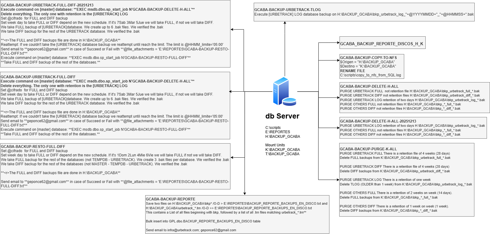

<style>
r { color: red }
o { color: Orange }
g { color: Green }
lg { color: lightgreen }
b { color: Blue }
lb { color: lightblue }

- To create tables:
  
  https://www.tablesgenerator.com/markdown_tables

> [!NOTE]  
> Highlights information that users should take into account, even when skimming.

> [!TIP]
> Optional information to help a user be more successful.

> [!IMPORTANT]
> Crucial information necessary for users to succeed.

> [!WARNING]  
> Critical content demanding immediate user attention due to potential risks.

> [!CAUTION]
> Negative potential consequences of an action.

> [!IDEA]
> XXXXX 
</style>

# BACKUP Methodology

## Index
- [BACKUP Methodology](#backup-methodology)
  - [Index](#index)
  - [Objective](#objective)
  - [Change History](#change-history)
  - [Projects](#projects)
    - [gCABA](#gcaba)
      - [PROD environment](#prod-environment)
        - [Intro](#intro)
        - [Disabled PROD MSSQL Server Jobs](#disabled-prod-mssql-server-jobs)
        - [Enabled PROD environment](#enabled-prod-environment)
        - [Questions \& Meetings](#questions--meetings)
    - [TELEFONICA](#telefonica)
      - [PROD environment](#prod-environment-1)
        - [Intro](#intro-1)
        - [Disabled PROD MSSQL Server Jobs](#disabled-prod-mssql-server-jobs-1)
        - [Enabled PROD environment](#enabled-prod-environment-1)
        - [Questions \& Meetings](#questions--meetings-1)
  - [Propousal](#propousal)
  - [You can view the SQL script GCABA-BACKUP-URBETRACK-TLOG.sql](#you-can-view-the-sql-script-gcaba-backup-urbetrack-tlogsql)
  
## Objective

The aim of this document is to create a comprehensive enterprise-grade database backup methodology using both Microsoft SQL Server and PostgreSQL.

## Change History

|Version   | Date        | Created by  | Approved by  |
|----------|-------------|-------------|--------------|
| 1.0      | 01-01-2026  | DBA Team    | Omar Chemes  |
|          |             |             |              |

## Projects

### gCABA

#### PROD environment

##### Intro

- Backup database policy

  - Database backup Type & Frequency

    | Project | Environment | db Name     | bkp Type | Frequency                                      | Job Name                          | Time                   | Duration Time | 
    | --------| ------------|-------------|----------|----------------------------------------------- |---------------------------------- | ---------------------- | ------------- |
    | gCABA   | PROD        | [urbetrack] | FULL     | Saturday - Tuesday - Thursday                  | GCABA-BACKUP-URBETRACK-FULL-DIFF  | 12:10:00 AM            |               |
    | gCABA   | PROD        | [urbetrack] | DIFF     | Monday - Wednesday - Friday                    | GCABA-BACKUP-URBETRACK-FULL-DIFF  | 12:10:00 AM            |               |
    | gCABA   | PROD        | [OTHERS]    | FULL     | Thursday - Saturday                            | GCABA-BACKUP-RESTO-FULL-DIFF      | Doesn't have           |               |
    | gCABA   | PROD        | [OTHERS]    | DIFF     | Sunday - Monday - Tuesday - Wednesday - Friday | GCABA-BACKUP-RESTO-FULL-DIFF      | Doesn't have           |               |
    | gCABA   | PROD        | [urbetrack] | LOG      | Every day                                      | GCABA-BACKUP-URBETRACK-TLOG       | All day (every 15 min) |               |

  - Database backup retention

    | Project | Environment | db Name     | bkp Type | Retention    | Retention Description                             | Job Name                   | Driver | Path                                       |
    | --------| ------------|-------------|----------|--------------|-------------------------------------------------- |----------------------------|--------| -------------------------------------------|
    | gCABA   | PROD        | [urbetrack] | FULL     | Not Apply    |                                                   | GCABA-BACKUP-DELETE-H-ALL  | H      | H:\BACKUP_GCABA\bkp_urbetrack_full_*.bak   |
    | gCABA   | PROD        | [OTHERS]    | FULL     | Not Apply    |                                                   | GCABA-BACKUP-DELETE-H-ALL  | H      | H:\BACKUP_GCABA\bkp_*_full_*.bak           |
    | gCABA   | PROD        | [urbetrack] | FULL     | Apply        | There is a retention file of 4 weeks (28 days)    | GCABA-BACKUP-PURGE-K-ALL   | K      | K:\BACKUP_GCABA\bkp_urbetrack_full_*.bak   |
    | gCABA   | PROD        | [OTHERS]    | FULL     | Apply        | There is a retention of 2 weeks on week (14 days) | GCABA-BACKUP-PURGE-K-ALL   | K      | K:\BACKUP_GCABA\bkp_*_full_*.bak           |
    | gCABA   | PROD        | [urbetrack] | DIFF     | Not Apply    |                                                   | GCABA-BACKUP-DELETE-H-ALL  | H      | H:\BACKUP_GCABA\bkp_urbetrack_diff_*.bak   |
    | gCABA   | PROD        | [OTHERS]    | DIFF     | Not Apply    |                                                   | GCABA-BACKUP-DELETE-H-ALL  | H      | H:\BACKUP_GCABA\bkp_*_diff_*.bak           |
    | gCABA   | PROD        | [urbetrack] | DIFF     | Apply        | There is a retention file of 4 weeks (28 days)    | GCABA-BACKUP-PURGE-K-ALL   | K      | K:\BACKUP_GCABA\bkp_urbetrack_diff_*.bak   |
    | gCABA   | PROD        | [OTHERS]    | DIFF     | Apply        | There is a retention of 1 week on week (1 week)   | GCABA-BACKUP-PURGE-K-ALL   | K      | K:\BACKUP_GCABA\bkp_*_diff_*.bak           |
    | gCABA   | PROD        | [urbetrack] | LOG      | Apply        | There is a retention of 2 days (2 days)           | GCABA-BACKUP-DELETE-H-ALL  | H      | H:\BACKUP_GCABA\bkp_urbetrack_log_*.bak    |
    | gCABA   | PROD        | [urbetrack] | LOG      | Apply        | There is a retention of one week ( 1 week)        | GCABA-BACKUP-PURGE-K-ALL   | K      | K:\BACKUP_GCABA\bkp_urbetrack_log_*.bak    |


    > [!IMPORTANT]
    > DIFF backups
    >  GCABA-BACKUP-URBETRACK-FULL-DIFF --> **EXEC msdb.dbo.sp_start_job N'GCABA-BACKUP-DELETE-H-ALL'**

- Storage

  - gCABA - CLARO

- Monitoring & Notification
  
  Backup jobs are monitored through the **PRTG monitoring platform**, which provides visibility into their operational status.

  Additionally, a daily email report is sent to the DevSecOps team containing the backup results along with their corresponding verification (VERIFY) outcomes. Regarding disk space utilization, notifications are sent via email to the DevSecOps team, and dedicated PRTG sensors with predefined threshold values are configured to generate alerts whenever available disk space falls below acceptable levels.

- Security Management
  
  - Backup Encryption

    Implement encryption for backup files to protect sensitive data and ensure the confidentiality of stored information.

  - Access Control

    Ensure that only authorized personnel have access to backup files and related backup management processes.


##### Disabled PROD MSSQL Server Jobs

On this section we are going to descrive the jobs that can be deleted from the instance.

- backup_report_tape

  - Status

    **<r>Disabled**

  - Last execution Date

    **<r>12/25/2024 10:00:00 AM**

  - Description
    
    **The job doesn't have a description.**

  - Command

    You can view the SQL script [here](./backup_report_tape.sql).


- BACKUP-PURGE

  - Status

    **<r>Disabled**

  - Last execution Date

    **<r>3/5/2025 9:00:00 PM**

  - Description
    
    The job doesn't have a description.

    Reading the code we can mention that this Job execute:

    1. Mount a K drive
    2. Get and Delete FULL backups files for URBETRACK Database older than 28 days
    3. Get and Delete DIFF backups files for URBETRACK Database older than 28 days
    4. Get and Delete LOG  backups files for URBETRACK Database older than  7 days
    5. Get and Delete FULL backups files for others Databases older than 14 days
    6. Get and Delete DIFF backups files for others Databases older than  7 days
    7. Send eMail to geponce62@gmail.com
    8. Title PT-GCABA BACKUP-URBETRACK-PURGE

  - Command

    You can view the SQL script [here](./BACKUP-PURGE.sql).


- BACKUP-REPORTE-GCABA

    - Status

    **<r>Disabled**

    - Last execution Date

    **<r>3/6/2025 8:15:00 AM**

    - Description

    The job doesn't have a description. <br>
    Reading the code we can mention that this Job execute a Report base on the .txt created on path <r>E:\REPORTES\BACKUP_REPORTE_BACKUPS_EN_DISCO.txt

    - Command

      You can view the SQL script [here](./BACKUP-REPORTE-GCABA.sql).


- BACKUP-RESTO-FULL-DIFF

  - Status

    **<r>Disabled**

  - Last execution Date

    **<r>3/6/2025 3:46:12 AM**

  - Description
    
    The job doesn't have a description. <br>
    Reading the code we can mention that this Job execute a backup of others databases

  - Command
    
    You can view the SQL script [here](./BACKUP-RESTO-FULL-DIFF.sql).


- BACKUP-URBETRACK-FULL-DIFF

  - Status

    **<r>Disabled**

  - Last execution Date

    **<r>3/6/2025 12:10:01 AM**

  - Description
    
    The job doesn't have a description. <br>
    Reading the code we can mention that this Job execute a FULL/DIFF backup of urbetrack with a specific schedule

    /*
    1 Dom 2 Lun 3 Mar 4 Mie 5 Jue 6 Vie 7 Sab 
    Base		7Sab	1Dom	2Lun	3Mar	4Mie	5Jue	6Vie
    urbetrack	FULL	DIFF	DIFF	FULL	DIFF	FULL	DIFF
    */

    Finally move the files to H: FULL COPY_ONLY and execute the job BACKUP-RESTO-FULL-DIFF

  - Command

    You can view the SQL script [here](./BACKUP-URBETRACK-FULL-DIFF.sql).

- BACKUP-URBETRACK-TLOG

  - Status

    **<r>Disabled**

  - Last execution Date

    **<r>5/27/2026 10:31:59 AM --> failed**
    **<r>3/6/2025 4:45:00 PM   --> successfull**

  - Description
    
    The job doesn't have a description. <br>
    Reading the code we can mention that this Job execute a LOG backup of urbetrack.

  - Command

    You can view the SQL script [here](./BACKUP-URBETRACK-TLOG.sql).


##### Enabled PROD environment

On this section we are going to descrive the jobs that are running and taking the databases backups in PROD gCABA environment.

- GCABA_BACKUP_REPORTE_DISCOS_H_K

  - Status

    **<r>Enabled**

  - Last execution Date

    **<r>6/1/2026 5:00:00 PM**

  - Description
    
    **The job doesn't have a description.**<br>

    Reading the code we can mention that this Job:
    
    Step I: <br>
    Execute a PowerShell to REPORT the .bak files only (not .log files) from **H:\BACKUP_GCABA\bkp*$fecha*.bak** and **K:\BACKUP_GCABA\bkp*$fecha*.bak** drivers.

    Step II: <br>
    Send email to **infra@urbetrack.com; geponce62@gmail.com**
    @file_attachments = **E:\REPORTES\GCABA_BACKUP_REPORTE_DISCOS_H_K_AT_1700.txt**

    > [!TIP]
    > This Job is only for reporting. Doesn't take any action

  - Schedule

    **Occurs every day at 12:00:00 PM. Schedule will be used starting on 3/31/2025.**
    **Occurs every day at 5:00:00 PM. Schedule will be used starting on 3/31/2025.**

  - Command

    You can view the SQL script [here](./GCABA_BACKUP_REPORTE_DISCOS_H_K.sql).

- GCABA-BACKUP-COPY-TO-NFS

  - Status

    **<r>Enabled**

  - Last execution Date

    **<r>3/28/2025 12:10:49 AM**
    **<r>More than a year ago**

  - Description
    
    **The job doesn't have a description.**<br>

    Reading the code we can mention that this Job execute:
    
    Step I:<br>
    Execute a PowerShell to copy the files from **$Origen = "H:\BACKUP_GCABA"** to **$Destino = "K:\BACKUP_GCABA"**. To execute this copy we are using ROBOCOPY.
    
    Step II:<br>
    Execute a PowerShell to rename the .log file that exists on "C:\scripts\copy_to_nfs_from_SQL.log". Finally this step create a new file base on copy_to_nfs_from_SQL.log

  - Schedule

    **This job doesn't have an Schedule**

  - Command

    You can view the SQL script [here](./GCABA-BACKUP-COPY-TO-NFS.sql)

- GCABA-BACKUP-DELETE-H-ALL

  - Status

    **<r>Enabled**

  - Last execution Date

    **<r>6/2/2026 12:10:01 AM**

  - Description
    
    **The job doesn't have a description.<br>**

    Reading the code we can mention that this Job execute:
    
    Step I:<br>
    DELETE files from **H:\BACKUP_GCABA**

    * PURGE URBETRACK FULL
      
      **<r>There is not retention we delete the files**<br>
      Delete FULL backups from **"H:\BACKUP_GCABA\bkp_urbetrack_full_*.bak"**

    * PURGE URBETRACK DIFF
    
      **<r>There is not retention we delete the files**<br>
      Delete DIFF backups from **"H:\BACKUP_GCABA\bkp_urbetrack_diff_*.bak"**

    * PURGE URBETRACK LOG
      
      **<r>There is a retention of two days**<br>
      Delete TLOG (OLDER than 2 days) from **"H:\BACKUP_GCABA\bkp_urbetrack_log_*.bak"** 
    
    * PURGE OTHERS FULL

      **<r>There is not retention we delete the files**<br>
      Delete FULL backups from **"H:\BACKUP_GCABA\bkp_*_full_*.bak"**

    * PURGE OTHERS DIFF

      **<r>There is not retention we delete the files**<br>
      Delete DIFF backups from **"H:\BACKUP_GCABA\bkp_*_diff_*.bak"**
    
  - Schedule

    **This job doesn't have an Schedule**

  - Command

    You can view the SQL script [here](./GCABA-BACKUP-DELETE-H-ALL.sql)

- GCABA-BACKUP-DELETE-H-ALL-20251213

  - Status

    **<r>Enabled**

  - Last execution Date

    **<r>12/14/2025 12:10:01 AM**
    **Last execution was six months ago**

  - Description
    
    **The job doesn't have a description.**<br>

    Reading the code we can mention that this Job execute:
    
    Step I: <br>
    **<r>This Job execute the same steps as GCABA-BACKUP-DELETE-H-ALL. But, has the first two steps disabled, these steps are related to the FULL and DIFFE backups for [URBETRACK] database**

  - Schedule

    **This job doesn't have an Schedule**

  - Command

    You can view the SQL script [here](./GCABA-BACKUP-DELETE-H-ALL-20251213.sql)

- GCABA-BACKUP-PURGE-K-ALL

  - Status

    **<r>Enabled**

  - Last execution Date

    **<r>6/1/2026 9:00:00 PM**

  - Description
    
    **The job doesn't have a description.**<br>

    Reading the code we can mention that this Job execute:
    
    Step I: <br>
    DELETE files from **K:\BACKUP_GCABA**

    * PURGE URBETRACK FULL
      
      **<r>There is a retention file of 4 weeks (28 days)**<br>
      Delete FULL backups from **"K:\BACKUP_GCABA\bkp_urbetrack_full_*.bak"**

    * PURGE URBETRACK DIFF
    
      **<r>There is a retention file of 4 weeks (28 days)**<br>
      Delete DIFF backups from **"K:\BACKUP_GCABA\bkp_urbetrack_diff_*.bak"**

    * PURGE URBETRACK LOG
      
      **<r>There is a retention of one week**<br>
      Delete TLOG (OLDER than 1 week) from **"K:\BACKUP_GCABA\bkp_urbetrack_log_*.bak"** 

    * PURGE OTHERS FULL

      **<r>There is a retention of 2 weeks on week (14 days).**<br>
      Delete FULL backups from **"K:\BACKUP_GCABA\bkp_*_full_*.bak"**

    * PURGE OTHERS DIFF

      **<r>There is a retention of 1 week on week (1 week).**<br>
      Delete DIFF backups from **"K:\BACKUP_GCABA\bkp_*_diff_*.bak"**

    Step II: <br>
    Send email to: **<r>geponce62@gmail.com** with **@file_attachments = 'E:\REPORTES\BACKUP_PURGE_K_ALL.txt'**

  - Schedule

    **Occurs every day at 9:00:00 PM. Schedule will be used starting on 8/2/2024.**

  - Command

    You can view the SQL script [here](./GCABA-BACKUP-PURGE-K-ALL.sql)

- GCABA-BACKUP-REPORTE

  - Status

    **<r>Enabled**

  - Last execution Date

    **<r>6/2/2026 8:15:00 AM**

  - Description
    
    **The job doesn't have a description.**<br>

    Reading the code we can mention that this Job execute:
    
    Step I: <br>
    Using [master] database.
    Check if there is a backup running.

    Save info in .txt file on:
    First. List all files that start with "bkp" order by date [/O-D] descending and redirects the output to a file on [E:\REPORTES\BACKUP_REPORTE_BACKUPS_EN_DISCO.txt]
    Note [>] is use to overwrite
    exec xp_cmdshell ''dir H:\BACKUP_GCABA\bkp* /O-D > E:\REPORTES\BACKUP_REPORTE_BACKUPS_EN_DISCO.txt''

    Second. Lists all transaction log backup files order by date [/O-D] descending and adds the output to the end of the existing file [E:\REPORTES\BACKUP_REPORTE_BACKUPS_EN_DISCO.txt]
    Note [>>] is use to add
    exec xp_cmdshell ''dir H:\BACKUP_GCABA\urbetrack_*.trn /O-D >> E:\REPORTES\BACKUP_REPORTE_BACKUPS_EN_DISCO.txt''

    **<r>The *Final Result* is, after both commands run E:\REPORTES\BACKUP_REPORTE_BACKUPS_EN_DISCO.txt contains a List of all files beginning with bkp, followed by a list of all .trn files matching urbetrack_*.trn**


    Bulk insert into a table:
    truncate table GPL.dbo.BACKUP_REPORTE_BACKUPS_EN_DISCO

    BULK INSERT GPL.dbo.BACKUP_REPORTE_BACKUPS_EN_DISCO
    FROM ''E:\REPORTES\BACKUP_REPORTE_BACKUPS_EN_DISCO.txt'';

    Send email to **infra@urbetrack.com; geponce62@gmail.com** with the result of the queries:

    /* URBETRACK db */
    select * from GPL.dbo.uv_BACKUP_REPORTE_BACKUPS_EN_DISCO_urbetrack order by 1'
    /* REST of the dbs */
    select * from GPL.dbo.uv_BACKUP_REPORTE_BACKUPS_EN_DISCO_resto order by 1

  - Schedule

    **Occurs every day at 8:15:00 AM. Schedule will be used starting on 3/7/2020.**

  - Command

    You can view the SQL script [here](./GCABA-BACKUP-REPORTE.sql)


- GCABA-BACKUP-RESTO-FULL-DIFF

  - Status

    **<r>Enabled**

  - Last execution Date

    **<r>6/2/2026 12:34:14 AM**

  - Description

    **The job doesn't have a description.**<br>

    Reading the code we can mention that this Job execute:

    Step I: <br>

    Declare many variables
    Set @DEBUG = N, @CIFRADO = N, @FORZAR_TIPO_BACKUP = N, @TIPO_BACKUP_FORZADO = DIFF, @DISCO = H, @DIRECTORIO = \BACKUP_CABA\

    If @cifrado is 'S' we are going to set up:
    set @subtexto='_cifr_'
    set @backup_with_full='WITH FORMAT, COMPRESSION, CHECKSUM, STATS=1, ENCRYPTION(ALGORITHM=AES_256, SERVER CERTIFICATE=CertificateForBackupPVK)'
    set @backup_with_diff='WITH FORMAT, COMPRESSION, CHECKSUM, STATS=1, DIFFERENTIAL, ENCRYPTION(ALGORITHM=AES_256, SERVER CERTIFICATE=CertificateForBackupPVK)'
    If not
    set @subtexto='_'
    set @backup_with_full='WITH FORMAT, COMPRESSION, CHECKSUM, STATS=1'
    set @backup_with_diff='WITH FORMAT, COMPRESSION, CHECKSUM, STATS=1, DIFFERENTIAL'
      
    Set week day to take FULL or DIFF depend on the new schedule. If it's 1Dom 2Lun 4Mie 6Vie we will take FULL if not we will take DIFF. 
    /*--if @weekday in (1,2,4,6) -- FULL: 1Dom 2Lun 4Mie 6Vie*/
    if @weekday in (5,7) -- FULL: 5Jue 7Sab
    set @tipo_backup='FULL'
    /*--else -- DIFF: 3Mar 5Jue 7Sab */
    else -- DIFF (1,2,3,4,6) 1Dom 2Lun 3Mar 4Mie 6Vie
    set @tipo_backup='DIFF'
    
    if @forzar_tipo_backup='S'
    set @tipo_backup=@tipo_backup_forzado

    If a backups is running we wait.

    If @tipo_backup='FULL'
    We take FULL backup for the rest of the databases (not TEMPDB - URBETRACK). We create 3 .bak files per database
    We verified the .bak
    ELSE
    We take DIFF backup for the rest of the databases (not MASTER - TEMPDB - URBETRACK).
    We verified the .bak      

    **<r>The FULL and DIFF backups file are done in H:\BACKUP_GCABA**

    Step II:<br>
    Send email to **geponce62@gmail.com** in case of Succeed or Fail with **@file_attachments = 'E:\REPORTES\GCABA-BACKUP-RESTO-FULL-DIFF.txt'**

  - Schedule

    **<r>This job doesn't have an Schedule**

  - Command

    You can view the SQL script [here](./GCABA-BACKUP-RESTO-FULL-DIFF.sql)

- GCABA-BACKUP-URBETRACK-FULL-DIFF

  - Status

    **<r>Enabled**

  - Last execution Date

    **<r>6/2/2026 12:10:00 AM**

  - Description
    
    **The job doesn't have a description.**<br>

    Reading the code we can mention that this Job execute:

    Step I: <br>
    Execute command on [master] database: **EXEC msdb.dbo.sp_start_job N'GCABA-BACKUP-DELETE-H-ALL'**
    Delete everything. The only one with retention is the [URBETRACK] LOG
    
    Step II:<br>
    Declare many variables
    Set @DEBUG = N, @CIFRADO = N, @FORZAR_TIPO_BACKUP = N, @TIPO_BACKUP_FORZADO = DIFF, @DISCO = H, @DIRECTORIO = \BACKUP_CABA\

    If @cifrado is 'S' we are going to set up:
    set @subtexto='_cifr_'
    set @backup_with_full='WITH FORMAT, COMPRESSION, CHECKSUM, STATS=1, ENCRYPTION(ALGORITHM=AES_256, SERVER CERTIFICATE=CertificateForBackupPVK)'
    set @backup_with_diff='WITH FORMAT, COMPRESSION, CHECKSUM, STATS=1, DIFFERENTIAL, ENCRYPTION(ALGORITHM=AES_256, SERVER CERTIFICATE=CertificateForBackupPVK)'
    If not
    set @subtexto='_'
    set @backup_with_full='WITH FORMAT, COMPRESSION, CHECKSUM, STATS=1'
    set @backup_with_diff='WITH FORMAT, COMPRESSION, CHECKSUM, STATS=1, DIFFERENTIAL'

    Set week day to take FULL or DIFF depend on the new schedule. If it's 7Sab 3Mar 5Jue we will take FULL, if not we will take DIFF. 
    if @weekday in (7,3,5) -- FULL: Sab Mar Jue (7,3,5)
    set @tipo_backup='FULL'
    else -- DIFF: Dom Lun Mie Vie (1,2,4,6)		
    set @tipo_backup='DIFF'
    
    if @forzar_tipo_backup='S'
    set @tipo_backup=@tipo_backup_forzado

    if @forzar_tipo_backup='S'
    set @tipo_backup=@tipo_backup_forzado

    If a backups is running we wait.

    If @tipo_backup='FULL'
    We take FULL backup for the [URBETRACK]. We create the .bak with up to 6 files.
    We verified the .bak
    ELSE
    We take DIFF backup for [URBETRACK] databases with up to 3 files.
    We verified the .bak      

    **<r>The FULL and DIFF backups file are done in H:\BACKUP_GCABA**

    Reattempt
    If we couldn't take the [URBETRACK] database backup we reattempt until reach the limit. The limit is @HHMM_limite='05:00'

    Step III & IV:<br>
    Send email to **geponce62@gmail.com** in case of Succeed or Fail with **@file_attachments = 'E:\REPORTES\GCABA-BACKUP-RESTO-FULL-DIFF.txt'**

    Step V:<br>
    Execute command on [master] database: **EXEC msdb.dbo.sp_start_job N'GCABA-BACKUP-RESTO-FULL-DIFF'**
    **Take FULL and DIFF backup of the rest of the databsaes.**

    Step VI:<br>
    -- DESHABILITADO
    -- Acordado en la reunion con Nico, Ramiro, David del Viernes 28/03/2025
    -- La copia de los backups del H: al NFS se hace con ROBOCOPY por afuera de SQL Server
    -- El script de copia con ROBOCOPY lo programa Nico en otro scheduler
    -- EXEC msdb.dbo.sp_start_job N'GCABA-BACKUP-COPY-TO-NFS'
    print 'Este Job de copia al NFS queda DESHABILITADO => EXEC msdb.dbo.sp_start_job N''GCABA-BACKUP-COPY-TO-NFS'''
    print 'Acordado en la reunion con Nico, Ramiro, David del Viernes 28/03/2025'

    Step VI:<br>
    -- 2025-0416
    -- Dejo desactivado el purgado de los backups del NFS
    -- Nico se encarga de la depuracion de los backups del NS en GCABA
    
    -- EXEC msdb.dbo.sp_start_job N'GCABA-BACKUP-PURGE-K-ALL'
    
    -- EVIDENCIA
    -- ===========
    -- GCABA/CLARO - Purgado de los backups de los LOG de la base urbetrack del NFS
    -- ----------------------------------------------------------------------------------------------------------------------------------
    -- Guillermo Ponce de Leon <geponce62@gmail.com>	14 de abril de 2025, 19:43
    -- Para: Nicolás Zabaleta <nicolas.zabaleta@urbetrack.com>
    -- Hola Nico.
    -- De acuerdo a lo conversado por whatsapp deshabilité en GCABA/CLARO el purgado de los backup de los LOG de la base urbetrack en el NFS.
    -- Saludos.
    -- ======================
    -- Nicolás Zabaleta <nicolas.zabaleta@urbetrack.com>	15 de abril de 2025, 10:00
    -- Para: Guillermo Ponce de Leon <geponce62@gmail.com>
    -- Buen dia Guille, como va?
    -- Perfecto gracias, hay algún otro job que utilice el NFS? porque debido al ultimo cambio de la forma de copy, estamos analizando dejar el nfs en solo lectura, ya -- que ese no se utiliza para la web.
    -- Avisame cualquier cosa, saludos.
    -- ======================
    -- Guillermo Ponce de Leon <geponce62@gmail.com>	15 de abril de 2025, 19:14
    -- Para: Nicolás Zabaleta <nicolas.zabaleta@urbetrack.com>
    -- Hola Nico.
    -- El Job que depura los backups viejos (FULL y DIFF) accede al NFS.
    -- Saludos.
    -- ======================
    -- Nicolás Zabaleta <nicolas.zabaleta@urbetrack.com>	16 de abril de 2025, 9:57
    -- Para: Guillermo Ponce de Leon <geponce62@gmail.com>
    -- Buen dia Guille, como estas?
    -- Si estas hablando de claro/gcaba entonces ese job tambien hay que desactivarlo porque la retencion la estamos manejando directamente desde el NFS de la misma -- -- forma que los logs.
    -- Saludos

  - Schedule

    **Occurs every day at 12:10:00 AM. Schedule will be used starting on 12/15/2025.***

  - Command

    You can view the SQL script [here](./GCABA-BACKUP-URBETRACK-FULL-DIFF.sql)

- GCABA-BACKUP-URBETRACK-FULL-DIFF-20251213

  - Status

    **<r>Enabled**

  - Last execution Date

    **<r>12/14/2025 12:10:00 AM**
    **<r>Last execution six months ago**

  - Description

    **The job doesn't have a description.**<br>

    Reading the code we can mention that this Job execute:

    Step I: <br>
    Execute command on [master] database: **EXEC msdb.dbo.sp_start_job N'GCABA-BACKUP-DELETE-H-ALL-20251213'**

    Step II:<br>
    Set select @forzar_tipo_backup=''N'', 
    Set @tipo_backup_forzado=''DIFF''
    Set select @disco=''H:'', @directorio=''\BACKUP_GCABA\'' -- H:\BACKUP_GCABA
    Set var @cifrado for FULL and DIFF backup. If @cifrado is 'S' we are going to use ENCRYPTION(ALGORITHM=AES_256, SERVER CERTIFICATE=CertificateForBackupPVK)
    Set @weekday
    Set @tipo_backup
    Check @debug
    Take FULL backup of [URBETRACK] database in 6 files and verify it
    Take DIFF backup of [URBETRACK] database in 3 files and verify it

    REINTENTAR_BACKUP:
    <r>The limit of the attempts is the TIME LIMIT (@reintentos).    

    Step III/IV:<br>
    Send email in case of Succes or Faile to **<r>geponce62@gmail.com**

    Step V:<br>
    Execute command on [master] database: **EXEC msdb.dbo.sp_start_job N'GCABA-BACKUP-RESTO-FULL-DIFF'**

    Step VI:<br>

    -- DESHABILITADO
    -- Acordado en la reunion con Nico, Ramiro, David del Viernes 28/03/2025
    -- La copia de los backups del H: al NFS se hace con ROBOCOPY por afuera de SQL Server
    -- El script de copia con ROBOCOPY lo programa Nico en otro scheduler
    -- EXEC msdb.dbo.sp_start_job N'GCABA-BACKUP-COPY-TO-NFS'
    print 'Este Job de copia al NFS queda DESHABILITADO => EXEC msdb.dbo.sp_start_job N''GCABA-BACKUP-COPY-TO-NFS'''
    print 'Acordado en la reunion con Nico, Ramiro, David del Viernes 28/03/2025'

    Step VII:<br>
    -- 2025-0416
    -- Dejo desactivado el purgado de los backups del NFS
    -- Nico se encarga de la depuracion de los backups del NS en GCABA
    
    -- EXEC msdb.dbo.sp_start_job N'GCABA-BACKUP-PURGE-K-ALL'
    
    -- EVIDENCIA
    -- ===========
    -- GCABA/CLARO - Purgado de los backups de los LOG de la base urbetrack del NFS
    -- ----------------------------------------------------------------------------------------------------------------------------------
    -- Guillermo Ponce de Leon <geponce62@gmail.com>	14 de abril de 2025, 19:43
    -- Para: Nicolás Zabaleta <nicolas.zabaleta@urbetrack.com>
    -- Hola Nico.
    -- De acuerdo a lo conversado por whatsapp deshabilité en GCABA/CLARO el purgado de los backup de los LOG de la base urbetrack en el NFS.
    -- Saludos.
    -- ======================
    -- Nicolás Zabaleta <nicolas.zabaleta@urbetrack.com>	15 de abril de 2025, 10:00
    -- Para: Guillermo Ponce de Leon <geponce62@gmail.com>
    -- Buen dia Guille, como va?
    -- Perfecto gracias, hay algún otro job que utilice el NFS? porque debido al ultimo cambio de la forma de copy, estamos analizando dejar el nfs en solo lectura, ya -- que ese no se utiliza para la web.
    -- Avisame cualquier cosa, saludos.
    -- ======================
    -- Guillermo Ponce de Leon <geponce62@gmail.com>	15 de abril de 2025, 19:14
    -- Para: Nicolás Zabaleta <nicolas.zabaleta@urbetrack.com>
    -- Hola Nico.
    -- El Job que depura los backups viejos (FULL y DIFF) accede al NFS.
    -- Saludos.
    -- ======================
    -- Nicolás Zabaleta <nicolas.zabaleta@urbetrack.com>	16 de abril de 2025, 9:57
    -- Para: Guillermo Ponce de Leon <geponce62@gmail.com>
    -- Buen dia Guille, como estas?
    -- Si estas hablando de claro/gcaba entonces ese job tambien hay que desactivarlo porque la retencion la estamos manejando directamente desde el NFS de la misma -- -- forma que los logs.
    -- Saludos */

  - Schedule

    **Occurs every day at 12:10:00 AM. Schedule will be used starting on 12/15/2025.***

  - Command

    You can view the SQL script [here](./GCABA-BACKUP-URBETRACK-FULL-DIFF-20251213.sql)

- GCABA-BACKUP-URBETRACK-TLOG

  - Status

    **<r>Enabled**

  - Last execution Date

    **<r>6/2/2026 3:45:00 PM**

  - Description

    **The job doesn't have a description.**<br>

    Reading the code we can mention that this Job execute:

    Step I: <br>
    Set dates variables
    Execute [URBETRACK] LOG database backup on H:\BACKUP_GCABA\bkp_urbetrack_log_''+@YYYYMMDD+''_''+@HHMMSS+''.bak

  - Schedule

    **Occurs every day every 15 minute(s) between 12:00:00 AM and 11:59:59 PM. Schedule will be used starting on 8/4/2024.***

  - Command

    You can view the SQL script [GCABA-BACKUP-URBETRACK-TLOG.sql](./Backups/scripts/CLARO/GCABA-BACKUP-URBETRACK-TLOG.sql)


- Diagram

  


##### Questions & Meetings

On this section we are going to give a detail of the question that we have after a tudy done of backups in gCABA for PROD environment.

**GUILLE**
  - Can we delete the six JOBs that are disable on PROD gCABA? ([backup_report_tape] - [BACKUP-PURGE] - [BACKUP-REPORTE-GCABA] - [BACKUP-RESTO-FULL-DIFF] - [BACKUP-URBETRACK-FULL-DIFF] - [BACKUP-URBETRACK-TLOG])
    BACKUPAR Y ELIMINAR DE LA INSTANCIA!!!!!!

  - [GCABA_BACKUP_REPORTE_DISCOS_H_K]
    - Who wrote the files on **H:\BACKUP_GCABA\bkp*$fecha*.bak** and **K:\BACKUP_GCABA\bkp*$fecha*.bak** and **'E:\REPORTES\GCABA_BACKUP_REPORTE_DISCOS_H_K_AT_1700.txt'**?<br>
    - Are we deleteing or steping on the files on **E:\REPORTES**?<br>
    
    En el H solo tenemos espacio para los backups del dia
    El historico esta en el K

  - [GCABA-BACKUP-COPY-TO-NFS]
    - This job was executed for last time more than a year ago 3/28/2025 12:10:49 AM. Can we delete it?<br>
    - This job was executed for last time more than a year ago, but if I connect to "C:\scripts" I can see the file "copy_to_nfs_from_SQL.log" created today (6/3/2026). So, who created this file? and for what?
    
    backpear y eliminar

  - [GCABA-BACKUP-DELETE-H-ALL]
    - I don't have any question. We delete everything less LOG that we keep the last two days


  - [GCABA-BACKUP-DELETE-H-ALL-20251213]
    - Last execution was six months ago 12/14/2025 12:10:01 AM. Can we delete it?
    backpear y eliminar

  - [GCABA-BACKUP-PURGE-K-ALL]
    - Why we have a retention file here and not in the H drive?
     
  - [GCABA-BACKUP-REPORTE]
    - No questions
    
  - [GCABA-BACKUP-RESTO-FULL-DIFF]
    - We don't have a schedule for this, why? - Because is executed by [GCABA-BACKUP-URBETRACK-FULL-DIFF] the next job on the list
    - Why we take 4 FULL backups per week?
    - Why we create more than a file per database that is not [TEMPDB] - [URBETRACK]. Databases are really small.
  - [GCABA-BACKUP-URBETRACK-FULL-DIFF]
    - Same point before. Why we create up to 6/3 files manually?
  - [GCABA-BACKUP-URBETRACK-FULL-DIFF-20251213]
    - Last execution was six months ago 12/14/2025 12:10:00 AM. Can we delete it?
    
    backpear y eliminar

  - [GCABA-BACKUP-URBETRACK-TLOG]
    - No questions
    - **46379 TICKET ZOHO VER QUILOMBO DEL DIA 12/14/2025 - MODIFICACION DE TIPO DE DATO INT TO BIGINT**

  - TELEFONICA
    HACE 6 MESES NO SE HACEN CORRECTAMENTE LOS BACKUPS.


  - Nico dar permissos a CloudFlare 

**DAVID**
  - [https://dev.azure.com/urbetrack/SRE%20Team/_wiki/wikis/SRE-Team.wiki/2325/Procedimiento-de-Copias-de-Seguridad-y-Restauracion]
    - From this document the section [storage] for [CLARO] is talking about LINUX but it's a WINDOWS.
    - [PRTG] - Request permissions to PRTG to Rodrigo?? JUMPSERVER CON 365 --> se saco y se puso atras de cloudflare --> se rompio
               Se sedio el trafico a cloudflare porque es gratuita
               Migrar a Prometheus y Grafana, esto era parte del laburo de Nico. HABLAR CON OMAR ESY NICO ESTE TEMA!!

    - [BaaS Telefónica VDC] - It's only for TELEFONICA not for CLARO


### TELEFONICA

#### PROD environment

##### Intro

- Backup database policy

  - Database backup Type & Frequency

    | Project    | Environment | db Name     | bkp Type | Frequency                                      | Job Name                          | Time                      | Duration Time | 
    | -----------| ------------|-------------|----------|----------------------------------------------- |---------------------------------- | ------------------------- | ------------- |
    | TELEFONICA | PROD        | [urbetrack] | FULL     | Saturday                                       | BACKUP-URBETRACK-FULL-DIFF        | 3:05:00 AM                |               |
    | TELEFONICA | PROD        | [urbetrack] | DIFF     | Monday - Tues - Wed - Thurs - Friday - Sunday  | BACKUP-URBETRACK-FULL-DIFF        | 3:05:00 AM                |               |
    | TELEFONICA | PROD        | [OTHERS]    | FULL     | Thursday - Saturday                            | BACKUP-RESTO-FULL-DIFF            | Doesn't have (3:05:00 AM) |               |
    | TELEFONICA | PROD        | [OTHERS]    | DIFF     | Sunday - Monday - Tuesday - Wednesday - Friday | BACKUP-RESTO-FULL-DIFF            | Doesn't have (3:05:00 AM) |               |
    | TELEFONICA | PROD        | [*1]        | LOG      | Not Apply                                      | Not Apply                         | Not Apply                 |               |

    [*1]
    > [!IMPORTANT]
    > on this server we are using Log Shipping that is why we are not using a Job to take full bkp.

  - Database backup retention [*2]

    | Project    | Environment | db Name     | bkp Type | Retention    | Retention Description                             | Job Name                   | Driver | Path                                       |
    | -----------| ------------|-------------|----------|--------------|-------------------------------------------------- |----------------------------|--------| -------------------------------------------|
    | TELEFONICA | PROD        | [urbetrack] | FULL     | 3 weeks      | There is a retention file of 3 weeks (21 days)    | BACKUP-PURGE               | K      | K:\BACKUP21\bkp_urbetrack_full_*.bak       |
    | TELEFONICA | PROD        | [OTHERS]    | FULL     | Apply        | There is a retention file of 3 weeks (21 days)    | BACKUP-PURGE               | K      | K:\BACKUP_GCABA\bkp_*_full_*.bak           |
    | TELEFONICA | PROD        | [urbetrack] | DIFF     | 3 weeks      | There is a retention file of 3 weeks (21 days)    | BACKUP-PURGE               | K      | K:\BACKUP21\bkp_urbetrack_diff_*.bak       |
    | TELEFONICA | PROD        | [OTHERS]    | DIFF     | Apply        | There is a retention file of 2 weeks (14 days)    | BACKUP-PURGE               | K      | K:\BACKUP_GCABA\bkp_*_full_*.bak           |
    | TELEFONICA | PROD        | [urbetrack] | LOG      | Apply        | There is a retention of 1 week (7 days)           | BACKUP-PURGE               | K      | K:\BACKUP21\bkp_urbetrack_log_*.bak        |

    [*2]
    > [!IMPORTANT]
    > RETENTION don't apply. All job was Disable
    
- Storage

  - TELEFONICA - NFS

- Monitoring & Notification
  
  Backup jobs are monitored through the **PRTG monitoring platform**, which provides visibility into their operational status.

  Additionally, a daily email report is sent to the DevSecOps team containing the backup results along with their corresponding verification (VERIFY) outcomes. Regarding disk space utilization, notifications are sent via email to the DevSecOps team, and dedicated PRTG sensors with predefined threshold values are configured to generate alerts whenever available disk space falls below acceptable levels.

- Security Management
  
  - Backup Encryption

    Implement encryption for backup files to protect sensitive data and ensure the confidentiality of stored information.

  - Access Control

    Ensure that only authorized personal have access to backup files and related backup management processes.

##### Disabled PROD MSSQL Server Jobs

On this section we are going to descrive the jobs that can be deleted from the instance.

- _OLD BACKUP-FULL-EXCEPTO-URBETRACK-URBE_HISTORY

  - Status 
    **<r>Disabled**

  - Last execution Date
    **<r>8/23/2024 4:15:00 AM**

  - Description
    **The job doesn't have a description.**

  - Command
    You can view the SQL script [here](./TELEFONICA/_OLD BACKUP-FULL-EXCEPTO-URBETRACK-URBE_HISTORY.sql).

- _OLD BACKUP-FULL-EXCEPTO-URBETRACK-URBE_HISTORY-VERIFIY

  - Status 
    **<r>Disabled**

  - Last execution Date
    **<r>8/23/2024 10:00:00 AM**

  - Description
    **The job doesn't have a description.**

  - Command
    You can view the SQL script [here](./TELEFONICA/_OLD BACKUP-FULL-EXCEPTO-URBETRACK-URBE_HISTORY-VERIFIY.sql).

- _OLD BACKUP-URBE_HISTORY-DIFF

  - Status 
    **<r>Disabled**

  - Last execution Date
    **<r>8/23/2024 2:15:00 AM**

  - Description
    **The job doesn't have a description.**

  - Command
    You can view the SQL script [here](./TELEFONICA/_OLD BACKUP-URBE_HISTORY-DIFF.sql).


- _OLD BACKUP-URBE_HISTORY-FULL

  - Status 
    **<r>Disabled**

  - Last execution Date
    **<r>8/17/2024 11:45:00 PM**

  - Description
    **The job doesn't have a description.**

  - Command
    You can view the SQL script [here](./TELEFONICA/_OLD BACKUP-URBE_HISTORY-FULL.sql).

- _OLD BACKUP-URBETRACK-DIFF

  - Status 
    **<r>Disabled**

  - Last execution Date
    **<r>8/17/2024 11:45:00 PM**

  - Description
    **The job doesn't have a description.**

  - Command
    You can view the SQL script [here](./TELEFONICA/_OLD BACKUP-URBETRACK-DIFF.sql).

- _OLD BACKUP-URBETRACK-FULL

  - Status 
    **<r>Disabled**

  - Last execution Date
    **<r>8/17/2024 2:00:00 PM**

  - Description
    **The job doesn't have a description.**

  - Command
    You can view the SQL script [here](./TELEFONICA/_OLD BACKUP-URBETRACK-FULL.sql).


- _OLD BACKUP-URBETRACK-LOG

  - Status 
    **<r>Disabled**

  - Last execution Date
    **<r>8/11/2024 7:30:00 PM**

  - Description
    **The job doesn't have a description.**

  - Command
    You can view the SQL script [here](./TELEFONICA/_OLD BACKUP-URBETRACK-LOG.sql).

##### Enabled PROD environment

On this section we are going to descrive the jobs that are running and taking the databases backups in PROD gCABA environment.

- [_BACKUP-RESTO-FULL-DIFF-OneTime]

  - Status 
    **<r>Enabled**

  - Last execution Date
    **<r>6/30/2025 5:36:23 PM**
    **This job executed for last time a year ago**

  - Description
    **The job doesn't have a description.**

  - Schedule

    **This job doesn't have an Schedule**

  - Command
    You can view the SQL script [here](./TELEFONICA/_BACKUP-RESTO-FULL-DIFF-OneTime.sql).

  > [!IMPORTANT]
  > This job was backuped up and deleted form the SQL instance.
  > Check ##### Questions & Meetings section

- [BACKUP_LISTADO_DIARIO]

  - Status 
    **<r>Enabled**

  - Last execution Date
    **<r>6/5/2026 3:00:00 AM**

  - Description
    **The job doesn't have a description.**

    Reading the code we can mention that this Job execute:
    
    Step I: <br>
    Generate File

    1) ¿A que hora del día genero el archivo?
    Voy a generar el archivo a las 00:00 cada día.
    Es decir que cada archivo generado a las 00:00 va a contener todos los archivos de BACKUP que se hayan generado el día anterior entre las 00:00 y las 23:59:59.
    2) ¿En que ubicación?
    En el mismo disco NFS donde se guardan los backups pero en otra carpeta para que no queden mezclados los archivos de backup con los archivos de control de los backups.

    This report is only for [URBETRACK] database

    Command

    ```sql
    USE GPL
    GO

    declare @yyyymmdd_ayer char(8), @yyyymmdd_hoy char(8)
    select @yyyymmdd_ayer=convert(char(8),dateadd(dd,-1,getdate()),112), @yyyymmdd_hoy=convert(char(8),getdate(),112)

    set nocount on

    SELECT left(bs.database_name, 10) +' '+
           convert(char(8),bs.backup_start_date,112)+' '+convert(char(8),bs.backup_start_date,108)+' '+
           upper(left(datename(dw,bs.backup_start_date),3))+' '+
          --bs.backup_finish_date, 
          CASE bs.type 
            WHEN 'D' THEN 'FULL'
            WHEN 'I' THEN 'DIFF' 
            WHEN 'L' THEN 'LOG ' 
          END+' '+
        --left(cast(bs.backup_size/1024./1024./1024. as numeric(10,2)),10) size_GB, 
        --left(cast(bs.compressed_backup_size/1024./1024./1024. as numeric(10,2)),10)  compressed_size_GB,
        replace(left(mf.physical_device_name,60),'K:\BACKUP21\','') Urbetrack_Backups_Since_Last_Full
        --left(mf.physical_device_name,40) backup_file_destination
    FROM msdb.dbo.backupmediafamily mf
    INNER JOIN msdb.dbo.backupset bs
    ON mf.media_set_id = bs.media_set_id 
    where bs.database_name in ('urbetrack')
    and bs.backup_start_date >= @yyyymmdd_ayer and bs.backup_start_date < @yyyymmdd_hoy
    order by bs.backup_start_date asc
    
    set nocount off
    ```

    Step II: <br>
    Set @yyyymmdd_ayer and @cmdshell
    Copy from **D:\BACKUP\BACKUP_LISTADO_DIARIO.txt** to **K:\REPORTES\backup_urbetrack_@yyyymmdd_ayer.txt**

  - Schedule

    **Occurs every day at 3:00:00 AM.**

  - Command
    You can view the SQL script [here](./TELEFONICA/BACKUP_LISTADO_DIARIO.sql).


- [BACKUP-PURGE]
  
  - Status 
    **<r>Disabled**

  - Last execution Date
    **<r>5/7/2025 9:00:01 PM**

  - Description
    
    2025-05-08
    Se desactiva el Job de la Retencion de los backups en RED a pedido de Nicolas Zabaleta.
    EVIDENCIA
    -- ==========
    [14:28, 8/5/2025] Nicolas Zabaleta Pagustech: guille como va, podrias desactivar la retencion del lado del sql de red? ya la estamos manejando nosotros directamente en el nfs

    Reading the code we can mention that this Job execute:

    Step I: <br>
    Mount disk K

    Step II: <br>
    DELETE files from **K:\BACKUP21**

    * PURGE URBETRACK FULL
      
      **<r>There is a retention file of 3 weeks (21 days)**<br>
      Delete FULL backups from **"K:\BACKUP21\bkp_urbetrack_full_*.bak"**

    * PURGE URBETRACK DIFF
    
      **<r>There is a retention file of 3 weeks (21 days)**<br>
      Delete DIFF backups from **"K:\BACKUP21\bkp_urbetrack_diff_*.bak"**

    * PURGE URBETRACK LOG
      
      **<r>There is a retention of one week**<br>
      Delete TLOG (OLDER than 1 week) from **"K:\BACKUP21\bkp_urbetrack_log_*.bak"** 

    * PURGE OTHERS FULL

      **<r>There is a retention of 2 weeks on week (14 days).**<br>
      Delete FULL backups from **"K:\BACKUP_GCABA\bkp_*_full_*.bak"**

    * PURGE OTHERS DIFF

      **<r>There is a retention of 1 week on week (1 week).**<br>
      Delete DIFF backups from **"K:\BACKUP_GCABA\bkp_*_diff_*.bak"**

    Step III: <br>
    Send email to: **<r>geponce62@gmail.com** with **@file_attachments =  'D:\REPORTES\BACKUP-PURGE.txt**

  - Schedule

    **Occurs every day at 9:00:00 PM.**

  - Command
    You can view the SQL script [here](./TELEFONICA/BACKUP-PURGE.sql).


- [BACKUP-REPORTE-RED]

  - Status
    **<r>Enabled**

  - Last execution Date
    **<r>5/7/2025 9:00:01 PM**

  - Description
    
    Reading the code we can mention that this Job execute:

    Step I: <br>
    Save files on:
    **exec xp_cmdshell 'dir K:\BACKUP21\bkp* /O-D > D:\REPORTES\BACKUP_REPORTE_BACKUPS_EN_DISCO.txt'**
    **exec xp_cmdshell 'dir K:\BACKUP21\urbetrack_*.trn /O-D >> D:\REPORTES\BACKUP_REPORTE_BACKUPS_EN_DISCO.txt'**

    Step II: <br>
    Save info into table **GPL.dbo.BACKUP_REPORTE_BACKUPS_EN_DISCO** from **'D:\REPORTES\BACKUP_REPORTE_BACKUPS_EN_DISCO.txt'** 

    Step III: <br>
    Send email to **'infra@urbetrack.com; geponce62@gmail.com'** with two subjects **'PT-EMPR.21 Reporte de Backups base urbetrack'** and **PT-EMPR.21 Reporte de Backups resto de las bases**

  - Schedule

    **Occurs every day at 8:15:00 AM.**

  - Command
    You can view the SQL script [here](./TELEFONICA/BACKUP-REPORTE-RED.sql).


- [BACKUP-RESTO-FULL-DIFF]

  - Status

    **<r>Enabled**

  - Last execution Date

    **<r>6/8/2026 3:11:18 AM**

  - Description

    **The job doesn't have a description.**<br>

    Reading the code we can mention that this Job execute:

    Step I: <br>

    Declare many variables
    Set @DEBUG = N, @CIFRADO = S, @FORZAR_TIPO_BACKUP = N, @TIPO_BACKUP_FORZADO = FULL, @DISCO = K, @DIRECTORIO = \BACKUP21\

    If @cifrado is 'S' we are going to set up:
    set @subtexto='_cifr_'
    set @backup_with_full='WITH FORMAT, COMPRESSION, CHECKSUM, STATS=1, ENCRYPTION(ALGORITHM=AES_256, SERVER CERTIFICATE=CertificateForBackupPVK)'
    set @backup_with_diff='WITH FORMAT, COMPRESSION, CHECKSUM, STATS=1, DIFFERENTIAL, ENCRYPTION(ALGORITHM=AES_256, SERVER CERTIFICATE=CertificateForBackupPVK)'
    If not
    set @subtexto='_'
    set @backup_with_full='WITH FORMAT, COMPRESSION, CHECKSUM, STATS=1'
    set @backup_with_diff='WITH FORMAT, COMPRESSION, CHECKSUM, STATS=1, DIFFERENTIAL'
    
    Set week day to take FULL or DIFF depend on the new schedule. If it's 7Sab - 5Jue (7,5) take FULL if not take DIFF (1Dom 2Lun 3Mar 4Mie 6Vie)
    -- -----------------------------------------
    -- 1 Dom 2 Lun 3 Mar 4 Mie 5 Jue 6 Vie 7 Sab 
    -- FULL: Sab Jue (7,5) DIFF: Dom Lun Mar Mie Vie (1,2,3,4,6)
    -- -----------------------------------------
    if @weekday in (7,5) -- FULL: Sab Jue (7,5)
      set @tipo_backup='FULL'
    else -- DIFF: Dom Lun Mar Mie Vie (1,2,3,4,6)		
      set @tipo_backup='DIFF'
    
    if @forzar_tipo_backup='S'
    set @tipo_backup=@tipo_backup_forzado

    If a backups is running we wait.

    Create CURSOR with all databases except [TEMPDB], [URBETRACK], [URBE_HISTORY]

    If @tipo_backup='FULL'
    We take FULL backup for the rest of the databases (not [TEMPDB], [URBETRACK], [URBE_HISTORY]). We create 3 .bak files per database
    We verified the .bak
    ELSE
    We take DIFF backup for the rest of the databases (not [TEMPDB], [URBETRACK], [URBE_HISTORY]).
    We verified the .bak      

    **<r>The FULL and DIFF backups file are done in K:\BACKUP21**

    Step II:<br>
    Send email to **geponce62@gmail.com** in case of Succeed or Fail with **@file_attachments = 'D:\REPORTES\BACKUP-RESTO-FULL-DIFF.txt'**

    Step III:<br>
    Declare many variables
    Set @DEBUG = N, @CIFRADO = S, @FORZAR_TIPO_BACKUP = N, @TIPO_BACKUP_FORZADO = FULL, @DISCO = K, @DIRECTORIO = \BACKUP21\

    If @cifrado is 'S' we are going to set up:
    set @subtexto='_cifr_'
    set @backup_with_full='WITH FORMAT, COMPRESSION, CHECKSUM, STATS=1, ENCRYPTION(ALGORITHM=AES_256, SERVER CERTIFICATE=CertificateForBackupPVK)'
    set @backup_with_diff='WITH FORMAT, COMPRESSION, CHECKSUM, STATS=1, DIFFERENTIAL, ENCRYPTION(ALGORITHM=AES_256, SERVER CERTIFICATE=CertificateForBackupPVK)'
    If not
    set @subtexto='_'
    set @backup_with_full='WITH FORMAT, COMPRESSION, CHECKSUM, STATS=1'
    set @backup_with_diff='WITH FORMAT, COMPRESSION, CHECKSUM, STATS=1, DIFFERENTIAL'


    Set week day to take FULL or DIFF depend on the new schedule. If it's 7Sab - 5Jue (7,5) take FULL if not take DIFF (1Dom 2Lun 3Mar 4Mie 6Vie)
    -- -----------------------------------------
    -- 1 Dom 2 Lun 3 Mar 4 Mie 5 Jue 6 Vie 7 Sab 
    -- FULL: Sab Jue (7,5) DIFF: Dom Lun Mar Mie Vie (1,2,3,4,6)
    -- -----------------------------------------
    if @weekday in (7) -- FULL: Sab 
      set @tipo_backup='FULL'
    else -- DIFF: Dom Lun Mar Mie Jue Vie (1,2,3,4,5,6)		
      set @tipo_backup='DIFF'
    
    if @forzar_tipo_backup='S'
    set @tipo_backup=@tipo_backup_forzado

    If a backups is running we wait.

    If @tipo_backup='FULL'
    We take FULL backup for [URBE_HISTORY] database. We create 3 .bak files per database
    We verified the .bak
    ELSE
    We take DIFF backup for [URBE_HISTORY] database. We create 3 .bak files per database
    We verified the .bak   

    Retried Backup with limit @HHMM_limite='06:00'

    **<r>The FULL and DIFF backups file are done in K:\BACKUP21**

    Step IV: <br>
    Send email to **'geponce62@gmail.com'** with two subjects 
      **PT-RED BACKUP-RESTO-FULL-DIFF** or **PT-RED BACKUP-RESTO-FULL-DIFF ERROR**
      **PT-RED BACKUP-URBE_HISTORY**    or **PT-RED BACKUP-URBE_HISTORY ERROR**

  - Schedule

    **<r>This job doesn't have an Schedule**

  - Command
    You can view the SQL script [here](./TELEFONICA/BACKUP-RESTO-FULL-DIFF.sql).

- [BACKUP-URBETRACK-FULL-DIFF]

  - Status

    **<r>Enabled**

  - Last execution Date

    **<r>6/8/2026 3:05:00 AM**

  - Description

    **The job doesn't have a description.**<br>

    Reading the code we can mention that this Job execute:

    Step I: <br>

    Declare many variables
    Set @DEBUG = N, @CIFRADO = S, @FORZAR_TIPO_BACKUP = N, @TIPO_BACKUP_FORZADO = FULL, @DISCO = K, @DIRECTORIO = \BACKUP21\

    If @cifrado is 'S' we are going to set up:
    set @subtexto='_cifr_'
    set @backup_with_full='WITH FORMAT, COMPRESSION, CHECKSUM, STATS=1, ENCRYPTION(ALGORITHM=AES_256, SERVER CERTIFICATE=CertificateForBackupPVK)'
    set @backup_with_diff='WITH FORMAT, COMPRESSION, CHECKSUM, STATS=1, DIFFERENTIAL, ENCRYPTION(ALGORITHM=AES_256, SERVER CERTIFICATE=CertificateForBackupPVK)'
    If not
    set @subtexto='_'
    set @backup_with_full='WITH FORMAT, COMPRESSION, CHECKSUM, STATS=1'
    set @backup_with_diff='WITH FORMAT, COMPRESSION, CHECKSUM, STATS=1, DIFFERENTIAL'
    
    ORIGINAL SET UP
    Set week day to take FULL or DIFF depend on the new schedule. If it's 7Sab - 3Mar - 5Jue (7,3,5) take FULL if not take DIFF (1Dom 2Lun 3Mar 4Mie 6Vie)

    CURRENT SET UP
    If it's Saturday take FULL backup for the res of the days take DIFF.

    -- -----------------------------------------
    /*
              1Dom  2Lun  3Mar  4Mie  5Jue  6Vie  7Sab

    Base		  7Sab	1Dom	2Lun	3Mar	4Mie	5Jue	6Vie
    urbetrack	FULL	DIFF	DIFF	FULL	DIFF	FULL	DIFF
    */
    -- -----------------------------------------
    -- ISSUE Backup FULL urbetrack 20260311 21:00
    -- El backup empezó a tardar a partir del FULL del Sabado 07/03/26 demoro 10:29 horas
    -- El backup FULL del Mar 10/03 luego de 42 horas sigue corriendo
    -- Voy a dejar corriendo el FULL porque supuestamente termina en 90 minutos
    -- Pero voy a dejar programado el FULL solamente los Sabados y el resto de los dias DIFF
    if @weekday in (7) -- FULL: Sab (7)
      set @tipo_backup='FULL'
    else -- DIFF: el resto de los días 
      set @tipo_backup='DIFF'

    if @forzar_tipo_backup='S'
    set @tipo_backup=@tipo_backup_forzado

    If a backups is running we wait.

    If @tipo_backup='FULL'
    We take FULL backup for [URBETRACK] database. We create 6 .bak files per database
    We verified the .bak
    ELSE
    We take DIFF backup for [URBETRACK] database. We create 3 .bak files per database
    We verified the .bak   

    Retried Backup with limit @HHMM_limite='06:00'

    **<r>The FULL and DIFF backups file are done in K:\BACKUP21** 

    Step IV: <br>
    Send email to **'geponce62@gmail.com'** with two subjects **PT-RED BACKUP-URBETRACK-FULL-DIFF** OR **PT-RED BACKUP-URBETRACK-FULL-DIFF ERROR**

    Step V: <br>
    **EXEC msdb.dbo.sp_start_job N'BACKUP-RESTO-FULL-DIFF'**

  - Schedule

    **<r>Occurs every day at 3:05:00 AM. Schedule will be used starting on 8/3/2024.**

  - Command
    
    You can view the SQL script [here](./TELEFONICA/BACKUP-URBETRACK-FULL-DIFF.sql).

##### Questions & Meetings

- Can we backup and detele all the Disabled jobs? **YES, we can!**

- [_BACKUP-RESTO-FULL-DIFF-OneTime]
  - Last execution time was almost a year ago. Can we backup and delete it? **YES, we can!**

- [BACKUP_LISTADO_DIARIO]
  
  > [!WARNING]  
  > This Job use the [GLP] database.

- [BACKUP-PURGE]
  - This job is disabled and has an explanation. **We can't delete it**
 
- [BACKUP-REPORTE-RED]
  - No questions

- [BACKUP-RESTO-FULL-DIFF]
  - No questions

- [BACKUP-URBETRACK-FULL-DIFF]
  - No questions


## Propousal

- Summary

  This assessment reviewed the current SQL Server backup implementation used for the gCABA environment and identified a mature but heavily customized backup framework based on SQL Agent Jobs, T-SQL scripts, PowerShell automation, file-system operations, NFS storage, reporting jobs, and restore validation processes.

  The current solution demonstrates several positive operational practices, including:

  - Full, Differential, and Transaction Log backups
  - Automated backup cleanup
  - Restore validation jobs
  - Backup reporting
  - Secondary storage using NFS repositories

  However, the environment also presents significant opportunities for improvement:

  - Extensive use of custom code and xp_cmdshell
  - Lack of backup encryption
  - Limited centralized monitoring
  - Lack of SLA-based alerting
  - Dependence on custom retention scripts
  - Limited observability capabilities
  - Potential recovery and compliance risks

  This document proposes a modern enterprise backup architecture based on:

  - SQL Server 2022 Best Practices (future implementation)
  - Ola Hallengren Maintenance Solution
  - Prometheus Monitoring
  - Grafana Visualization
  - AlertManager Alerting
  - Backup Encryption
  - Automated Recovery Validation
  - Disaster Recovery Readiness


1. Current State Assessment

   - Current Architecture Overview

    Current backup architecture consists of:

        SQL Server
          |
     SQL Agent Jobs
          |
     Full/Diff Backups
     Log Backups
     Restore Validation
     Cleanup Jobs
     Reporting Jobs
          |
    Local Backup Disk (H:)
          |
    NFS Copy (K:)
          |
    Long-Term Storage


   - Backup Types Identified
    
    **Full Backups**<br>
      Purpose:
        - Complete database backup
        - Foundation for recovery chain

      Observed:
        - Managed through custom jobs
    
    **Differential Backups**
      Purpose:
        - Reduce restore time
        - Reduce backup size

      Observed:
        - Combined with Full backup framework

    **Transaction Log Backups**
      Purpose:
        - Point-in-time recovery

      Observed:
        - Dedicated SQL Agent jobs

    **Restore Validation**
      Purpose:
        - Verify backup usability

      Observed:
        - Dedicated restore testing jobs

   - Storage Locations

      Primary Storage   --> H:\BACKUP_GCABA
      Secondary Storage --> K:\BACKUP_GCABA
                            Mounted from: \\ARO-NFS\backup\dbbackups
      Reporting         --> E:\REPORTES

   - Strengths

    Good Backup Coverage (Full Differential Log)
    Restore Validation (One of the most valuable practices already implemented)
    Secondary Repository (NFS copy process provides redundancy)
    Reporting (Backup reporting already exists)
    Retention Management (Automated cleanup processes implemented)

   - Risks and Weaknesses

    **Single Points of Failure** 
    Local Backup Storage H:\BACKUP_GCABA
    Risk: Disk failure, Corruption, Capacity exhaustion
    
    **SQL Agent Dependency**
    All operations depend on SQL Agent.
    Risk: Agent outage stops backups
    
    **Security Risks, xp_cmdshell Usage**
    Current jobs execute operating system commands.
    Risks: Privilege escalation, Compliance findings, Attack surface expansion
    Recommendation: Disable after migration.

    **No Encryption**
    Current backups appear unencrypted.
    Risk: Data exposure, Regulatory violations, Monitoring Risks

    **No centralized monitoring**
    Potential issues remain undetected: Missed backups, Storage shortages, Long-running jobs

2. Gap Analysis

    | Area             | Current State   | Recommended State         |
    | ---------------- | --------------- | ------------------------- |
    | Backup Framework | Custom Scripts  | Ola Hallengren            |
    | Encryption       | Not Implemented | AES-256                   |
    | Monitoring       | Reports Only    | Prometheus                |
    | Visualization    | Text Reports    | Grafana                   |
    | Alerting         | Basic           | AlertManager              |
    | Validation       | Partial         | Automated Restore Testing |
    | Compliance       | Limited         | Auditable                 |
    | Observability    | Minimal         | Enterprise Grade          |
    | Retention        | Custom Scripts  | Policy Driven             |
    | Recovery Metrics | Not Measured    | RPO/RTO Monitoring        |


3. Proposed Backup Architecture

- Core Components

  +--------------------------------------------------+
  | SQL Server                                       |
  +--------------------------------------------------+
                  |
                  v
  +--------------------------------------------------+
  | Ola Hallengren Maintenance Solution              |
  +--------------------------------------------------+
        |             |            |
        v             v            v
  Full Backup    Diff Backup   Log Backup
        |
        v
  Backup Validation
        |
        v
  Backup Repository
        |
        v
  Offsite Storage

- Backup Strategy

  **FULL Backups**
  
  | Setting      | Value        |
  | ------------ | ------------ |
  | Frequency    | Weekly       |
  | Schedule     | Sunday 01:00 |
  | Compression  | Enabled      |
  | Encryption   | Enabled      |
  | Verification | Enabled      |

  ```sql
  EXECUTE dbo.DatabaseBackup
      @Databases = 'USER_DATABASES',
      @Directory = '\\BackupRepository\SQL',
      @BackupType = 'FULL',
      @Compress = 'Y',
      @Verify = 'Y';
  ```

  **Differential Backups**

  | Setting     | Value   |
  | ----------- | ------- |
  | Frequency   | Daily   |
  | Schedule    | 01:00   |
  | Compression | Enabled |


  **Transaction Log Backups**

  | Setting        | Value            |
  | -------------- | ---------------- |
  | Frequency      | Every 15 Minutes |
  | Recovery Model | FULL             |
  | Verification   | Enabled          |

  **System Database Backups**
  Daily: master, msdb, model

  Recommended Schedule: Daily 02:00

- Retention Policy

  **Daily Backups**
  Retention: 35 Days
  Reason: Supports operational recovery.

  **Weekly Backups**
  Retention: 12 Weeks
  Reason: Supports historical recovery.

  **Monthly Backups**
  Retention: 13 Months
  Reason: Annual auditing requirements.

  **Yearly Backups**
  Retention: 7 Years
  Reason: Compliance and legal requirements.

- Recovery Strategy

  **Recovery Objectives**

  | Metric | Target     |
  | ------ | ---------- |
  | RPO    | 15 Minutes |
  | RTO    | 2 Hours    |

  **Recovery Scenarios**
  Database Restore

  Steps:
    Restore Full Backup
    Restore Differential
    Restore Logs
    Recover Database

- Security Recommendations

  **Backup Encryption**

    Create certificate:

    ```sql
    CREATE MASTER KEY ENCRYPTION BY PASSWORD='StrongPassword';

    CREATE CERTIFICATE BackupCertificate
    WITH SUBJECT='Backup Encryption';
    ```

    Backup:

    ```sql
    WITH COMPRESSION,
    ENCRYPTION
    (
        ALGORITHM = AES_256,
        SERVER CERTIFICATE = BackupCertificate
    )
    ```

- Service Accounts

  Use dedicated:

    svc_sql_backup --> MSSQL Server
    svc_prometheus --> Prometheus
    svc_grafana    --> Grafana

- Prometheus Monitoring Design

  - Architecture

    SQL Server
        |
        v
    MSSQL Exporter
        |
        v
    Grafana Alloy
        |
        v
    Prometheus
        |
        v
    AlertManager
        |
        v
    Grafana

  - Metrics

    - Backup Age
      Purpose: Time since last successful backup.
      Query:
      ```sql
      sql_backup_last_success_age_seconds
      ```
      Alert:
      sql_backup_last_success_age_seconds > 86400

    - Backup Duration
      sql_backup_duration_seconds

    - Backup Size
      sql_backup_size_bytes

    - Job Failures
      sql_agent_job_failed_total

    - Database Growth
      mssql_database_size_bytes

    - Disk Utilization
      windows_logical_disk_free_bytes

    - Log Growth
      mssql_log_file_used_percent

- Grafana Dashboard Design

   - Executive Dashboard

      Audience: Management
      Widgets:
        Backup Compliance %
        Backup Success Rate
        Failed Backups
        Capacity Forecast
        SLA Status

      Visualizations:
        Stat Panels
        Gauges
        Pie Charts
        

   - DBA Dashboard

      Widgets:
        Backup Age
        Backup Duration
        Backup Size
        Job Status
        Restore Tests

      Visualizations:
        Tables
        Heatmaps
        Time Series

   - Compliance Dashboard

      Widgets:
        Retention Compliance
        Encryption Compliance
        Restore Validation Status

      Visualizations:
        Tables
        Traffic Lights
        Compliance Score

- Alerting Design

   - Failed Backup
      Severity: Critical
      PromQL  : increase(sql_backup_failed_total[1h]) > 0
      Response: Immediate investigation.

   - Missing Backup
      Severity:Critical
      PromQL  :sql_backup_last_success_age_seconds > 86400

   - Backup Duration Anomaly
      Severity: Warning
      PromQL  : sql_backup_duration_seconds > (avg_over_time(sql_backup_duration_seconds[30d]) * 2)

   - Low Disk Space
      Severity: Critical
      PromQL  : windows_logical_disk_free_percent < 15
   
   - Failed SQL Agent Job
      Severity: Warning
      PromQL: increase(sql_agent_job_failed_total[1h]) > 0
   
   - Transaction Log Growth

      Severity: Warning
      PromQL: mssql_log_file_used_percent > 80
   
   - Restore Validation Failure
      Severity: Critical
      PromQL  : sql_restore_validation_failed_total > 0

- Disaster Recovery Recommendations

  - Backup Rule

    Implement:

    3-2-1 Rule
    3 Copies
    2 Different Media Types
    1 Offsite Copy

  - Immutable Storage

    Recommended:

    Object Lock
    WORM Storage
    Immutable Backup Repository

  - DR Testing

    | Activity               | Frequency |
    | ---------------------- | --------- |
    | Restore Test           | Weekly    |
    | DR Simulation          | Quarterly |
    | Full Recovery Exercise | Yearly    |


- Implementation Roadmap

  - Quick Wins (0–30 Days)
    High Priority

      - Deploy Ola Hallengren
      - Enable Compression
      - Implement Encryption
      - Remove xp_cmdshell dependencies
      - Configure backup verification

  - Medium-Term (30–90 Days)
    Monitoring

      - Deploy Grafana Alloy
      - Deploy MSSQL Exporter
      - Deploy Prometheus
      - Deploy AlertManager

  -  Reporting
    Create Grafana dashboards

  -  Long-Term (90+ Days)
     - Enterprise Maturity
     - Immutable storage
     - DR site integration
     - Automated restore lab
     - Capacity forecasting
     - SLA reporting

   - Risk Matrix

      | Risk               | Impact   | Likelihood | Priority |
      | ------------------ | -------- | ---------- | -------- |
      | Backup Failure     | Critical | Medium     | High     |
      | Disk Exhaustion    | Critical | High       | High     |
      | Encryption Missing | High     | High       | High     |
      | Restore Failure    | Critical | Medium     | High     |
      | Monitoring Gap     | High     | High       | High     |
      | Agent Failure      | Medium   | Medium     | Medium   |
      | Repository Failure | Critical | Low        | Medium   |
      | Human Error        | High     | Medium     | Medium   |


- Conclusion

  The current gCABA backup framework is operationally mature and already incorporates several important DBA practices such as Full, Differential, Transaction Log backups, retention management, reporting, and restore validation. However, it relies heavily on custom-developed logic and operating-system-level automation that increases operational complexity, security exposure, and maintenance effort.

  The recommended target state is a standardized enterprise backup platform based on SQL Server 2022, Ola Hallengren Maintenance Solution, Prometheus, Grafana Alloy, Prometheus AlertManager, and Grafana. This architecture will provide:

  Encrypted backups (AES-256)
  Automated backup lifecycle management
  Centralized monitoring and observability
  Real-time alerting
  Compliance reporting
  Improved RPO/RTO achievement
  Reduced operational risk
  Simplified maintenance and support


- Add on the corresponding place
  
  Based on the scripts, I already see several important characteristics of the current implementation that should influence the redesign.

  - Initial Findings from the Current Solution<br>
    - Backup Types Identified<br>
      The current methodology includes:<br>
      - Full backups
      - Differential backups
      - Transaction Log backups
      - Restore validation jobs
      - Backup copy jobs to NFS storage
      - Backup purge/retention jobs
      - Reporting jobs

    - Storage Architecture<br>
      The current design appears to use:

      | Location        | Purpose                       |
      | --------------- | ----------------------------- |
      | H:\BACKUP_GCABA | Local backup staging area     |
      | K:\BACKUP_GCABA | NFS-mounted backup repository |
      | E:\REPORTES     | Reporting and logging         |

      The NFS share is mounted from: **\\ARO-NFS\backup\dbbackups**

    - Strengths<br>
      The current methodology already contains several good practices:<br>
      - Separate Full/Differential and TLog backup jobs
      - Backup reporting jobs
      - Restore testing jobs
      - Secondary backup repository (NFS)
      - Automated cleanup jobs
      - Backup verification logic
      - Operational reporting

    - Weaknesses<br>
      1. Custom Backup Framework
      The entire solution is heavily based on custom *T-SQL, PowerShell and xp_cmdshell logic*.

        - Risks:<br>
          - Difficult maintenance
          - Knowledge concentrated in few people
          - Complex troubleshooting
          - Limited standardization

        - Recommendation:<br>
          Replace with:<br>
          - Ola Hallengren Maintenance Solution
          - Native SQL Agent schedules
          - Centralized configuration tables

      2. Extensive xp_cmdshell Usage
      Found in multiple jobs **exec xp_cmdshell 'dir ...'**.

        - Risks:<br>
          - Security exposure
          - Compliance concerns
          - Difficult auditing

        - Recommendation:<br>
          -  Remove wherever possible.

      3. Retention Logic Managed by File Deletion Scripts
        Current solution uses PowerShell deletion jobs.

        - Risks:<br>
          - Accidental deletions
          - No catalog awareness
          - No backup history validation

        - Recommendation:<br>
          - Use Ola Hallengren retention parameters: **@CleanupTime**

      4. No Backup Encryption
        Current scripts indicate: **set @cifrado='N'**

      5. Monitoring Gap
      Current monitoring is primarily:<br>
        - Text files
          - Email reports
          - SQL Agent Job status

        - Missing:<br>
          - Backup age monitoring
          - Backup SLA tracking
          - RPO/RTO visualization
          - Trend analysis
          - Centralized alerting

  - Recommended Target Architecture

    You can view the Grhapic propousal [here](./Recommended Target Architecture.drawio)

  - Backup Strategy recommend

    - Full Backups
      - Weekly 
      - Sunday 01:00
      - Compression Enabled
      - Encryption Enabled
    
    - Differential Backups
      - Daily
      - Monday-Saturday
      - Every 24 hours
    
    - Transaction Log Backups
      - Every 15 minutes
      - Production databases only
    
    - System Databases
      - Daily:
          master
          msdb
          model
    
  - Retention Recommendation

    | Backup Type | Retention |
    | ----------- | --------- |
    | Log         | 14 days   |
    | Daily       | 35 days   |
    | Weekly      | 12 weeks  |
    | Monthly     | 13 months |
    | Yearly      | 7 years   |

  - Monitoring Metrics for Prometheus

    - Critical metrics:

      - Last successful backup age
      - Last successful log backup age
      - Backup duration
      - Backup size
      - Backup throughput
      - Restore test status
      - SQL Agent Job status
      - Disk utilization
      - Database growth
      - Log file growth
      - Failed backup count


## You can view the SQL script [GCABA-BACKUP-URBETRACK-TLOG.sql](./Backups/scripts/CLARO/GCABA-BACKUP-URBETRACK-TLOG.sql)

