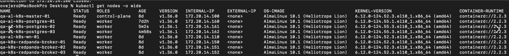

### RED TELEFONICA SQL 2019

 - Jumpserver RED: https://vdcaccess.urbetrack.com/

 - Credenciales Jumpserver RED
    Usuario: lliberatori
    Clave inicial: lli,,123./raCPl

 - Credenciales VM y SQL-
    User: lliberatori
    Clave: bT0EpdKHvB430b

### gCABA

 - Jumpserver GCABA: https://vcloudprodaccess.urbetrack.com/

 - Credenciales Jumpserver GCABA-
    Usuario: lliberatori
    Clave inicial: lli,,123;.KIr672d

 - Credenciales VM-
    User: lliberatori
    Clave: W0VFvUWpwgwEU7

 La autenticación a SQL es con el usuario de Windows.

### Mirroring Prod

   - Lliberatori123 Password para el mirroring PRODUCCION gCABA
   - user =  lliberatori
   - Pass = lliberatori123.Rac --> Esta es la sa de prod gCABA

### pgAdmin de Barrido

 1. pgAdmin de barrido en qa03 para la postgres single instance de qa03 (origen) 
    https://pgadmin-qa03.urbetrack.net/login
 
 2. pgAdmin de barrido en kubernetes, para el cluster postgres (destino) 
    https://pgadmin-qa.corp.urbetrack.com/login?next=/browser/

    A AWS clonamos la postgres single instance que había, acá estamos desplgegando por primera vez la base en el ambiente de kuber, aún en claro, con el cluster de postgres que tiene 3 replicas. por eso tenemos que "hacerlo de cero"

    - PGADMIN_DEFAULT_EMAIL: "devsecops@urbetrack.com" 
    - PGADMIN_DEFAULT_PASSWORD: "CambiarEstaPasswordPgAdmin" 

 3. Single Instance PostgreSQL
    
    Te paso la pw que tenía el user en qa03, así le dejamos mismo user y pw
 
    - Pass = Aegau.s0aquoyooNain#ah4b

### ???
 
 - ok, fijate si llegás a la 172.20.14.112 1433
 - sa
 - Urbetrack*4260

	user = qa_srv_barrido_hygiene_cycles_pg_app_rw
	pass = (Lxqe_^hDrW|'H`{

### AWS

- RDS - QA

  I can connect from my laptop

	1. QA01-OP-SQLDB-AWS
		a. Technology = SQL
		b. IP = 
		c. User = sa
		d. Pass = Urbetrack*4260

	2. QA02-OP-SQLDB-AWS
		a. Technology = SQL
		b. IP = 
		c. User = sa
		d. Pass = Urbetrack*4260
	
	3. QA03-OP-SQLDB-AWS
		a. Technology = SQL
		b. IP = 
		c. User = sa
		d. Pass = Urbetrack*4260
	
	4. QA04-OP-SQLDB-AWS
		a. Technology = SQL
		b. IP = 
		c. User = sa
        d. Pass = Urbetrack*4260

    AWS QA01-2-3-4
    el dispatcher está usando:
    host: 10.100.41.65
    user: urbetrack_web
    pw: web!123*
    
    
    la web usa:
    host: 10.100.41.65
    user: urbetrack_addresser
    pw: adr!123*

		
**QA PostgreSQL**

### JumpServer QA03 CLARO

	• URL:https://vcloudqa03access.urbetrack.com/

	• Usuario: lliberatori
	Clave inicial: zJs9ZI.2433!!

	• VM de acceso QA-GA-DEVAPPS

	• SQL Servers

	Hostname: QA01-OP-SQLDB
	IP: 172.16.14.12
	
	Hostname: QA02-OP-SQLDB
	IP: 172.18.14.12
	
	Hostname: QA03-OP-SQLDB
	IP: 172.20.14.12
	
	Hostname: QA04-OP-SQLDB
	IP: 172.24.14.12

		○ Usuario SQL
		Usuario: lliberatori
        Clave: zJs9ZITka0aMwz

