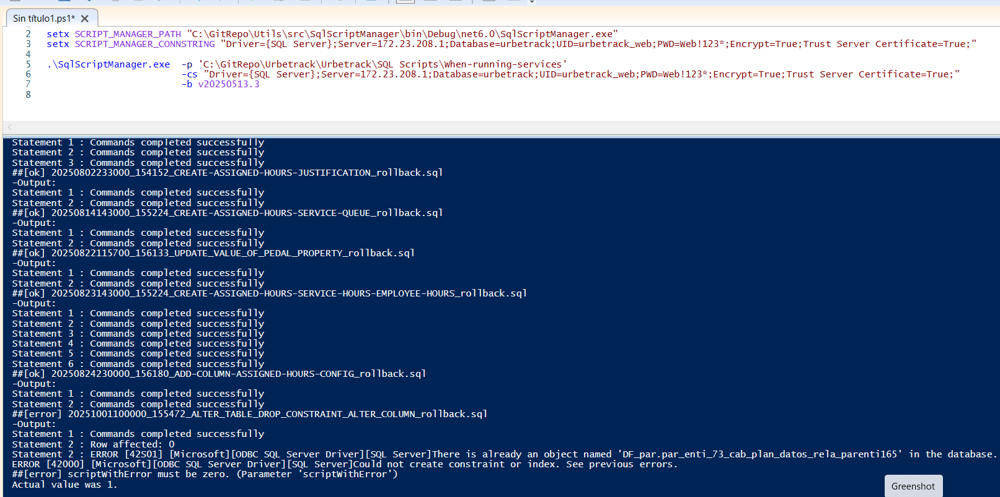

### 1. Cloudflare

  - How to set up

  -  Cloudflare
     
     Con el cliente vas a empezar a tener acceso a todo lo nuevo que estamos desplegando con buenas prácticas, vas a poder llegar a 
     pgAdmin, etc

     Te logueás con SSO

     https://urbetrack.cloudflareaccess.com/#/Launcher

### 2. FinnegansGo

  - FIN.1981!Rac

### 3. Bitwarden

  - BIT.1891!!@kp

### 4. Portal de Urbetrack

  - lucas.liberatori@urbetrack.com
  - uRBe.2433!!Rac

### 5. Deploy SQL urbetrack local

PS C:\GitRepo\Utils\src\SqlScriptManager\bin\Debug\net6.0> 

setx SCRIPT_MANAGER_PATH "C:\GitRepo\Utils\src\SqlScriptManager\bin\Debug\net6.0\SqlScriptManager.exe"
setx SCRIPT_MANAGER_CONNSTRING "Driver={SQL Server};Server=172.23.208.1;Database=urbetrack;UID=urbetrack_web;PWD=Web!123*;Encrypt=True;Trust Server Certificate=True;"

.\SqlScriptManager.exe  -p 'C:\GitRepo\Urbetrack\Urbetrack\SQL Scripts\When-running-services' -cs "Driver={SQL Server};Server=172.23.208.1;Database=urbetrack;UID=urbetrack_web;PWD=Web!123*;Encrypt=True;Trust Server Certificate=True;" -b v20250513.3

En la tabla siguiente esta el log del deploy

SELECT * FROM [dbo].[soc.sys_sqlm_01_mov_scripts_log]

