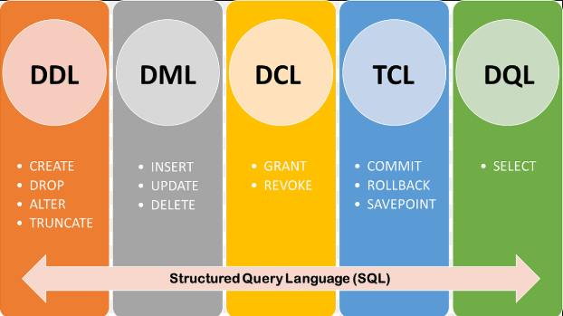

<style>
r { color: red }
o { color: Orange }
g { color: Green }
lg { color: lightgreen }
b { color: Blue }
lb { color: lightblue }

- To create tables:
  
  https://www.tablesgenerator.com/markdown_tables

> [!NOTE]  
> Highlights information that users should take into account, even when skimming.

> [!TIP]
> Optional information to help a user be more successful.

> [!IMPORTANT]
> Crucial information necessary for users to succeed.

> [!WARNING]  
> Critical content demanding immediate user attention due to potential risks.

> [!CAUTION]
> Negative potential consequences of an action.

> [!IDEA]
> XXXXX 
</style>

# Methodology RBAC Permissions

## Index
- [Methodology RBAC Permissions](#methodology-rbac-permissions)
  - [Index](#index)
  - [Objective](#objective)
  - [Change History](#change-history)
  - [Enterprise Database Security \& Permission Governance Methodology](#enterprise-database-security--permission-governance-methodology)
    - [1. Executive Summary](#1-executive-summary)
    - [2. Core Security Principles](#2-core-security-principles)
    - [3. Implementation Roadmap](#3-implementation-roadmap)
    - [4. Enterprise RBAC Model](#4-enterprise-rbac-model)
    - [5. Standard Role Model](#5-standard-role-model)
    - [6. Environment-Specific RBAC Design](#6-environment-specific-rbac-design)
    - [7. User Naming Standards](#7-user-naming-standards)
    - [8. Environment Security Matrix](#8-environment-security-matrix)
    - [9. Recommended Access Model](#9-recommended-access-model)
    - [10. Password \& Credential Strategy](#10-password--credential-strategy)
    - [11. Temporary Elevated Access](#11-temporary-elevated-access)
    - [12. Break-Glass Emergency Access](#12-break-glass-emergency-access)
    - [13. SQL Server Best Practices](#13-sql-server-best-practices)
    - [14. PostgreSQL Best Practices](#14-postgresql-best-practices)
    - [15. SQL Server RBAC Example](#15-sql-server-rbac-example)
    - [16. PostgreSQL RBAC Example](#16-postgresql-rbac-example)
    - [17. Governance Model](#17-governance-model)
    - [18. Auditing Recommendations](#18-auditing-recommendations)
    - [19. Onboarding Procedure](#19-onboarding-procedure)
    - [20. Offboarding Procedure](#20-offboarding-procedure)
    - [21. Final Notes for Your Organization](#21-final-notes-for-your-organization)
  - [ANEXI I](#anexi-i)
  - [ANEXO II](#anexo-ii)


## Objective

The aim of this document is to create a comprehensive enterprise-grade database security and permission governance methodology designed for a mid-to-large enterprise using both Microsoft SQL Server and PostgreSQL without Active Directory integration.

## Change History

|Version   | Date        | Created by  | Approved by  |
|----------|-------------|-------------|--------------|
| 1.0      | 28-05-2026  | DBA Team    |              |
|          |             |             |              |


## Enterprise Database Security & Permission Governance Methodology

### 1. Executive Summary

This document defines a standardized security, access control, and governance model for enterprise database environments.

- The methodology is designed to:

  * Standardize database access across all environments
  * Reduce operational and security risks
  * Enforce Principle of Least Privilege (PoLP)
  * Simplify administration and auditing
  * Support scalability and future growth
  * Reduce unauthorized privilege escalation
  * Establish clear governance and separation of duties

- Supported platforms:

  * Microsoft SQL Server
  * PostgreSQL

- Supported environments:

  * DEV
  * QA
  * TEST
  * UAT/PREPROD
  * PROD
  * Future environments

### 2. Core Security Principles
   
- 2.1 Principle of Least Privilege (PoLP)

    Users receive:

    - Only the minimum permissions required
    - Only in the required environments
    - Only for the required duration

    | Access Type               | Allowed                    |
    | ------------------------- | -------------------------- |
    | Developer in DEV          | RW + limited DDL           |
    | QA Analyst in QA          | Read-only                  |
    | Backend developer in PROD | Usually read-only          |
    | DBA Team                  | Controlled admin roles     |
    | Applications              | Dedicated service accounts |

- 2.2 Separation of Duties

    No single user should control:

    - Development
    - Deployment
    - Approval
    - Production administration

    | Role             | Responsibility                 |
    | ---------------- | ------------------------------ |
    | Developers       | DEV schema changes             |
    | QA               | Validation                     |
    | Release Managers | Deployment approval            |
    | DBAs             | Security + operational control |
    | Security Team    | Auditing + compliance          |

- 2.3 Environment Isolation

    PROD must always be isolated.

    | Rule                                    | Recommendation |
    | --------------------------------------- | -------------- |
    | Separate credentials per environment    | Mandatory      |
    | Separate passwords per environment      | Mandatory      |
    | No shared accounts                      | Mandatory      |
    | No PROD access from DEV tools           | Recommended    |
    | No cross-environment ownership chaining | Mandatory      |


### 3. Implementation Roadmap

The implementation is develope by **Phases**, these are:

- Phase 1 — Assessment

    - Inventory databases
    - Inventory users
    - Identify privileged access
    - Identify shared accounts

- Phase 2 — Design

    - Define RBAC roles
    - Define naming standards
    - Define environment segregation
    - Define onboarding workflows

- Phase 3 — Implementation

    - Create standard roles
    - Remove direct grants
    - Create audit logging
    - Configure password policies

- Phase 4 — Hardening

    - Remove excessive privileges
    - Disable unsafe features
    - Restrict network access
    - Implement monitoring

- Phase 5 — Governance

    - Audit reports
    - Compliance checks
    - Periodic penetration testing

### 4. Enterprise RBAC Model

- 4.1 Recommended Access Layers

    **<r>Use: USER → ROLE → PERMISSIONS**

    > [!IMPORTANT]
    > Never assign permissions directly to users.


### 5. Standard Role Model

- 5.1 Global Enterprise Roles

    | Role              | Purpose                             |
    | ----------------- | ----------------------------------- |
    | db_ro             | Read-only                           |
    | db_rw             | Read/write DML                      |
    | db_ddladmin       | Controlled DDL                      |
    | db_exec           | Execute stored procedures/functions |
    | db_owner_limited  | Limited ownership                   |
    | db_monitor        | Monitoring only                     |
    | db_backup         | Backup operations                   |
    | db_security_admin | Security management                 |
    | db_platform_dba   | DBA operational role                |
    | db_breakglass     | Emergency access                    |


### 6. Environment-Specific RBAC Design

- 6.1 Roles Naming Standard

  This is the terminology use for **ROLES**

  - SQL

    **<g>sql_env_system_role**
    **<g>sql_env_team_role**

    Examples:

    **sql_dev_sales_ro**<br>
    **sql_prod_sales_rw**<br>
    **sql_prod_sales_exec**<br>
    **sql_prod_finance_dba**<br>
    **sql_dev_backend_ro**<br>
    **sql_dev_tester_ro**<br>

  - PostgreSQL

    **<g>pg_env_database_role**

    Examples:

    **pg_dev_orders_ro**<br>
    **pg_prod_orders_rw**<br>
    **pg_prod_orders_exec**<br>

### 7. User Naming Standards

- 7.1 Human Users

  This is the terminology use for **USERS**

  Format --> **<g>firstname.lastname**

  Examples:

  **<g>hernan.ramirez**<br>
  **<g>daniel.perez**<br>
  **<g>romina.alejo**<br>

- 7.2 Service Accounts

    Format --> **<g>svc_application_environment**

    Examples:

    **<g>svc_billing_prod**<br>
    **<g>svc_orders_qa**<br>
    **<g>svc_inventory_dev**<br>

- 7.3 Application Accounts

    Format --> **<g>app_application_environment**

    Examples:

    **<g>app_mobile_prod**<br>
    **<g>app_api_qa**<br>

### 8. Environment Security Matrix

    | Environment   | Human RW             | Human DDL | Production Data | Sysadmin Allowed |
    | ------------- | -------------------- | --------- | --------------- | ---------------- |
    | DEV           | Yes                  | Yes       | Sanitized only  | Limited          |
    | QA            | Limited              | No        | Masked          | Limited          |
    | TEST          | Limited              | No        | Masked          | Limited          |
    | UAT / PREPROD | Very Limited         | No        | Partial masked  | Restricted       |
    | PROD          | Extremely Restricted | No        | Real            | DBA only         |

### 9. Recommended Access Model

- 9.1 Developers

    | Environment   | Access           |
    | ------------- | ---------------- |
    | DEV           | RW + limited DDL |
    | QA            | RO               |
    | TEST          | RO               |
    | UAT / PREPROD | RO               |
    | PROD          | Usually RO only  |

- 9.2 QA Analysts

    | Environment   | Access    |
    | ------------- | --------- |
    | DEV           | RO        |    
    | QA            | RW or RO  |
    | UAT / PREPROD | RO        |
    | PROD          | No access |

    > [!NOTE]  
    > In some companies QA doesn't have access to DEV.
    > Some highly regulated companies separate: Developers, Testers, Validators to maintain independent validation.
    > Common industries like: Banking, Healthcare, Pharmaceutical, etc

- 9.3 Backend Team

    | Environment   | Access |
    | ------------- | ------ |
    | DEV           | RW     |
    | QA            | RW     |
    | TEST          | RW     |    
    | UAT / PREPROD | RO     |
    | PROD          | RO     |

- 9.4 Architects Team

    | Environment   | Access |
    | ------------- | ------ |
    | DEV           | RO     |
    | QA            | RO     |
    | TEST          | RO     |    
    | UAT / PREPROD | RO     |
    | PROD          | RO     |

- 9.5 DBA Team

    | Environment   | Access |
    | ------------- | ------ |
    | DEV           | Admin  |
    | QA            | Admin  |
    | TEST          | Admin  |    
    | UAT / PREPROD | Admin  |
    | PROD          | Admin  |
  
- Sumary

    | Team        | Environment   | Access           |
    | ----------- | ------------- | ---------------- |
    | Developers  | DEV           | RW + limited DDL |
    |             | QA            | RO               |
    |             | TEST          | RO               |
    |             | UAT / PREPROD | RO               |
    |             | PROD          | Usually RO only  |
    |------------------------------------------------|
    | QA Analysts | DEV           | RO               |
    |             | QA            | RW or RO         |
    |             | TEST          | RO               |
    |             | UAT / PREPROD | RO               |
    |             | PROD          | No Access        |
    |------------------------------------------------|
    | Backend     | DEV           | RW               |
    |             | QA            | RW               |
    |             | TEST          | RW               |
    |             | UAT / PREPROD | RO               |
    |             | PROD          | RO               |
    |------------------------------------------------|
    | Architects  | DEV           | RO               |
    |             | QA            | RO               |
    |             | TEST          | RO               |
    |             | UAT / PREPROD | RO               |
    |             | PROD          | RO               |
    |------------------------------------------------|
    | DBA         | DEV           | Admin            |
    |             | QA            | Admin            |
    |             | TEST          | Admin            |
    |             | UAT / PREPROD | Admin            |
    |             | PROD          | Admin            |
    |------------------------------------------------|
    
### 10. Password & Credential Strategy

- 10.1 Requirements

    | Requirement     | Recommendation                  |
    | --------------- | ------------------------------- |
    | Minimum length  | 16+ characters                  |
    | Rotation        | 60–90 days                      |
    | MFA             | Strongly recommended externally |
    | Shared accounts | Prohibited                      |
    | Password vault  | Mandatory                       |
    | Secrets in code | Prohibited                      |

- 10.2 Recommended Secret Vaults

    | Product         | Recommendation          |
    | --------------- | ----------------------- |
    | HashiCorp Vault | Excellent               |
    | CyberArk        | Enterprise-grade        |
    | Bitwarden (*)   | Mid-size organizations  |
    | 1Password       | Good operational choice |


    > [!NOTE]  
    > Bitwarden (*) - Use in Urbetrack

### 11. Temporary Elevated Access

- 11.1 Just-In-Time (JIT) Access

    Users should not permanently hold elevated permissions.

    Process:

      1. Ticket created
      2. Manager approval
      3. DBA approval
      4. Temporary role assignment
      5. Automatic expiration
      6. Audit logging

- 11.2 Recommended Duration

    | Access Type        | Duration     |
    | ------------------ | ------------ |
    | Emergency PROD fix | 2–4 hours    |
    | Release deployment | 8 hours      |
    | Investigation      | 24 hours max |


### 12. Break-Glass Emergency Access

- 12.1 Requirements

    Emergency accounts should:

    1. Be isolated
    2. Have randomized passwords
    3. Be vaulted
    4. Require executive/security approval
    5. Generate immediate alerts when used

    Example Accounts: 
        
        SQL Server --> sql_breakglass_prod
        PostgreSQL --> pg_breakglass_prod

### 13. SQL Server Best Practices

- 13.1 Security Recommendations

    | Recommendation                | Status      |
    | ----------------------------- | ----------- |
    | Disable sa login              | Recommended |
    | Rename sa                     | Recommended |
    | Use contained users carefully | Recommended |
    | Avoid sysadmin role           | Critical    |
    | Avoid TRUSTWORTHY ON          | Critical    |
    | Disable xp_cmdshell           | Critical    |
    | Use signed procedures         | Recommended |
    | Use schemas for segregation   | Mandatory   |

### 14. PostgreSQL Best Practices

- 14.1 Security Recommendations

    | Recommendation                 | Status      |
    | ------------------------------ | ----------- |
    | Avoid SUPERUSER                | Critical    |
    | Separate LOGIN vs ROLE         | Mandatory   |
    | Revoke PUBLIC permissions      | Critical    |
    | Restrict pg_hba.conf           | Mandatory   |
    | Use SCRAM-SHA-256              | Mandatory   |
    | Separate schemas               | Mandatory   |
    | Disable unnecessary extensions | Recommended |


    > [!NOTE]  
    > pg_hba.conf
    >   Controlling: who can connect, from where, using which authentication method
    >   Think of it as: PostgreSQL firewall + authentication rules

    > [!NOTE]  
    > SCRAM-SHA-256
    >   Modern PostgreSQL password authentication.
    > Enable SCRAM
    >   postgresql.conf
    >   password_encryption = scram-sha-256

### 15. SQL Server RBAC Example

- 15.1 Example Request Processing

    | User         | Team       | DEV | QA | UAT | PROD |
    | ------------ | ---------- | --- | -- | --- | ---- |
    | hernan.villa | Backend    | RW  | RW | RO  | RO   |
    | daniel.bear  | Backend    | RW  | RW | RO  | RO   |
    | natalia.febo | QA Analyst | RO  | RW | RO  | No   |

    > [!NOTE]  
    > Validate against point **8.3 Backend Team**.

- 15.2 Example Provisioning Mapping

  - SQL Server
    
    hernan.villa
        → sql_dev_app_rw
        → sql_qa_app_rw
        → sql_uat_app_ro
        → sql_prod_app_ro
        
  - PostgreSQL
   
    hernan.villa
        → pg_dev_app_rw
        → pg_qa_app_rw
        → pg_uat_app_ro
        → pg_prod_app_ro

- 15.3 Create Roles

    ```sql
    /* SQL SERVER */

    USE [urbetrack];
    GO

    CREATE ROLE db_ro;
    CREATE ROLE db_rw;
    CREATE ROLE db_ddladmin; 
    CREATE ROLE db_exec;
    CREATE ROLE db_owner_limited;
    CREATE ROLE db_monitor;
    CREATE ROLE db_backup;
    CREATE ROLE db_security_admin;
    CREATE ROLE db_platform_dba;
    CREATE ROLE db_breakglass;
    GO
    ```

- 15.4 Permissions

    ```sql
    /* SQL SERVER */
    /* Read-Only  */
    GRANT SELECT TO db_ro;

    /* SQL SERVER */
    /* Read-Write */
    GRANT SELECT, INSERT, UPDATE, DELETE TO db_rw;

    /* SQL SERVER */ 
    /* Execute    */
    GRANT SELECT TO db_rexec;    
    ```

- 15.5 Create Login

    ```sql
    USE master;
    GO

    CREATE LOGIN [hernan.villa]
    WITH PASSWORD = 'StrongPassword123!',
    CHECK_POLICY = ON,
    CHECK_EXPIRATION = ON;
    GO
    ```

- 15.6 Create User

    ```sql
    USE [urbetrack];
    GO

    CREATE USER [hernan.villa] FOR LOGIN [hernan.villa];

    ALTER ROLE db_ro
    ADD MEMBER [hernan.villa];

    ALTER ROLE db_exec
    ADD MEMBER [hernan.villa];
    GO   
    ```

- 15.7 Verify PErmissions

    ```sql
    SELECT
        dp.name AS UserName,
        rp.name AS RoleName
    FROM sys.database_role_members drm
    JOIN sys.database_principals rp
        ON drm.role_principal_id = rp.principal_id
    JOIN sys.database_principals dp
        ON drm.member_principal_id = dp.principal_id;
    GO
    ```

### 16. PostgreSQL RBAC Example

- 16.1 Create Roles

    ```sql
    /* SQL SERVER */

    USE [urbetrack];
    GO

    CREATE ROLE pg_ro NOLOGIN;
    CREATE ROLE pg_rw NOLOGIN;
    CREATE ROLE pg_ddladmin NOLOGIN;
    CREATE ROLE pg_exec NOLOGIN;
    CREATE ROLE pg_owner_limited NOLOGIN;
    CREATE ROLE pg_monitor NOLOGIN;
    CREATE ROLE pg_backup NOLOGIN;
    CREATE ROLE pg_security_admin NOLOGIN;
    CREATE ROLE pg_platform_dba NOLOGIN;
    CREATE ROLE pg_breakglass NOLOGIN;
    GO
    ```

- 16.2 Permissions

    ```sql
    /* PostgreSQL */
    /* Read-Only  */
    GRANT CONNECT ON DATABASE urbetrack TO pg_ro;
    GRANT USAGE ON SCHEMA public TO pg_ro;
    GRANT SELECT ON ALL TABLES IN SCHEMA public TO pg_ro;

    /* SQL SERVER */ 
    /* Read-Write */
    GRANT SELECT, INSERT, UPDATE, DELETE
    ON ALL TABLES IN SCHEMA public
    TO pg_rw;

    /* SQL SERVER */ 
    /* Execute    */
    GRANT SELECT TO db_rexec;    
    ```

- 16.3 Create User

    ```sql
    CREATE ROLE "hernan.villa"
    LOGIN
    PASSWORD 'StrongPasswordHere';

    GRANT pg_ro TO "hernan.villa";    
    ```

- 16.4 Default Future Permissions

    ```sql
    ALTER DEFAULT PRIVILEGES IN SCHEMA app
    GRANT SELECT ON TABLES TO pg_ro;

    ALTER DEFAULT PRIVILEGES IN SCHEMA app
    GRANT SELECT, INSERT, UPDATE, DELETE
    ON TABLES TO pg_rw;    
    ```

    > [!WARNING]  
    > Without this, new tables lose permissions consistency.

- 16.5 Verify Permissions

    ```sql
    SELECT
        r.rolname AS role_name,
        m.rolname AS member_name
    FROM pg_auth_members am
    JOIN pg_roles r
        ON am.roleid = r.oid
    JOIN pg_roles m
        ON am.member = m.oid;   
    ```

### 17. Governance Model

- 17.1 Access Request Workflow

            Manager Request 
    (Create Ticket Zoho - Azure DevOps)
                   ↓
            Security Validation 
             (Security Team)
                   ↓
               DBA Review 
               (DBA Team)
                   ↓
                Approval 
        (Manager DecSecOps Manager)
                   ↓
              Provisioning 
               (DBA Team)
                   ↓
              Audit Logging 
             (Security Team)

    > [!IMPORTANT]
    > And eMail is not a Ticket. The hold process start with a ticket on Zoho or Azure DevOps.

- 17.2 Recommended Enterprise Architecture

  - Logical Model

                  +------------------+
                  |  Security Team   |
                  +------------------+
                           |
                           v
                  +------------------+
                  |    DBA Team      |
                  +------------------+
                           |
        +------------------+------------------+
        |                                     |
        v                                     v

  +-------------+                     +-------------+
  | SQL Server  |                     | PostgreSQL  |
  +-------------+                     +-------------+

        |                                     |

  +-------------+                     +-------------+
  | DEV Roles   |                     | DEV Roles   |
  | QA Roles    |                     | QA Roles    |
  | UAT Roles   |                     | UAT Roles   |
  | PROD Roles  |                     | PROD Roles  |
  +-------------+                     +-------------+


### 18. Auditing Recommendations

- SQL Server

Use:

 * Failed login auditing
 * Privileged role monitoring

- PostgreSQL

Use:

 * pgaudit extension
 * log_connections
 * log_disconnections
 * log_statement='ddl'
 * log_duration

### 19. Onboarding Procedure

Steps

 * Manager request
 * Ticket creation
 * Role mapping
 * DBA provisioning
 * Password setup
 * Documentation update
 * Audit registration

### 20. Offboarding Procedure

Immediate Actions

 * Disable account
 * Remove role memberships
 * Revoke vault access
 * Archive audit evidence

### 21. Final Notes for Your Organization

The correct enterprise approach is:

 - Create individual named accounts
 - Assign environment-specific RBAC roles
 - Avoid sysadmin/db_owner
 - Grant only required access
 - Separate PROD credentials
 - Audit all provisioning actions
 - Document approvals and expirations

This methodology is scalable, auditable, secure, and aligned with enterprise security best practices used in regulated environments.

## ANEXI I

- DDL, DML, DCL, TCL, and DQL



- SQL Procedure to create random password
    
    ```sql
    /* Notes 
        - Parameter description:
            @Length         INT = 16 By default desired password length of 16 characters (recommended >= 12)
            @RequireUpper   BIT = 1  By default require at least one uppercase
            @RequireLower   BIT = 1  By default require at least one lowercase
            @RequireDigit   BIT = 1  By default require at least one digit
            @RequireSymbol  BIT = 1  By default require at least one symbol
            @Password       NVARCHAR(400) OUTPUT   -- output password

        - SQL Functions
            - CRYPT_GEN_RANDOM()
                Syntax   : CRYPT_GEN_RANDOM(length, [seed])
                Descrip. : This function returns a cryptographic, randomly-generated number, generated by the Crypto API (CAPI). 
                            CRYPT_GEN_RANDOM returns a hexadecimal number with a length of a specified number of bytes.
                Examples : 
                            SELECT 
                                CRYPT_GEN_RANDOM(5)  AS Length5
                            , CRYPT_GEN_RANDOM(10) AS Length10

                            SELECT 
                                CRYPT_GEN_RANDOM(5, 0X3951215498)  AS Length5
                            , CRYPT_GEN_RANDOM(10, 0X39512154069984874151) AS Length10
            - CHECKSUM()        : Returns the checksum value computed over a table or row
            - ABS()             : A mathematical function that returns the absolute (positive) value of the specified numeric 
                                expression. (ABS changes negative values to positive values. ABS has no effect on zero or positive values.)
            - LEN(@Characters)  : 89 Has always the same LEN
            - NEWID()           : Create an uniqueidentifier value every time that you execute it
            - RAND()            : Returns a pseudo-random float value from 0 through 1, exclusive.
            - SUBSTRING()       : Returns part of a character, binary, text or image expression.

        - Execution
            EXEC [dbo].[RandomPassCreator]

            EXEC [dbo].[RandomPassCreator] @length = NULL
            EXEC [dbo].[RandomPassCreator] @length = 5
            EXEC [dbo].[RandomPassCreator] @length = 20
            EXEC [dbo].[RandomPassCreator] @length = 50

            EXEC [dbo].[RandomPassCreator] @RequireUpper  = 0 /* not use UPPER case */
            EXEC [dbo].[RandomPassCreator] @RequireLower  = 0 /* not use lower case */
            EXEC [dbo].[RandomPassCreator] @RequireDigit  = 0 /* not use Digit case */
            EXEC [dbo].[RandomPassCreator] @RequireSymbol = 0 /* not use Digit case */

            EXEC [dbo].[RandomPassCreator] @RequireUpper  = 0, @RequireLower = 0, @RequireDigit = 0, @RequireSymbol = 0  /* Use all of them */

            EXEC [dbo].[RandomPassCreator] @RequireUpper  = NULL
    */
    CREATE OR ALTER PROCEDURE [dbo].[RandomPassCreator]
    
    @Length         INT = 16 
    , @RequireUpper   BIT = 1  
    , @RequireLower   BIT = 1  
    , @RequireDigit   BIT = 1  
    , @RequireSymbol  BIT = 1  

    AS

    BEGIN

        SET NOCOUNT ON;

        BEGIN TRY

            /* Treat NULL flags as ON */
            SET @RequireUpper  = COALESCE(@RequireUpper,  1);
            SET @RequireLower  = COALESCE(@RequireLower,  1);
            SET @RequireDigit  = COALESCE(@RequireDigit,  1);
            SET @RequireSymbol = COALESCE(@RequireSymbol, 1);

            /* Minimum safe length (ensure we can include required character types) */
            IF @Length IS NULL OR @Length < 12
                SET @Length = 12;

            /*  */
            DECLARE @Password NVARCHAR(400)

            /* Character sets */
            DECLARE @Upper   NVARCHAR(64) = N'ABCDEFGHIJKLMNOPQRSTUVWXYZ';
            DECLARE @Lower   NVARCHAR(64) = N'abcdefghijklmnopqrstuvwxyz';
            DECLARE @Digits  NVARCHAR(16) = N'0123456789';
            DECLARE @Symbols NVARCHAR(64) = N'!@#$%^&*()-_=+[]{};:,.<>?/~`|';

            /* Build candidate pool depending on flags */
            DECLARE @Pool NVARCHAR(400) = N'';

            IF @RequireUpper = 1 
                SET @Pool = @Pool + @Upper;

            IF @RequireLower = 1 
                SET @Pool = @Pool + @Lower;

            IF @RequireDigit = 1 
                SET @Pool = @Pool + @Digits;

            IF @RequireSymbol = 1 
                SET @Pool = @Pool + @Symbols;

            /* If user turned off everything (defensive), fallback to all groups */
            IF LEN(@Pool) = 0
                SET @Pool = @Upper + @Lower + @Digits + @Symbols;

            /* Temporary table to collect chosen characters */
            DECLARE @chars TABLE (
                id INT IDENTITY(1,1)
                , ch NCHAR(1)
            );

            /* Helper to pick a random char from a set using CRYPT_GEN_RANDOM:
                - We use ABS(CHECKSUM(CRYPT_GEN_RANDOM(4))) % LEN(set) + 1 as random index.
                CHECKSUM on varbinary returns an int we can use */
            DECLARE @idx INT;

            /* Insert RequireUpper if is required */
            IF @RequireUpper = 1
            BEGIN
                SET @idx = (ABS(CHECKSUM(CRYPT_GEN_RANDOM(4))) % LEN(@Upper)) + 1;
                INSERT INTO @chars (ch) 
                VALUES (SUBSTRING(@Upper, @idx, 1));
            END
        
            /* Insert RequireLower if is required */
            IF @RequireLower = 1
            BEGIN
                SET @idx = (ABS(CHECKSUM(CRYPT_GEN_RANDOM(4))) % LEN(@Lower)) + 1;
                INSERT INTO @chars (ch) 
                VALUES (SUBSTRING(@Lower, @idx, 1));
            END

            /* Insert RequireDigit if is required */
            IF @RequireDigit = 1
            BEGIN
                SET @idx = (ABS(CHECKSUM(CRYPT_GEN_RANDOM(4))) % LEN(@Digits)) + 1;
                INSERT INTO @chars (ch) 
                VALUES (SUBSTRING(@Digits, @idx, 1));
            END

            /* Insert RequireSymbol if is required */
            IF @RequireSymbol = 1
            BEGIN
                SET @idx = (ABS(CHECKSUM(CRYPT_GEN_RANDOM(4))) % LEN(@Symbols)) + 1;
                INSERT INTO @chars (ch) 
                VALUES (SUBSTRING(@Symbols, @idx, 1));
            END

            /* Fill remaining characters from the pool */
            WHILE (SELECT COUNT(*) FROM @chars) < @Length
            BEGIN
                SET @idx = (ABS(CHECKSUM(CRYPT_GEN_RANDOM(4))) % LEN(@Pool)) + 1;
                INSERT INTO @chars (ch) 
                VALUES (SUBSTRING(@Pool, @idx, 1));
            END

            /* Shuffle the characters by ordering with NEWID() and concatenate */
            SELECT @Password = ( SELECT ch
                                FROM   @chars
                                ORDER BY NEWID()
                                FOR XML PATH(''), TYPE).value('.', 'NVARCHAR(MAX)');

            /* Return password to caller and select for convenience */
            SELECT @Password AS GeneratedPassword;

        END TRY
        BEGIN CATCH
            /* Clear output and rethrow (preserve original error) */
            SET @Password = NULL;

            DECLARE @ErrorMessage NVARCHAR(4000) = ERROR_MESSAGE();
            DECLARE @ErrorSeverity INT = ERROR_SEVERITY();
            DECLARE @ErrorState INT = ERROR_STATE();

            /* Re-throw original error (SQL Server 2012+) */
            THROW;
        END CATCH
    END;
    GO
    ```

- PostgreSQL Function to create random password
    
    ```sql
    /*
    Function: RandomPassCreator
    Description: Generates a random password based on the requested rules.
    Requirements: - PostgreSQL 12+
                  - pgcrypto extension
                    Enable pgcrypto extension (required only once per database)
    Notes
        - Recommended minimum length: 12
        - The function guarantees required character categories are included.
        - Symbols can be customized in variable v_symbol.
        - Function uses PostgreSQL random() for character selection.
        - pgcrypto extension is included for enterprise compatibility/future enhancements.

    Execute: 
            - Default password (16 chars)
             SELECT public."RandomPassCreator"();

            - 24-character password
             SELECT public."RandomPassCreator"(24);

            - Password without symbols
             SELECT public."RandomPassCreator" (20,TRUE,TRUE,TRUE,FALSE)

            - Digits only
             SELECT public."RandomPassCreator" (12,FALSE,FALSE,TRUE,FALSE);
    */

    CREATE EXTENSION IF NOT EXISTS pgcrypto;

    -- Function Creation
    CREATE OR REPLACE FUNCTION public."RandomPassCreator"
    (
        p_length          INT     DEFAULT 16,
        p_requireupper    BOOLEAN DEFAULT TRUE,
        p_requirelower    BOOLEAN DEFAULT TRUE,
        p_requiredigit    BOOLEAN DEFAULT TRUE,
        p_requiresymbol   BOOLEAN DEFAULT TRUE
    )
    RETURNS TEXT
    LANGUAGE plpgsql
    AS
    $$
    DECLARE
        v_upper   TEXT := 'ABCDEFGHIJKLMNOPQRSTUVWXYZ';
        v_lower   TEXT := 'abcdefghijklmnopqrstuvwxyz';
        v_digit   TEXT := '0123456789';
        v_symbol  TEXT := '!@#$%^&*()_-+=<>?';

        v_allchars TEXT := '';
        v_password TEXT := '';
        v_required INT := 0;

        v_i        INT;
        v_pos      INT;
        v_temp     TEXT[];
    BEGIN

        -- Validate minimum possible length
        v_required :=
            CASE WHEN p_requireupper  THEN 1 ELSE 0 END
            + CASE WHEN p_requirelower  THEN 1 ELSE 0 END
            + CASE WHEN p_requiredigit  THEN 1 ELSE 0 END
            + CASE WHEN p_requiresymbol THEN 1 ELSE 0 END;

        IF p_length < v_required THEN
            RAISE EXCEPTION
                'Password length (%) is too short for the selected requirements (%)',
                p_length,
                v_required;
        END IF;

        -- Build allowed character set
        IF p_requireupper THEN
            v_allchars := v_allchars || v_upper;

            v_password := v_password ||
                substr(v_upper,
                    floor(random() * length(v_upper) + 1)::INT,
                    1);
        END IF;

        IF p_requirelower THEN
            v_allchars := v_allchars || v_lower;

            v_password := v_password ||
                substr(v_lower,
                    floor(random() * length(v_lower) + 1)::INT,
                    1);
        END IF;

        IF p_requiredigit THEN
            v_allchars := v_allchars || v_digit;

            v_password := v_password ||
                substr(v_digit,
                    floor(random() * length(v_digit) + 1)::INT,
                    1);
        END IF;

        IF p_requiresymbol THEN
            v_allchars := v_allchars || v_symbol;

            v_password := v_password ||
                substr(v_symbol,
                    floor(random() * length(v_symbol) + 1)::INT,
                    1);
        END IF;

        -- If no requirements selected, allow all character types
        IF v_allchars = '' THEN
            v_allchars := v_upper || v_lower || v_digit || v_symbol;
        END IF;

        -- Fill remaining password length
        WHILE length(v_password) < p_length LOOP

            v_password := v_password ||
                substr(v_allchars,
                    floor(random() * length(v_allchars) + 1)::INT,
                    1);

        END LOOP;

        -- Shuffle password characters
        v_temp := string_to_array(v_password, NULL);

        FOR v_i IN REVERSE array_length(v_temp, 1)..2 LOOP

            v_pos := floor(random() * v_i + 1)::INT;

            v_temp[v_pos] :=
                v_temp[v_i] || (
                    v_temp[v_i] := v_temp[v_pos]
                );

        END LOOP;

        v_password := array_to_string(v_temp, '');

        RETURN v_password;

    END;
    $$;    
    ```

## ANEXO II

Steps Summary

- SQL

    ```sql
    /*

    QUESTION I:
    
        Do we have the Matrix for this access?
        
        e.g.

        | User         | Team       | DEV | QA | UAT | PROD |
        | ------------ | ---------- | --- | -- | --- | ---- |
        | hernan.villa | Backend    | RW  | RW | RO  | RO   |
        | daniel.bear  | Backend    | RW  | RW | RO  | RO   |
        | natalia.febo | QA Analyst | RO  | RW | RO  | No   |

    QUESTION II:

        Is this for MSSQL Server or PostgreSQL?
        
    QUESTION III:
    
        Do we have the [ROLE] created to give support to this? 
            --> IF YES --> Nothing to do
            --> IF NOT --> GET [TECHNOLOGY] + [ENVIRONMENT] + [SYSTEM / TEAM] + [ROLE], and create the [ROLE]

    QUESTION IV:
    
        Do we have the [USER] created?
            --> IF YES --> Do we need to change the permissions?
                --> IF YES --> go to next point
                --> IF NO  --> Nothing to do

            --> IF NOT 
                --> Is it a [Human User] - [Service Accounts] or [Application Accounts]?
                    --> Create the [USER]   --> Format for [Human User]           --> **<g>firstname.lastname**
                                            --> Format for [Service Accounts]     --> **<g>svc_application_environment**
                                            --> Format for [Application Accounts] --> **<g>app_application_environment**

    QUESTION V:
    
        Create a strong password and add to Bitwarden

    -- ------------------------------------------------------------------------------------------------------------------------------------
    -- ------------------------------------------------------------------------------------------------------------------------------------

    EXAMPLE:

        Ticket: 
            
            Solicito la creación de credenciales de acceso a los RDS para los siguientes integrantes del equipo del proyecto Organics:

            - QA:
            hernan.villalba@urbetrack.com — Backend
            daniel.bejar@urbetrack.com — Backend
            natalia.febo@urbetrack.com — Quality Control Analyst
            
            - UAT/PREPROD:
            hernan.villalba@urbetrack.com — Backend
            daniel.bejar@urbetrack.com — Backend
            
            - PROD:
            hernan.villalba@urbetrack.com — Backend
            daniel.bejar@urbetrack.com — Backend

        Solution:

            QUESTION I:
            
            Do we have the Matrix for this access?

                | User         | Team       | DEV | QA | UAT | PROD |
                | ------------ | ---------- | --- | -- | --- | ---- |
                | hernan.villa | Backend    | RW  | RW | RO  | RO   |
                | daniel.bear  | Backend    | RW  | RW | RO  | RO   |
                | natalia.febo | QA Analyst | RO  | RW | RO  | No   |
            
            QUESTION II:

                Is this for MSSQL Server or PostgreSQL?

                In this case is for MSSQL Server.

            QUESTION III:
        
                Do we have the [ROLE] created to give support to this?
                GET [TECHNOLOGY] + [ENVIRONMENT] + [SYSTEM / TEAM] + [ROLE], and create the [ROLE]

                    → sql_dev_backend_rw
                    → sql_qa_backend_rw
                    → sql_uat_backend_ro
                    → sql_prod_backend_ro

                    → sql_dev_qaanalyst_ro
                    → sql_qa_qaanalyst_rw
                    → sql_uat_qaanalyst_ro

                    /* SQL SERVER */
                    USE [urbetrack]; ESTO SE TIENE QUE EJECUTAR EN LA MASTER NO EN LA DB PARTICULAR!!!!
                    GO

                    CREATE ROLE db_ro;
                    CREATE ROLE db_rw;
                    CREATE ROLE db_ddladmin; 
                    CREATE ROLE db_exec;
                    CREATE ROLE db_owner_limited;
                    CREATE ROLE db_monitor;
                    CREATE ROLE db_backup;
                    CREATE ROLE db_security_admin;
                    CREATE ROLE db_platform_dba;
                    CREATE ROLE db_breakglass;
                    GO

            QUESTION IV:
            
                Do we have the [USER] created?
                Is it a [Human User] - [Service Accounts] or [Application Accounts]?
                Create the [USER]   --> Format for [Human User]           --> **<g>firstname.lastname**
                                    --> Format for [Service Accounts]     --> **<g>svc_application_environment**
                                    --> Format for [Application Accounts] --> **<g>app_application_environment**

                hernan.villalba@urbetrack.com 
                daniel.bejar@urbetrack.com — Backend
                natalia.febo@urbetrack.com 


    */


    ```

- PostgreSQL